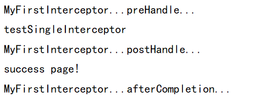
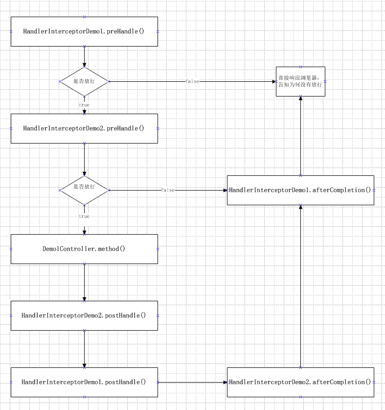

# SpringMVC— —拦截器

本文主要介绍Spring MVC拦截器。

[toc]

## 一、什么是拦截器？

Spring MVC 的拦截器`Interceptor`类似于 Servlet 中的过滤器 `Filter`，用于对处理器进行预处理和后处理。

拦截器链（Interceptor Chain）：拦截器链就是将拦截器按一定的顺序联结成一条链。在访问被拦截的方法时，拦截器链中的拦截器就会按定义的顺序被调用。

拦截器和过滤器的区别：

- 过滤器是 servlet 规范中的一部分，任何 java web 工程都可以使用。拦截器是 Spring MVC 框架的，只有使用了 SpringMVC 框架的工程才能用。
- 拦截器只会拦截访问的控制器方法，不会拦截静态资源；但过滤器可以对静态资源进行拦截。

拦截器方法介绍：拦截器接口中有三个方法：

```java
public interface HandlerInterceptor {
    default boolean preHandle(HttpServletRequest request, HttpServletResponse response, Object handler) throws Exception {
        return true;
    }

    default void postHandle(HttpServletRequest request, HttpServletResponse response, Object handler, @Nullable ModelAndView modelAndView) throws Exception {
    }

    default void afterCompletion(HttpServletRequest request, HttpServletResponse response, Object handler, @Nullable Exception ex) throws Exception {
    }
}
```

- `preHanle()`在处理器方法之前执行；当返回值为`true`时，表示放行，后续的方法才能执行；当返回值为`false`时，表示不放行，后续的方法（除了已放行的拦截器的`afterCompletion()`外）不会执行。
- `postHandle()`在处理器方法之后执行；
- `afterCompletion()`在页面渲染完成后执行；


## 二、拦截器的实现

要在Spring MVC项目中实现自己的拦截器，只需要两步：

- 编写类实现`HandlerInterceptor`接口；

- 在`springmvc.xml`配置文件中进行配置。

  配置内容如下：

  ```xml
  <!-- 配置拦截器链 -->
  <mvc:interceptors>
      <!-- 配置拦截器方法一：默认拦截所有方法 -->
      <bean class="com.lee.interceptor.MyFirstInterceptor"></bean>
      <!-- 配置拦截器方法二：可以拦截指定方法 -->
      <mvc:interceptor>
          <!-- 指定要拦截的方法 -->
          <mvc:mapping path="/test01"/>
          <!-- 指定拦截器 -->
          <bean class="com.lee.interceptor.MySecondInterceptor"></bean>
      </mvc:interceptor>
  </mvc:interceptors>
  ```

  

### 2.1 单拦截器的实现

首先编写实现了`HandlerInterceptor`接口的拦截器类：

```java
package com.lee.interceptor;

import org.springframework.web.servlet.HandlerInterceptor;
import org.springframework.web.servlet.ModelAndView;

import javax.servlet.http.HttpServletRequest;
import javax.servlet.http.HttpServletResponse;

public class MyFirstInterceptor implements HandlerInterceptor {
    @Override
    public boolean preHandle(HttpServletRequest request, HttpServletResponse response, Object handler) throws Exception {
        System.out.println("MyFirstInterceptor...preHandle...");
        return true;
    }

    @Override
    public void postHandle(HttpServletRequest request, HttpServletResponse response, Object handler, ModelAndView modelAndView) throws Exception {
        System.out.println("MyFirstInterceptor...postHandle...");
    }

    @Override
    public void afterCompletion(HttpServletRequest request, HttpServletResponse response, Object handler,
                                Exception ex) throws Exception {
        System.out.println("MyFirstInterceptor...afterCompletion...");
    }
}
```

然后在文件`springmvc-servlet.xml`中配置拦截器：

```xml
<!-- 配置拦截器链 -->
<mvc:interceptors>
    <bean class="com.lee.interceptor.MyFirstInterceptor"></bean>
</mvc:interceptors>
```

编写处理器方法：

```java
@RequestMapping("/test01")
public String testSingleInterceptor(){
    System.out.println("testSingleInterceptor");
    return "success";
}
```

访问地址http://localhost:8080/test01的控制器打印结果，各方法完成顺序如下，符和预期：




### 2.2 多拦截器的实现

多拦截器需要我们编写多个实现了`HandleInterceptoe`接口的拦截器类，然后在配置文件中进行配置即可。

多拦截器的执行顺序如下：

- `preHandle()`按照配置顺序执行；
- `postHandle()`逆序执行；
- `afterCompletion()`逆序执行；



代码实现：

首先在上个例子的基础上编写第二个拦截器类`MySecondInterceptor`：

```java
package com.lee.interceptor;

import org.springframework.web.servlet.HandlerInterceptor;
import org.springframework.web.servlet.ModelAndView;

import javax.servlet.http.HttpServletRequest;
import javax.servlet.http.HttpServletResponse;

public class MySecondInterceptor implements HandlerInterceptor {
    @Override
    public boolean preHandle(HttpServletRequest request, HttpServletResponse response, Object handler) throws Exception {
        System.out.println("MySecondInterceptor...preHandle...");
        return true;
    }

    @Override
    public void postHandle(HttpServletRequest request, HttpServletResponse response, Object handler, ModelAndView modelAndView) throws Exception {
        System.out.println("MySecondInterceptor...postHandle...");
    }

    @Override
    public void afterCompletion(HttpServletRequest request, HttpServletResponse response, Object handler,
                                Exception ex) throws Exception {
        System.out.println("MySecondInterceptor...afterCompletion...");
    }
}

```

然后编写配置文件：

```xml
<!-- 配置拦截器链 -->
<mvc:interceptors>
    <bean class="com.lee.interceptor.MyFirstInterceptor"></bean>
    <mvc:interceptor>
        <mvc:mapping path="/test01"/>
        <bean class="com.lee.interceptor.MySecondInterceptor"></bean>
    </mvc:interceptor>
</mvc:interceptors>
```

执行结果：


