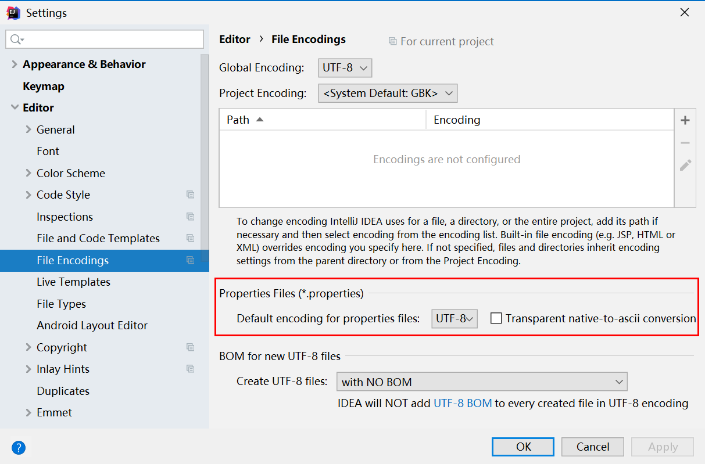
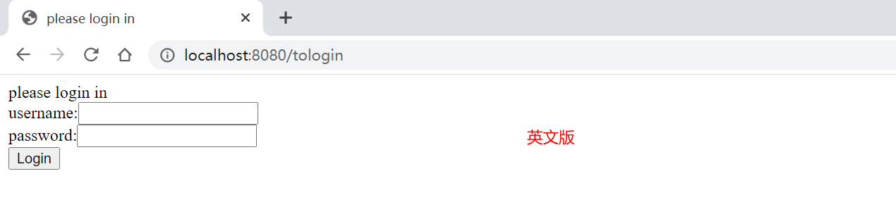
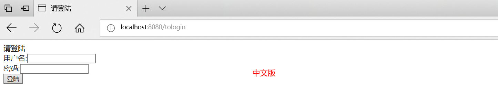
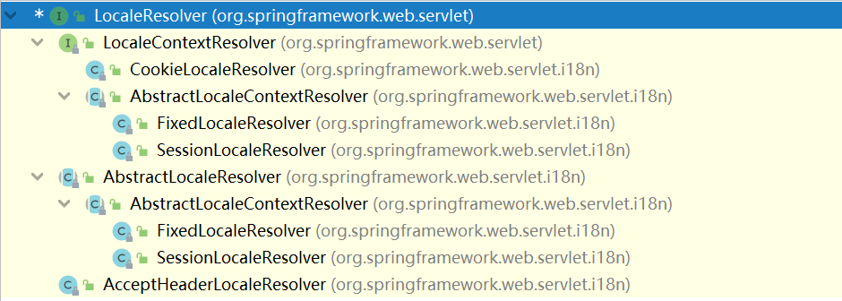
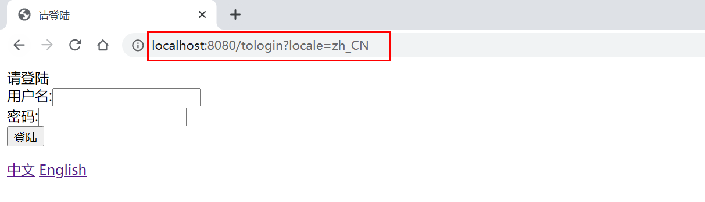
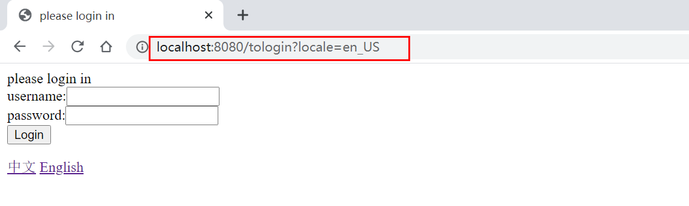

# SpringMVC— —国际化

本文介绍Spring MVC如何根据区域页面显示不同的语言以及如何设置区域信息。


## 一、基本国际化

本例讲解如何根据浏览器的语言设置，自动转换页面语言。

首先在`resources`下创建不同语言的国际化资源文件：

`resources/pages/login`下创建中文资源文件配置`login_zh.properties`：

```properties
introduction=请登陆
username=用户名
password=密码
submit=登陆
```

`resources/pages/login`下创建英文资源文件配置`login_en.properties`：

```properties
introduction=please login in
username=username
password=password
submit=Login
```

然后在`springmvc-servlet.xml`中配置语言文件管理器：

```xml
<!-- 配置国际化资源文件管理器 -->
<bean id="messageSource" class="org.springframework.context.support.ResourceBundleMessageSource">
    <property name="basenames">
        <list>
            <value>pages.login.login</value>
        </list>
    </property>
    <!-- 国际化资源文件编码设置 -->
    <property name="defaultEncoding" value="UTF-8"></property>
</bean>
```

注意：

- 如果需要为多个页面设置国际化，则设置`basenames`，如果只有一个页面，则只需要设置`basename`；
- `pages.login.login`表示文件夹`pages/login`下以`login`开头的文件为所管理的国际化资源文件；注意文件夹之间不是用`/`分隔，而是`.`。

此处需要额外设置IDEA的文件编码格式：`file-->settings-->editor-->file encodings`，将properties文件的编码设置为`UTF-8`:



然后编写登陆`login.jsp`界面，此处需要用到两个关于EL表达式的依赖：

```markdown
jstl-1.1.2.jar
standard-1.1.2.jar
```

`login.jsp`页面内容如下：

```jsp
<%@ page contentType="text/html;charset=UTF-8" language="java" %>
<%@ taglib prefix="fmt" uri="http://java.sun.com/jsp/jstl/fmt" %>
<html>
    <head>
        <title><fmt:message key="introduction"/></title>
    </head>
    <body>
        <fmt:message key="introduction"/>
        <form action="/login" method="post">
            <fmt:message key="username"/>:<input type="text" name="username"><br>
            <fmt:message key="password"/>:<input type="password" name="password"><br>
            <input type="submit" value="<fmt:message key="submit"/>">
        </form>

    </body>
</html>

```

注意:

- 在页头引入fmt：`<%@ taglib prefix="fmt" uri="http://java.sun.com/jsp/jstl/fmt" %>`
- 然后在需要国际化的地方，利用` <fmt:message key="xxx"/>`的方式取出国际化资源文件中的内容；

编写Controller层代码如下：

```java
package com.lee.controller;

import org.springframework.stereotype.Controller;
import org.springframework.web.bind.annotation.RequestMapping;

@Controller
public class LoginController {

    @RequestMapping("/tologin")
    public String toLogin(){
        return "login";
    }
}

```

改变浏览器的语言设置，输入地址`http://localhost:8080/tologin`内容分别如下：






## 二、区域信息处理器介绍

在Spring MVC的前端控制器中，区域信息处理器为接口`LocaleResolver`，接口类型如下：

```java
public interface LocaleResolver {
    //从request中获得Locale信息
    Locale resolveLocale(HttpServletRequest request);

    //设置Locale
    void setLocale(HttpServletRequest request, @Nullable HttpServletResponse response, @Nullable Locale locale);
}

```

Spring MVC中实现了`LocaleResolver`接口的类有如下：



- `AcceptHeaderLocaleResolver`，从请求的`Header`中获取`Locale`，不支持修改`Locale`，也是默认的区域处理器。

- `CookieLocaleResolver`，从`Cookie`中获取`Locale`，支持修改`Locale`;
- `FixedLocaleResolver`，从JVM获取默认的`Locale`，不支持修改`Locale`；
- `SessionLocaleResolver`，从`Session`获取`Locale`，支持修改`Locale`;


## 三、自定义区域信息处理器

我们可以自己实现`LocaleResolver`接口，编写自己的区域信息处理器：

```java
package com.lee.localeResolver;

import org.springframework.web.servlet.LocaleResolver;

import javax.servlet.http.HttpServletRequest;
import javax.servlet.http.HttpServletResponse;
import java.util.Locale;

public class MyLocaleResolver implements LocaleResolver {
    @Override
    public Locale resolveLocale(HttpServletRequest httpServletRequest) {
        Locale locale = null;
        String localeString = httpServletRequest.getParameter("locale");
        if (localeString != null && !"".equals(localeString) ) {
            String[] strings = localeString.split("_");
            locale = new Locale(strings[0],strings[1]);
        }else {
            locale = httpServletRequest.getLocale();
        }
        return locale;
    }

    @Override
    public void setLocale(HttpServletRequest httpServletRequest, HttpServletResponse httpServletResponse, Locale locale) {
        throw new UnsupportedOperationException("Cannot change locale");
    }
}

```

然后在`springmvc-servlet.xml`中设置为自己的区域信息处理器：

```xml
<!-- 设置区域信息处理器 -->
<bean id="localeResolver" class="com.lee.localeResolver.MyLocaleResolver"></bean>
```

login.jsp页面内容增加了切换区域信息的超链接：

```jsp
<%@ page contentType="text/html;charset=UTF-8" language="java" %>
<%@ taglib prefix="fmt" uri="http://java.sun.com/jsp/jstl/fmt" %>
<html>
<head>
    <title><fmt:message key="introduction"/></title>
</head>
<body>
<fmt:message key="introduction"/>
<form action="/login" method="post">
    <fmt:message key="username"/>:<input type="text" name="username"><br>
    <fmt:message key="password"/>:<input type="password" name="password"><br>
    <input type="submit" value="<fmt:message key="submit"/>">
</form>
<a href="/tologin?locale=zh_CN">中文</a>
<a href="/tologin?locale=en_US">English</a>

</body>
</html>

```

当点击不同的超链接时，会切换不同的语言：






## 四、SessionLocaleResolver和LocaleChangeInterceptor

我们也可以利用`SessionLocaleResolver`和拦截器`LocaleChangeInterceptor`实现语言切换：

在`springmvc-servlet.xml`中分别配置区域信息处理器和拦截器：

```xml
<!-- 设置区域信息处理器 -->
<bean id="localeResolver" class="org.springframework.web.servlet.i18n.SessionLocaleResolver"></bean>
<!-- 配置拦截器 -->
<mvc:interceptors>
    <bean class="org.springframework.web.servlet.i18n.LocaleChangeInterceptor"></bean>
</mvc:interceptors>

```

login.jsp页面如上不变，效果相同。

原理主要是拦截器`LocaleChangeInterceptor`会解析请求中的参数`?locale=xxx`，然后设置进`session`中，`SessionLocaleResolver`从`session`中获取区域信息，进行页面语言改变。

拦截器`LocaleChangeInterceptor`源码：

```java
public class LocaleChangeInterceptor extends HandlerInterceptorAdapter {
    public static final String DEFAULT_PARAM_NAME = "locale";
    private String paramName = "locale";
    
    public boolean preHandle(HttpServletRequest request, HttpServletResponse response, Object handler) throws ServletException {
        String newLocale = request.getParameter(this.getParamName());
        if (newLocale != null && this.checkHttpMethod(request.getMethod())) {
            LocaleResolver localeResolver = RequestContextUtils.getLocaleResolver(request);
            if (localeResolver == null) {
                throw new IllegalStateException("No LocaleResolver found: not in a DispatcherServlet request?");
            }

            try {
                localeResolver.setLocale(request, response, this.parseLocaleValue(newLocale));
            } catch (IllegalArgumentException var7) {
                if (!this.isIgnoreInvalidLocale()) {
                    throw var7;
                }

                if (this.logger.isDebugEnabled()) {
                    this.logger.debug("Ignoring invalid locale value [" + newLocale + "]: " + var7.getMessage());
                }
            }
        }

        return true;
    }   
}
```

