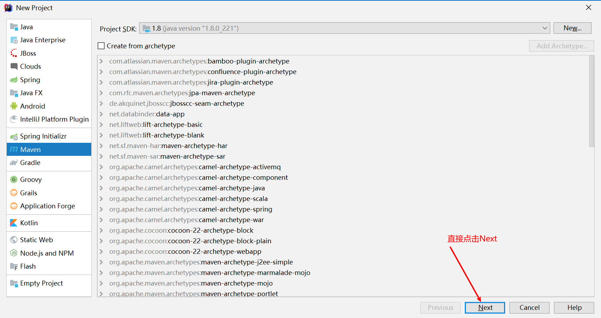
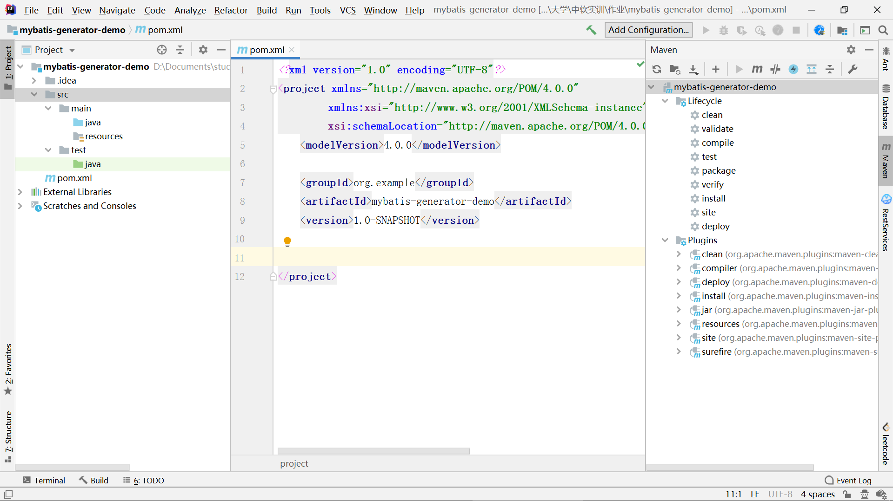
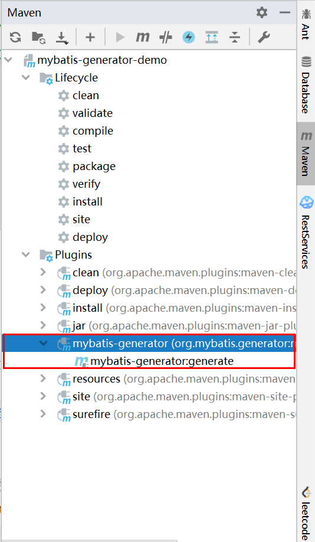
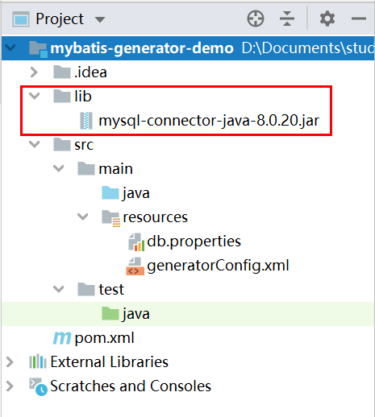
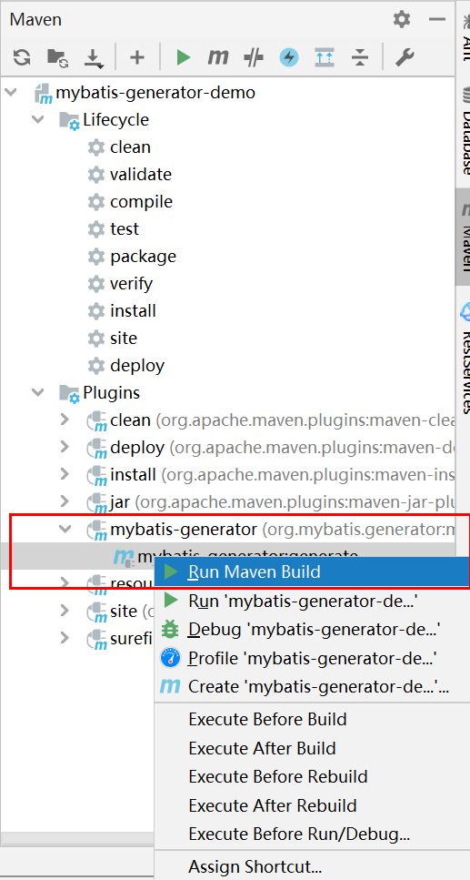
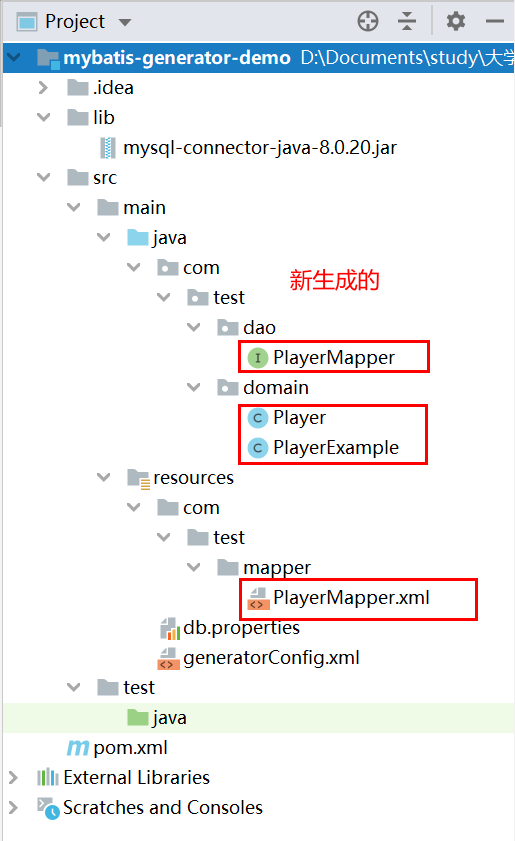
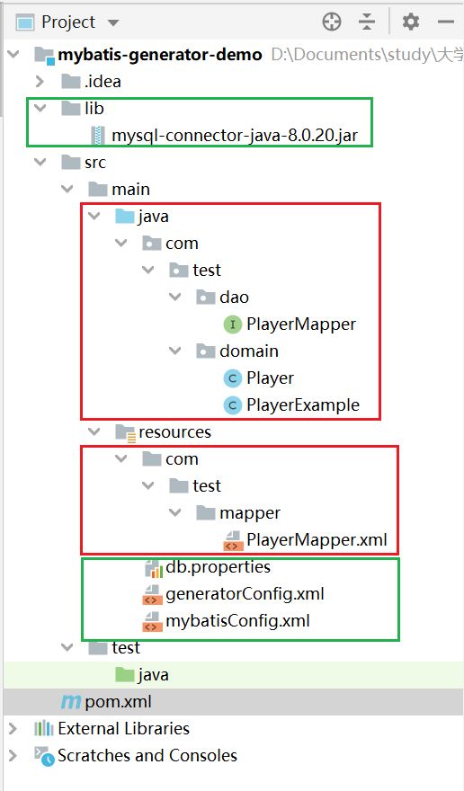

# MyBatis— —mybatis generator插件的使用[IDEA]

本文主要介绍在Maven项目中，如何利用mybatis-generator插件，用于自动生成MyBatis的Mapper和POJO。

[toc]

## 一、新建项目

打开IDEA，新建Maven项目，不使用模板，然后项目命名为mybatis-generator-demo，点击Finish完成项目创建。



等待Maven导入依赖，项目如下：




## 二、添加插件

在pom.xml文件中添加如下插件信息：

```xml
<build>
    <!--放在finalName标签的下面-->
    <plugins>
        <!--mybatis-generator插件-->
        <plugin>
            <!--Mybatis-generator插件,用于自动生成Mapper和POJO-->
            <groupId>org.mybatis.generator</groupId>
            <artifactId>mybatis-generator-maven-plugin</artifactId>
            <version>1.3.2</version>
            <configuration>
                <!--配置文件的位置  一定要改成配置文件的位置及名字-->
                <configurationFile>src/main/resources/generatorConfig.xml</configurationFile>
                <verbose>true</verbose>
                <overwrite>true</overwrite>
            </configuration>
            <executions>
                <execution>
                    <id>Generate MyBatis Artifacts</id>
                    <goals>
                        <goal>generate</goal>
                    </goals>
                </execution>
            </executions>
            <dependencies>
                <dependency>
                    <groupId>org.mybatis.generator</groupId>
                    <artifactId>mybatis-generator-core</artifactId>
                    <version>1.3.2</version>
                </dependency>
            </dependencies>
        </plugin>
        <plugin>
            <groupId>org.apache.maven.plugins</groupId>
            <artifactId>maven-compiler-plugin</artifactId>
            <configuration>
                <source>8</source>
                <target>8</target>
            </configuration>
        </plugin>
    </plugins>
</build>
```

之后，我们在Maven面板中插件一栏可以看到mybatis-generator:




## 三、创建mybatis generator配置文件

我们需要注意的是generatorConfig.xml文件的位置，在pom.xml文件中显示配置文件的位置如下：

```xml
<configurationFile>src/main/resources/generatorConfig.xml</configurationFile>
```

配置文件的内容如下，需要注意的点：

- 将id修改为项目名
- 其他配置按需要修改

```xml
<?xml version="1.0" encoding="UTF-8"?>
<!DOCTYPE generatorConfiguration
        PUBLIC "-//mybatis.org//DTD MyBatis Generator Configuration 1.0//EN"
        "http://mybatis.org/dtd/mybatis-generator-config_1_0.dtd">

<!-- mybatis generator文档地址：http://mybatis.org/generator/index.html  -->
<generatorConfiguration>
    <!-- 数据库配置文件地址 -->
    <properties resource="db.properties"/>
    <!-- 数据库驱动地址 -->
    <classPathEntry location="src/main/webapp/lib/mysql-connector-java-8.0.20.jar"/>
    <!-- id为项目名 -->
    <context id="xxx" targetRuntime="MyBatis3">

        <commentGenerator>
            <property name="suppressDate" value="true"/>
            <!-- 是否去除自动生成的注释 true：是 ： false:否 -->
            <property name="suppressAllComments" value="true"/>
        </commentGenerator>

        <!--数据库链接URL，用户名、密码 -->
        <jdbcConnection driverClass="${jdbc.driver}"
                        connectionURL="${jdbc.url}" userId="${jdbc.username}" password="${jdbc.password}">
        </jdbcConnection>

        <!-- 数据类型转换 -->
        <javaTypeResolver>
            <property name="forceBigDecimals" value="false"/>
        </javaTypeResolver>

        <!-- 生成模型的包名和位置，按照项目实际情况修改 -->
        <javaModelGenerator targetPackage="xmu.lee.domain"
                            targetProject="src/main/java">
            <!-- enableSubPackages:是否让schema作为包的后缀 -->
            <property name="enableSubPackages" value="true"/>
            <!-- 从数据库返回的值被清理前后的空格 -->
            <property name="trimStrings" value="true"/>
        </javaModelGenerator>

        <!-- 生成XML映射文件的包名和位置，按照项目实际情况修改 -->
        <sqlMapGenerator targetPackage="xmu.lee.mapper"
                         targetProject="src/main/resources">
            <property name="enableSubPackages" value="true"/>
        </sqlMapGenerator>

        <!-- 生成DAO的包名和位置 ，按照项目实际情况修改-->
        <javaClientGenerator type="XMLMAPPER"
                             targetPackage="xmu.lee.dao"
                             targetProject="src/main/java">
            <property name="enableSubPackages" value="true"/>
        </javaClientGenerator>

        <!-- 要生成哪些表，可以有多个table元素 -->
        <!-- tableName:用于自动生成代码的数据库表；domainObjectName:对应于数据库表的javaBean类名 -->
        <table tableName="tab_article"
               domainObjectName="Article">
            <!--  手动转换数据库Date为java的LocalDate-->
            <!-- column为数据库列名 ,property为java数据类型-->
            <columnOverride column="article_publish_date"
                            property="articlePublishDate"
                            jdbcType="DATE"
                            javaType="java.time.LocalDate"
                            typeHandler="org.apache.ibatis.type.LocalDateTypeHandler"></columnOverride>
        </table>
    </context>
</generatorConfiguration>
```

注意，默认情况下，mybatis generator会将数据库DATE数据类型转换为java.time.Date类型，但由于Date类型不好用 ，所以我们要手动配置，将数据库DATE数据类型转换为LocalDate类型。

在`<table>   </table>`中添加子元素`<columnOveride>`：

```xml
<table tableName="tab_article"
               domainObjectName="Article">
            <!--  手动转换数据库Date为java的LocalDate-->
            <!-- column为数据库列名 ,property为java数据类型-->
            <columnOverride column="article_publish_date"
                            property="articlePublishDate"
                            jdbcType="DATE"
                            javaType="java.time.LocalDate"
                            typeHandler="org.apache.ibatis.type.LocalDateTypeHandler">			  </columnOverride>
</table>
```

- column为数据库列名
- property为实体类的属性名
- jdbcType为数据库字段数据类型，必须为大写
- javaType就是要转换的实体属性的数据类型
- typeHandler为转换引擎，注意不要写错了，将DATE转换为LocalDate就写`LocalDateTypeHandler`


## 四、创建数据库配置文件

在`src/main/resources`下创建数据库配置文件`db.properties`：

```properties
jdbc.driver=com.mysql.cj.jdbc.Driver
jdbc.url=jdbc:mysql://localhost:3306/test?serverTimezone=Asia/Shanghai
jdbc.username=root
jdbc.password=123456
```

此处使用的数据库版本是MySQL 8.0.20，所以数据库驱动为`com.mysql.cj.jdbc.Driver`，并且在数据库连接url后面需要加上时区。


## 五、引入数据库驱动文件

因为在`generatorConfig.xml`文件中需要指定数据库驱动文件位置`lib/mysql-connector-java-8.0.20.jar`，所以我们需要在项目下新建`lib`文件夹，然后将数据库驱动放进该文件夹。




## 六、运行插件

在Maven面板中选择该插件，右击运行：



之后再项目结构中，能看到新生成的模型、映射配置文件等：




## 七、创建mybatis配置文件

mybatis generator插件只是帮助我们生成了一些枯燥的代码，不用我们自己写而已。如果要使用MyBatis，仍然需要MyBatis配置文件，在`src/main/resources`下创建MyBatis配置文件：

```xml
<?xml version="1.0" encoding="UTF-8" ?>
<!DOCTYPE configuration
        PUBLIC "-//mybatis.org//DTD Config 3.0//EN"
        "http://mybatis.org/dtd/mybatis-3-config.dtd">

<configuration>
    <properties resource="db.properties"></properties>

    <environments default="development">
        <environment id="development">
            <transactionManager type="JDBC"></transactionManager>
            <dataSource type="POOLED">
                <property name="driver" value="${database.driver}"/>
                <property name="url" value="${database.url}"/>
                <property name="username" value="${database.username}"/>
                <property name="password" value="${database.password}"/>
            </dataSource>
        </environment>
    </environments>

    <mappers>
        <mapper resource="com/test/mapper/PlayerMapper.xml"></mapper>
    </mappers>

</configuration>
```

最主要的是设置映射配置文件的位置。

然后还要在pom.xml文件中加入数据库驱动和mybatis依赖：

```xml
<dependencies>

    <!-- https://mvnrepository.com/artifact/mysql/mysql-connector-java -->
    <dependency>
        <groupId>mysql</groupId>
        <artifactId>mysql-connector-java</artifactId>
        <version>8.0.20</version>
    </dependency>

    <!-- https://mvnrepository.com/artifact/org.mybatis/mybatis -->
    <dependency>
        <groupId>org.mybatis</groupId>
        <artifactId>mybatis</artifactId>
        <version>3.5.5</version>
    </dependency>

</dependencies>
```


## 八、总结

mybatis generator插件并不是为了替代MyBatis，而是帮助我们自动生成模型代码、映射配置文件、Mapper接口代码，免除了繁琐的持久层代码编写工作，所以在生成代码之后，不要忘记创建MyBatis配置文件以及添加依赖。

最后整个项目结构如下（红框中的是mybatis generator生成的，绿框的是自己需要创建的）：

