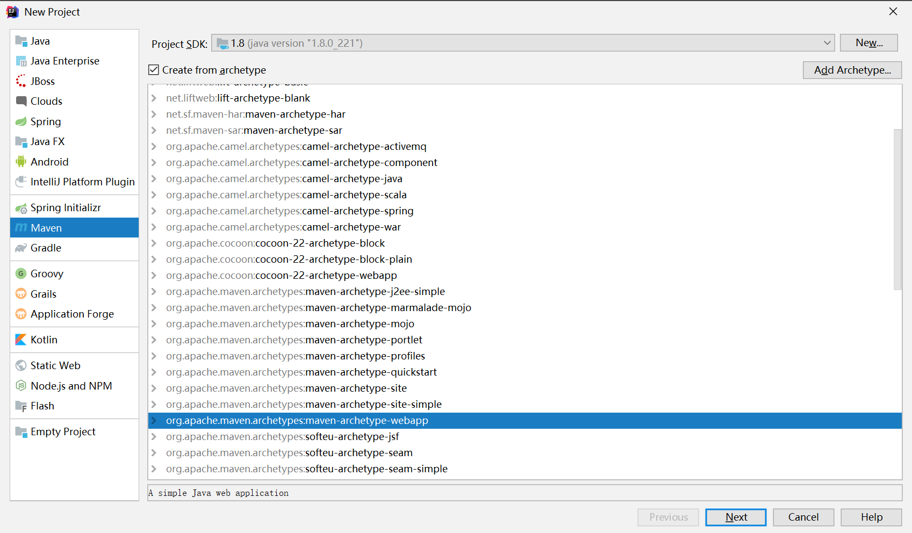
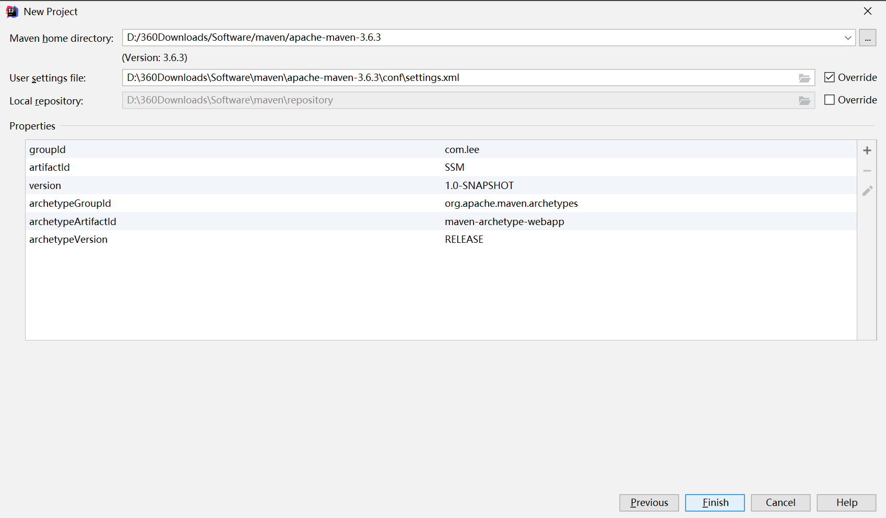
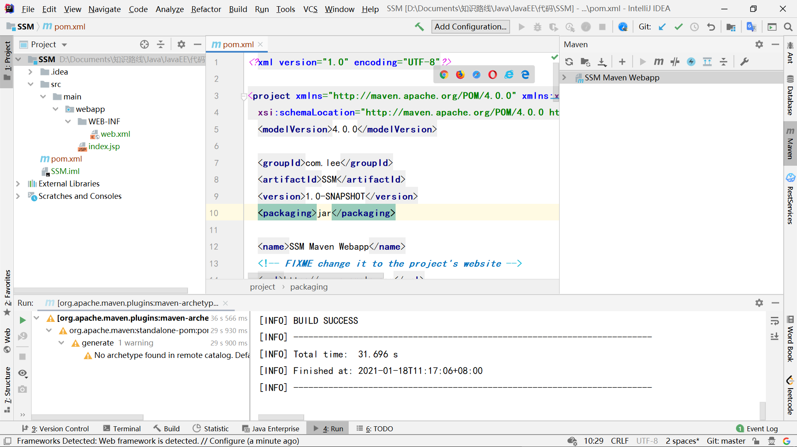
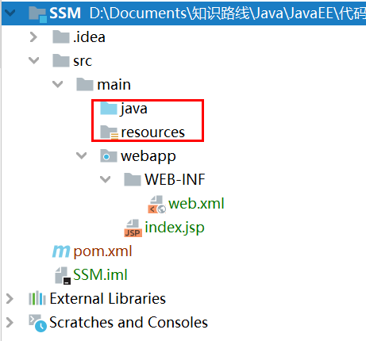
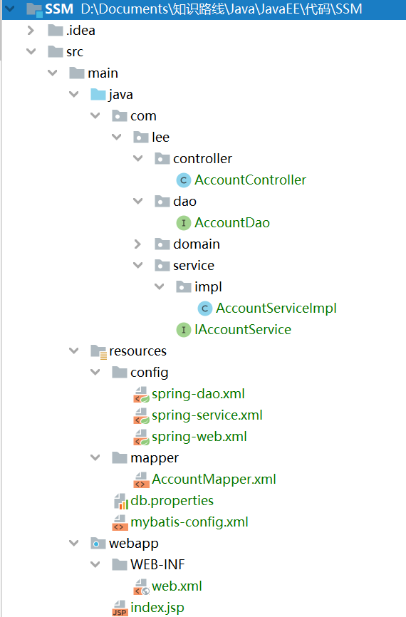
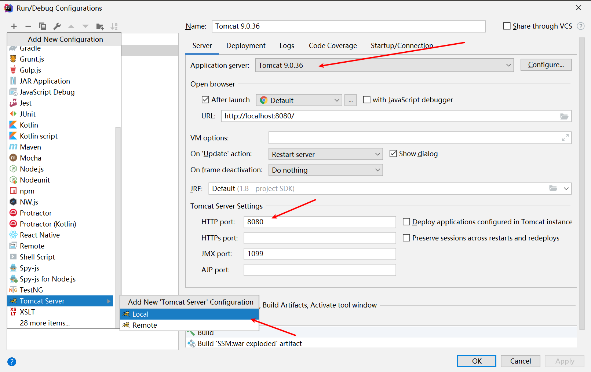
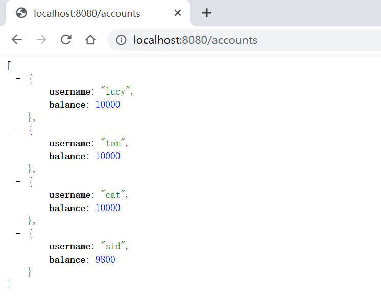
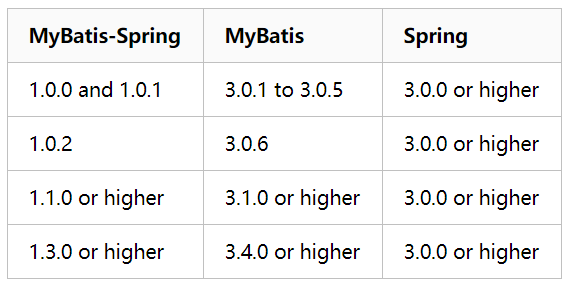
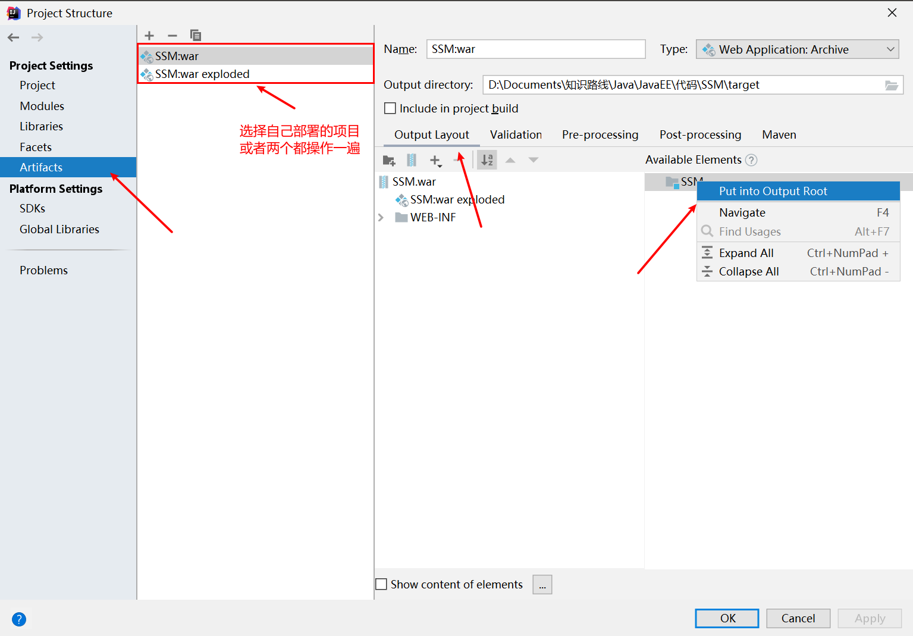

# SSM进阶— —SSM整合

本文主要介绍如何利用maven进行SSM整合，进行网站开发。

[toc]

## 一、创建项目

选择创建maven-webapp项目：



注意设置maven的配置文件和本地仓库：



项目创建完成后如下：

- 将打包方式`<packaging>war</packaging>`修改为`jar`；

- 

  ```xml
  <properties>
      <project.build.sourceEncoding>UTF-8</project.build.sourceEncoding>
      <maven.compiler.source>1.7</maven.compiler.source>
      <maven.compiler.target>1.7</maven.compiler.target>
  </properties>
  修改为
  <properties>
      <project.build.sourceEncoding>UTF-8</project.build.sourceEncoding>
      <maven.compiler.source>1.8</maven.compiler.source>
      <maven.compiler.target>1.8</maven.compiler.target>
  </properties>
  ```




然后在main目录下创建源码文件夹和资源文件夹：




## 二、引入依赖

### 2.1 引入spring依赖

在pom.xml中引入spring依赖：

```xml
<properties>
    <!-- 控制springframework版本 -->
    <spring.version>5.3.3</spring.version>
</properties>

<dependencies>
    <!-- https://mvnrepository.com/artifact/org.springframework -->
    <dependency>
        <groupId>org.springframework</groupId>
        <artifactId>spring-core</artifactId>
        <version>${spring.version}</version>
    </dependency>
    <dependency>
        <groupId>org.springframework</groupId>
        <artifactId>spring-context</artifactId>
        <version>${spring.version}</version>
    </dependency>
    <dependency>
        <groupId>org.springframework</groupId>
        <artifactId>spring-expression</artifactId>
        <version>${spring.version}</version>
    </dependency>
    <dependency>
        <groupId>org.springframework</groupId>
        <artifactId>spring-beans</artifactId>
        <version>${spring.version}</version>
    </dependency>
    <dependency>
        <groupId>org.springframework</groupId>
        <artifactId>spring-jdbc</artifactId>
        <version>${spring.version}</version>
    </dependency>
</dependencies>
```


### 2.2 引入spring mvc依赖

在pom.xml中引入spring mvc 依赖：

```xml
<dependency>
    <groupId>org.springframework</groupId>
    <artifactId>spring-web</artifactId>
    <version>${spring.version}</version>
</dependency>
<dependency>
    <groupId>org.springframework</groupId>
    <artifactId>spring-webmvc</artifactId>
    <version>${spring.version}</version>
</dependency>
```


### 2.3 引入mybatis依赖

在pom.xml中引入mybatis和mysql连接依赖：

```xml
<properties>
    <mybatis.version>3.5.6</mybatis.version>
    <mysql.version>8.0.22</mysql.version>
</properties>

<dependencies>
    <!-- https://mvnrepository.com/artifact/org.mybatis/mybatis -->
    <dependency>
        <groupId>org.mybatis</groupId>
        <artifactId>mybatis</artifactId>
        <version>${mybatis.version}</version>
    </dependency>
    <dependency>
        <groupId>org.mybatis</groupId>
        <artifactId>mybatis-spring</artifactId>
        <version>1.3.0</version>
    </dependency>
    <!-- https://mvnrepository.com/artifact/mysql/mysql-connector-java -->
    <dependency>
        <groupId>mysql</groupId>
        <artifactId>mysql-connector-java</artifactId>
        <version>${mysql.version}</version>
    </dependency>
</dependencies>
```


### 2.4 引入Jackson

我们只需要向前端传JSON数据，所以不需要页面，引入Jackson：

```xml
<dependency>
    <groupId>com.fasterxml.jackson.core</groupId>
    <artifactId>jackson-databind</artifactId>
    <version>${jackson.version}</version>
</dependency>
<dependency>
    <groupId>com.fasterxml.jackson.core</groupId>
    <artifactId>jackson-core</artifactId>
    <version>${jackson.version}</version>
</dependency>
<dependency>
    <groupId>com.fasterxml.jackson.core</groupId>
    <artifactId>jackson-annotations</artifactId>
    <version>${jackson.version}</version>
</dependency>
```


### 2.5 引入数据库连接池

引入druid数据库连接池依赖：

```xml
<!-- https://mvnrepository.com/artifact/com.alibaba/druid -->
<dependency>
    <groupId>com.alibaba</groupId>
    <artifactId>druid</artifactId>
    <version>1.2.4</version>
</dependency>
```


## 三、创建实体类、控制器类、服务类

创建Account实体类：

```java
package com.lee.domain;

import org.springframework.stereotype.Component;

@Component
public class Account {
    private String username;
    private Integer balance;

    public String getUsername() {
        return username;
    }

    public void setUsername(String username) {
        this.username = username;
    }

    public Integer getBalance() {
        return balance;
    }

    public void setBalance(Integer balance) {
        this.balance = balance;
    }

    @Override
    public String toString() {
        return "Account{" +
                "username='" + username + '\'' +
                ", balance=" + balance +
                '}';
    }
}

```

创建AccoutDao接口：

```java
package com.lee.dao;

import com.lee.domain.Account;
import org.springframework.stereotype.Repository;

import java.util.List;

@Repository("accountDao")
public interface AccountDao {
    public List<Account> findAll();
}

```

创建IAccountService接口：

```java
package com.lee.service;

import com.lee.domain.Account;

import java.util.List;

public interface IAccountService {
    public List<Account> findAll();
}

```

实现IAccountServiceImpl接口：

```java
package com.lee.service.impl;

import com.lee.dao.AccountDao;
import com.lee.domain.Account;
import com.lee.service.IAccountService;
import org.springframework.beans.factory.annotation.Autowired;
import org.springframework.stereotype.Service;

import java.util.List;

@Service("accountService")
public class AccountServiceImpl implements IAccountService {
    
    @Autowired
    private AccountDao accountDao;
    
    @Override
    public List<Account> findAll() {
        return accountDao.findAll();
    }
}

```

创建AccountController类：

```java
package com.lee.controller;

import com.lee.domain.Account;
import com.lee.service.IAccountService;
import org.springframework.beans.factory.annotation.Autowired;
import org.springframework.stereotype.Controller;
import org.springframework.web.bind.annotation.GetMapping;

import java.util.List;

@RestController
public class AccountController {
    
    @Autowired
    private IAccountService accountService;
    
    @GetMapping("/accounts")
    public String findAll(){
        List<Account> all = accountService.findAll();
        System.out.println(all);
        return "success";
    }
}
```


## 四、创建配置文件

### 4.1 创建spring-web.xml配置文件

在resources/config下创建spring-web.xml配置文件，对spring mvc 进行配置：

```xml
<?xml version="1.0" encoding="UTF-8"?>
<beans xmlns="http://www.springframework.org/schema/beans"
       xmlns:xsi="http://www.w3.org/2001/XMLSchema-instance"
       xmlns:context="http://www.springframework.org/schema/context"
       xmlns:mvc="http://www.springframework.org/schema/mvc"
       xsi:schemaLocation="http://www.springframework.org/schema/beans
	http://www.springframework.org/schema/beans/spring-beans.xsd
	http://www.springframework.org/schema/context
	http://www.springframework.org/schema/context/spring-context.xsd
	http://www.springframework.org/schema/mvc
	http://www.springframework.org/schema/mvc/spring-mvc-3.0.xsd">
    <!-- 配置SpringMVC -->
    <!-- 1.开启SpringMVC注解模式 -->
    <!-- 简化配置：
        (1)自动注册DefaultAnootationHandlerMapping,AnotationMethodHandlerAdapter
        (2)提供一些列：数据绑定，数字和日期的format @NumberFormat, @DateTimeFormat, xml,json默认读写支持
    -->
    <mvc:annotation-driven />

    <!-- 2.静态资源默认servlet配置
        (1)加入对静态资源的处理：js,gif,png
        (2)允许使用"/"做整体映射
     -->
    <mvc:default-servlet-handler/>

    <!-- 3.配置jsp 显示ViewResolver -->
    <bean class="org.springframework.web.servlet.view.InternalResourceViewResolver">
        <property name="viewClass" value="org.springframework.web.servlet.view.JstlView" />
        <property name="prefix" value="/WEB-INF/jsp/" />
        <property name="suffix" value=".jsp" />
    </bean>

    <!-- 4.扫描web相关的bean -->
    <context:component-scan base-package="com.lee.controller" />
</beans>

```


### 4.2 创建spring-service.xml配置文件

在resources/config下创建spring-service.xml配置文件，将service层的服务类加入容器：

```xml
<?xml version="1.0" encoding="UTF-8"?>
<beans xmlns="http://www.springframework.org/schema/beans"
       xmlns:xsi="http://www.w3.org/2001/XMLSchema-instance"
       xmlns:context="http://www.springframework.org/schema/context"
       xmlns:aop="http://www.springframework.org/schema/aop"
       xmlns:tx="http://www.springframework.org/schema/tx"
       xsi:schemaLocation="http://www.springframework.org/schema/beans  http://www.springframework.org/schema/beans/spring-beans-3.0.xsd
           http://www.springframework.org/schema/context http://www.springframework.org/schema/context/spring-context-3.0.xsd
           http://www.springframework.org/schema/aop http://www.springframework.org/schema/aop/spring-aop-3.0.xsd
           http://www.springframework.org/schema/tx http://www.springframework.org/schema/tx/spring-tx-3.0.xsd">

    <!-- 注解扫描 -->
    <context:component-scan base-package="com.lee.service"></context:component-scan>

</beans>
```


### 4.3 创建spring-dao.xml配置文件

在resources下创建db.properties:

```properties
jdbc.driver=com.mysql.cj.jdbc.Driver
jdbc.url=jdbc:mysql://localhost:3306/test?serverTimezone=Asia/Shanghai&useUnicode=true&characterEncoding=UTF-8
jdbc.username=root
jdbc.password=123456
```

在resources/config下创建spring-dao.xml配置文件，配置数据源和数据库连接池：

```xml
<?xml version="1.0" encoding="UTF-8"?>
<beans xmlns="http://www.springframework.org/schema/beans"
       xmlns:xsi="http://www.w3.org/2001/XMLSchema-instance" xmlns:context="http://www.springframework.org/schema/context"
       xsi:schemaLocation="http://www.springframework.org/schema/beans
	http://www.springframework.org/schema/beans/spring-beans.xsd
	http://www.springframework.org/schema/context
	http://www.springframework.org/schema/context/spring-context.xsd">
    <!-- 配置整合mybatis过程 -->
    <!-- 1.配置数据库相关参数properties的属性：${url} -->
    <context:property-placeholder location="classpath:db.properties" />

    <!-- 2.数据库连接池 -->
    <bean id="dataSource" class="com.alibaba.druid.pool.DruidDataSource">
        <!-- 配置连接池属性 -->
        <property name="driverClassName" value="${jdbc.driver}" />
        <property name="url" value="${jdbc.url}" />
        <property name="username" value="${jdbc.username}" />
        <property name="password" value="${jdbc.password}" />
    </bean>

    <!-- 3.配置SqlSessionFactory对象 -->
    <bean id="sqlSessionFactory" class="org.mybatis.spring.SqlSessionFactoryBean">
        <!-- 注入数据库连接池 -->
        <property name="dataSource" ref="dataSource" />
        <!-- 配置MyBaties全局配置文件:mybatis-config.xml -->
        <property name="configLocation" value="classpath:mybatis-config.xml" />
        <!-- 扫描domain包 使用别名 -->
        <property name="typeAliasesPackage" value="com.lee.domain" />
        <!-- 扫描sql配置文件:mapper需要的xml文件 -->
        <property name="mapperLocations" value="classpath:mapper/*.xml" />
    </bean>

    <!-- 4.配置扫描Dao接口包，动态实现Dao接口，注入到spring容器中 -->
    <bean class="org.mybatis.spring.mapper.MapperScannerConfigurer">
        <!-- 注入sqlSessionFactory -->
        <property name="sqlSessionFactoryBeanName" value="sqlSessionFactory" />
        <!-- 给出需要扫描Dao接口包 -->
        <property name="basePackage" value="com.lee.dao" />
    </bean>
</beans>

```

在resources下创建mybatis-config.xml文件：

```xml
<?xml version="1.0" encoding="UTF-8" ?>
<!DOCTYPE configuration
        PUBLIC "-//mybatis.org//DTD Config 3.0//EN"
        "http://mybatis.org/dtd/mybatis-3-config.dtd">
<configuration>
    <!-- 配置全局属性 -->
    <settings>
        <!-- 使用jdbc的getGeneratedKeys获取数据库自增主键值 -->
        <setting name="useGeneratedKeys" value="true" />

        <!-- 使用列别名替换列名 默认:true -->
        <setting name="useColumnLabel" value="true" />

        <!-- 开启驼峰命名转换:Table{create_time} -> Entity{createTime} -->
        <setting name="mapUnderscoreToCamelCase" value="true" />
    </settings>
</configuration>

```

在resources/mapper下创建对应的AccountMapper.xml文件：

```xml
<?xml version="1.0" encoding="UTF-8" ?>
<!DOCTYPE mapper PUBLIC "-//mybatis.org//DTD Mapper 3.0//EN" "http://mybatis.org/dtd/mybatis-3-mapper.dtd" >
<mapper namespace="com.lee.dao.AccountDao">
    <select id="findAll" resultType="com.lee.domain.Account">
        select * from account;
    </select>
</mapper>
```


## 五、配置web.xml文件

配置web.xml文件，加载上述的配置文件：

```xml
<!DOCTYPE web-app PUBLIC
        "-//Sun Microsystems, Inc.//DTD Web Application 2.3//EN"
        "http://java.sun.com/dtd/web-app_2_3.dtd" >

<web-app>
    <display-name>Archetype Created Web Application</display-name>

    <servlet>
        <servlet-name>DispatcherServlet</servlet-name>
        <servlet-class>org.springframework.web.servlet.DispatcherServlet</servlet-class>
        <!-- 配置springMVC需要加载的配置文件
            spring-dao.xml,spring-service.xml,spring-web.xml
            Mybatis - > spring -> springmvc
         -->
        <init-param>
            <param-name>contextConfigLocation</param-name>
            <param-value>classpath:config/spring-*.xml</param-value>
        </init-param>
    </servlet>
    <servlet-mapping>
        <servlet-name>DispatcherServlet</servlet-name>
        <!-- 默认匹配所有的请求 -->
        <url-pattern>/</url-pattern>
    </servlet-mapping>

</web-app>

```


## 六、项目结构

在上述配置完成后，最终项目结构如下：




## 七、配置Tomcat

配置Tomcat然后启动项目：




## 八、结果

启动项目，浏览器访问`http://localhost:8080/accounts`，结果如下：




## 九、问题及其解决方案

### 9.1 问题一

java.lang.AbstractMethodError:org.mybatis.spring.transaction.SpringManagedTransaction.getTimeout()Ljava/lang/Integer

问题定位：spring、mybatis、mybatis-spring版本不兼容



参考资料：https://www.cnblogs.com/beppezhang/p/6118661.html

### 9.2 问题二

有时候明明导入了依赖，但仍会报未找到相关类的错误

问题定位：在将项目打包进Tomcat中，相关依赖并没有导入

解决方案：

File-->Project Structure-->左侧Project Settings-->选择Artifacts-->右侧选择Output Layer-->Available Elements-->鼠标右键选择 Put into Output Root




## 十、参考资料

【1】https://blog.csdn.net/qq598535550/article/details/51703190

