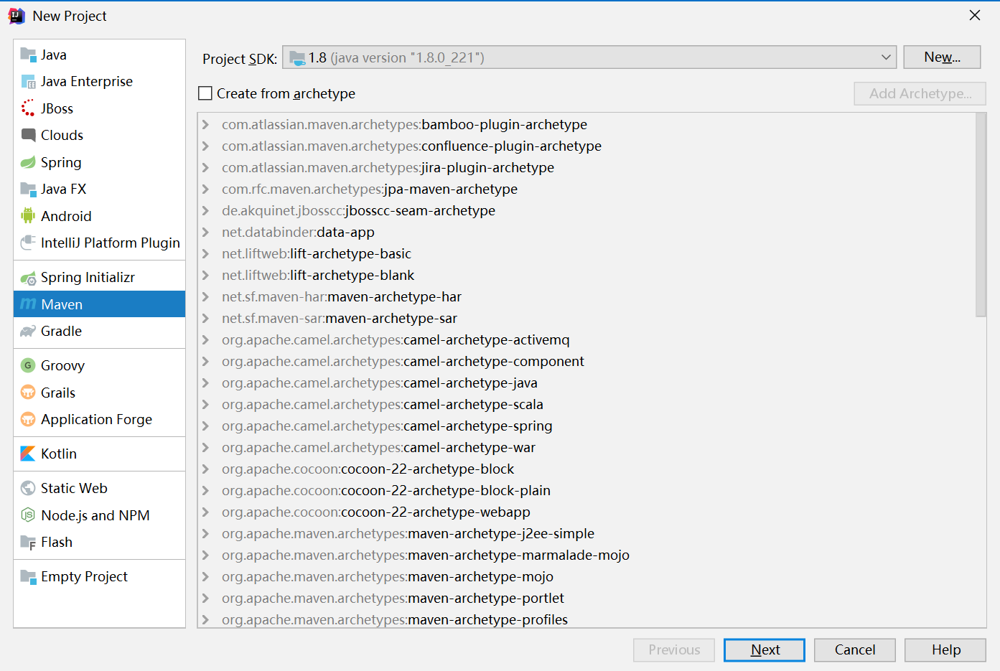
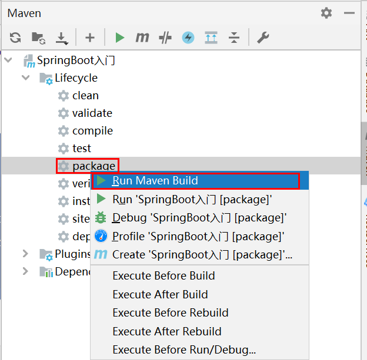
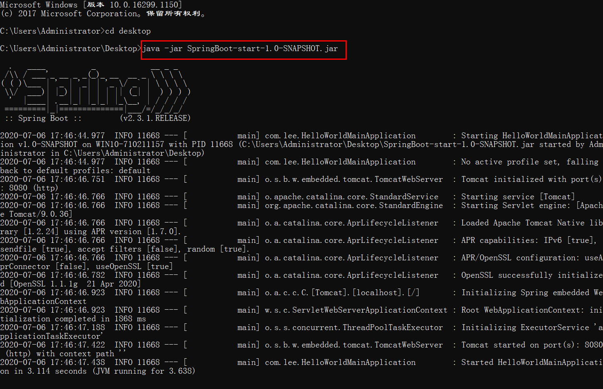
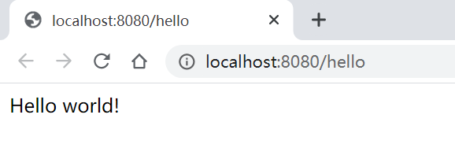
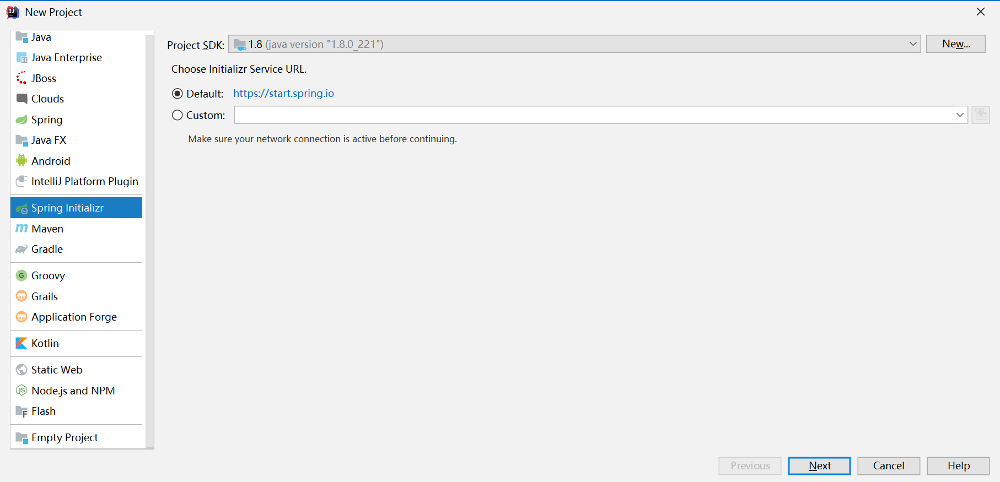
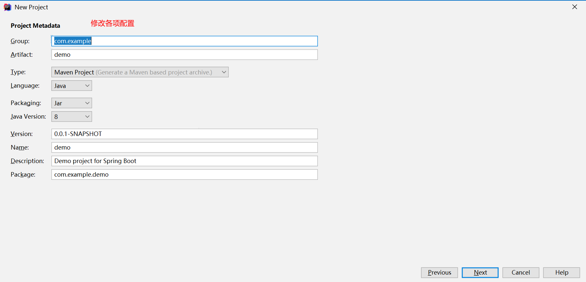
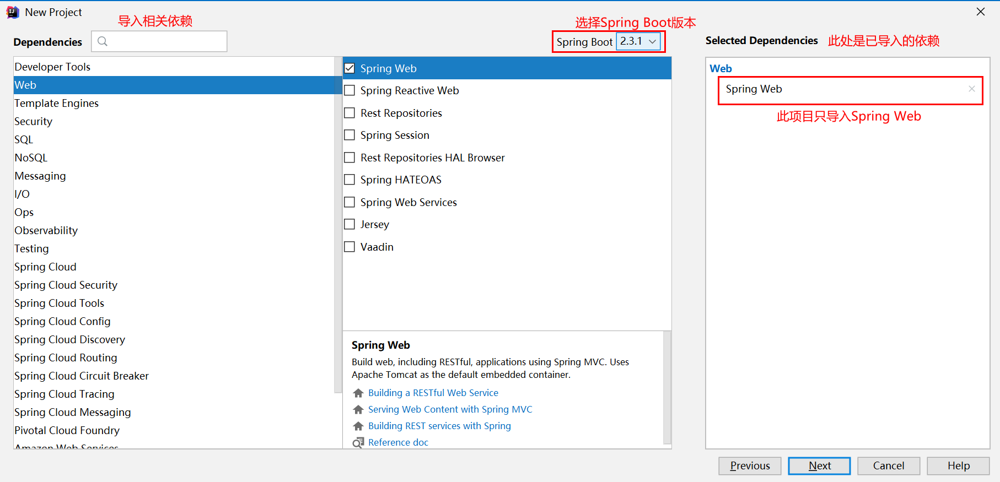
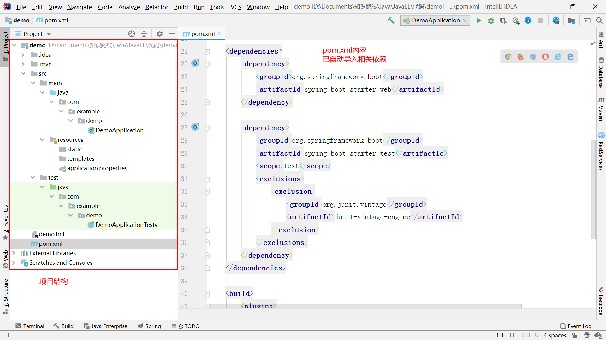

# Spring Boot— —入门程序

本文主要介绍一个Spring Boot的入门程序。

[toc]

## 一、创建maven项目

打开IDEA，创建一个maven项目，不使用模板：



输入项目名，选择项目地址后，完成项目创建。


## 二、导入Spring Boot依赖

在pom.xml文件中添加配置：

```xml
<parent>
    <groupId>org.springframework.boot</groupId>
    <artifactId>spring-boot-starter-parent</artifactId>
    <version>2.3.1.RELEASE</version>
</parent>

<dependencies>
    <dependency>
        <groupId>org.springframework.boot</groupId>
        <artifactId>spring-boot-starter-web</artifactId>
    </dependency>
</dependencies>
```


## 三、创建主程序

在`src/main/java/com/lee`下创建主程序：

```java
package com.lee;

import org.springframework.boot.SpringApplication;
import org.springframework.boot.autoconfigure.SpringBootApplication;

@SpringBootApplication
public class HelloWorldMainApplication {
    public static void main(String[] args) {
        //启动项目
        SpringApplication.run(HelloWorldMainApplication.class,args);
    }
}

```


## 四、创建Controller

在`src/main/java/com/lee/controller`下创建HelloController:

```java
package com.lee.controller;

import org.springframework.web.bind.annotation.RequestMapping;
import org.springframework.web.bind.annotation.RestController;

@RestController
public class HelloController {
    
    @RequestMapping("/hello")
    public String hello(){
        return "Hello world!";
    }
}

```


## 五、启动项目

启动主程序，然后在浏览器中输入地址：http://localhost:8080/hello ：


## 六、项目部署

首先在pom.xml中设置打包方式：

```xml
<packaging>jar</packaging>
```

然后添加插件：

```xml
<build>
    <plugins>
        <plugin>
            <groupId>org.springframework.boot</groupId>
            <artifactId>spring-boot-maven-plugin</artifactId>
        </plugin>
    </plugins>
</build>
```

然后选择Maven面板的package:



注意，此时我遇到了一个问题：提示项目的`<artifactId>`无效。因为我pom.xml文件中的项目`<artifactId>`包含了中文，所以将其中的中文修改或者删除即可。

打包完成后，在target文件下即可找到生成的jar包：SpringBoot-start-1.0-SNAPSHOT.jar。

将生成的jar包复制到桌面，利用命令行启动：



然后在浏览器中输入地址：http://localhost:8080/hello ：



## 七、使用Spring Initializr快速创建项目

我们可以使用Spring Initializr快速创建项目，省略了导入依赖和创建主程序的步骤，并且添加了项目配置文件等内容：







选择项目位置、修改项目名后完成项目创建。



只需要编写业务逻辑代码即可。

