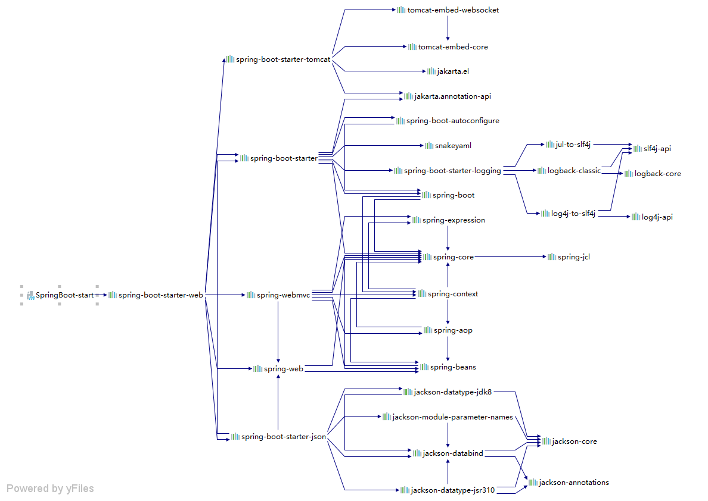

# Spring Boot — —依赖管理

本文主要介绍Spring Boot中依赖管理的知识。

[toc]

## 1. 依赖管理

在我们的项目pom.xml文件中，声明了父项目：

```xml
<parent>
    <groupId>org.springframework.boot</groupId>
    <artifactId>spring-boot-starter-parent</artifactId>
    <version>2.3.1.RELEASE</version>
</parent>
```

我们可以点进去，可以看到父项目`spring-boot-starter-parent`也有父项目：

```xml
<parent>
    <groupId>org.springframework.boot</groupId>
    <artifactId>spring-boot-dependencies</artifactId>
    <version>2.3.1.RELEASE</version>
</parent>
```

同样点进该父项目（`spring-boot-dependencies`），可以发现在该配置文件中声明了许多依赖的版本：

```xml
<properties>
    <activemq.version>5.15.12</activemq.version>
    <antlr2.version>2.7.7</antlr2.version>
    <appengine-sdk.version>1.9.80</appengine-sdk.version>
    <artemis.version>2.12.0</artemis.version>
    <aspectj.version>1.9.5</aspectj.version>
    .....
</properties>
```

这就是自动版本管理，当我们引入依赖时，通常可以不用写版本号，因为springboot已经帮我们写好了。

如果我们想要更改依赖默认的版本号，可以在自己的项目中覆盖默认值，重写相关的版本号，比如：

```xml
<properties>
    <mysql.version>5.1.43</mysql.version>
</properties>
```


## 2. starter 场景启动器

如果我们想要开发web应用，在springboot中只需要引入一个依赖：

```xml
<dependency>
    <groupId>org.springframework.boot</groupId>
    <artifactId>spring-boot-starter-web</artifactId>
</dependency>
```

只要引入starter，这个场景的所有常规需要的依赖都会自动引入，比如，引入了`spring-boot-starter-web`，web开发场景的常规依赖都会引入：



所有场景启动器最底层的依赖是：

```xml
<dependency>
    <groupId>org.springframework.boot</groupId>
    <artifactId>spring-boot-starter</artifactId>
    <version>2.3.4.RELEASE</version>
    <scope>compile</scope>
</dependency>
```

以`spring-boot-starter-*`命名的依赖，是官方出品的，查看更多官方出品的starter场景启动器：

https://docs.spring.io/spring-boot/docs/current/reference/html/using-spring-boot.html#using-boot-starter

第三方提供的场景启动器，通常命名为：`thirdpartyproject-spring-boot-starter`。