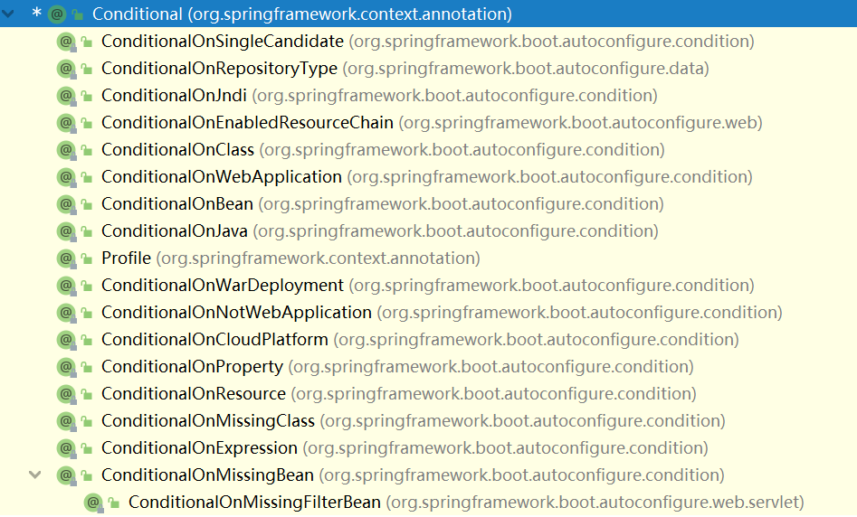
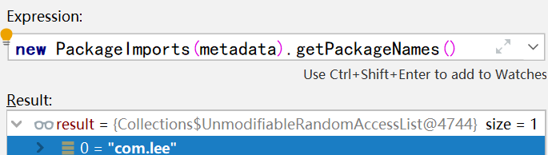
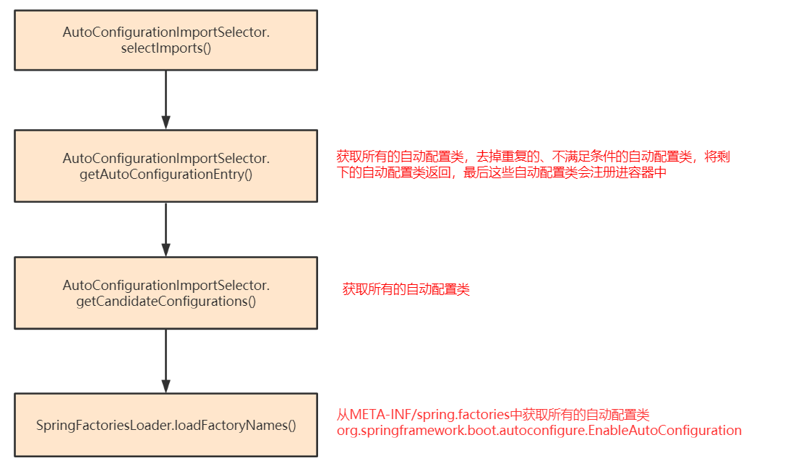
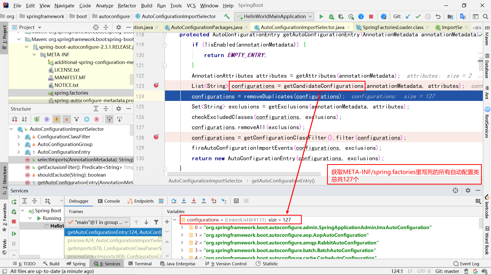
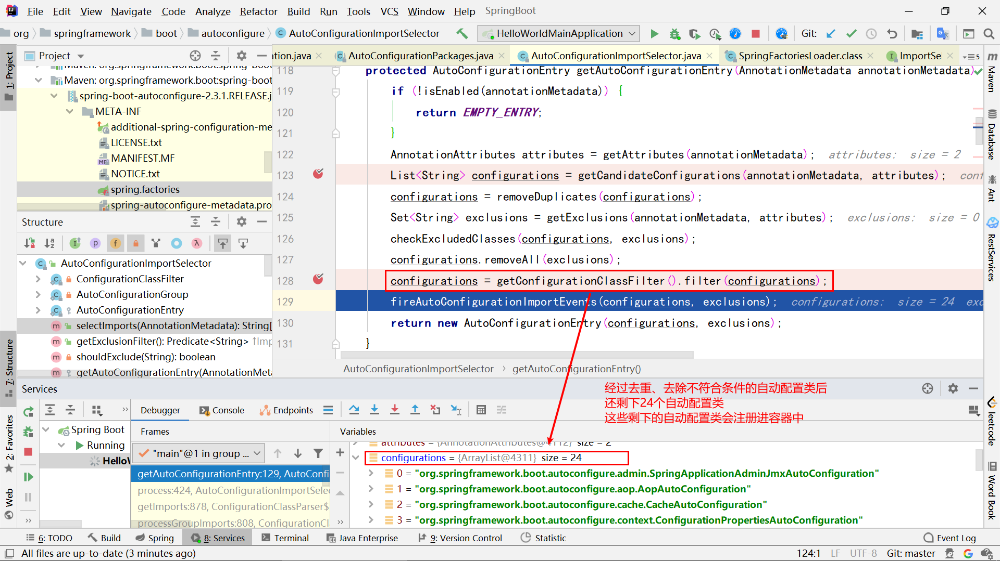

# Spring Boot— —自动配置

本文主要讲解自动配置的知识。

[toc]

## 1. 注解

### 1.1 @Configuration和@Bean

`@Configuration`标注在类上，表示该类是一个配置类，并将该配置类注册进容器中（组件名为首字母小写的类名），相当于spring中的`beans.xml`文件，`@Configuration`的定义如下：

```java
@Component
public @interface Configuration {
    @AliasFor(
        annotation = Component.class
    )
    String value() default "";

    boolean proxyBeanMethods() default true;
}
```

在配置类中的方法，可以使用`@Bean`进行标注，表示将一个组件注册进容器中，这个组件的类型是方法的返回值，这个组件的名字是方法名，相当于spring配置文件中的`<bean></bean>`标签，`@Bean`的定义如下：

```java
public @interface Bean {
    @AliasFor("name")
    String[] value() default {};

    @AliasFor("value")
    String[] name() default {};

    /** @deprecated */
    @Deprecated
    Autowire autowire() default Autowire.NO;

    boolean autowireCandidate() default true;

    String initMethod() default "";

    String destroyMethod() default "(inferred)";
}
```

使用案例如下：

```java
@Configuration
public class MyConfig {

    @Bean
    public User user(){
        return new User("zhangssan",18);
    }
}
```

在注解`@Configuration`注解中，有一个属性`proxyBeanMethods`，默认是true。

```
Full mode(proxyBeanMethods = true)：每个@Bean方法被调用多少次，返回的组件都是容器中的单实例对象
Lite mode(proxyBeanMethods = false)：每个@Bean方法被调用返回的组件都是新创建的
```

如果给@Bean标注的方法传入了对象参数，这个参数的值就会从容器中找。


### 1.2 @Import

`@Import`标注在配置类上，可以将其指定的类注册进容器中，组件名默认为全限定类名。

```java
public @interface Import {
    /**
	 * {@link Configuration @Configuration}, {@link ImportSelector},
	 * {@link ImportBeanDefinitionRegistrar}, or regular component classes to import.
	 */
    Class<?>[] value();
}
```

使用实例：

```java
@Configuration(proxyBeanMethods = true)
@Import({Car.class})
public class MyConfig {

    @Bean
    public User user(){
        return new User("zhangssan",18);
    }
}
```

在该实例中，`@Import`将`Car`注册进了容器。

`@Import`除了可以将普通类作为组件添加进容器中，还可以：

- `@Import`还可以将一个配置类导入容器，然后配置类的方法可以把组件导入容器；
- `@Import`还可以将`ImportSelector`和`ImportBeanDefinitionRegistrar`接口的方法所指定的类添加进容器中。

更多信息可以查看以下链接：

[1] spring注解版p8-10：https://www.bilibili.com/video/BV1ME411o7Uu?p=8

[2] Spring全解系列 - @Import注解：https://zhuanlan.zhihu.com/p/147025312


### 1.3 @Conditional

`@Conditional`：表示按条件装配，只有满足Conditional指定的条件，才进行组件注入。`@Conditional`是一个父注解，有许多子注解。

```java
public @interface Conditional {
    Class<? extends Condition>[] value();
}
```



例如，`@ConditionalOnBean`表示容器中有相关组件时，才会将该组件注册进容器中。

```java
@Configuration(proxyBeanMethods = true)
public class MyConfig {

    @Bean
    @ConditionalOnBean(Pet.class)
    public User user(){
        User user = new User("zhangssan", 18);
        user.setPet(pet());
        return user;
    }

    public Pet pet(){
        return new Pet("tom");
    }
}
```

该例子没有将pet放进容器中，则用户也不会放进容器中：

```java
@SpringBootApplication
public class HelloWorldMainApplication {
    public static void main(String[] args) {
        // 启动项目
        ConfigurableApplicationContext ioc = SpringApplication.run(HelloWorldMainApplication.class, args);

        System.out.println("容器中是否包含pet组件："+ioc.containsBean("pet"));
        System.out.println("容器中是否包含user组件："+ioc.containsBean("user"));
    }
}
```

结果为：

```txt
容器中是否包含pet组件：false
容器中是否包含user组件：false
```

如果在配置类的`pet()`方法上加上注解`@Bean`，则表示将`pet`放进容器，则`user`也会注册进容器，结果如下：

```txt
容器中是否包含pet组件：true
容器中是否包含user组件：false
```

**为什么user没有注册进容器呢？!!!!!!!!**

在配置类中，组件也是按照顺序进行注册的，在前面的方法先进行组件注册，在该例中，`user()`方法在前面，此时容器中还没有`pet`组件，则不会注册`user`，然后再将`pet`注册进容器中。如果我们将`pet()`放在`user()`方法前面，则结果如下：

```txt
容器中是否包含pet组件：true
容器中是否包含user组件：true
```


### 1.4 @ImportResource

如果我们想把之前的spring配置文件生效，那么我们可以使用`@ImportResource`注解，只需要在配置类上加上该注解，并指明配置文件的位置即可：

```java
@ImportResource("classpath:beans.xml")
@Configuration
public class MyConfig {
    ...
}
```


### 1.5 @ConfigurationProperties

`@ConfigurationProperties`可以将配置文件中的配置绑定到Java Bean中，但是首先需要将Java Bean注册进容器中，所以出现了两种方法：

**方法一：@Component + @ConfigurationProperties**

```java
@Component
@ConfigurationProperties(prefix = "mycar")
public class Car {
    private String brand;
    private Double price;
    ......
}
```

配置文件`application.yaml`内容：

```yaml
mycar:
  brand: BMW
  price: 200000
```

主程序类：

```java
@SpringBootApplication
public class HelloWorldMainApplication {
    public static void main(String[] args) {
        // 启动项目
        ConfigurableApplicationContext ioc = SpringApplication.run(HelloWorldMainApplication.class, args);

        Car car = ioc.getBean(Car.class);
        System.out.println(car);
    }
}
```

结果：

```txt
Car{brand='BMW', price=200000.0}
```


**方法二：@EnableConfigurationProperties+ @ConfigurationProperties**

配置类：

```java
@Configuration
@EnableConfigurationProperties({Car.class})
public class MyConfig {
    ......
}
```

Java Bean:

```java
@ConfigurationProperties(prefix = "mycar")
public class Car {
    private String brand;
    private Double price;
}
```

之所以要有方法二，是因为如果你想把第三方提供的JavaBean与配置文件内容绑定，但是你没办法直接修改第三方代码，所以需要在自己的配置类中将第三方的JavaBean加入容器中。所以，你也可以不用`@EnableConfigurationProperties`，使用`@Import`将JavaBean加入容器中也可以。


## 2. @SpringBootApplication注解

在我们的程序中，`@SpringBootApplication`是标注在主程序上的注解，这是一个复合注解：

```java
@SpringBootConfiguration
@EnableAutoConfiguration
@ComponentScan(excludeFilters = { @Filter(type = FilterType.CUSTOM, classes = TypeExcludeFilter.class),@Filter(type = FilterType.CUSTOM, classes = AutoConfigurationExcludeFilter.class) })
public @interface SpringBootApplication {

	@AliasFor(annotation = EnableAutoConfiguration.class)
	Class<?>[] exclude() default {};

	@AliasFor(annotation = EnableAutoConfiguration.class)
	String[] excludeName() default {};

	@AliasFor(annotation = ComponentScan.class, attribute = "basePackages")
	String[] scanBasePackages() default {};

	@AliasFor(annotation = ComponentScan.class, attribute = "basePackageClasses")
	Class<?>[] scanBasePackageClasses() default {};

	@AliasFor(annotation = ComponentScan.class, attribute = "nameGenerator")
	Class<? extends BeanNameGenerator> nameGenerator() default BeanNameGenerator.class;

	@AliasFor(annotation = Configuration.class)
	boolean proxyBeanMethods() default true;
}
```

接下来分别讲解三个注解：

### 2.1 @SpringBootConfiguration

```java
@Configuration
public @interface SpringBootConfiguration {
    @AliasFor(
        annotation = Configuration.class
    )
    boolean proxyBeanMethods() default true;
}
```

这就是一个配置注解，表示我们的主程序是一个配置类。


### 2.2 @ComponentScan

包扫描注解，我们可以指定要扫描的包。


### 2.3 @EnableAutoConfiguration

这个注解也是一个复合注解：

```java
@AutoConfigurationPackage
@Import(AutoConfigurationImportSelector.class)
public @interface EnableAutoConfiguration {

	String ENABLED_OVERRIDE_PROPERTY = "spring.boot.enableautoconfiguration";

	Class<?>[] exclude() default {};

	String[] excludeName() default {};
}
```

#### 2.3.1 @AutoConfigurationPackage

`@AutoConfigurationPackage`注解底层是一个`@Import`注解，将`AutoConfigurationPackages.Registrar`导入。

```java
@Import(AutoConfigurationPackages.Registrar.class)
public @interface AutoConfigurationPackage {
    
	String[] basePackages() default {};

	Class<?>[] basePackageClasses() default {};

}
```

接下来看`AutoConfigurationPackages.Registrar`的源码：

```java
static class Registrar implements ImportBeanDefinitionRegistrar, DeterminableImports {

    @Override
    public void registerBeanDefinitions(AnnotationMetadata metadata,
                                        BeanDefinitionRegistry registry) {
        register(registry, new PackageImports(metadata).getPackageNames().toArray(new String[0]));
    }

    @Override
    public Set<Object> determineImports(AnnotationMetadata metadata) {
        return Collections.singleton(new PackageImports(metadata));
    }

}
```

它实现了接口`ImportBeanDefinitionRegistrar`，表示可以在方法`registerBeanDefinitions()`自定义批量导入组件。

在这个方法中，首先明确两个参数的含义：

- AnnotationMetadata：表示`@Import`所标注的类信息，此处表示主程序类（即被`@SpringBootApplication`注解标注的类）；
- BeanDefinitionRegistry：BeanDefinition注册器，用于组件的注册、移除等；

首先创建了一个`PackageImports`对象，这个对象代表要导入组件的包，在本例中代表主程序类所在的包，这就说明了为什么Spring Boot会自动将主程序类所在包及其子包中的类注册进容器中。



然后调用方法`register()`方法，批量将该包下的类注册进容器中。


#### 2.3.2 @Import(AutoConfigurationImportSelector.class)

`@Import(AutoConfigurationImportSelector.class)`的作用是手动将自动配置相关的类注册进容器中。`AutoConfigurationImportSelector`类间接实现了`ImportSelector`接口，源码相关方法如下：

```java
public class AutoConfigurationImportSelector implements DeferredImportSelector, BeanClassLoaderAware,
ResourceLoaderAware, BeanFactoryAware, EnvironmentAware, Ordered {

    @Override
    public String[] selectImports(AnnotationMetadata annotationMetadata) {
        if (!isEnabled(annotationMetadata)) {
            return NO_IMPORTS;
        }
        AutoConfigurationEntry autoConfigurationEntry = getAutoConfigurationEntry(annotationMetadata);
        return StringUtils.toStringArray(autoConfigurationEntry.getConfigurations());
    }

    protected AutoConfigurationEntry getAutoConfigurationEntry(AnnotationMetadata annotationMetadata) {
        // 此处删除具体代码
    }

    protected List<String> getCandidateConfigurations(AnnotationMetadata metadata, AnnotationAttributes attributes) {
        // 此处删除具体代码
    }
}
```

首先会调用方法`selectImports()`，将符和规则的类注册进容器中，在该方法中，调用`getAutoConfigurationEntry()`，获取所有合理的自动配置类，最后会将这些合理的自动配置类注册进容器中。主要方法调用关系如下：



接下来通过debug的方式了解上述自动配置的过程：



**不光是`spring-boot-autoconfigure`下的的`META-INF/spring.factories`被读取到，所有 Spring Boot Starter 下的`META-INF/spring.factories`都会被读取到。**



何谓不符合条件，就是这些自动配置类被`@Conditional`注解标注，如果项目中没有相关依赖，不符合条件，则这些自动配置类不会被注册进容器中。


## 3. 自动配置类案例

由于第一个项目是web项目，所以spring boot自动配置了web开发场景相关依赖。通过前面的分析，自动配置类`DispatcherServletAutoConfiguration`是会生效的，其中有一个静态内部类`DispatcherServletConfiguration`也会生效，这个内部类会自动向容器注册组件`dispatcherServlet`和`multipartResolver`：

```java
@AutoConfigureOrder(Ordered.HIGHEST_PRECEDENCE)
@Configuration(proxyBeanMethods = false)
@ConditionalOnWebApplication(type = Type.SERVLET)
@ConditionalOnClass(DispatcherServlet.class)
@AutoConfigureAfter(ServletWebServerFactoryAutoConfiguration.class)
public class DispatcherServletAutoConfiguration {
    
    @Configuration(proxyBeanMethods = false)
    @Conditional(DefaultDispatcherServletCondition.class)
    @ConditionalOnClass(ServletRegistration.class)
    @EnableConfigurationProperties(WebMvcProperties.class)
    protected static class DispatcherServletConfiguration {

        @Bean(name = DEFAULT_DISPATCHER_SERVLET_BEAN_NAME)
        public DispatcherServlet dispatcherServlet(WebMvcProperties webMvcProperties) {
            DispatcherServlet dispatcherServlet = new DispatcherServlet();
            dispatcherServlet.setDispatchOptionsRequest(webMvcProperties.isDispatchOptionsRequest());
            dispatcherServlet.setDispatchTraceRequest(webMvcProperties.isDispatchTraceRequest());
            dispatcherServlet.setThrowExceptionIfNoHandlerFound(webMvcProperties.isThrowExceptionIfNoHandlerFound());
            dispatcherServlet.setPublishEvents(webMvcProperties.isPublishRequestHandledEvents());
            dispatcherServlet.setEnableLoggingRequestDetails(webMvcProperties.isLogRequestDetails());
            return dispatcherServlet;
        }

        @Bean
        @ConditionalOnBean(MultipartResolver.class)
        @ConditionalOnMissingBean(name = DispatcherServlet.MULTIPART_RESOLVER_BEAN_NAME)
        public MultipartResolver multipartResolver(MultipartResolver resolver) {
            // Detect if the user has created a MultipartResolver but named it incorrectly
            // 如果@Bean方法有参数，则该参数会从容器中获取
            return resolver;
        }

    }
}
```


## 4. 总结

- Spring Boot先从`\META-INF\spring.factories`中加载所有的自动配置类（xxxxxAutoConfiguration）；
- 每个自动配置类按照条件进行生效，默认都会绑定配置文件指定的值。xxxProperties和配置文件中的相关属性进行了绑定；
- 生效的自动配置类就会给容器中装配很多组件；
- 只要容器中有这些组件，相当于这些功能就有了；
- 定制化配置：

- - 用户可以自己创建配置类，然后通过`@Bean`替换默认的组件；
  - 通过配置文件修改默认组件的值，以达到定制化配置；


## 参考资料

[1] 尚硅谷SpringBoot2教程：https://www.bilibili.com/video/BV19K4y1L7MT?p=7

[2] 视频教程文档：https://www.yuque.com/atguigu/springboot/qb7hy2#9pznQ