# Spring Boot— —web开发

本文主要介绍Spring Boot的web开发中相关知识。

[toc]


## 1. 流程【硬核】

本文可以看作是Spring MVC在Spring Boot中的应用，在第一节，我们将详细

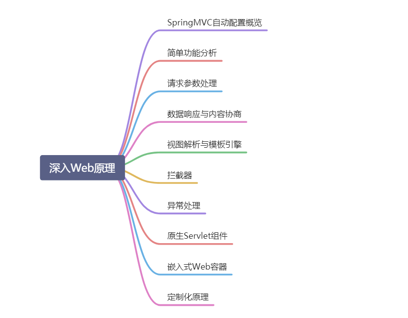

**下面以Spring Boot 2.4.4 版本介绍相关知识。**


## 2. 静态资源

本小节主要介绍Spring Boot中静态资源的相关配置与原理。

### 2.1 静态资源的默认配置

在Spring Boot中，静态资源默认放置在`\static`，`\public`，`\resources`和`\META-INF\resources`类路径下，可以通过`http://ip:port/静态资源名`直接访问。

例如，在项目类路径下分别放置不同的静态资源，然后启动项目，浏览器访问结果如下:


我们也可以修改配置文件，来修改静态资源的访问路径以及放置目录：

```yaml
spring:
  mvc:
    static-path-pattern: /resources/**        # 修改静态资源的访问前缀
  web:
    resources:
      static-locations: [classpath:/mystatic/,classpath:/static/] # 修改静态资源的放置目录

```

现在只能通过路径`http://ip:port/resources/静态资源名`来访问`/mystatic/`、`/static/`和`/META-INF/resources/`目录下的静态资源。

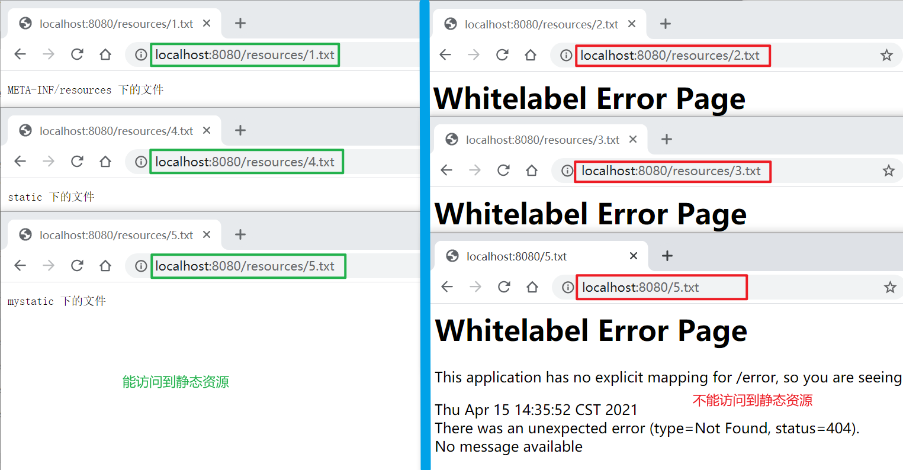

如果静态资源名和controller的访问路径重合，则优先访问controller的方法，只有controller的方法无法匹配路径，才会匹配静态资源，如果静态资源也没有，则返回404。


### 2.2 欢迎页

我们可以在静态资源目录下放置`index.html`网页作为欢迎页，当请求`http://ip:port`访问时，会在静态资源目录中查找`index.html`并返回。注意：不可以配置静态资源的访问前缀，否则无法找到欢迎页文件。

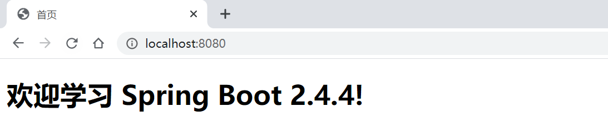

如果在静态资源目录中没找到`index.html`，则会到`resources/templates` 目录下找 `index.html`作为欢迎页文件。

更多知识请查看参考资料[1]。


### 2.3 favicon

只需要在静态资源目录下放置`favicon.ico`文件即可，注意：不能配置静态资源访问前缀。

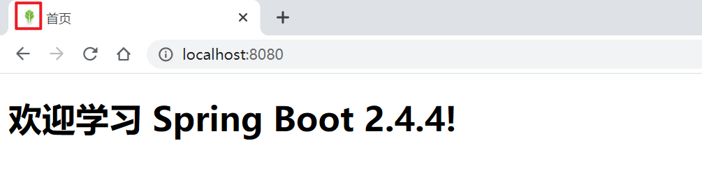

注意，这不是Spring Boot的功能，是浏览器会自动发送`http://ip:port/favicon.ico`请求图标。


### 2.4 源码分析

SpringMVC功能的自动配置类 `WebMvcAutoConfiguration`：

```java
@Configuration(proxyBeanMethods = false)
@ConditionalOnWebApplication(type = Type.SERVLET)
@ConditionalOnClass({ Servlet.class, DispatcherServlet.class, WebMvcConfigurer.class })
@ConditionalOnMissingBean(WebMvcConfigurationSupport.class)
@AutoConfigureOrder(Ordered.HIGHEST_PRECEDENCE + 10)
@AutoConfigureAfter({ DispatcherServletAutoConfiguration.class, TaskExecutionAutoConfiguration.class,
		ValidationAutoConfiguration.class })
public class WebMvcAutoConfiguration {}
```

在`WebMvcAutoConfiguration`中存在两个静态内部类`WebMvcAutoConfigurationAdapter`和`EnableWebMvcConfiguration`：

```java
@Configuration(proxyBeanMethods = false)
@Import(EnableWebMvcConfiguration.class)
@EnableConfigurationProperties({ WebMvcProperties.class,         org.springframework.boot.autoconfigure.web.ResourceProperties.class,
WebProperties.class })
@Order(0)
public static class WebMvcAutoConfigurationAdapter implements WebMvcConfigurer {}

@ConfigurationProperties(prefix = "spring.mvc")
public class WebMvcProperties {}

@Deprecated
@ConfigurationProperties(prefix = "spring.resources", ignoreUnknownFields = false)
public class ResourceProperties extends Resources {}

@ConfigurationProperties("spring.web")
public class WebProperties {}
```

```java
@Configuration(proxyBeanMethods = false)
@EnableConfigurationProperties(WebProperties.class)
public static class EnableWebMvcConfiguration extends DelegatingWebMvcConfiguration implements ResourceLoaderAware {}

@ConfigurationProperties("spring.web")
public class WebProperties {}
```

在`EnableWebMvcConfiguration`中，向容器注册了组件`welcomePageHandlerMapping`，则欢迎页：

```java
@Bean
public WelcomePageHandlerMapping welcomePageHandlerMapping(
    ApplicationContext applicationContext,
    FormattingConversionService mvcConversionService, 
    ResourceUrlProvider mvcResourceUrlProvider) {
    WelcomePageHandlerMapping welcomePageHandlerMapping = new WelcomePageHandlerMapping(
        new TemplateAvailabilityProviders(applicationContext), applicationContext, getWelcomePage(),
        this.mvcProperties.getStaticPathPattern());
    welcomePageHandlerMapping.setInterceptors(getInterceptors(mvcConversionService, mvcResourceUrlProvider));
    welcomePageHandlerMapping.setCorsConfigurations(getCorsConfigurations());
    return welcomePageHandlerMapping;
}

// new WelcomePageHandlerMapping()构造方法，明确了欢迎页的查找规则
WelcomePageHandlerMapping(
    TemplateAvailabilityProviders templateAvailabilityProviders,
    ApplicationContext applicationContext, Resource welcomePage, 
    String staticPathPattern) {
    if (welcomePage != null && "/**".equals(staticPathPattern)) {
        logger.info("Adding welcome page: " + welcomePage);
        setRootViewName("forward:index.html");
    }else if (
        welcomeTemplateExists(templateAvailabilityProviders, applicationContext)) {
        
        logger.info("Adding welcome page template: index");
        setRootViewName("index");
    }
}
```


## 3. 请求处理

请求处理主要解决如下问题：

- 表单REST风格的原理
- 请求找到哪个handler(controller)的方法
- 方法参数值的确定


### 3.1 表单REST源码分析

RESTful风格是请求路径相同，根据HTTP请求方法的不同，匹配不同的Controller处理方法。

假设现在有一个请求路径`/user`，不同的请求方法对应着不同的操作，如`GET`对应着获取用户信息，`POST`对应着新建用户，`/PUT`对应着修改用户信息，`DELETE`对应着删除用户信息。

但是，现在有一个问题，在前端页面中，表单只支持两种方法`GET`和`POST`：

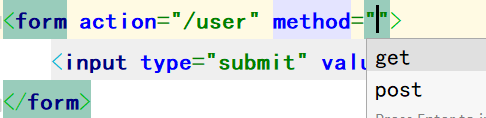

如果需要支持`DELETE`和`PUT`方法，需要在表单中添加一个隐藏域，该域的名字为`_method`，值为对应的方法`DELETE`或`PUT`，并且表单的提交方法为`post`。

```html
<form action="/user" method="post">
    <input type="hidden" name="_method" value="delete">
    <input type="submit" value="delete-submit">
</form>
<form action="/user" method="post">
    <input type="hidden" name="_method" value="put">
    <input type="submit" value="put-submit">
</form>
```

然后在Spring Boot的配置文件中开启表单REST支持：

```yaml
spring:
  mvc:
    hiddenmethod:
      filter:
        enabled: true
```

注意，这样的设置只对表单REST有效，如果使用客户端工具（如postman），则不用如此设置。

**原理分析：**

接下来讲解一下表单REST原理。首先在类`WebMvcAutoConfiguration`中有一个方法，向容器中添加了组件`hiddenHttpMethodFilter`：

```java
@Bean
@ConditionalOnMissingBean(HiddenHttpMethodFilter.class)
@ConditionalOnProperty(prefix = "spring.mvc.hiddenmethod.filter", name = "enabled", matchIfMissing = false)
public OrderedHiddenHttpMethodFilter hiddenHttpMethodFilter() {
    return new OrderedHiddenHttpMethodFilter();
}
```

我们深入组件`OrderedHiddenHttpMethodFilter`的父类`HiddenHttpMethodFilter`中，存在这样一个方法：

```java
private static final List<String> ALLOWED_METHODS;
public static final String DEFAULT_METHOD_PARAM = "_method";
private String methodParam = "_method";

static { 		 
    ALLOWED_METHODS=Collections.unmodifiableList(Arrays.asList(
        HttpMethod.PUT.name(), 
        HttpMethod.DELETE.name(), 
        HttpMethod.PATCH.name()));
}

protected void doFilterInternal(
    HttpServletRequest request, HttpServletResponse response, 
    FilterChain filterChain) 
    throws ServletException, IOException {
    HttpServletRequest requestToUse = request;

    // 如果表单的提交方法为post并且没有异常，则进入该if
    if ("POST".equals(request.getMethod()) && request.getAttribute("javax.servlet.error.exception") == null) { 
        // 获取域名为_method的值，就是方法
        String paramValue = request.getParameter(this.methodParam);
        // 方法不为空
        if (StringUtils.hasLength(paramValue)) {
            // 将方法名转为大写
            String method = paramValue.toUpperCase(Locale.ENGLISH);
            // 重新封装请求request，修改方法为_method指定的方法
            if (ALLOWED_METHODS.contains(method)) {
                requestToUse = new HiddenHttpMethodFilter.HttpMethodRequestWrapper(request, method);
            }
        }
    }

    // 放行
    filterChain.doFilter((ServletRequest)requestToUse, response);
}
```

从源码中我们也可以看出，隐藏域`_method`的值可以为`DELETE`、`PUT`和`PATCH`。

如果我们想修改隐藏域`_method`的名字，即将`_method`修改为其它名字，有什么办法呢？`hiddenHttpMethodFilter()`方法中有一个注解`@ConditionalOnMissingBean(HiddenHttpMethodFilter.class)`，只有用户没有自定义配置`hiddenHttpMethodFilter`时，Spring Boot才会默认配置。所以我们可以自己向容器中注册一个组件`hiddenHttpMethodFilter`，修改为想要的名字：

```java
@Configuration(proxyBeanMethods = false)        // 注意设置proxyBeanMethods为false
public class MyConfig {
    
    @Bean
    public HiddenHttpMethodFilter hiddenHttpMethodFilter(){
        HiddenHttpMethodFilter methodFilter = new HiddenHttpMethodFilter();
        methodFilter.setMethodParam("_m");      // 自定义隐藏域的名字
        return methodFilter;
    }
}
```


### 3.2 基础回顾

在开始具体的问题前，首先打一个基础。

- 回顾Java WEB的知识，当一个请求到达时，会调用接口`Servlet`中的service方法进行处理；
- 在Spring MVC中，`DispatcherServlet`负责责任分派，控制流程；

我们可以查看`DispatcherServlet`的类继承结构：

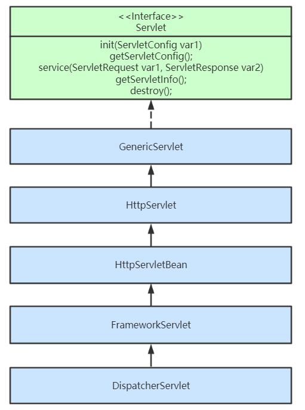

现在从`FrameworkServlet`到`DispatcherServlet`，从`service()`方法开始，看请求的处理方法调度路线，如下（删除其它处理代码，只看方法调度）：

```java
// FrameworkServlet
protected void service(HttpServletRequest request, HttpServletResponse response) throws ServletException, IOException {
    if (httpMethod != HttpMethod.PATCH && httpMethod != null) {
        super.service(request, response);
    } else {
        this.processRequest(request, response);
    }
}

protected final void processRequest(HttpServletRequest request, HttpServletResponse response) throws ServletException, IOException {
    
    this.doService(request, response);

}
// 由于是抽象方法，所以调用子类（DispatcherServlet）的方法
protected abstract void doService(HttpServletRequest var1, HttpServletResponse var2) throws Exception;

// DispatcherServlet
protected void doService(HttpServletRequest request, HttpServletResponse response) throws Exception {
    
    this.doDispatch(request, response);

}

protected void doDispatch(HttpServletRequest request, HttpServletResponse response) throws Exception {
    
}
```

图示如下：

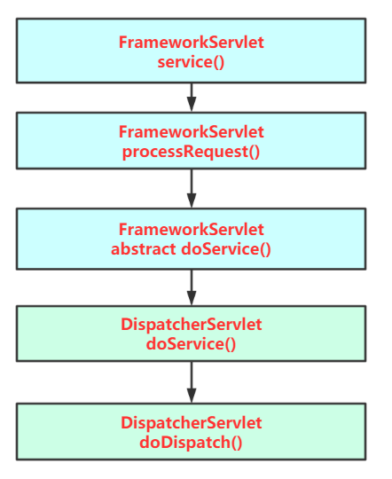

所以接下来的原理分析，都从`DispatcherServlet`的`doDispatch()`方法开始。


### 3.3 请求映射原理

本小节主要讲解请求如何找到handler(controller)的处理方法。

在`doDispatcher()`方法中，有如下一行代码：

```java
// Determine handler for the current request.
mappedHandler = getHandler(processedRequest);
```

根据注释，我们可以确定这行代码就是用来确定处理请求的handler(controller)的。进入这个方法，源码如下:

```java
// DispatcherServlet
private List<HandlerMapping> handlerMappings;

protected HandlerExecutionChain getHandler(HttpServletRequest request) throws Exception {
    if (this.handlerMappings != null) {
        for (HandlerMapping mapping : this.handlerMappings) {
            HandlerExecutionChain handler = mapping.getHandler(request);
            if (handler != null) {
                return handler;
            }
        }
    }
    return null;
}
```

现在我们在`getHandler(processedRequest);`这行代码打上断电，然后以debug的模式启动项目，最后发送一个请求：`/user`

进入`getHandler()`方法内部，可以看到`this.handlerMappings`的值如下：

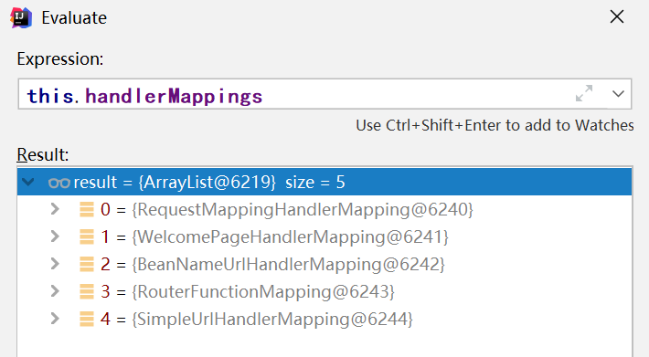

其中包括五个`xxxHandlerMapping`，Spring Boot逐一扫描这五个`HandlerMapping`，查找能处理该请求的`Handler`。

现在我们来看`HandlerMapping`这个接口，其中包含一个抽象方法`getHandler()`，其子类继承关系如下：

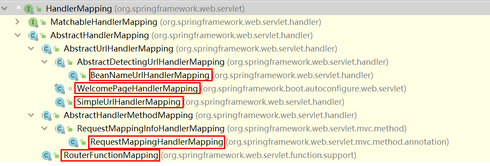

可以看到其非抽象子类的数量恰好为五个，就是`DispatcherServlet`中包含的五个。

在`RequestMappingHandlerMapping`中，有属性`mappingRegistry`，其中保存了请求路径与`handler.method()`的对应关系：

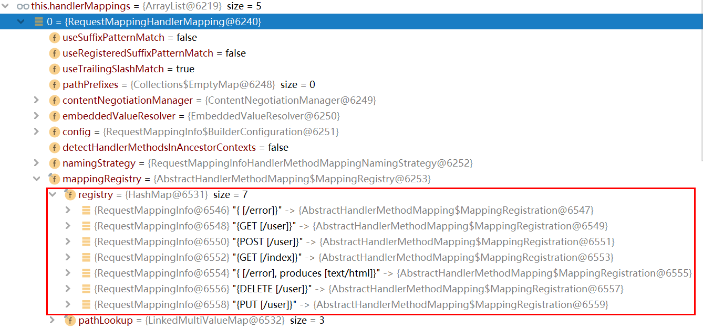

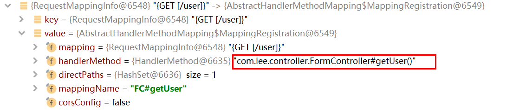

具体的确定handler的过程，可以追踪`getHandler()`方法确定。


### 3.4 方法参数绑定

在controller的方法中，可以有以下类型的参数：

**①注解**

@PathVariable、@RequestHeader、@RequestAttribute、@RequestParam、@MatrixVariable、@CookieValue、@RequestBody等

**②Servlet 原生类**

WebRequest、ServletRequest、MultipartRequest、 HttpSession、javax.servlet.http.PushBuilder、Principal、InputStream、Reader、HttpMethod、Locale、TimeZone、ZoneId

**③复杂类型**

Map、Model、Errors/BindingResult、RedirectAttributes、ServletResponse、SessionStatus、UriComponentsBuilder、ServletUriComponentsBuilder

**④自定义对象**

即自定义的POJO类，例如`User`，`Student`等类，Spring Boot可以将请求中表单的数据绑定到类属性中。


### 3.5 参数转换器

虽然Spring Boot 给我们提供了很多默认的参数转换器，但是有时候，默认的参数转换器无法工作，这时候需要我们编写自己的参数转换器。

在本案例中，将字符串转换为`Person`对象，`Person`类声明如下：

```java
@Data
public class Person {
    private String name;
    private Integer age;
    private String gender;
}
```

字符串的格式为`name,age,gender`;

首先需要实现`Converter<S,T>`接口，`S`即为源类型，`T`为目标类型：

```java
public class StringToPersonConverter implements Converter<String, Person> {
    @Override
    public Person convert(String source) {
        Person person = new Person();
        String[] split = source.split(",");
        if (split.length > 0){
            person.setName(split[0]);
            person.setAge(Integer.valueOf(split[1]));
            person.setGender(split[2]);
        }
        return person;
    }
}
```

然后将自定义的类型转换器添加到容器中：

```java
@Configuration
public class ConverterConfig implements WebMvcConfigurer {
    @Override
    public void addFormatters(FormatterRegistry registry) {
        registry.addConverter(new StringToPersonConverter());
    }
}
```

测试页面：

```html
<h2>测试自定义转换器</h2>
<form action="/person" method="post">
    信息：<input name="person" value="张三,19,男">
    <input type="submit" value="提交"/>
</form>
```

Controller：

```java
@ResponseBody
@PostMapping("/person")
public Person person(Person person){
    return person;
}
```

结果：

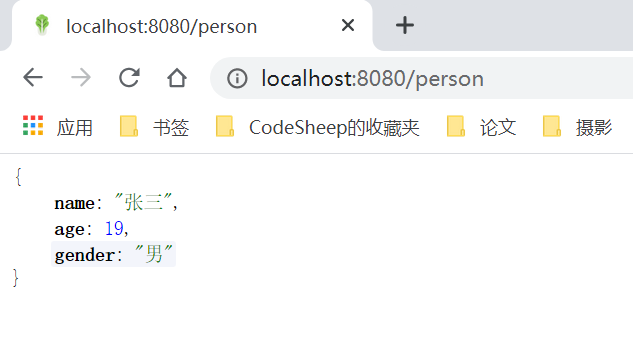

自己定义的参数类型转换器成功起作用了。


## 4. 响应处理

### 4.1 内容协商

所谓内容协商，就是服务端根据用户端程序（如浏览器、Postman等）可以接收的内容类型，将返回的内容转换为对应的类型。例如：

Postman发送请求，请求头带有`Accept:application/json`，响应内容为json格式：

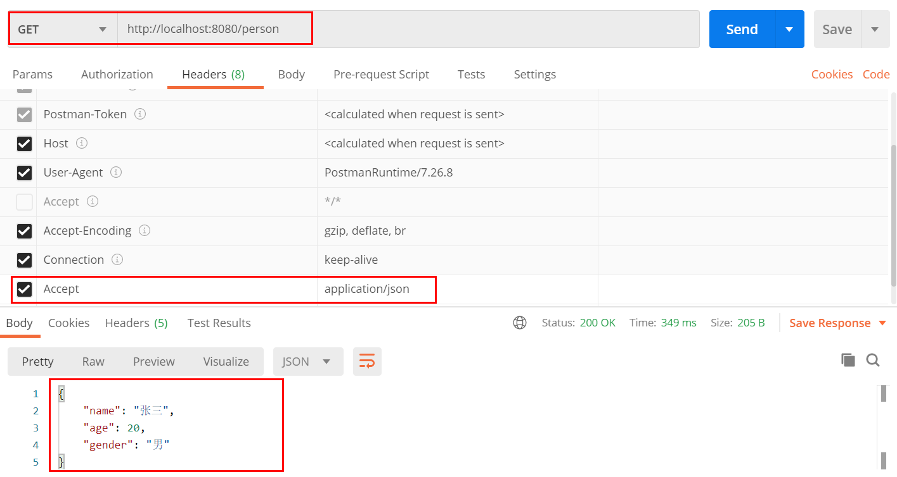

然后在pom.xml中添加依赖，增加内容转换为xml格式的转换器：

```xml
<dependency>
    <groupId>com.fasterxml.jackson.dataformat</groupId>
    <artifactId>jackson-dataformat-xml</artifactId>
</dependency>
```

重启项目，然后postman发送请求，请求头带有`Accept:application/xml`，响应内容为xml格式：

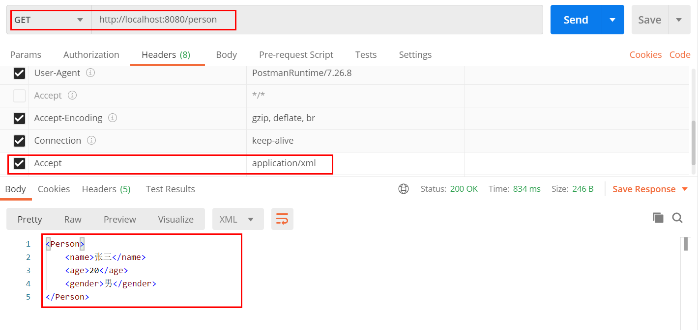


如果我们使用浏览器发送请求，无法修改请求头，那么我们如何使用内容协商机制呢？我们可以在请求参数上确定响应内容格式。首先在项目配置文件中开启参数内容协商机制：

```yaml
spring:
  mvc:
    contentnegotiation:
      favor-parameter: true
```

然后浏览器发请求时带上参数`format`，`format`可以有两个值：`json`或`xml`。

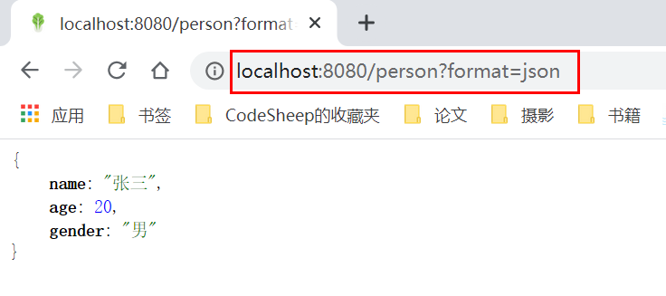

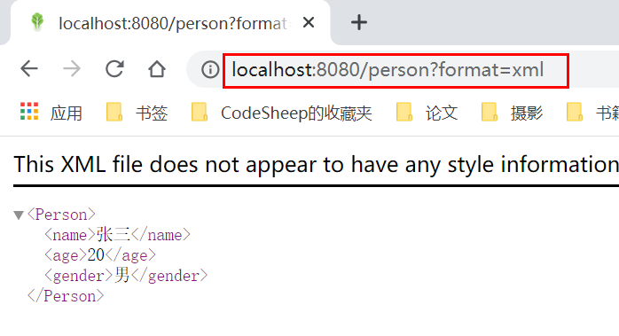


## 5. 视图解析

SpringBoot默认不支持 JSP，需要引入第三方模板引擎技术实现页面渲染。常见的模板引擎有freemarker、thymeleaf等。本小节使用thymeleaf作为模板引擎讲解。

### 5.1 thymeleaf使用

首先引入starter：

```xml
<dependency>
    <groupId>org.springframework.boot</groupId>
    <artifactId>spring-boot-starter-thymeleaf</artifactId>
</dependency>
```

引入依赖后，thymeleaf的自动配置类`ThymeleafAutoConfiguration`起作用：

```java
@Configuration(proxyBeanMethods = false)
@EnableConfigurationProperties(ThymeleafProperties.class)
@ConditionalOnClass({ TemplateMode.class, SpringTemplateEngine.class })
@AutoConfigureAfter({ WebMvcAutoConfiguration.class, WebFluxAutoConfiguration.class })
public class ThymeleafAutoConfiguration {}
```

在自动配置类中，会向容器注册模板引擎和视图解析器：

```java
// 模板引擎
@Bean
@ConditionalOnMissingBean(ISpringTemplateEngine.class)
SpringTemplateEngine templateEngine(
    ThymeleafProperties properties,
    ObjectProvider<ITemplateResolver> templateResolvers, 
    ObjectProvider<IDialect> dialects) {}

// 视图解析器
@Bean
@ConditionalOnMissingBean(name = "thymeleafViewResolver")
ThymeleafViewResolver thymeleafViewResolver(ThymeleafProperties properties,
                                            SpringTemplateEngine templateEngine) {}
```

所有关于thymeleaf的配置属性都在类`ThymeleafProperties`中，重要的属性包括页面前缀和后缀，默认值如下：

```java
@ConfigurationProperties(prefix = "spring.thymeleaf")
public class ThymeleafProperties {
    
    public static final String DEFAULT_PREFIX = "classpath:/templates/";
	public static final String DEFAULT_SUFFIX = ".html";
}
```

我们只需要将页面放在类路径的`templates`目录下，并将页面后缀名设置为`.html`即可，然后controller编写的方法会根据返回值自动到该目录寻找同名页面。

在编写页面代码时，加上thymeleaf的命名空间，显示代码提示：

```html
<html lang="en" xmlns:th="http://www.thymeleaf.org">
```

例子：发送请求`/about`，返回about.html页面。

首先在`templates`目录下创建`about.html`页面，代码如下：

```html
<!DOCTYPE html>
<html lang="en" xmlns:th="http://www.thymeleaf.org">
<head>
    <meta charset="UTF-8">
    <title>About me</title>
</head>
<body>
    <h1 th:text="${msg}">哈哈</h1>
</body>
</html>
```

然后创建`ViewTestController`，代码如下：

```java
@Controller              // 注意使用@Controller
public class ViewTestController {

    @GetMapping("/about")
    public String about(Model model){
        // model中的数据会被封装到request请求域中
        model.addAttribute("msg","hello world!");
        return "about";
    }
}
```

启动项目，发送请求，浏览器结果如下：

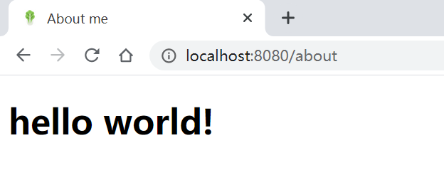

可以看到页面显示内容不是"哈哈"，而是“hello world!”，说明模板引擎生效了。


### 5.2 thymeleaf语法

完整教程请查看：https://www.thymeleaf.org/doc/tutorials/2.1/usingthymeleaf.html


## 6. 拦截器

### 6.1 案例

首先实现`HandlerInterceptor`接口，编写自己的拦截器类：

```java
public class MyFirstInterceptor implements HandlerInterceptor {
    public boolean preHandle(HttpServletRequest request, HttpServletResponse response, Object handler) throws Exception {
        System.out.println("MyFirstInterceptor.preHandle()--------拦截路径："+request.getRequestURI());
        return true;
    }

    public void postHandle(HttpServletRequest request, HttpServletResponse response, Object handler, ModelAndView modelAndView) throws Exception {
        System.out.println("MyFirstInterceptor.postHandle()");
    }

    public void afterCompletion(HttpServletRequest request, HttpServletResponse response, Object handler,
                                Exception ex) throws Exception {
        System.out.println("MyFirstInterceptor.afterCompletion()");
    }
}
```

`HandlerInterceptor`接口定义了三个方法：

- `preHandle()`：在目标方法执行前执行，只有返回值为true，才会放行继续执行；
- `postHandle()`：在目标方法执行后执行；
- `afterCompletion()`：在`preHandle()`方法返回值为false、发生异常、页面正常渲染后执行；

然后实现`WebMvcConfigurer`接口，编写自己的配置类，并实现方法`addInterceptors()`添加拦截器：

```java
@Configuration
public class InterceptorConfig implements WebMvcConfigurer {
    @Override
    public void addInterceptors(InterceptorRegistry registry) {
        registry.addInterceptor(new MyFirstInterceptor())
                .addPathPatterns("/**")     // 拦截所有路径，包括静态资源路径
                .excludePathPatterns("/js/**","/img/**","/css/**"); // 移除某些路径的拦截
    }
}
```

启动项目，访问`/user`路径，控制台打印结果如下：

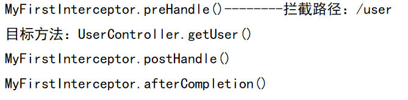


### 6.2 拦截器原理

在讲解拦截器原理之前，再添加两个拦截器：`MySecondInterceptor`和`MyThirdInterceptor`。

拦截器原理都在`DispatcherServlet`的`doDispatch()`方法中，大致流程如下：

```java
protected void doDispatch(HttpServletRequest request, HttpServletResponse response){
    try {
        // 找到执行链，包括controller和拦截器链
        mappedHandler = getHandler(processedRequest);
        // 执行拦截器的preHandle()方法
        if (!mappedHandler.applyPreHandle(processedRequest, response)) {
            return;
        }
        // 实际调用controller的方法
        mv = ha.handle(processedRequest, response, mappedHandler.getHandler());
        // 执行拦截器的postHandle()方法
        mappedHandler.applyPostHandle(processedRequest, response, mv);
        
        // 在该方法中调用拦截器的afterCompletion()方法
        processDispatchResult(processedRequest, response, mappedHandler, mv, dispatchException);
    }catch (Exception ex) {
        // 上述步骤出异常，执行拦截器的afterCompletion()方法
        triggerAfterCompletion(processedRequest, response, mappedHandler, ex);
    }catch (Throwable err) {
        // 上述步骤出异常，执行拦截器的afterCompletion()方法
        triggerAfterCompletion(processedRequest, response, mappedHandler,
                               new NestedServletException("Handler processing failed", err));
    }finally {
        // ...
    }
}
```

现在以Debug的形式展示上述步骤：

当找到处理器执行链后，`mappedHandler`结果如下：

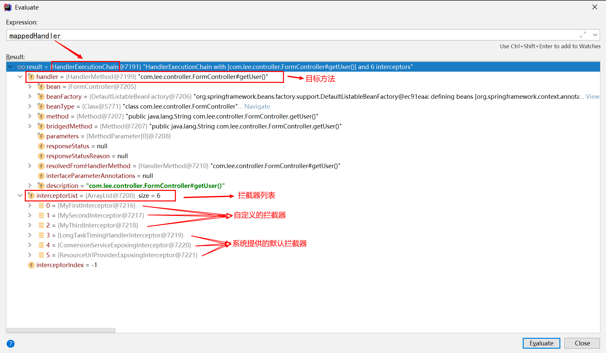

然后进入`mappedHandler.applyPreHandle()`方法：

- 顺序执行拦截器链的`preHandle()`方法；
  - 如果其中一个拦截器返回false，则逆序调用之前执行过的拦截器的`afterCompletion()`方法；

```java
boolean applyPreHandle(HttpServletRequest request, HttpServletResponse response) throws Exception {
    for (int i = 0; i < this.interceptorList.size(); i++) {
        HandlerInterceptor interceptor = this.interceptorList.get(i);
        if (!interceptor.preHandle(request, response, this.handler)) {
            triggerAfterCompletion(request, response, null);
            return false;
        }
        this.interceptorIndex = i;
    }
    return true;
}

void triggerAfterCompletion(HttpServletRequest request, HttpServletResponse response, @Nullable Exception ex) {
    for (int i = this.interceptorIndex; i >= 0; i--) {
        HandlerInterceptor interceptor = this.interceptorList.get(i);
        try {
            interceptor.afterCompletion(request, response, this.handler, ex);
        }
        catch (Throwable ex2) {
            logger.error("HandlerInterceptor.afterCompletion threw exception", ex2);
        }
    }
}
```

执行完目标方法后，调用`applyPostHandle()`方法，顺序执行拦截器链的`postHandle()`方法：

```java
void applyPostHandle(HttpServletRequest request, HttpServletResponse response, @Nullable ModelAndView mv)
    throws Exception {

    for (int i = this.interceptorList.size() - 1; i >= 0; i--) {
        HandlerInterceptor interceptor = this.interceptorList.get(i);
        interceptor.postHandle(request, response, this.handler, mv);
    }
}
```

请求正确处理后，最后在`processDispatchResult()`执行`afterCompletion()`方法：

```java
private void processDispatchResult(
    HttpServletRequest request, 
    HttpServletResponse response,                    
    @Nullable HandlerExecutionChain mappedHandler, 
    @Nullable ModelAndView mv,                     
    @Nullable Exception exception) throws Exception {
    
    if (mappedHandler != null) {
        mappedHandler.triggerAfterCompletion(request, response, null);
    }
}
```


## 7. 错误处理

### 7.1 默认规则

默认情况下，Spring Boot会将所有的异常情况、错误映射到`/error`路径进行处理。对于机器客户端（如Postman），会返回包含错误码、错误信息的JSON数据；对于浏览器客户端，会返回包含错误信息的`whitelabel`页面，如：

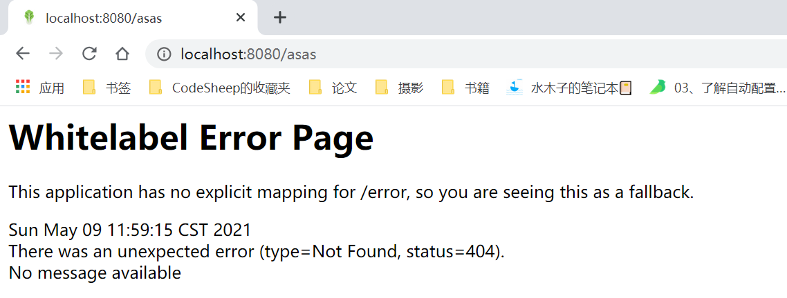

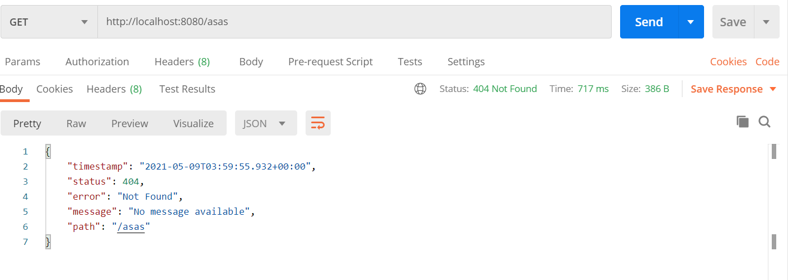

我们也可以自定义错误页面，只需要在静态资源目录中添加`/error/xxx.html`，`xxx`对应着错误状态码：

添加`/resources/static/error/404.html`和`/resources/static/error/5xx.html`页面：

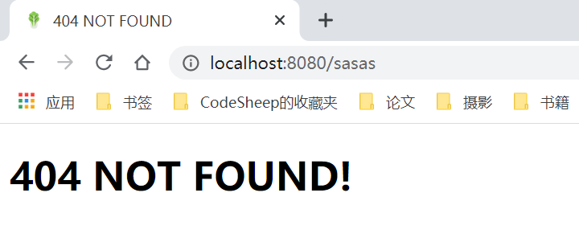

`/math`路径对应的方法中有除零异常，会导致500错误，因此会找到`5xx.html`页面。

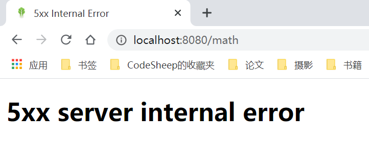


### 7.2 异常处理的自动配置

`ErrorMvcAutoConfiguration`自动配置类，向容器自动注入了以下三个主要的组件：

- `DefaultErrorAttributes`：

  ```java
  @Bean
  @ConditionalOnMissingBean(value = ErrorAttributes.class, search = SearchStrategy.CURRENT)
  public DefaultErrorAttributes errorAttributes() {
      return new DefaultErrorAttributes();
  }
  ```

- 

  ```java
  @Bean
  @ConditionalOnMissingBean(value = ErrorController.class, search = SearchStrategy.CURRENT)
  public BasicErrorController basicErrorController(
      ErrorAttributes errorAttributes,
      ObjectProvider<ErrorViewResolver> errorViewResolvers) {
      
      return new BasicErrorController(
          errorAttributes, 
          this.serverProperties.getError(),
          errorViewResolvers.orderedStream().collect(Collectors.toList()));
  }
  ```

  


### 7.3 异常处理流程


## 8. 文件上传

### 8.1 案例

首先在页面中写表单：

```html
<form action="/upload" method="post" enctype="multipart/form-data">
    姓名：<input name="username" type="text" /><br>
    邮箱：<input name="email" type="text"/><br>
    头像：<input name="headImage" type="file" /><br>
    生活照（一次可选择多张照片）：<input name="photos" type="file" multiple><br>
    <input type="submit" value="提交"/>
</form>
```

- 注意表单的上传方式为`POST`，并且设置属性`enctype="multipart/form-data"`；
- 如果要一次性上传多份文件，则可以设置为`multiple`；

然后编写Controller方法：

```java
@Controller
public class FileController {

    @PostMapping("/upload")
    public String upload(@RequestParam("username") String username,
                         @RequestParam("email") String email,
                         @RequestPart("headImage") MultipartFile headImage,
                         @RequestPart("photos") MultipartFile[] photos) throws IOException {
        // 判断文件是否上传成功，如果是，则保存在磁盘中
        if (!headImage.isEmpty()){
            String originalFilename = headImage.getOriginalFilename();
            headImage.transferTo(new File("D:/"+originalFilename));
        }

        if (photos.length > 0){
            for (MultipartFile photo : photos) {
                String originalFilename = photo.getOriginalFilename();
                photo.transferTo(new File("D:/"+originalFilename));
            }
        }

        System.out.println("用户 "+username+"("+email+")上传了文件，文件路径为D:/");

        return "success";
    }
}
```

最后修改配置文件，设置上传的文件的大小限制：

```yaml
spring:
  servlet:
    multipart:
      max-file-size: 10MB           # 单个文件大小限制
      max-request-size: 100MB       # 单请求总文件大小限制
```


### 8.2 原理解析

首先来看自动配置类`MultipartAutoConfiguration`做了哪些事：

```java
@Configuration(proxyBeanMethods = false)
@ConditionalOnClass({ Servlet.class, StandardServletMultipartResolver.class, MultipartConfigElement.class })
@ConditionalOnProperty(prefix = "spring.servlet.multipart", name = "enabled", matchIfMissing = true)
@ConditionalOnWebApplication(type = Type.SERVLET)
@EnableConfigurationProperties(MultipartProperties.class)
public class MultipartAutoConfiguration {

	private final MultipartProperties multipartProperties;

	public MultipartAutoConfiguration(MultipartProperties multipartProperties) {
		this.multipartProperties = multipartProperties;
	}

	@Bean
	@ConditionalOnMissingBean({ MultipartConfigElement.class, CommonsMultipartResolver.class })
	public MultipartConfigElement multipartConfigElement() {
		return this.multipartProperties.createMultipartConfig();
	}

	@Bean(name = DispatcherServlet.MULTIPART_RESOLVER_BEAN_NAME)
	@ConditionalOnMissingBean(MultipartResolver.class)
	public StandardServletMultipartResolver multipartResolver() {
		StandardServletMultipartResolver multipartResolver = new StandardServletMultipartResolver();
		multipartResolver.setResolveLazily(this.multipartProperties.isResolveLazily());
		return multipartResolver;
	}
}
```

- 向容器中注入组件`MultipartConfigElement`，用于解析配置；
- 向容器中注入组件`StandardServletMultipartResolver`，用于解析文件类型参数；
- 有关文件上传的配置前缀为`spring.servlet.multipart`；

下面我们来讲解如何解析文件类型参数的：

在`DispatcherServlet`类的`doDispatch()`方法中，有如下重点代码：

```java
protected void doDispatch(HttpServletRequest request, HttpServletResponse response) throws Exception {
    HttpServletRequest processedRequest = request;
    boolean multipartRequestParsed = false;       // 判断请求是否为文件上传请求
    
    // 检查请求是否为文件上传请求，并封装
    processedRequest = checkMultipart(request);   
    multipartRequestParsed = (processedRequest != request);

    // 实际的方法调用，在该方法里进行参数解析
    mv = ha.handle(processedRequest, response, mappedHandler.getHandler());
}
```

在`checkMultipart(request)`方法中，将调用容器中的组件`StandardServletMultipartResolver`进行请求封装：

```java
protected HttpServletRequest checkMultipart(HttpServletRequest request) throws MultipartException {

    return this.multipartResolver.resolveMultipart(request);
    
}
```

`this.multipartResolver`是`MultipartResolver`接口类型，而`MultipartResolver`的两个实现子类为：

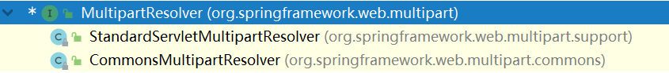

第一个实现子类`StandardServletMultipartResolver`就是我们之前的自动配置类自动注入的，所以我们直接查看该类的同名方法：

```java
public MultipartHttpServletRequest resolveMultipart(HttpServletRequest request) throws MultipartException {
    return new StandardMultipartHttpServletRequest(request, this.resolveLazily);
}
```

直接将原生的请求封装为一个文件上传请求：`MultipartHttpServletRequest`。

然后通过`RequestPartMethodArgumentResolver`解析器，将请求中的文件封装为参数，进行处理。


## 9. 原生组件注入

所谓原生组件，就是Java WEB中的`Servlet`、`Filter`和`Listener`。我们可以在Spring Boot中自定义原生组件，并将其纳入容器中进行管理。

### 9.1 注入方式

在Spring Boot中，有两种原生组件的注入方式：

**方式一 注解**

我们可以利用`@ServletComponentScan("basePackage")`+`@WebServlet("/path")`/`@WebListener`/`@WebFilter("/path")`的方式将原生组件加入容器中；

注意：

- 自定义的`Servlet`需要继承`HttpServlet`，并自己实现`doGet()`等方法；
- 自定义的`Filter`需要实现`Filter`接口，实现`doFilter()`方法；
- 自定义的`Listener`需要实现对应的监听接口（如`ServletContextListener`）；

**方式二 配置类注入 **

使用`ServletRegistrationBean`, `FilterRegistrationBean`和 `ServletListenerRegistrationBean`进行注入，例如：

```java
import com.lee.filter.MyFilter;
import com.lee.listener.MyListener;
import com.lee.servlet.MyServlet;
import org.springframework.boot.web.servlet.FilterRegistrationBean;
import org.springframework.boot.web.servlet.ServletListenerRegistrationBean;
import org.springframework.boot.web.servlet.ServletRegistrationBean;
import org.springframework.context.annotation.Bean;
import org.springframework.context.annotation.Configuration;
import javax.servlet.Servlet;

@Configuration
public class ServletFilterListenerConfig {

    @Bean
    public ServletRegistrationBean servletRegistration(){
        ServletRegistrationBean<Servlet> registrationBean = new ServletRegistrationBean();
        registrationBean.setServlet(new MyServlet());
        registrationBean.addUrlMappings("/my");
        return registrationBean;
    }

    @Bean
    public FilterRegistrationBean filterRegistration(){
        FilterRegistrationBean registrationBean = new FilterRegistrationBean();
        registrationBean.setFilter(new MyFilter());
        registrationBean.addUrlPatterns("/my","/my2");
        return registrationBean;
    }

    @Bean
    public ServletListenerRegistrationBean servletListenerRegistration(){
        ServletListenerRegistrationBean registrationBean = new ServletListenerRegistrationBean();
        registrationBean.setListener(new MyListener());
        return registrationBean;
    }
}

```


### 9.2 DispatcherServlet

`DispatcherServlet`是Spring Boot提供的`Servlet`，通过查看`DispatcherServletAutoConfiguration`自动配置类，我们可以知道`DispatcherServlet`是如何自动注入容器的：

```java
@AutoConfigureOrder(Ordered.HIGHEST_PRECEDENCE)
@Configuration(proxyBeanMethods = false)
@ConditionalOnWebApplication(type = Type.SERVLET)
@ConditionalOnClass(DispatcherServlet.class)
@AutoConfigureAfter(ServletWebServerFactoryAutoConfiguration.class)
public class DispatcherServletAutoConfiguration {

	public static final String DEFAULT_DISPATCHER_SERVLET_BEAN_NAME = "dispatcherServlet";

	public static final String DEFAULT_DISPATCHER_SERVLET_REGISTRATION_BEAN_NAME = "dispatcherServletRegistration";

	@Configuration(proxyBeanMethods = false)
	@Conditional(DefaultDispatcherServletCondition.class)
	@ConditionalOnClass(ServletRegistration.class)
	@EnableConfigurationProperties(WebMvcProperties.class)
	protected static class DispatcherServletConfiguration {

		@Bean(name = DEFAULT_DISPATCHER_SERVLET_BEAN_NAME)
		public DispatcherServlet dispatcherServlet(WebMvcProperties webMvcProperties) {
			DispatcherServlet dispatcherServlet = new DispatcherServlet();
            // 省略一些对dispatcherServlet的设置代码
			return dispatcherServlet;
		}
	}

	@Configuration(proxyBeanMethods = false)
	@Conditional(DispatcherServletRegistrationCondition.class)
	@ConditionalOnClass(ServletRegistration.class)
	@EnableConfigurationProperties(WebMvcProperties.class)
	@Import(DispatcherServletConfiguration.class)
	protected static class DispatcherServletRegistrationConfiguration {

		@Bean(name = DEFAULT_DISPATCHER_SERVLET_REGISTRATION_BEAN_NAME)
		@ConditionalOnBean(value = DispatcherServlet.class, name = DEFAULT_DISPATCHER_SERVLET_BEAN_NAME)
		public DispatcherServletRegistrationBean dispatcherServletRegistration(
            DispatcherServlet dispatcherServlet,
			WebMvcProperties webMvcProperties, 
            ObjectProvider<MultipartConfigElement> multipartConfig) {
            
			DispatcherServletRegistrationBean registration = 
                new DispatcherServletRegistrationBean(
                	dispatcherServlet,
					webMvcProperties.getServlet().getPath());
            
			registration.setName(DEFAULT_DISPATCHER_SERVLET_BEAN_NAME);
				registration.setLoadOnStartup(webMvcProperties.getServlet().getLoadOnStartup());
			multipartConfig.ifAvailable(registration::setMultipartConfig);
			return registration;
		}

	}
}

```

在以上的代码中，关键代码如下：

```java
DispatcherServletRegistrationBean registration = 
                new DispatcherServletRegistrationBean(
                	dispatcherServlet,
					webMvcProperties.getServlet().getPath());
```

即设置`dispatcherServlet`的路径为`webMvcProperties.getServlet().getPath()`；该路径为：

```java
@ConfigurationProperties(prefix = "spring.mvc")
public class WebMvcProperties {
    
    	public static class Servlet {
			private String path = "/";
        }
}
```

即`dispatcherServlet`的路径为`/`；

因此我们可以自定义多个原生`Servlet`，这些`Servlet`与`dispatcherServlet`一同工作；多个`Servlet`一起工作时，路径匹配按照精确优选原则；

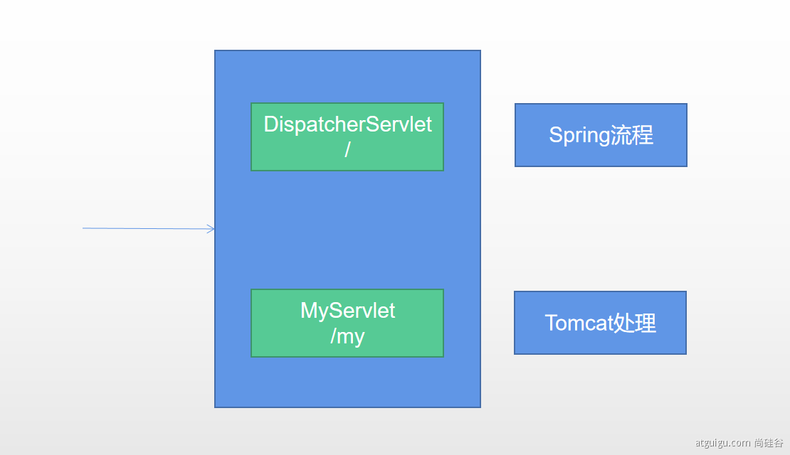


## 10. 嵌入式Servlet容器


## 参考资料

[1] 静态资源首页：https://www.hangge.com/blog/cache/detail_2528.html

[2] thymeleaf语法：https://www.thymeleaf.org/doc/tutorials/2.1/usingthymeleaf.html

[3] 上传文件到项目根路径下：https://blog.csdn.net/hi_bigguy/article/details/89204902

