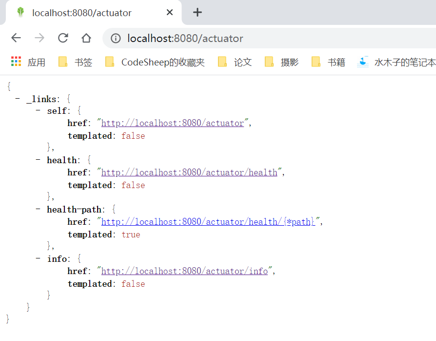
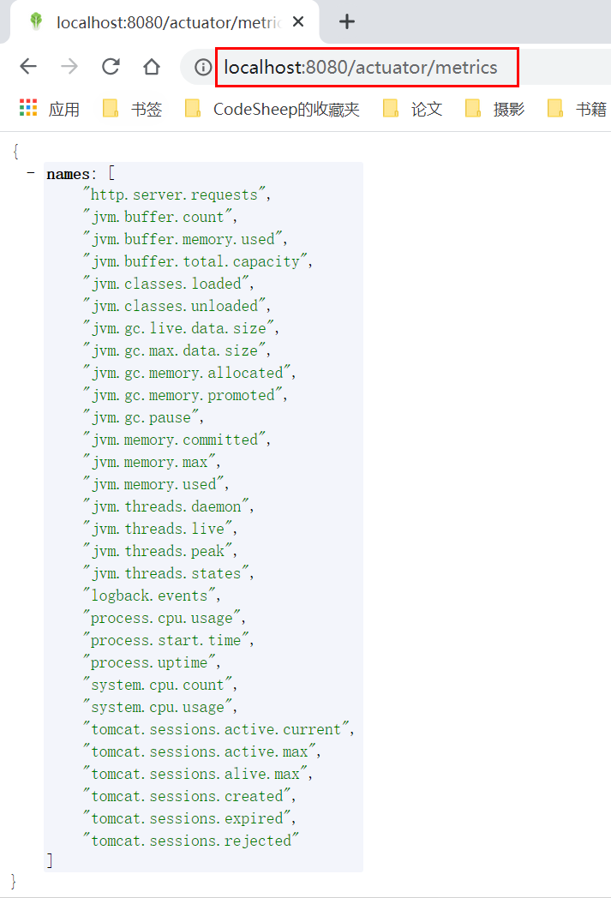
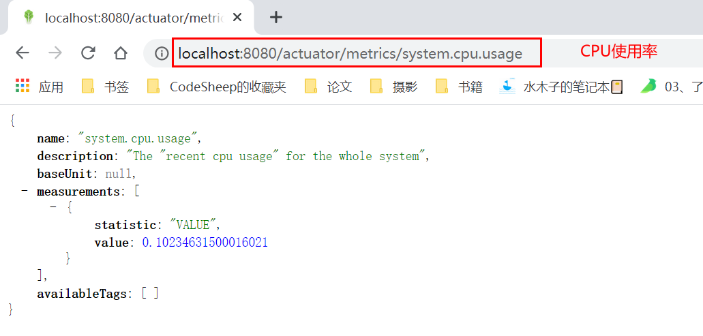
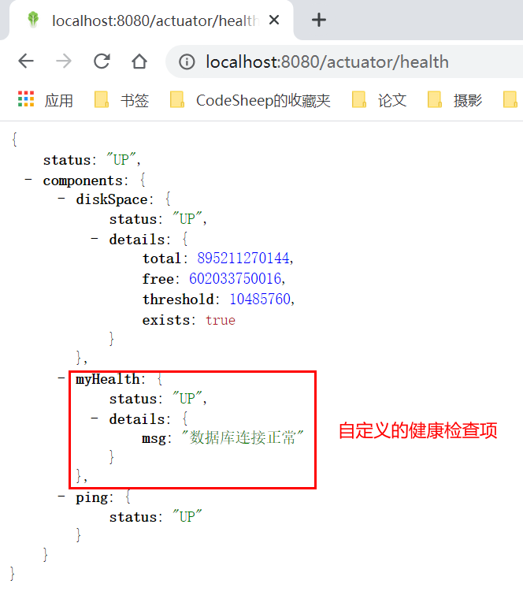
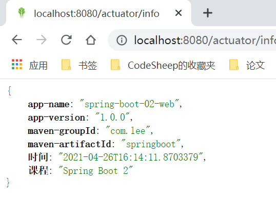
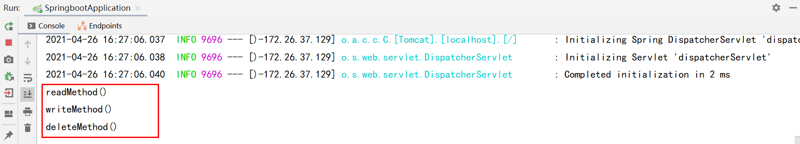

# Spring Boot— —指标监控

本文主要介绍指标监控的相关知识。

[toc]

## 1. Actuator与Endpoints

当我们的应用部署上线时，我们需要对其进行监控、追踪、审计、控制等，Spring Boot提供了`spring-boot-starter-actuator`场景启动器，帮助我们快速地获得监控应用的功能。

要使用Actuator，需要在`pom.xml`中添加场景启动器：

```xml
<dependency>
    <groupId>org.springframework.boot</groupId>
    <artifactId>spring-boot-starter-actuator</artifactId>
</dependency>
```

> Actuator endpoints let you monitor and interact with your application. Spring Boot includes a number of built-in endpoints and lets you add your own. For example, the `health` endpoint provides basic application health information.

endpoints(端点)能让我们监控、控制应用，Spring Boot提供了许多内置的端点，我们也可以创建自己的端点。例如，端点`health`提供应用的基本健康信息。

> Each individual endpoint can be [enabled or disabled](https://docs.spring.io/spring-boot/docs/current/reference/htmlsingle/#production-ready-endpoints-enabling-endpoints) and [exposed (made remotely accessible) over HTTP or JMX](https://docs.spring.io/spring-boot/docs/current/reference/htmlsingle/#production-ready-endpoints-exposing-endpoints). An endpoint is considered to be available when it is both enabled and exposed. The built-in endpoints will only be auto-configured when they are available. Most applications choose exposure via HTTP, where the ID of the endpoint along with a prefix of `/actuator` is mapped to a URL. For example, by default, the `health` endpoint is mapped to `/actuator/health`.

每个端点都能单独启用或禁用、通过HTTP或JMX(Jconsole)暴露。一个端点只有同时启用并暴露，才会起作用。内置的端点只有起作用时，才会自动配置相关属性。大多数的应用通过HTTP暴露端点，端点的ID加上前缀`/actuator`成为访问该端点的路径。例如，端点`health`默认的访问路径为`/actuator/health`。

详细的端点列表如下，[官网链接](https://docs.spring.io/spring-boot/docs/current/reference/htmlsingle/#production-ready-endpoints)：

| ID                 | 描述                                                         |
| ------------------ | ------------------------------------------------------------ |
| `auditevents`      | 暴露当前应用程序的审核事件信息。需要一个`AuditEventRepository组件`。 |
| `beans`            | 显示应用程序中所有Spring Bean的完整列表。                    |
| `caches`           | 暴露可用的缓存。                                             |
| `conditions`       | 显示自动配置的所有条件信息，包括匹配或不匹配的原因。         |
| `configprops`      | 显示所有`@ConfigurationProperties`。                         |
| `env`              | 暴露Spring的属性`ConfigurableEnvironment`                    |
| `flyway`           | 显示已应用的所有Flyway数据库迁移。 需要一个或多个`Flyway`组件。 |
| `health`           | 显示应用程序运行状况信息。                                   |
| `httptrace`        | 显示HTTP跟踪信息（默认情况下，最近100个HTTP请求-响应）。需要一个`HttpTraceRepository`组件。 |
| `info`             | 显示应用程序信息。                                           |
| `integrationgraph` | 显示Spring `integrationgraph` 。需要依赖`spring-integration-core`。 |
| `loggers`          | 显示和修改应用程序中日志的配置。                             |
| `liquibase`        | 显示已应用的所有Liquibase数据库迁移。需要一个或多个`Liquibase`组件。 |
| `metrics`          | 显示当前应用程序的“指标”信息。                               |
| `mappings`         | 显示所有`@RequestMapping`路径列表。                          |
| `scheduledtasks`   | 显示应用程序中的计划任务。                                   |
| `sessions`         | 允许从Spring Session支持的会话存储中检索和删除用户会话。需要使用Spring Session的基于Servlet的Web应用程序。 |
| `shutdown`         | 使应用程序正常关闭。默认禁用。                               |
| `startup`          | 显示由`ApplicationStartup`收集的启动步骤数据。需要使用`SpringApplication`进行配置`BufferingApplicationStartup`。 |
| `threaddump`       | 执行线程转储。                                               |

如果您的应用程序是Web应用程序（Spring MVC，Spring WebFlux或Jersey），则可以使用以下附加端点：

| ID           | 描述                                                         |
| ------------ | ------------------------------------------------------------ |
| `heapdump`   | 返回`hprof`堆转储文件。                                      |
| `jolokia`    | 通过HTTP暴露JMX bean（需要引入Jolokia，不适用于WebFlux）。需要引入依赖`jolokia-core`。 |
| `logfile`    | 返回日志文件的内容（如果已设置`logging.file.name`或`logging.file.path`属性）。支持使用HTTP`Range`标头来检索部分日志文件的内容。 |
| `prometheus` | 以Prometheus服务器可以抓取的格式公开指标。需要依赖`micrometer-registry-prometheus`。 |


## 2. 案例使用

首先在添加场景启动器：

```xml
<dependency>
    <groupId>org.springframework.boot</groupId>
    <artifactId>spring-boot-starter-actuator</artifactId>
</dependency>
```

默认情况下，我们可以通过HTTP的方式访问`info`和`health`两个端点。例如，启动项目，然后访问`http://localhost:8080/actuator`，会显示可以访问的端点，效果如下：



[默认情况下](https://docs.spring.io/spring-boot/docs/current/reference/htmlsingle/#production-ready-endpoints-exposing-endpoints)，web只暴露`health`和`info`两个端点。

如果我们要通过HTTP的方式访问其它的端点，需要在配置文件中开启对应的端点。例如，开启`metrics`端点：

```yaml
management:
  endpoint:
    metrics: 
      enabled: true        # 启用metrics
  endpoints:
    web:
      exposure:
      	# 在web端暴露metrics，默认只暴露health和info
        include: ['health','info','metrics']   
```

浏览器访问`http://localhost:8080/actuator/metrics`，如下：



显示的是`metrics`端点下的情况，我们可以在`/actuator/metrics`后面加上`/metric-name`，监控具体的属性：




## 3. 定制endpoint

### 3.1 定制health端点

我们可以定制`health`端点，来显示更多更详细的信息。首先创建自己的健康检查类，继承`AbstractHealthIndicator`，并实现方法：

注意：自定义的健康检查类需要以`HealthIndicator`结尾；

```java
@Component
public class MyHealthHealthIndicator extends AbstractHealthIndicator {
    @Override
    protected void doHealthCheck(Health.Builder builder) throws Exception {
        // 根据业务执行具体的健康检查
        // 根据检查结果返回，此处假设flag为true，即检查结果为健康
        boolean flag = true;
        if (flag){
            builder.up()
                    .withDetail("msg","数据库连接正常");
        }else {
            builder.down()
                    .withDetail("msg","数据库连接失败");
        }
    }
}
```

然后在配置文件中配置：总是显示健康检查细节：

```yaml
management:
    health:
      show-details: always
```

结果如下：




### 3.2 定制info端点

通常有两种方式定制`info`端点的返回信息：

**方式一：配置文件**

我们可以在配置文件中通过`info`前缀编写info信息：

```yaml
info:
  app-name: spring-boot-02-web
  app-version: 1.0.0
  maven-groupId: @project.groupId@           # 获取pom.xml文件中的值
  maven-artifactId: @project.artifactId@
```

**方式二：实现InfoContributor**

我们可以编写类实现`InfoContributor`：

```java
@Component
public class MyInfoContributor implements InfoContributor {
    @Override
    public void contribute(Info.Builder builder) {
        builder.withDetail("时间", LocalDateTime.now())
                .withDetail("课程","Spring Boot 2");
    }
}
```

浏览器访问，会输出两种方式汇总的信息，如下：




## 4. 自定义端点

除了Spring Boot提供的内置端点，我们也可以自己定义端点：

```java
@Component
@Endpoint(id = "my")
public class MyEndpoint {

    @ReadOperation
    public void readMethod(){
        System.out.println("readMethod()");
    }

    @WriteOperation
    public void writeMethod(){
        System.out.println("writeMethod()");
    }

    @DeleteOperation
    public void deleteMethod(){
        System.out.println("deleteMethod()");
    }

}
```

- 自定义的端点需要加上注解：`@Endpoint(id='xxx')`，并放入容器中：`@Component`；
- `@ReadOperation`表示浏览器发送HTTP-GET请求时，会调用该方法，并将该方法的值返回给浏览器；
- `@WriteOperation`表示浏览器发送HTTP-POST请求时，会调用该方法，并将该方法的值返回给浏览器；
- `@DeleteOperation`表示浏览器发送HTTP-POST请求时，会调用该方法，并将该方法的值返回给浏览器；

在配置文件中暴露自定义的端点（默认是开启的，所以只需要暴露）：

```yaml
management:
  endpoints:
    web:
      exposure:
        include: ['health','info','metrics','my']
```

然后使用Postman工具，分别发送三种请求`GET`、`POST`、`DELETE`访问路径`http://localhost:8080/actuator/my`，控制台打印如下：




## 参考资料

[1] 尚硅谷雷丰阳-Spring Boot 2视频教程：https://www.bilibili.com/video/BV19K4y1L7MT?p=77

[2] Spring Boot官网：https://docs.spring.io/spring-boot/docs/current/reference/htmlsingle/