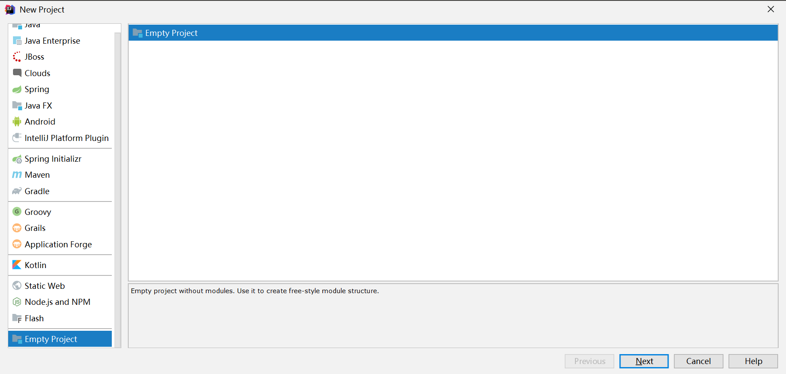
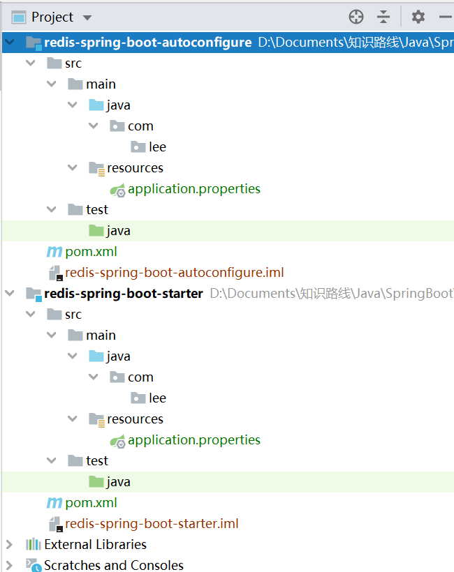

# Spring Boot— —自定义starter

本文主要介绍如何自定义场景启动器starter。在本文中，案例为自定义一个jedis的starter。

[toc]

## 1. 环境搭建

首先在IDEA中创建一个空项目：



然后创建两个模块：`redis-spring-boot-starter`和`redis-spring-boot-autoconfigure`，并删除模块中不需要的内容：



`redis-spring-boot-starter`的pom.xml文件依赖为：

```xml
<dependencies>
    <dependency>
        <groupId>org.springframework.boot</groupId>
        <artifactId>spring-boot-starter</artifactId>
    </dependency>

    <dependency>
        <groupId>com.lee</groupId>
        <artifactId>redis-spring-boot-autoconfigure</artifactId>
        <version>0.0.1-SNAPSHOT</version>
    </dependency>
</dependencies>
```

`redis-spring-boot-autoconfigure`的pom.xml文件依赖为：

```xml
<dependencies>
    <dependency>
        <groupId>org.springframework.boot</groupId>
        <artifactId>spring-boot-starter</artifactId>
    </dependency>

    <dependency>
        <groupId>redis.clients</groupId>
        <artifactId>jedis</artifactId>
        <version>3.6.0</version>
    </dependency>
</dependencies>
```


## 2. 编写配置类

在`redis-spring-boot-autoconfigure`模块中，编写配置类：

`RedisProperties`:

```java
@ConfigurationProperties(prefix = "jedis")
public class RedisProperties {
    private String host = "localhost";
    private Integer port = 6379;

    public String getHost() {
        return host;
    }

    public void setHost(String host) {
        this.host = host;
    }

    public Integer getPort() {
        return port;
    }

    public void setPort(Integer port) {
        this.port = port;
    }
}
```

`RedisAutoConfigure`：

```java
@Configuration
@EnableConfigurationProperties({RedisProperties.class})
public class RedisAutoConfiguration {

    @Bean
    @ConditionalOnMissingBean(name = "jedis")
    public Jedis jedis(RedisProperties redisProperties){
        String host = redisProperties.getHost();
        Integer port = redisProperties.getPort();
        return new Jedis(host,port);
    }
}
```


## 3. 编写配置文件

在`redis-spring-boot-autoconfigure`的resources下创建`META-INF/spring.factories`，将我们自己编写的自动配置类添加到配置文件中：

```txt
org.springframework.boot.autoconfigure.EnableAutoConfiguration=\
com.lee.RedisAutoConfiguration
```


## 4. 测试

创建一个模块`redis-starter-test`，在pom.xml文件中添加依赖：

```xml
<dependency>
    <groupId>com.lee</groupId>
    <artifactId>redis-spring-boot-starter</artifactId>
    <version>0.0.1-SNAPSHOT</version>
</dependency>
```

然后在启动类中获取jedis：

```java
@SpringBootApplication
public class RedisStarterTestApplication {

    public static void main(String[] args) {
        ConfigurableApplicationContext context = SpringApplication.run(RedisStarterTestApplication.class, args);

        Jedis jedis = context.getBean(Jedis.class);
        System.out.println(jedis);
    }
}
```

```txt
redis.clients.jedis.Jedis@76884e4b
```

说明我们配置的Jedis已经起作用了，我们可以在项目的配置文件中通过`jedis`前缀修改host和port。

