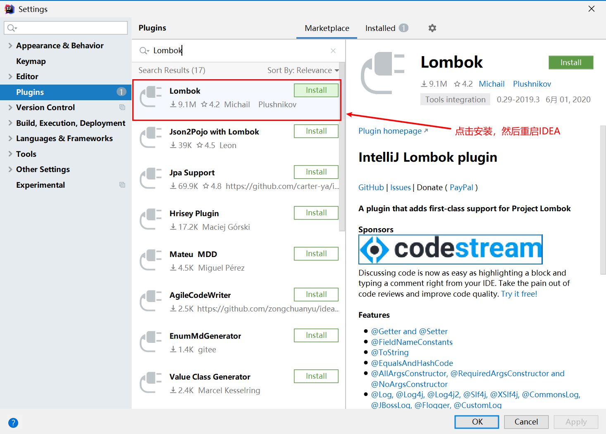
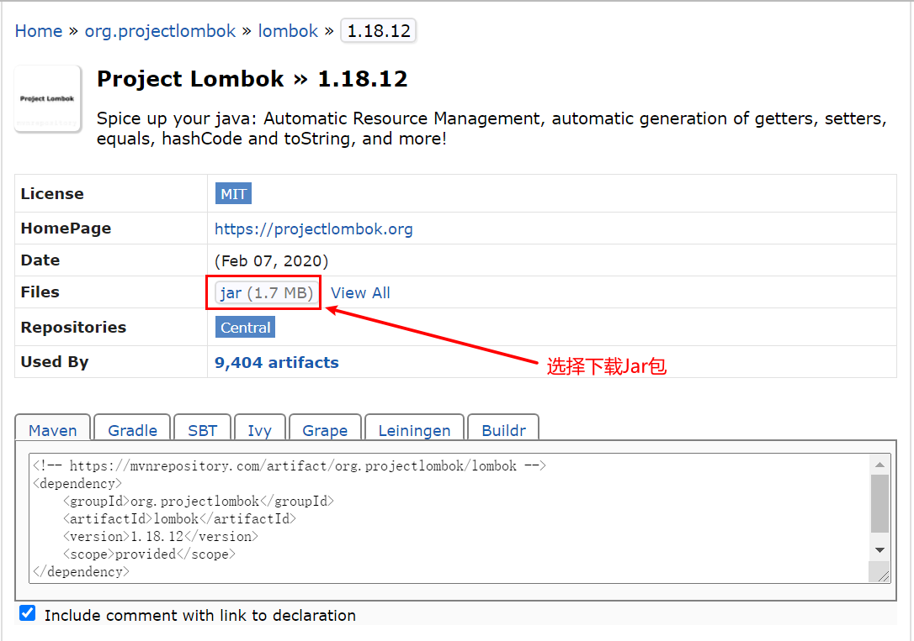
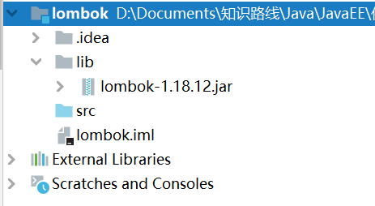
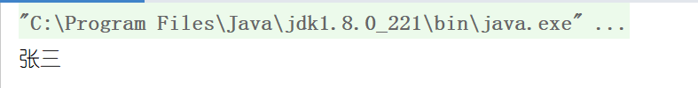
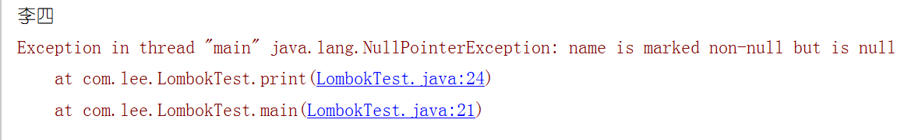
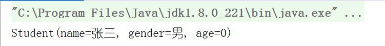

# Lombok的使用

本篇文章主要介绍Lombok。


## 一、什么是Lombok?

直接看Lombok官网对Lombok的介绍：

> Project Lombok is a java library that automatically plugs into your editor and build tools, spicing up your java.
>
> 意译：Lombok是一个插件，让你的Java代码更有趣。
>
> Never write another getter or equals method again, with one annotation your class has a fully featured builder, Automate your logging variables, and much more.
>
> 意译：不用再写get()和equals()方法了。只需要一个注解，你的类就拥有了功能齐全的builder。自动构建日志变量，还有更多功能等你探索。


## 二、Lombok的使用

本节内容主要介绍Lombok在IDEA中的使用。

### 2.1 安装Lombok插件

打开IDEA，依次点击**File--Settings--Plugins**，在搜索框中输入**Lombok**，选择安装，然后重启IDEA。




### 2.2 新建项目

本次新建一个普通的Java项目，过程略。


### 2.3 引入依赖

如果是maven工程，可以在pom.xml文件中引入以下依赖：

```xml
<!-- https://mvnrepository.com/artifact/org.projectlombok/lombok -->
<dependency>
    <groupId>org.projectlombok</groupId>
    <artifactId>lombok</artifactId>
    <version>1.18.12</version>
    <scope>provided</scope>
</dependency>
```

如果是普通Java工程，可以在maven仓库中下载后引入项目中使用，本次教程使用该方法。



然后在项目下新建文件夹**lib**，将下载的Jar包复制进该文件夹，然后右键选择**Add as Library**，项目结构如下：




### 2.3 使用Lombok

在使用Lombok时，有可能出现Lombok不起作用的情况，请参考以下资料解决：

https://blog.csdn.net/xzp_12345/article/details/80268834

在`com.lee.domain`包中新建学生类`Student`，然后在该类上添加注解`@Getter`和`@Setter`：

```java
package com.lee.domain;

import lombok.Getter;
import lombok.Setter;

@Setter
@Getter
public class Student {
    private String name;
    private String gender;
    private int age;
}
```

在`com.lee`包下新建测试类：

```java
package com.lee;

import com.lee.domain.Student;

public class LombokTest {
    public static void main(String[] args) {
        Student student = new Student();
        student.setName("张三");
        System.out.println(student.getName());
    }
}

```

结果：



`Student`类编译后的字节码文件内容：

```java
//
// Source code recreated from a .class file by IntelliJ IDEA
// (powered by Fernflower decompiler)
//

package com.lee.domain;

public class Student {
    private String name;
    private String gender;
    private int age;

    public Student() {
    }

    public void setName(String name) {
        this.name = name;
    }

    public void setGender(String gender) {
        this.gender = gender;
    }

    public void setAge(int age) {
        this.age = age;
    }

    public String getName() {
        return this.name;
    }

    public String getGender() {
        return this.gender;
    }

    public int getAge() {
        return this.age;
    }
}

```

可以看到Lombok帮我们自动生成了`get/set`方法。


## 三、Lombok特性介绍

本节主要介绍Lombok的一些特性及其作用。

### 3.1 val

`val`像是一个数据类型，它的作用是根据其后的表达式，自动确定**局部变量**的类型，并自动将该变量设为`final`。

```java
val age = 12;
--相当于--
int final age = 12;
```


### 3.2 var

`var`和`val`类似，也是根据其后的表达式，自动确定局部变量的类型，但是与`val`不同的是，`var`不会将该变量设为`final`。

```java
var age = 12;
-- 相当于 --
int age = 12;
```


### 3.3 @NonNull

`@NonNull`注解用在**方法或构造函数的参数上**，它会在调用方法时检查参数是否为空，如果为空，会抛出空指针异常`NullPointerExecption`。

```java
private static void print(@NonNull String name){
    System.out.println(name);
}

public static void main(String[] args) {
    print("李四");
    print(null);
}
```

结果：




### 3.4 @Cleanup

`@Cleanup`注解用在**局部变量**上，用于自动释放资源，比如IO流等。

```java
@Cleanup 
InputStream in = new FileInputStream(args[0]);
```


### 3.5 @Getter/@Setter

`@Getter/@Setter`，这两个注解用在**类或属性**上，用于自动生成`get/set`方法。如果用在类上，表示自动生成所有属性的`get/set`方法。

```java
//用在类上
@Getter
@Setter
public class Student{...}

//用在属性上
public class Student{
    @Getter
    @Setter
    private String name;
    ...
}
```


### 3.6 @ToString

`@ToString`用在**类**上，用于自动重写`toString()`方法。这个注解默认会打印每个属性，如果想忽略某个属性，可以在该属性上添加注解`@ToString.Exclude`。


### 3.7 @EqualsAndHashCode

`@EqualsAndHashCode`用在**类**上，用于自动重写`equals(Object o)`和`hashCode()`方法。

注意该注解默认仅使用该类中定义的属性且不调用父类的方法，所以需要通过参数`callSuper=true`来解决问题。


### 3.8 Constructor注解

其实有关构造函数的注解，包括以下三个：`@NoArgsConstructor`、` @RequiredArgsConstructor`、` @AllArgsConstructor`，并且这三个注解都用在**类**上。

- `@NoArgsConstructor`用于自动为类添加一个无参构造函数；

- ` @RequiredArgsConstructor`自动为标记了`@NotNull`的属性生成构造函数，但是注意，该注解生成的构造函数的访问修饰符为`private`，所以在创建对象时是不能使用该构造函数的，但是该注解可以根据参数`staticName=“xxx”`来生成一个静态方法`public static className xxx()`，该静态方法调用了生成的私有构造函数，用于返回对象。

  ```java
  package com.lee.domain;
  
  import lombok.*;
  
  @ToString
  @RequiredArgsConstructor(staticName = "build")
  @AllArgsConstructor
  @NoArgsConstructor
  public class Student {
      @NonNull private String name;
      @NonNull private String gender;
      private int age;
  }
  
  ```

  编译后生成的class文件:

  ```java
  //
  // Source code recreated from a .class file by IntelliJ IDEA
  // (powered by Fernflower decompiler)
  //
  
  package com.lee.domain;
  
  import lombok.NonNull;
  
  public class Student {
      @NonNull
      private String name;
      @NonNull
      private String gender;
      private int age;
  
      public String toString() {
          return "Student(name=" + this.name + ", gender=" + this.gender + ", age=" + this.age + ")";
      }
  
      private Student(@NonNull String name, @NonNull String gender) {
          if (name == null) {
              throw new NullPointerException("name is marked non-null but is null");
          } else if (gender == null) {
              throw new NullPointerException("gender is marked non-null but is null");
          } else {
              this.name = name;
              this.gender = gender;
          }
      }
  
      public static Student build(@NonNull String name, @NonNull String gender) {
          return new Student(name, gender);
      }
  
      public Student(@NonNull String name, @NonNull String gender, int age) {
          if (name == null) {
              throw new NullPointerException("name is marked non-null but is null");
          } else if (gender == null) {
              throw new NullPointerException("gender is marked non-null but is null");
          } else {
              this.name = name;
              this.gender = gender;
              this.age = age;
          }
      }
  
      public Student() {
      }
  }
  
  ```

  测试方法：

  ```java
  package com.lee;
  
  import com.lee.domain.Student;
  
  public class LombokTest {
      public static void main(String[] args) {
          Student student = Student.build("张三","男");
          System.out.println(student);
      }
  }
  
  ```

  结果：

  

- `@AllArgsConstructor`用于自动生成一个全属性的构造函数。


### 3.9 @Data

`@Data`用于**类**上，其集合了`@Getter`, `@Setter`, `@ToString`, `@EqualsAndHashCode` 和`@RequiredArgsConstructor`注解。


### 3.10 @Value

`@Value`和`@Data`类似，但用于不可变类型。生成的类和所有属性都设置为`final`，所有属性都为`private`，所有属性自动生成`get`方法但是没有`set`方法，会生成初始化所有属性的构造函数。相当于同时应用了`final @ToString @EqualsAndHashCode @AllArgsConstructor @FieldDefaults(makeFinal = true, level = AccessLevel.PRIVATE) @Getter`。

```java
package com.lee.domain;

import lombok.*;

@Value
public class Student {
    private String name;
    private int age;
}

```

编译后的class文件：

```java
//
// Source code recreated from a .class file by IntelliJ IDEA
// (powered by Fernflower decompiler)
//

package com.lee.domain;

public final class Student {
    private final String name;
    private final int age;

    public Student(String name, int age) {
        this.name = name;
        this.age = age;
    }

    public String getName() {
        return this.name;
    }

    public int getAge() {
        return this.age;
    }

    public boolean equals(Object o) {
        if (o == this) {
            return true;
        } else if (!(o instanceof Student)) {
            return false;
        } else {
            Student other = (Student)o;
            Object this$name = this.getName();
            Object other$name = other.getName();
            if (this$name == null) {
                if (other$name == null) {
                    return this.getAge() == other.getAge();
                }
            } else if (this$name.equals(other$name)) {
                return this.getAge() == other.getAge();
            }

            return false;
        }
    }

    public int hashCode() {
        int PRIME = true;
        int result = 1;
        Object $name = this.getName();
        int result = result * 59 + ($name == null ? 43 : $name.hashCode());
        result = result * 59 + this.getAge();
        return result;
    }

    public String toString() {
        return "Student(name=" + this.getName() + ", age=" + this.getAge() + ")";
    }
}

```


## 四、关于Lombok的争议

使用Lombok的优点是通过注解帮助开发人员消除Java的冗长代码，尤其是对于简单的Java对象（POJO）。

但是很多程序员认为Lombok的缺点也有很多：

- **侵入性高**

  因为Lombok的使用要求开发者一定要在IDE中安装对应的插件。如果未安装插件的话，使用IDE打开一个基于Lombok的项目的话会提示找不到方法等错误，导致项目编译失败。也就是说，**如果项目组中有一个人使用了Lombok，那么其他人就必须也要安装IDE插件**，否则就没办法协同开发。更重要的是，如果我们定义的一个jar包中使用了Lombok，那么就要求所有依赖这个jar包的所有应用都必须安装插件，这种侵入性是很高的。

- **代码可读性，可调试性低**

  在代码中使用了Lombok，确实可以帮忙减少很多代码，因为Lombok会帮忙自动生成很多代码。但是这些代码是要在编译阶段才会生成的，所以在开发的过程中，其实很多代码其实是缺失的。在代码中大量使用Lombok，就导致代码的可读性会低很多，而且也会给代码调试带来一定的问题。

- **有坑**

  在使用Lombok过程中，如果对于各种注解的底层原理不理解的话，很容易产生意想不到的结果。

  举一个简单的例子，当我们使用@Data定义一个类的时候，会自动帮我们生成equals()方法 。

  **但是如果只使用了`@Data`，而不使用`@EqualsAndHashCode(callSuper=true)`的话，会默认是`@EqualsAndHashCode(callSuper=false)`，这时候生成的equals()方法只会比较子类的属性，不会考虑从父类继承的属性，无论父类属性访问权限是否开放。**


至于是否使用Lombok，还是仁者见仁智者见智，不要过度依赖就好，毕竟现在编译器自动生成代码功能还是挺强大的。


## 五、参考资料

[1]Lombok官网文档：https://projectlombok.org/features/all

[2]Lombok注解无作用：https://blog.csdn.net/xzp_12345/article/details/80268834

[3]@Value解释：https://blog.csdn.net/u011054333/article/details/54381850

[4]Lombok的缺点：http://www.itpub.net/2020/02/20/5273/