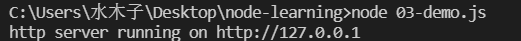
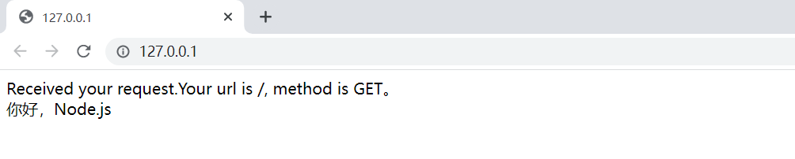

# Node— —fs、path和http模块

本文主要介绍Node.js提供的fs、path和http模块的使用。


## 1. fs模块

fs模块是Node.js提供的文件系统，可以用于操作文件。如果需要使用fs模块，首先需要引入：

```javascript
const fs = require("fs");
```

然后，我们就可以通过fs变量来操作文件。

- `fs.readFile(filepath,[options,],callback)`：该函数用于读取文件内容，有三个参数

    -  `filepath`：文件路径，不可省略
    - `options`：配置信息，可以省略
    - `callback`：回调函数，读取文件完成后进行调用，参数`err`表示读取文件失败时的错误对象，`data`表示读取文件成功时的文件内容

    ```javascript
    const fs = require("fs");
    
    fs.readFile("./hello.txt","utf-8",function(err, data){
        if(err){
            return console.log("读取文件失败：" + err.message);
        }
        console.log("读取文件成功，文件内容为：" + data);
    })
    ```

- `fs.writeFile(filepath,data,[options,]callback)`：该函数用于向文件中写入内容。该方法只能用来创建文件，不能用来创建路径。有四个参数：

    - `filepath`：文件路径，不可省略
    - `data`：要写入的文件内容，不可省略
    - `options`：配置信息，可以省略
    - `callback`：回调函数，写入文件完成后调用，参数`err`表示写入文件中的错误信息

    ```javascript
    const fs = require("fs");
    
    fs.writeFile("./hello.txt","hello Node.js",function(err){
        if(err){
            return console.log("写入文件失败：" + err.message);
        }
    })
    ```

更多有关fs模块的用法参照文档。


## 2. path模块

path模块是Node.js提供的路径模块，如果要使用path模块，首先使用如下代码进行引入：

```javascript
const path = require("path")
```

- `__dirname`：获取当前JS文件所处的目录路径，使用该属性不用引入path模块

    ```javascript
    console.log(__dirname);
    ```

-  `__filename`：获取当前JS文件的路径，使用该属性不用引入path模块

    ```javascript
    console.log(__filename);
    ```

- `path.join([...paths])`：用于路径拼接，将多个路径片段拼接成一个完整的路径字符串。注意：`../`会抵消上一层路径

    ```javascript
    let a = path.join(__dirname, "/file/a/","../","b");
    console.log(a);
    ```

    结果：`C:\Users\水木子\Desktop\node-learning\file\b`，可以看到路径`\a`没有被输出。

- `path.basename(path[, ext])`：用于获取路径中的最后一部分，经常通过这个方法获取路径中的文件名

    - path：必填参数，路径
    - ext：选填参数，扩展名

    ```javascript
    let filepath = "c:/file/index.html";
    console.log(path.basename(filepath));
    console.log(path.basename(filepath,".html"));
    ```

    结果：

    ```txt
    index.html
    index
    ```

- `path.extname(path)`：用于获取文件的扩展名

    ```java
    let filepath = "c:/file/index.html";
    console.log(path.extname(filepath));
    ```

    结果：`.html`


## 3. http模块

http 模块是 Node.js 官方提供的、用来创建 web 服务器的模块。通过 http 模块提供的 http.createServer() 方法，就能方便的把一台普通的电脑，变成一台 Web 服务器，从而对外提供 Web 资源服务。

使用前需要导入http模块：

```javascript
const http = require("http")
```

以下代码加注释说明了如何创建一个WEB服务器：

```javascript
// 1. 导入http模块
const http = require("http");

// 2. 创建web服务器实例
const server = http.createServer();

// 3. 为服务器实例绑定 request 事件，即可监听客户端发送过来的网络请求：
server.on("request",(req, res) => {
    // 只要有客户端请求该服务器，都会触发request事件
    // req表示请求，res表示响应
    let str = `Received your request.Your url is ${req.url}, method is ${req.method}。<br>你好，Node.js`;
    // 为防止中文乱码，设置响应头
    res.setHeader("Content-Type","text/html; charset=utf-8");
    // 使用res.end()方法向客户端响应内容
    res.end(str);
})

// 4. 调用服务器实例的 .listen(port,callback) 方法，即可启动当前的 web 服务器实例
server.listen(80, ()=>{
    console.log("http server running on http://127.0.0.1");
})
```






## 参考资料

[1] 黑马程序员Node.js全套入门教程：https://www.bilibili.com/video/BV1a34y167AZ