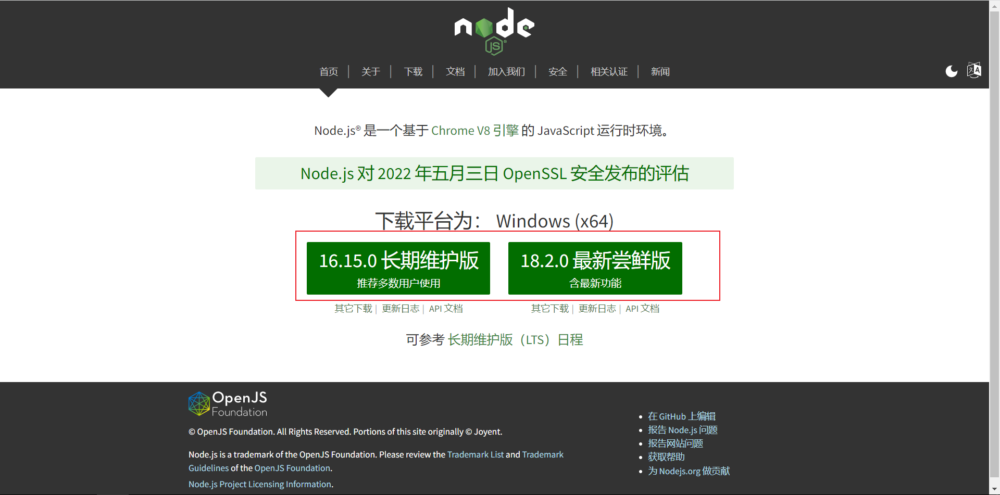
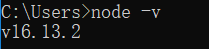
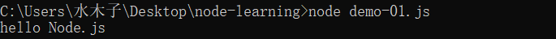

# Node.js— —安装与入门


## 1. 什么是Node.js

> Node.js是一个基于 [Chrome V8 引擎](https://v8.dev/) 的 JavaScript 运行时环境。

换句话说，Node就是用于运行JavaScript代码的运行时环境，就像JRE用于运行Java程序。


## 2. Node.js的安装

进入Node.js官网进行下载：



下载完成后进行安装，安装过程简单，略过。

安装完成后，在终端运行如下命令，查看是否安装成功：

```powershell
node -v
```




## 3. 使用Node.js运行JS代码

Node.js运行JS代码的命令如下：

```powershell
node JS文件路径
```

首先，我们创建一个JS文件，内容如下：

```javascript
console.log("hello Node.js");
```

然后打开终端，转到JS文件所在路径，运行JS代码：



可以发现JavaScript代码成功执行了！


## 4. Node.js能做什么

Node.js 作为一个 JavaScript 的运行环境，仅仅提供了基础的功能和 API。然而，基于 Node.js 提供的这些基础能，很多强大的工具和框架如雨后春笋，层出不穷，所以学会了 Node.js ，可以让前端程序员胜任更多的工作和岗位：

①基于 Express 框架（http://www.expressjs.com.cn/），可以快速构建 Web 应用

②基于 Electron 框架（https://electronjs.org/），可以构建跨平台的桌面应用

③基于 restify 框架（http://restify.com/），可以快速构建 API 接口项目

④读写和操作数据库、创建实用的命令行工具辅助前端开发、etc…


## 5. JS学习路径

**浏览器中的 JavaScript 学习路径：**

JavaScript 基础语法 + 浏览器内置 API（DOM + BOM） + 第三方库（jQuery、art-template 等）

**Node.js 的学习路径：**

JavaScript 基础语法 + Node.js 内置 API 模块（fs、path、http等）+ 第三方 API 模块（express、mysql 等）


## 参考资料

[1] 黑马程序员Node.js全套入门教程：https://www.bilibili.com/video/BV1a34y167AZ

[2] Node.js官网 https://nodejs.org/zh-cn/