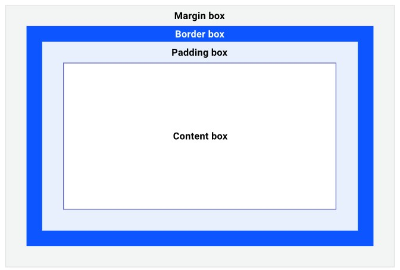
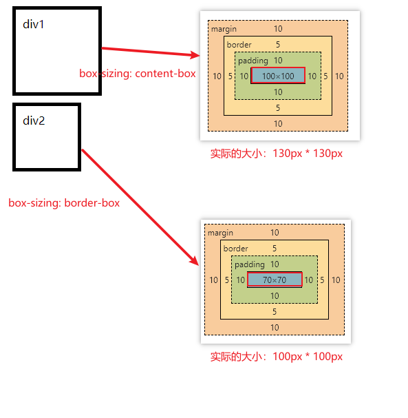

# CSS-盒模型

本文介绍CSS中的盒模型、HTML元素分类。


## 1. 盒模型

HTML页面中任何元素都是一个盒子（box），盒模型示意图如下：



盒模型包括四部分内容：

- Content box：内容区域，该区域放置子元素；
- Padding box：内边距区域，可通过`padding`设置该区域的宽度。当设置`background`时，该区域也会受到影响。
- Border box：边框区域，可通过`border`设置该区域宽度、样式等内容。
- Margin box：外边距区域，可通过`margin`设置该区域的宽度。


## 2. 盒子的大小

我们可以显式地设置盒子的宽高（`width`和`height`），但是元素的实际大小却有可能不同：

```html
<style>
    div {
        border: black solid 5px;
        padding: 10px;
        margin: 10px;
        width: 100px;
        height: 100px;
    }
    .div1{
        box-sizing: content-box;
    }
    .div2{
        box-sizing: border-box;
    }
</style>

<div class="div1">div1</div>
<div class="div2">div2</div>
```

`box-sizing`可以设置如下两种值：

- `content-box`：默认值。设置的宽高为`content box`的宽高，元素的实际大小需要内容区大小加上内边距和边框。
- `border-box`：设置的宽高为元素的实际大小，`content box`的大小需要元素的实际大小减去内边距和边框。

注：元素的实际大小指的是边框`border`所围成的大小。



## 3. 块级元素与行内元素

HTML中存在如下几种元素：

- 块级元素
- 行内元素
- 行内块级元素：综合了块级元素和行内元素的特征

三者的区别如下表：

|              | 是否独占一行 | width、height设置是否有效 | padding设置是否有效 |     margin设置是否有效     |       默认宽度       |
| :----------: | :----------: | :-----------------------: | :-----------------: | :------------------------: | :------------------: |
|   块级元素   |      是      |           有效            |        有效         |            有效            |      撑满父元素      |
|   行内元素   |      否      |           无效            |        有效         | 水平方向有效，垂直方向无效 | 随内部元素的内容变化 |
| 行内块级元素 |      否      |           有效            |        有效         |            有效            | 随内部元素的内容变化 |


## 参考资料

[1] 盒模型：https://pengfeixc.com/tutorial/css/box-model

[2] 块级元素与行内元素：

