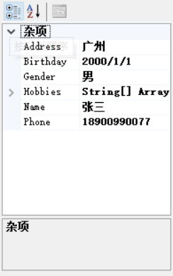
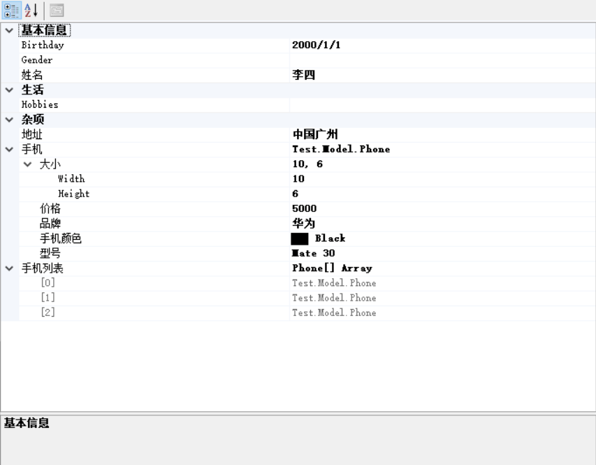
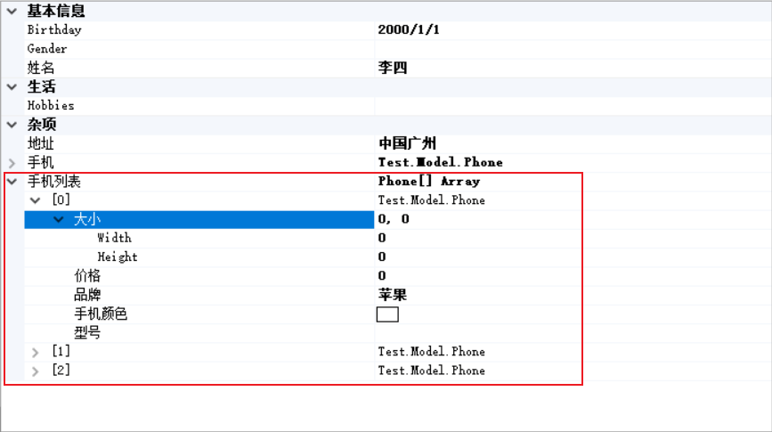
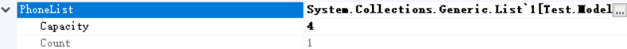

# 控件— —PropertyGrid的使用

本文主要介绍PropertyGrid控件的使用。


## 1. 基础使用

`PropertyGrid`用于显示对象的属性，就像Visual Studio中的属性面板。

我们可以在工具箱中拖拽一个`PropertyGrid`控件到页面上，然后指定`SelectedObject`，就可以显示对象的属性了。

```c#
Student student = new Student()
{
    Name = "张三",
    Gender = "男",
    Birthday = new DateTime(2000, 1, 1),
    Phone = "18900990077",
    Address = "广州",
    Hobbies = new string[] { "篮球", "羽毛球" }
};

propertyGrid1.SelectedObject = student;
```




## 2. 中阶使用

### 2.1 改变属性的显示名

我们只需要在属性上利用`[DisplayName("你要显示的属性名")]`特性改变显示的属性名：

```c#
using System.ComponentModel;

public class Student
{
    [DisplayName("姓名")]
    public string Name { get; set; }

    // 其他属性省略...
}
```

这样`Name`就会显示为`姓名`了。


### 2.2 隐藏属性

默认情况下，`PropertyGrid`会显示所有公共的(`public`)属性。如果我们不想让某个公共属性显示出来，可以在其上标注`[Browsable(false)]`

```c#
using System.ComponentModel;

public class Student
{
    [DisplayName("姓名")]
    public string Name { get; set; }
    
    [Browsable(false)]
    public string Phone { get; set; }

    // 其他属性省略...
}
```


### 2.3 添加说明

当我们选中某个属性时，会在`PropertyGrid`下面显示这个属性的说明。我们可以为属性添加说明，只需要在属性上标注`[Description("说明文字")]`

```c#
using System.ComponentModel;

public class Student
{
    [Description("包含省份、城市、区县以及详细地址")]
    [DisplayName("地址")]
    public string Address { get; set; }

    // 其他属性省略...
}

```


### 2.4 分类

我们可以将对象的属性分到不同的类别中去，只需要在属性上标注`[Category("类别")]`，如果没有标注，默认为`杂项`类别。

```c#
using System.ComponentModel;

public class Student
{

    [Category("基本信息")]
    [DisplayName("姓名")]
    public string Name { get; set; }

    [Category("基本信息")]
    public string Gender { get; set; }

    [Browsable(false)]
    public string Phone { get; set; }

    [Category("基本信息")]
    public DateTime Birthday { get; set; }

    [Description("包含省份、城市、区县以及详细地址")]
    [DisplayName("地址")]
    public string Address { get; set; }

    [Category("生活")]
    public string[] Hobbies { get; set; }
}
```


### 2.5 只读

默认情况下，我们可以修改属性的值，但有的情况下，我们不想让用户修改值。我们可以在类或属性上标注`[ReadOnly(true)]`特性，使得对象或属性变为只读。

```c#
// 1. 如果标注在类上，那么所有的属性都是只读的
[ReadOnly(true)]
public class Student
{
    // ...
}

// 2. 如果标注在属性上，只有该属性是只读的
public class Student
{
    [DisplayName("姓名")]
    [ReadOnly(true)]
    public string Name { get; set; }

    // 其他属性省略...
}
```

有一个问题，如果你想显示的对象不是你能控制的，也就是说你不能在类或属性上加`[ReadOnly(false)]`特性，那要怎么办呢？

可以通过如下方式给类加上特性：

```c#
TypeDescriptor.AddAttributes(myObject, new Attribute[]{new ReadOnlyAttribute(true)});
propertyGrid1.SelectedObject = myObject;
```

上面的方式是给类加上特性，如何动态地给属性加上特性呢？参考资料[2]（未验证）。


### 2.6 隐藏顶部工具栏

只需要将`PropertyGrid`的属性`ToolBarVisible`设置为`false`即可。


### 2.7 隐藏底部说明栏

只需要将`PropertyGrid`的属性`HelpVisible`设置为`false`即可。


## 3. TypeConverter的使用

首先先定义一个`Phone`类，然后将其内嵌到`Student`类中，最后将`Student`实例指定给`PropertyGrid`：

```c#
Student student = new Student()
{
    Name = "李四",
    Birthday = new DateTime(2000, 1, 1),
    Address = "中国广州",
    Phone = new Phone()
    {
        Brand = "华为",
        PhoneModel = "Mate 30",
        Price = 5000,
        Size = new Size(10, 6),
        Color = Color.Black
    },
    Phones = new Phone[]
    {
        new Phone() { Brand = "苹果" },
        new Phone() { Brand = "小米" },
        new Phone() { Brand = "OPPO" }
    }
};
propertyGrid1.SelectedObject = student;
```

显示结果如下：



可以看到内嵌实体`Phone`(手机)的属性是可以展开的，但是`Phones`(手机列表)只能显示有几个元素，不能将每个元素的属性展开。

针对这种情况，我们可以在`Phone`类上添加特性：

```c#
[TypeConverter(typeof(ExpandableObjectConverter))]
```



这样处于数组中的元素也是可以展开的了。PS：如果是`List`，那么`List`中的元素也是无法展开的。

那么我们就要深入研究下`TypeConverter`的用法了。


## 4. 如何展开List中的元素

在上一节中，我们直到`List`中的元素是无法轻易地展开地，如果仅仅在对应的类和属性上添加特性：

```c#
[TypeConverter(typeof(ExpandableObjectConverter))]
public List<Phone> PhoneList { get; set; }

-------------

[TypeConverter(typeof(ExpandableObjectConverter))]
public class Phone {...}
```

那么得到的效果是这样的：



显然这不是我们希望的效果，我们希望`List`能像数组一样展开每个元素的属性。


## 参考资料

[1] https://stackoverflow.com/questions/2315288/readonly-propertygrid

[2] https://stackoverflow.com/questions/12143650/how-to-add-property-level-attribute-to-the-typedescriptor-at-runtime

[3] http://software-tecnico-libre.es/en/article-by-topic/all_sections/all-topics/all-articles/propertygrid-control-type-converters

[4] https://stackoverflow.com/questions/32582504/propertygrid-expandable-collection
