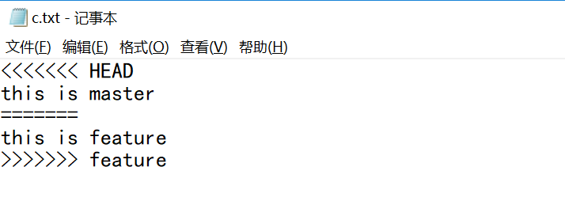

# Git使用教程

本篇文章主要介绍如何使用Git进行版本控制。


## 一、什么是Git

Git是一个分布式版本控制系统。

所谓分布式，是与集中式相对立的。集中式版本控制系统，版本库是集中存放在中央服务器的，每个人都需要从中央服务器获取最新版本进行工作，再将工作结果推送到中央服务器。而分布式版本控制系统并不存在中央服务器，每个人的计算机里都有完整的版本库。


## 二、简单使用Git

下载安装Git后，就可以开始使用了。

### 2.1 创建版本库

在一个文件夹中，打开Git，然后通过`git init`命令能把一个文件夹变成Git可以管理的仓库。


当创建版本库后，就有了工作区、缓存区和本地仓库的概念。


### 2.2 把文件添加到版本库中

把文件添加到版本库中需要两步，第一步是将文件添加到缓存区中，第二步是将暂存区中的文件提交到本地版本库中。第一步使用命令`git add 文件名`，第二步使用命令`git commit -m '修改记录'`。

首先我们在文件夹中新建一个文件readme.txt，内容如下：

```txt
this is a readme.txt
git test
```


命令图示如下：


### 2.3 查看工作区状态

我们可以使用命令`git status`来查看工作区的状态，即可以跟踪文件的修改状态，注意，这里只能跟踪提交过到缓存区的文件。

比如我们新建一个文件a.txt，然后执行`git status`：


提示我们这个文件是**Untracked files**，即未跟踪的。

但是我们在修改文件readme.txt如下：

```txt
this is a readme.txt
git test
git status
```

再次使用`git status`，提示我们readme.txt文件已做修改：


## 三、版本控制

在进行下面的操作之前，需要做一下前置工作。

1. 首先将增加的文件a.txt以及修改的文件readme.txt添加到版本库中。


`git add .`表示将当前文件夹下的所有文件添加到缓存区中。

2. 然后在a.txt文件中添加内容：

   ```txt
   this is a.txt
   aaaaaaaaaaaaaaaaaaaaa
   ```

   再次提交到版本库中：


迄今为止，我们已经提交了三次。


### 3.1 查看提交日志

我们可以使用命令`git log`查看我们的提交日志：


可以看到每次提交都会生成一个日志记录，并且该记录包含了提交的编号(commit id)，作者，时间以及提交时的修改信息。

可以使用参数`--pretty=oneline`来显示简略日志信息：


### 3.2 版本回退

在Git中，使用HEAD指针指向当前的版本。

如果我们想回到之前的某个版本，那么我们可以使用`git reset --hard 提交的编号`，这里的提交编号可以不用写全，只需要写几位，能明确某一个版本即可。例如我们想回退到第一次提交的时候：


并且提示也告诉我们现在HEAD指向了第一次提交的版本，查看我们的工作区：


a.txt已经消失了，并且readme.txt的内容如下：

```txt
this is a readme.txt
git test
```

注意：在Git中，用`HEAD`表示当前版本，上一个版本就是`HEAD^`，上上一个版本就是`HEAD^^`，当然往上100个版本写100个`^`比较容易数不过来，所以写成`HEAD~100`。

该命令不仅能版本回退，也能从旧版本前进到新版本，只要我们知道版本的提交编号，就可以跳转到某一个版本。


### 3.3 历史命令记录

如果我们回退到某一个版本后，那么使用`git log`再也查询不到该版本之后的提交记录了：


如果我们此时想前进到新版本，那么我们可以使用命令`git reflog`来查看命令历史记录：


此时前面的数据就是提交编号，我们可以使用命令`git reset --hard 编号`来进行版本前进操作。


### 3.4 撤销工作区修改

如果我们在工作区修改了很多文件，此时想要撤销修改，方法之一是手动将修改删除，方法之二就是利用Git的命令`git checkout -- 文件名`或`git restore 文件名`来撤销修改，这里分为两种情况：如果该文件没有添加到缓存区，那么撤销修改后的文件状态为本地仓库的文件状态；如果添加到了缓存区，那么撤销修改后的文件状态为缓存区中的文件状态。总之，就是让这个文件回到最近一次`git commit`或`git add`时的状态。

测试，修改readme.txt为如下部分：

```txt
this is a readme.txt
git test
测试撤销修改
修改了很多文件
```

然后执行命令`git checkout -- .`，文件readme.txt内容恢复如下：

```txt
this is a readme.txt
git test
```

如果修改后添加到缓存区，然后再进行修改，之后执行此命令会将缓存区的文件状态覆盖掉工作区的文件状态。


### 3.5 撤销缓存区修改

我们可以使用命令`git reset HEAD 文件名`或`git restore --staged 文件名`可以把暂存区的修改撤销掉，重新放回工作区。

比如我们现在修改了文件readme.txt以及添加了两个文件a.txt和b.txt：


然后使用命令`git reset HEAD .`撤销缓存区的修改：


### 3.6 删除文件

如果我们在工作区删除了一个已提交到本地仓库的文件，那么我们实际上只删除工作区的文件，本地仓库的文件并没有删除，如果需要删除本地仓库的文件，需要使用命令`git rm 文件名`，然后提交`git commit`。


如果一个文件提交到版本库中，那么不要担心该文件会被删除，我们总能通过版本回退找到该文件。


## 四、远程仓库

在连接远程仓库之前，需要你创建Github账号，然后创建一个仓库，此处不再赘述。

### 4.1 添加远程仓库

所谓添加远程仓库，就是让本地仓库和远程仓库相关联。

首先获取远程仓库的地址：


然后使用命令`git remote add origin 远程仓库地址`添加远程仓库。


其中的`git remote add`表示添加远程仓库的命令，`origin`是远程仓库的名字，`https://github.com/Lee-0o0/git-study.git`是远程仓库的地址。


### 4.2 推送

添加了远程仓库后，我们就可以将本地仓库的内容推送到远程仓库中去了，使用命令`git push`。


在Github远程仓库中已经有了本地仓库的内容：


其中`git push`表示推送命令，`origin`表示推送到哪个远程仓库（即远程仓库名），`master`表示分支名。

第一次推送`master`分支时，加上了`-u`参数，Git不但会把本地的`master`分支内容推送到远程仓库的`master`分支，还会把本地的`master`分支和远程的`master`分支关联起来，在以后的推送或者拉取时就可以简化命令。

此后，每次本地提交后，只要有必要，就可以使用命令`git push origin master`推送最新修改。


### 4.3 拉取

所谓拉取，就是把远程仓库的内容复制到本地。

我们可以使用`git clone 远程仓库地址`来复制项目，该命令是把整个Git项目拷贝下来，包括里面的日志信息，Git项目里的分支，你也可以直接切换、使用里面的分支等等，使用该命令不需要先与远程项目关联。


并且之后可以直接推送到远程仓库中去。

也可以使用命令`git pull  远程主机名 远程分支名：本地分支名`用于取回远程仓库某个分支的更新与本地的指定分支合并。


## 五、分支管理

分支可以让我们可以并行工作，提高工作效率。

### 5.1 分支管理基本语句

- 查看所有分支

  我们可以使用命令`git branch`查看所有的分支。并且当前分支会用`*`特别标注出来。

- 创建分支

  我们可以使用命令`git branch 分支名`来创建一个新的分支。

  

- 切换分支

  我们可以使用命令`git switch 分支名`来切换到目标分支。

  

- 删除分支

  我们可以使用命令`git branch -d 分支名`来删除分支，注意，如果你当前在该分支，则不能删除。

  

- 合并分支

  当其他分支的工作完成后，可以将其他分支的工作内容合并到当前分支上。我们可以使用命令`git merge 目标分支名`来合并分支。

  首先切换到dev分支，然后新建c.txt文件，提交；然后切换到master分支，合并dev分支，查看日志。
  
  
  
  


### 5.2 冲突管理

如果不同分支修改了同一个文件，合并时会引发冲突，需要我们手动修改解决冲突。例子：

新建一个分支feature，然后在文件c.txt中修改内容为：

```txt
this is feature
```

然后提交。


切换到master分支，修改c.txt文件为：

```txt
this is master
```

然后提交。


然后合并feature分支：


提示在c.txt文件中发生了合并冲突，打开c.txt文件，如下：



可以看到Git将冲突的内容标注出来了，用`<<<<<<<`、`=======`和`>>>>>>>`将两个分支的不同内容分隔开来，我们可以手动修改冲突的内容，然后再提交。

修改c.txt为如下内容：

```txt
this is master conflict fixed
```


## 六、标签管理

标签就像提交编号，帮助我们更好管理版本。

### 6.1 创建与删除标签

我们可以使用命令`git tag 标签名`为最新的提交创建一个标签，如果要为之前的某次提交创建标签，则可以加上提交编号，命令格式为`git tag 标签名 提交编号`。

可以使用命令`git tag`查看所有标签，标签不是按时间顺序列出，而是按字母排序的，也可以用命令`git show 标签名`查看标签具体信息。

因为创建的标签都只存储在本地，不会自动推送到远程。所以，打错的标签可以在本地安全删除，我们可以使用命令`git tag -d 标签名`删除标签。


### 6.2 推送标签

由于标签不会自动推送到远程，所以我们需要手动推送。

如果需要推送某个标签到远程，可以使用命令`git push origin 标签名`，也可以使用命令`git tag origin --tags`一次性推送全部尚未推送到远程的本地标签。

如果需要删除推送到远程的标签，则需要先删除本地的标签，使用命令`git tag -d 标签名`，然后删除远程的标签，使用命令`git push origin :refs/tags/标签名`。


## 七、参考资料

[1]廖雪峰Git教程： https://www.liaoxuefeng.com/wiki/896043488029600