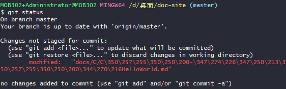
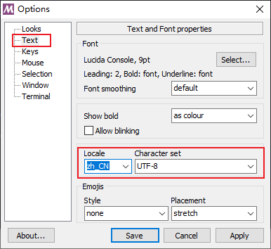

# Git控制台中文乱码问题

**问题：**当我们使用在Git命令行中输入相关命令时，如果结果涉及中文，那么会出现编码而非中文：



**分析：**在默认设置下，中文文件名在工作区状态输出，中文名不能正确显示，而是显示为八进制的字符编码


**解决方案：**

首先在Git控制台输入如下命令：

```bash
git config --global core.quotepath false
```

将 Git  配置文件 `core.quotepath`项设置为`false`。`quotepath`表示引用路径，加上`--global`表示全局配置。

然后在Git控制台空白处鼠标右击，选择`Options`，然后选择`Text`，按照下图进行设置：



**参考资料**

[1] https://blog.csdn.net/u012145252/article/details/81775362