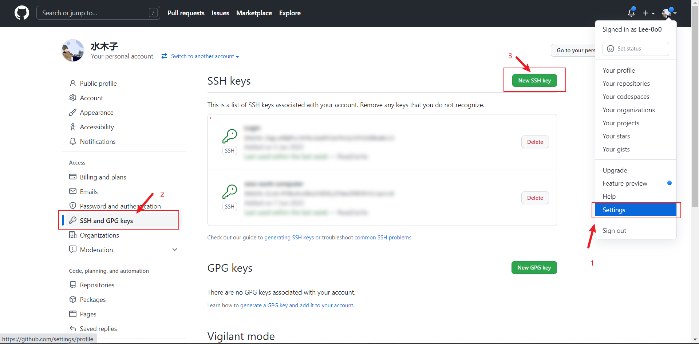
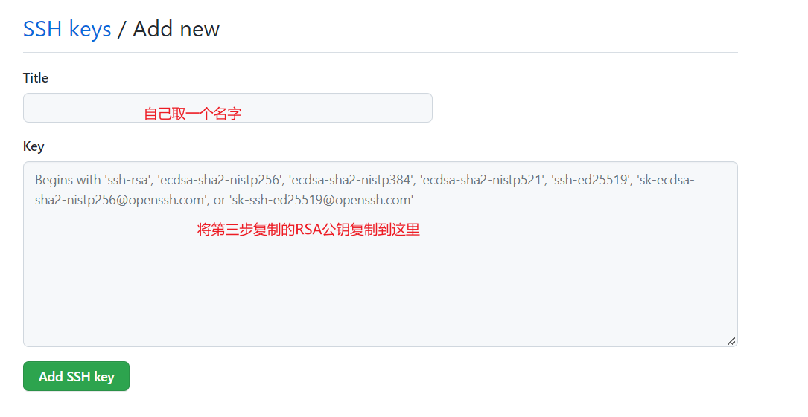
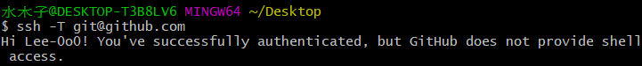

# Git配置SSH密钥


我们在往Github上push项目的时候，如果使用HTTPS的方式，每次都需要输入账号密码，非常麻烦。而采用SSH的方式，push代码的时候就不需要输入账号密码，非常方便。而配置SSH只需要在Github账号下配置一个SSH公钥即可，配置SSH步骤如下：

1. 使用秘钥生成工具生成RSA秘钥和公钥
2. 将RSA公钥添加到代码托管平台（Github）


**第一步**：首先我们检查本机是否已经配置了SSH，打开Git 控制台界面，输入如下命令：

```bash
cd ~/.ssh
ls
//看是否存在 id_rsa 和 id_rsa.pub文件，如果存在，说明已经有SSH Key
```

如果已经存在RSA密钥和公钥，则跳转到第三步。


**第二步**：生成RSA密钥和公钥。如果本机还没有RSA密钥和公钥，使用以下命令生成：

```bash
cd ~/.ssh
ssh-keygen -t rsa -C "xxx@xxx.com"
//执行后一直回车即可
```


**第三步**：获取RSA公钥内容，使用如下命令获取RSA公钥内容：

```bash
cd ~/.ssh
cat id_rsa.pub
```


**第四步**：打开Github，按照如下的步骤打开Github的SSH设置页面：





将第三步的RSA公钥复制到上图位置。


**第五步**：验证是否配置成功，在Git控制台中输入如下命令：

```bash
ssh -T git@github.com
```

出现下图表示配置成功：



之后，我们向Github推送代码的时候，就不用输入账号和密码了。