# Nginx

本文主要介绍Nginx相关知识，并通过实例加深理解。


## 1. Nginx概念

### 1.1 Nginx是什么

> Nginx是由伊戈尔·赛索耶夫开发的，于2004年10月4日发布第一个版本。
>
> Nginx (engine x) 是一个高性能的HTTP和反向代理web服务器，同时也提供了IMAP/POP3/SMTP服务。其特点是占有内存少，并发能力强。Nginx专为性能优化而开发，性能是其最重要的考量，实现上非常注重效率，能经受高负载的考验，有报告表明能支持高达50000个并发连接数。


### 1.2 反向代理

既然有反向代理，那么肯定也有正向代理。不论是正向代理还是反向代理，在结构上都是客户端和服务端之间的一个代理服务器，区别是代理的对象不同。

首先介绍正向代理，如大家所知，在国内是无法直接访问谷歌`www.google.com`的，而利用正向代理服务器，可以帮助我们访问谷歌站点，首先客户端设置代理服务器，然后将请求发给正向代理服务器，代理服务器是可以访问谷歌站点的，所以代理服务器将我们的请求转发给谷歌站点，然后代理服务器再将响应内容返回给客户端。

> 正向代理隐藏了真实的请求客户端，服务端不知道真实的客户端是谁，客户端的请求都由代理服务器代替来请求。正向代理的对象是客户端。

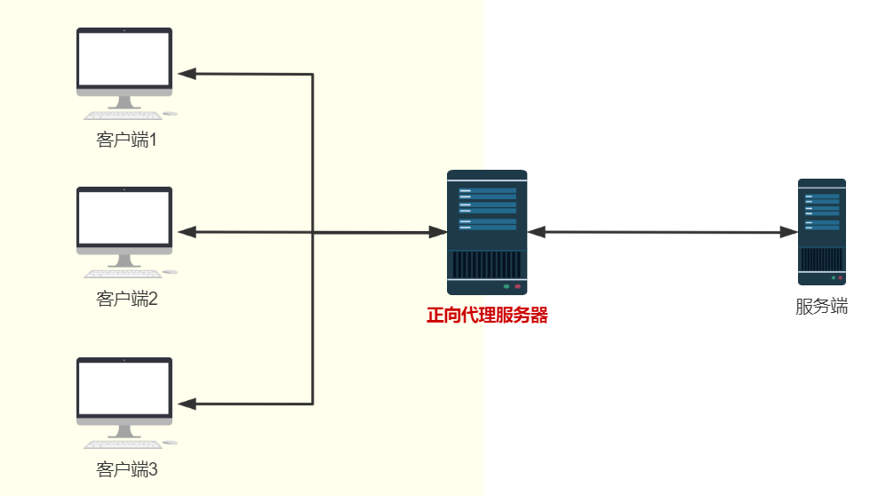

反向代理与正向代理相反，代理的对象是服务端。

> 对于客户端来说，反向代理服务器就好像目标服务器。并且客户端不需要进行任何设置。客户端将请求发送给反向代理服务器，然后反向代理服务器将请求发送给目标服务器，最后将响应转发给客户端。反向代理屏蔽了真实目标服务器的地址。

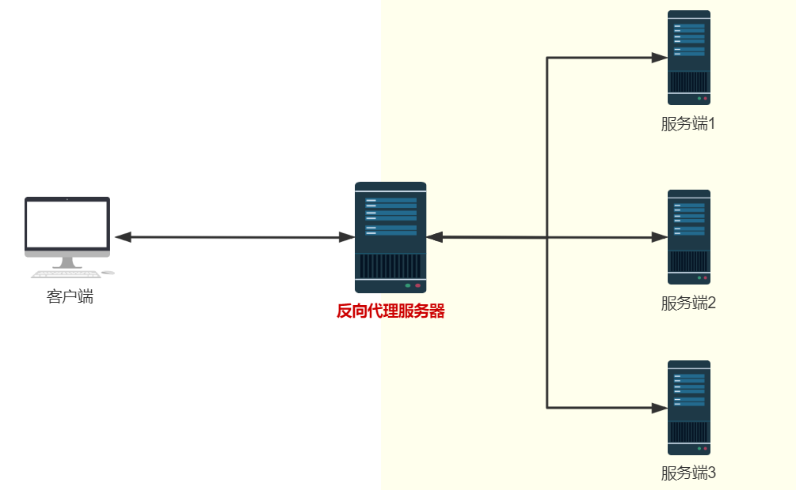


### 1.3 负载均衡

反向代理是负载均衡的实现原理。所谓负载均衡，反向代理服务器将请求分发到目标服务器上，每台目标服务器都是合理的请求，使其整体具有更高的工作效率和资源利用率。


### 1.4 动静分离

为了提高网站的响应速度，减轻程序服务器（Tomcat，Jboss等）的负载，对于静态资源，如图片、js、css等文件，可以在反向代理服务器中进行缓存（也可以转发给专门的存放静态资源的服务器），这样浏览器在请求一个静态资源时，代理服务器就可以直接处理，而不用将请求转发给后端服务器。对于用户请求的动态文件，如servlet、jsp，则转发给Tomcat，Jboss服务器处理，这就是动静分离。即动态文件与静态文件的分离。

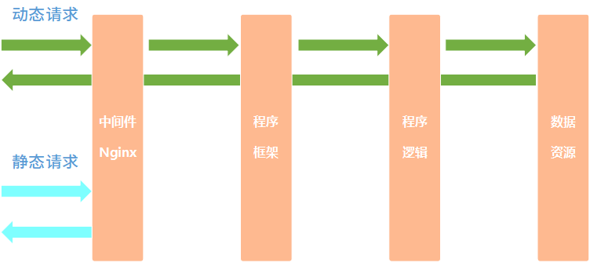


## 2. Nginx的安装、命令和配置

### 2.1 Nginx的安装

下列步骤在华为学生云服务器和VMware 虚拟机都有实现，有效性可以保证。系统是CentOS 7。

我们需要在服务器上安装Nginx软件，安装步骤如下：

首先下载安装依赖包：

```shell
yum -y install gcc zlib zlib-devel pcre-devel openssl openssl-devel
```

下载nginx：

```shell
// 创建一个文件夹
cd /home
mkdir nginx
cd /home/nginx
// 下载tar包
wget http://nginx.org/download/nginx-1.13.7.tar.gz
// 解压
tar -xvf nginx-1.13.7.tar.gz
```

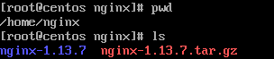

安装nginx：

```shell
//进入nginx目录
cd /home/nginx/nginx-1.13.7
//执行命令
./configure
//执行make命令
make
//执行make install命令
make install
```

启动nginx：

```shell
/usr/local/nginx/sbin/nginx
```

关闭防火墙：

```shell
systemctl stop firewalld.service
```

访问页面：

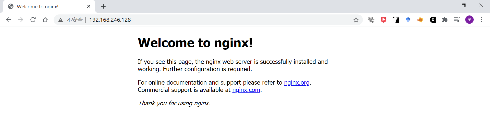


### 2.2 Nginx的命令

要使用nginx的命令，需要进入nginx的安装目录：

```shell
cd /usr/local/nginx/sbin
```

**查看nginx的版本：**

```shell
./nginx -v
```


**启动nginx：**

```shell
./nginx
```

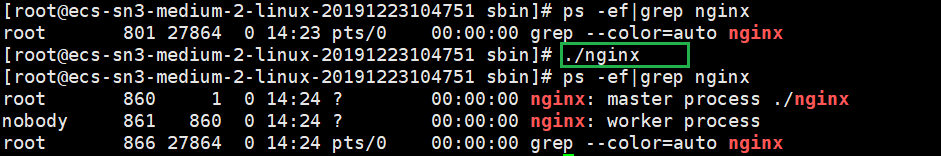

**关闭nginx：**

```shell
./nginx -s stop
```

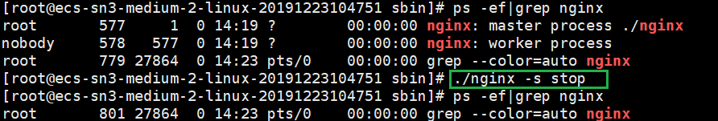

**重启nginx：**

```shell
./nginx -s reload
```

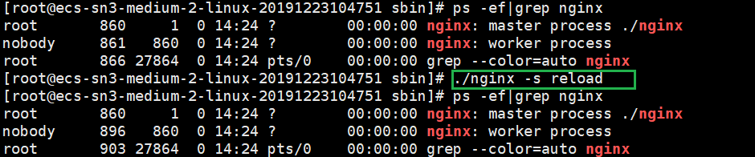


### 2.3 Nginx的配置

当我们启动nginx时，默认使用`/usr/local/nginx/conf/nginx.conf`配置文件。配置文件去掉注释内容后的完整内容如下：

```txt
worker_processes  1;

events {
    worker_connections  1024;
}

http {
    include       mime.types;
    default_type  application/octet-stream;
    sendfile        on;
    server {
        listen       80;
        server_name  localhost;

        location / {
            root   html;
            index  index.html index.htm;
        }

        error_page   500 502 503 504  /50x.html;
        location = /50x.html {
            root   html;
        }
    }
}
```

配置文件主要分为三部分：全局配置块、events块和http块。

- **全局配置块**

  从配置文件开始到 events 块之间的内容，主要会设置一些影响nginx 服务器整体运行的配置指令，主要包括配置运行 Nginx 服务器的用户（组）、允许生成的 worker process 数，进程 PID 存放路径、日志存放路径和类型以及配置文件的引入等。

  比如上面第一行配置的：

  ```txt
  worker_processes  1;
  ```

  这是 Nginx 服务器并发处理服务的关键配置，worker_processes 值越大，可以支持的并发处理量也越多，但是会受到硬件、软件等设备的制约，这个后面会详细介绍。

- **events块**

  events 块涉及的指令主要影响 Nginx 服务器与用户的网络连接，常用的设置包括是否开启对多 work process 下的网络连接进行序列化，是否允许同时接收多个网络连接，选取哪种事件驱动模型来处理连接请求，每个 word process 可以同时支持的最大连接数等。

  比如默认的events块：

  ```txt
  events {
      worker_connections  1024;
  }
  ```

  表示每个 work process 支持的最大连接数为 1024。

- **http块**

  这算是 Nginx 服务器配置中最频繁的部分，代理、缓存和日志定义等绝大多数功能和第三方模块的配置都在这里。需要注意的是：http 块也可以包括 **http全局块**、**server 块**。

  - http全局块

    http全局块配置的指令包括文件引入、MIME-TYPE 定义、日志自定义、连接超时时间、单链接请求数上限等。

  - server块

    每个 http 块可以包括多个 server 块，而每个 server 块就相当于一个虚拟主机。而每个 server 块也分为全局 server 块，以及可以同时包含多个 location 块。

    - 全局server块：最常见的配置是本虚拟机主机的监听配置和本虚拟主机的名称或IP配置。
    - 一个 server 块可以配置多个 location 块。location块的主要作用是基于 Nginx 服务器接收到的请求字符串（例如 server_name/uri-string），对虚拟主机名称（也可以是IP别名）之外的字符串（例如 前面的 /uri-string）进行匹配，对特定的请求进行处理。地址定向、数据缓存和应答控制等功能，还有许多第三方模块的配置也在这里进行。


## 3. Nginx配置实例——反向代理

### 3.1 实例一

该实例要实现的功能是访问服务器nginx的端口80时，nginx将请求转发到本服务器端口8080，返回tomcat页面。

首先在服务器上安装tomcat，端口号为8080，访问页面如下：

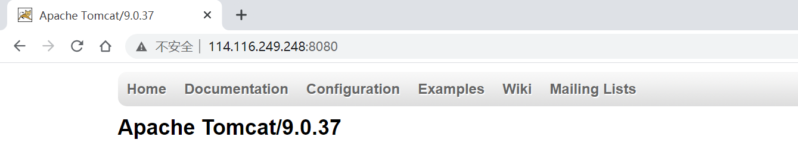

然后修改`/usr/local/nginx/conf/nginx.conf`的配置文件中的http块：

```txt
http {
    server {
        listen       80;
        server_name  114.116.249.248;    // 修改为服务器ip地址

        location / {
            root   html;
            proxy_pass	http://114.116.249.248:8080;  // 添加转发地址，注意分号！
            index  index.html index.htm;
        }

        error_page   500 502 503 504  /50x.html;
        location = /50x.html {
            root   html;
        }
    }
}
```

重启nginx后，在浏览器通过服务器端口80访问，得到tomcat页面：

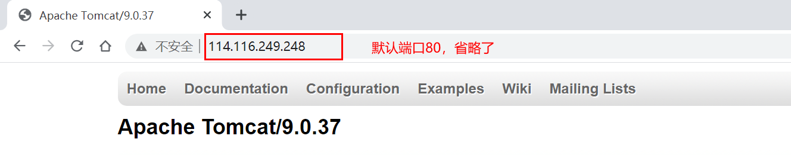


### 3.2 实例二

反向代理实例二，在服务器启动两个tomcat，端口分别为8080和8081。nginx监听端口9001。

- 当浏览器访问`http://114.116.249.248:9001/abc/a.html`的时候，跳转到`http://114.116.249.248:8080/abc/a.html`；
- 当浏览器访问`http://114.116.249.248:9001/def/a.html`的时候，跳转到`http://114.116.249.248:8081/def/a.html`；

首先启动两个tomcat，结果如下：

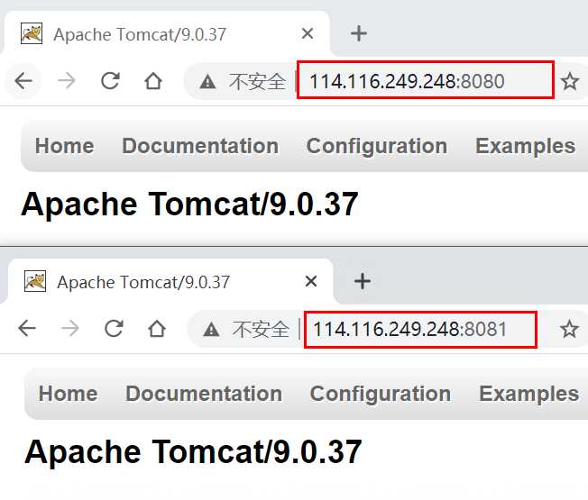

然后在tomcat(8080)目录下的`webapps`下添加目录文件`adc/a.html`，在tomcat(8081)目录下的webapps下添加目录文件`def/a.html`：

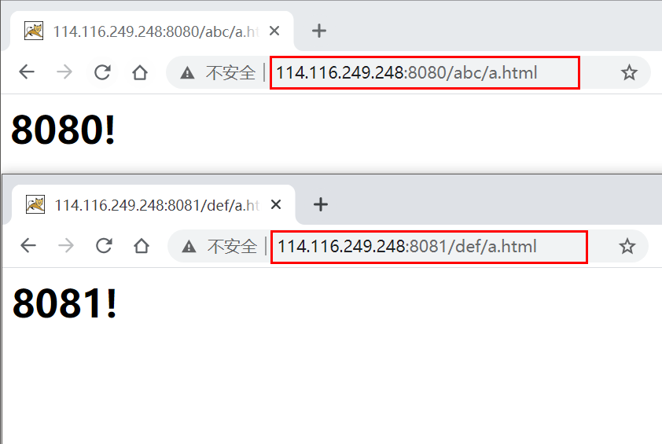

然后配置nginx，在http块中添加server块：

```txt
server {
	listen       9001;
	server_name  114.116.249.248;

	location ~ /abc/ {
		proxy_pass http://127.0.0.1:8080;
	}

	location ~ /def/ {
		proxy_pass http://127.0.0.1:8081;
	}
}
```

重启nginx后，浏览器访问结果：

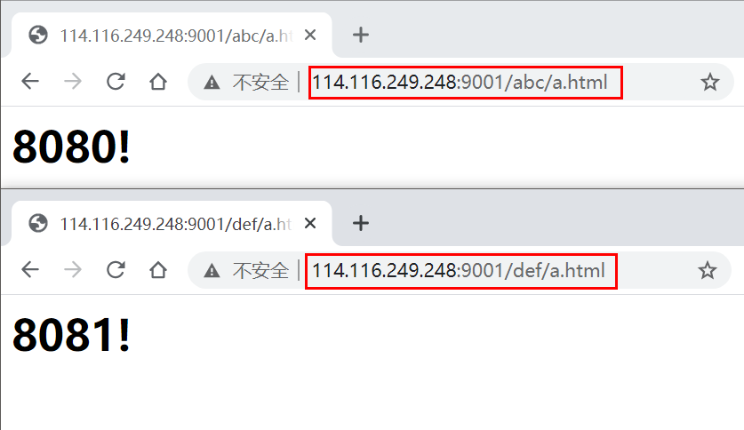


### 3.3 路径匹配规则

本小节主要介绍nginx中的路径匹配规则。


## 4. Nginx配置实例——负载均衡

### 4.1 实例

本实例要实现的功能是：浏览器访问`http://114.116.249.248/abc/a.html`，nginx将请求分配到`http://114.116.249.248:8080/abc/a.html`和`http://114.116.249.248:8081/abc/a.html`，实现负载均衡。

首先启动两个tomcat，端口分别为8080和8081，并且在两个tomcat的webapps目录下新建目录abc，然后在abc目录下创建文件a.html。访问结果如下：

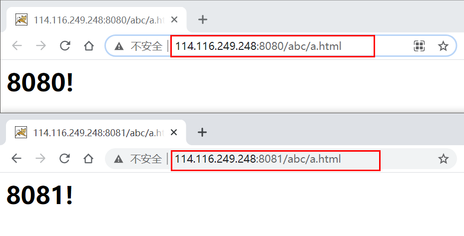

配置nginx，实现负载均衡：

```txt
# 首先在http的全局块中添加upstream
upstream server_pool{  					# server_pool是可以修改的名字
	server 114.116.249.248:8080;        # 格式为: server ip:port;
	server 114.116.249.248:8081;
}
# 然后在location块中添加proxy_pass
location / {
	proxy_pass http://server_pool;      # 引用server_pool块 
}
```

重启nginx后，访问效果如下：

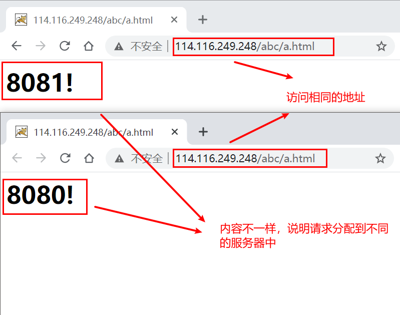


### 4.2 分配策略

nginx有几种分配策略：

**策略一 轮询（默认）**

每个请求按时间顺序逐一分配到不同的后端服务器，如果后端服务器down掉，能自动剔除。

```txt
upstream server_pool {
    server 192.168.0.14;
    server 192.168.0.15;
}
```

**策略二 weight**

指定轮询几率，weight和访问比率成正比，用于后端服务器性能不均的情况。

```txt
upstream server_pool {
    server 192.168.0.14 weight=3;
    server 192.168.0.15 weight=7;
}
```

权重越高，在被访问的概率越大，如上例，分别是30%，70%。

**策略三 ip_hash**

上述方式存在一个问题就是说，在负载均衡系统中，假如用户在某台服务器上登录了，那么该用户第二次请求的时候，因为我们是负载均衡系统，每次请求都会重新定位到服务器集群中的某一个，那么**已经登录某一个服务器的用户再重新定位到另一个服务器，其登录信息将会丢失，这样显然是不妥的**。我们可以采用**ip_hash**指令解决这个问题，如果客户已经访问了某个服务器，当用户再次访问时，会将该请求通过**哈希算法，自动定位到该服务器**。
每个请求按访问ip的hash结果分配，这样**每个访客固定访问一个后端服务器**，可以解决**session的问题**。

```txt
upstream server_pool {
    ip_hash;
    server 192.168.0.14:88;
    server 192.168.0.15:80;
}
```

**策略四 fair**

按后端服务器的响应时间来分配请求，响应时间短的优先分配。

```txt
upstream server_pool {
    server server1;
    server server2;
    fair;
}
```


## 5. Nginx配置实例——动静分离

首先在服务器的根目录下创建目录`data`，然后再在`data`目录下分别创建两个子目录`html`和`image`，并在其中放入相关资源文件：

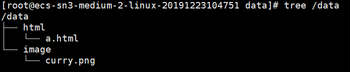

配置nginx，在server块中添加location块：

```txt
http{
	server {
		listen 80;
		server_name  114.116.249.248; 
		
		location /html/ { 
			root	/data/; 
		} 
		location /image/ { 
			root	/data/; 
		}
	}
}
```

重启nginx后，浏览器访问`http://114.116.249.248/html/a.html`和`http://114.116.249.248/image/curry.png`，结果如下：


## 6. Nginx配置实例——高可用


## 7. Nginx原理解析


## 8. 参考资料

[1] B站尚硅谷教学视频：https://www.bilibili.com/video/BV1zJ411w7SV?p=1

[2] 正向代理和反向代理：https://www.cnblogs.com/sddai/p/8460054.html

[3] nginx的安装：https://blog.csdn.net/t8116189520/article/details/81909574

[4] nginx的启动问题解决：https://blog.csdn.net/yangyongming_888/article/details/88037097

[5] nginx负载均衡策略： https://segmentfault.com/a/1190000014483200