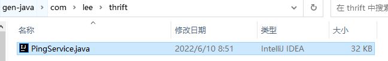
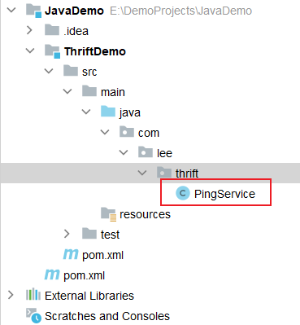
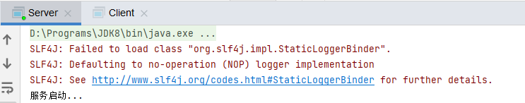
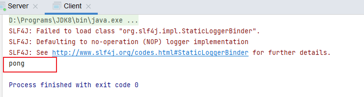
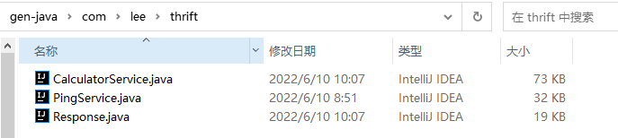
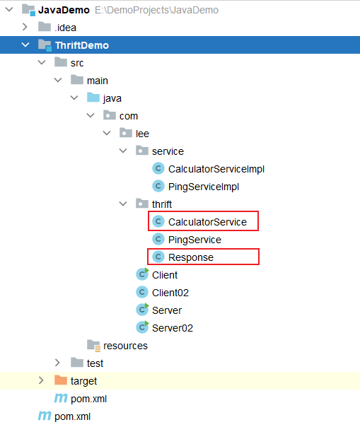
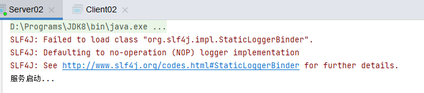
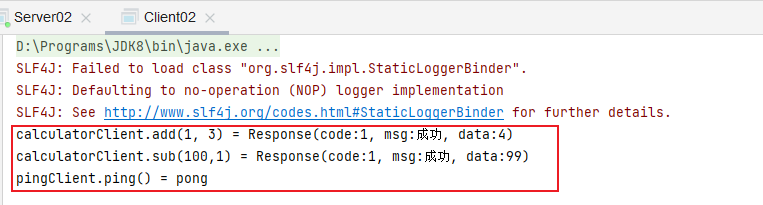

# RPC— —Thrift入门

本文主要介绍RPC框架——Thrift。


## 1. Thrift介绍


## 2. 入门案例

### 2.1 下载Thrift Compiler

进入下载界面：https://thrift.apache.org/download，下载Thrift Compiler ：


### 2.2 编写IDL

下载完成后，在Thrift Compiler 同目录下创建ping.thrift文件，文件内容如下：

```txt
namespace java com.lee.thrift

service PingService{
    string ping()
}
```

然后打开命令行，运行如下命令：

```bash
thrift-0.16.0.exe --gen java ping.thrift
```

这样，Thrift Compiler就会将ping.thrift编译为Java文件，结果如下：




### 2.3 搭建项目

#### 2.3.1 搭建服务端

首先创建一个Maven项目，然后引入Thrift依赖：

```xml
<!-- https://mvnrepository.com/artifact/org.apache.thrift/libthrift -->
<dependency>
    <groupId>org.apache.thrift</groupId>
    <artifactId>libthrift</artifactId>
    <version>0.16.0</version>
</dependency>
```

然后将上一步生产的PingService.java文件复制到我们的项目中：



接下来开始编写服务实现类PingServiceImpl：

```java
package com.lee.service;

import com.lee.thrift.PingService;
import org.apache.thrift.TException;

public class PingServiceImpl implements PingService.Iface {

    @Override
    public String ping() throws TException {
        return "pong";
    }
    
}
```

编写启动服务的代码：

```java
package com.lee;

import com.lee.service.PingServiceImpl;
import com.lee.thrift.PingService;
import org.apache.thrift.TProcessor;
import org.apache.thrift.protocol.TBinaryProtocol;
import org.apache.thrift.server.TServer;
import org.apache.thrift.server.TSimpleServer;
import org.apache.thrift.transport.*;

public class Server {
    public static void main(String[] args) {
        try {
            // 1. 创建transport层
            TServerTransport transport = new TServerSocket(8080);
            // 2. 创建protocol层
            TBinaryProtocol.Factory protocolFactory = new TBinaryProtocol.Factory();
            // 3. 创建processor层
            TProcessor processor = new PingService.Processor(new PingServiceImpl());
            // 4. 为服务配置参数
            TServer.Args serverArgs = new TServer.Args(transport);
            serverArgs.protocolFactory(protocolFactory);
            serverArgs.processor(processor);
            // 5. 创建服务并启动
            TServer server = new TSimpleServer(serverArgs);
            System.out.println("服务启动...");
            server.serve();

        } catch (TTransportException e) {
            e.printStackTrace();
        }
    }
}

```


#### 2.3.2 搭建客户端

当服务端代码编写完成后，我们开始编写客户端代码：

```java
package com.lee;

import com.lee.thrift.PingService;
import org.apache.thrift.TException;
import org.apache.thrift.protocol.*;
import org.apache.thrift.transport.TSocket;
import org.apache.thrift.transport.TTransport;
import org.apache.thrift.transport.TTransportException;

public class Client {
    public static void main(String[] args) {
        try {
            // 1. 创建transport层并建立连接
            TTransport transport = new TSocket("127.0.0.1",8080);
            transport.open();
            // 2. 创建protocol层
            TProtocol protocol = new TBinaryProtocol(transport);
            // 3. 创建client并调用接口
            PingService.Client client = new PingService.Client(protocol);
            String result = client.ping();
            System.out.println(result);
            // 4. 关闭Socket连接
            transport.close();
        } catch (TTransportException e) {
            e.printStackTrace();
        } catch (TException e) {
            e.printStackTrace();
        }
    }
}

```


### 2.4 运行测试

首先运行服务端Server代码：



然后运行客户端Client代码：



调用服务成功！


## 3. 进阶案例

入门案例我们只是简单使用了一下Thrift，接下来讲解一个进阶案例，看看Thrift更复杂的用法。

在入门案例中，我们只有一个服务PingService，但实际开发中，我们会有多个服务，这要怎么实现呢？

### 3.1 新增IDL

首先在ping.thrift同目录下再创建一个IDL文件Calculator.thrift：

```txt
namespace java com.lee.thrift

struct Response{
    1: string code,
    2: string msg,
    3: i64 data
}

service CalculatorService{
    Response add(1: i64 num1, 2: i64 num2),

    Response sub(1: i64 num1, 2: i64 num2)
}
```

然后运行如下命令，编译为Java文件：

```bash
thrift-0.16.0.exe --gen java Calculator.thrift
```

结果如下：




### 3.2 实现Calculator服务

首先将新生成的Java文件复制到项目中：


然后实现Calculator服务（此处为演示Thrift用法，具体实现不做过多考虑）：

```java
package com.lee.service;

import com.lee.thrift.CalculatorService;
import com.lee.thrift.Response;
import org.apache.thrift.TException;

public class CalculatorServiceImpl implements CalculatorService.Iface {
    @Override
    public Response add(long num1, long num2) throws TException {
        Response response = new Response();
        response.code = "1";
        response.msg = "成功";
        response.data = num1 + num2;
        return response;
    }

    @Override
    public Response sub(long num1, long num2) throws TException {
        Response response = new Response();
        response.code = "1";
        response.msg = "成功";
        response.data = num1 - num2;
        return response;
    }
}

```


### 3.3 搭建项目

#### 3.3.1 搭建服务端

```java
package com.lee;

import com.lee.service.CalculatorServiceImpl;
import com.lee.service.PingServiceImpl;
import com.lee.thrift.CalculatorService;
import com.lee.thrift.PingService;
import org.apache.thrift.TMultiplexedProcessor;
import org.apache.thrift.protocol.TCompactProtocol;
import org.apache.thrift.protocol.TProtocolFactory;
import org.apache.thrift.server.TServer;
import org.apache.thrift.server.TThreadPoolServer;
import org.apache.thrift.transport.TServerSocket;
import org.apache.thrift.transport.TServerTransport;
import org.apache.thrift.transport.TTransportException;

import java.util.concurrent.TimeUnit;

public class Server02 {
    public static void main(String[] args) {
        try {
            // 1. 创建transport层
            TServerTransport transport = new TServerSocket(8080);
            // 2. 创建protocol层
            TProtocolFactory protocolFactory = new TCompactProtocol.Factory();
            // 3. 注册服务
            TMultiplexedProcessor processor = new TMultiplexedProcessor();
            processor.registerProcessor("PingService",new PingService.Processor(new PingServiceImpl()));
            processor.registerProcessor("CalculatorService",new CalculatorService.Processor(new CalculatorServiceImpl()));
            // 4. 创建服务器参数，此处使用多线程阻塞IO的方式处理客户端连接
            TThreadPoolServer.Args serverArgs = new TThreadPoolServer.Args(transport);
            serverArgs.maxWorkerThreads = 800;
            serverArgs.minWorkerThreads = 100;
            serverArgs.stopTimeoutVal = 80;
            serverArgs.stopTimeoutUnit = TimeUnit.SECONDS;
            serverArgs.processor(processor);
            serverArgs.protocolFactory(protocolFactory);
            // 5. 创建服务器并启动服务
            TServer server = new TThreadPoolServer(serverArgs);
            System.out.println("服务启动...");
            server.serve();

        } catch (TTransportException e) {
            e.printStackTrace();
        }
    }
}

```


#### 3.3.2 搭建客户端

```java
package com.lee;

import com.lee.thrift.CalculatorService;
import com.lee.thrift.PingService;
import com.lee.thrift.Response;
import org.apache.thrift.TException;
import org.apache.thrift.protocol.TCompactProtocol;
import org.apache.thrift.protocol.TMultiplexedProtocol;
import org.apache.thrift.protocol.TProtocol;
import org.apache.thrift.transport.TSocket;
import org.apache.thrift.transport.TTransport;
import org.apache.thrift.transport.TTransportException;

public class Client02 {
    public static void main(String[] args) {
        try {
            // 1. 创建transport层并建立连接
            TTransport transport = new TSocket("127.0.0.1", 8080);
            transport.open();
            // 2. 创建protocal
            TProtocol protocol = new TCompactProtocol(transport);
            TMultiplexedProtocol calculatorProtocol = new TMultiplexedProtocol(protocol, "CalculatorService");
            TMultiplexedProtocol pingProtocol = new TMultiplexedProtocol(protocol, "PingService");

            // 3. 创建client并调用接口
            CalculatorService.Client calculatorClient = new CalculatorService.Client(calculatorProtocol);

            Response addResponse = calculatorClient.add(1, 3);
            System.out.println("calculatorClient.add(1, 3) = " + addResponse.toString());
            Response subResponse = calculatorClient.sub(100,1);
            System.out.println("calculatorClient.sub(100,1) = " + subResponse.toString());

            PingService.Client pingClient = new PingService.Client(pingProtocol);
            String pong = pingClient.ping();
            System.out.println("pingClient.ping() = " + pong);

            // 4. 关闭Socket连接
            transport.close();
        } catch (TTransportException e) {
            e.printStackTrace();
        } catch (TException e) {
            e.printStackTrace();
        }
    }
}

```


### 3.4 运行测试

首先运行服务端Server02：



然后运行客户端Client02：



测试成功！


## 4. Thrift IDL介绍


## 5. Thrift体系介绍


## 6. 源码分析


## 7. Armeria的使用


## 参考资料

[1] Thrift官网：https://thrift.apache.org/

[2] Thrift IDL 介绍：https://juejin.cn/post/6844903971086139400

[3] 单端口多服务：https://www.cnblogs.com/luckygxf/p/9393618.html

[4] armeria ：https://armeria.dev/tutorials/