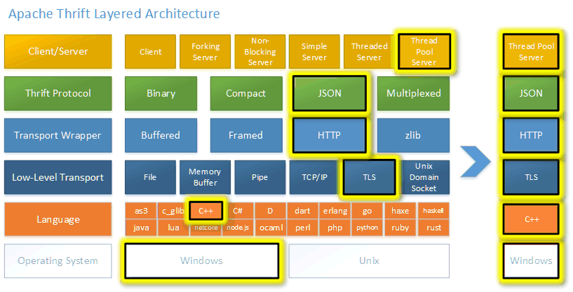

# RPC— —Thrift入门

本文主要介绍RPC框架——Thrift。


## 1. Thrift介绍

Thrift是Facebook于2007年开发的跨语言的rpc框架，提供多语言的编译功能，并提供多种服务器工作模式；用户通过Thrift的IDL（接口定义语言）来描述接口函数及数据类型，然后通过Thrift的编译器生成各种语言类型的接口文件，用户可以根据自己的需要采用不同的语言开发客户端代码和服务器端代码。


## 2. 入门案例

### 2.1 下载Thrift Compiler

进入下载界面：https://thrift.apache.org/download，下载Thrift Compiler ：


### 2.2 编写IDL

下载完成后，在Thrift Compiler 同目录下创建ping.thrift文件，文件内容如下：

```txt
namespace java com.lee.thrift

service PingService{
    string ping()
}
```

然后打开命令行，运行如下命令：

```bash
thrift-0.16.0.exe --gen java ping.thrift
```

这样，Thrift Compiler就会将ping.thrift编译为Java文件，结果如下：


### 2.3 搭建项目

#### 2.3.1 搭建服务端

首先创建一个Maven项目，然后引入Thrift依赖：

```xml
<!-- https://mvnrepository.com/artifact/org.apache.thrift/libthrift -->
<dependency>
    <groupId>org.apache.thrift</groupId>
    <artifactId>libthrift</artifactId>
    <version>0.16.0</version>
</dependency>
```

然后将上一步生产的PingService.java文件复制到我们的项目中：


接下来开始编写服务实现类PingServiceImpl：

```java
package com.lee.service;

import com.lee.thrift.PingService;
import org.apache.thrift.TException;

public class PingServiceImpl implements PingService.Iface {

    @Override
    public String ping() throws TException {
        return "pong";
    }
    
}
```

编写启动服务的代码：

```java
package com.lee;

import com.lee.service.PingServiceImpl;
import com.lee.thrift.PingService;
import org.apache.thrift.TProcessor;
import org.apache.thrift.protocol.TBinaryProtocol;
import org.apache.thrift.server.TServer;
import org.apache.thrift.server.TSimpleServer;
import org.apache.thrift.transport.*;

public class Server {
    public static void main(String[] args) {
        try {
            // 1. 创建transport层
            TServerTransport transport = new TServerSocket(8080);
            // 2. 创建protocol层
            TBinaryProtocol.Factory protocolFactory = new TBinaryProtocol.Factory();
            // 3. 创建processor层
            TProcessor processor = new PingService.Processor(new PingServiceImpl());
            // 4. 为服务配置参数
            TServer.Args serverArgs = new TServer.Args(transport);
            serverArgs.protocolFactory(protocolFactory);
            serverArgs.processor(processor);
            // 5. 创建服务并启动
            TServer server = new TSimpleServer(serverArgs);
            System.out.println("服务启动...");
            server.serve();

        } catch (TTransportException e) {
            e.printStackTrace();
        }
    }
}

```


#### 2.3.2 搭建客户端

当服务端代码编写完成后，我们开始编写客户端代码：

```java
package com.lee;

import com.lee.thrift.PingService;
import org.apache.thrift.TException;
import org.apache.thrift.protocol.*;
import org.apache.thrift.transport.TSocket;
import org.apache.thrift.transport.TTransport;
import org.apache.thrift.transport.TTransportException;

public class Client {
    public static void main(String[] args) {
        try {
            // 1. 创建transport层并建立连接
            TTransport transport = new TSocket("127.0.0.1",8080);
            transport.open();
            // 2. 创建protocol层
            TProtocol protocol = new TBinaryProtocol(transport);
            // 3. 创建client并调用接口
            PingService.Client client = new PingService.Client(protocol);
            String result = client.ping();
            System.out.println(result);
            // 4. 关闭Socket连接
            transport.close();
        } catch (TTransportException e) {
            e.printStackTrace();
        } catch (TException e) {
            e.printStackTrace();
        }
    }
}

```


### 2.4 运行测试

首先运行服务端Server代码：


然后运行客户端Client代码：


调用服务成功！


## 3. 进阶案例

入门案例我们只是简单使用了一下Thrift，接下来讲解一个进阶案例，看看Thrift更复杂的用法。

在入门案例中，我们只有一个服务PingService，但实际开发中，我们会有多个服务，这要怎么实现呢？

### 3.1 新增IDL

首先在ping.thrift同目录下再创建一个IDL文件Calculator.thrift：

```txt
namespace java com.lee.thrift

struct Response{
    1: string code,
    2: string msg,
    3: i64 data
}

service CalculatorService{
    Response add(1: i64 num1, 2: i64 num2),

    Response sub(1: i64 num1, 2: i64 num2)
}
```

然后运行如下命令，编译为Java文件：

```bash
thrift-0.16.0.exe --gen java Calculator.thrift
```

结果如下：


### 3.2 实现Calculator服务

首先将新生成的Java文件复制到项目中：


然后实现Calculator服务（此处为演示Thrift用法，具体实现不做过多考虑）：

```java
package com.lee.service;

import com.lee.thrift.CalculatorService;
import com.lee.thrift.Response;
import org.apache.thrift.TException;

public class CalculatorServiceImpl implements CalculatorService.Iface {
    @Override
    public Response add(long num1, long num2) throws TException {
        Response response = new Response();
        response.code = "1";
        response.msg = "成功";
        response.data = num1 + num2;
        return response;
    }

    @Override
    public Response sub(long num1, long num2) throws TException {
        Response response = new Response();
        response.code = "1";
        response.msg = "成功";
        response.data = num1 - num2;
        return response;
    }
}

```


### 3.3 搭建项目

#### 3.3.1 搭建服务端

```java
package com.lee;

import com.lee.service.CalculatorServiceImpl;
import com.lee.service.PingServiceImpl;
import com.lee.thrift.CalculatorService;
import com.lee.thrift.PingService;
import org.apache.thrift.TMultiplexedProcessor;
import org.apache.thrift.protocol.TCompactProtocol;
import org.apache.thrift.protocol.TProtocolFactory;
import org.apache.thrift.server.TServer;
import org.apache.thrift.server.TThreadPoolServer;
import org.apache.thrift.transport.TServerSocket;
import org.apache.thrift.transport.TServerTransport;
import org.apache.thrift.transport.TTransportException;

import java.util.concurrent.TimeUnit;

public class Server02 {
    public static void main(String[] args) {
        try {
            // 1. 创建transport层
            TServerTransport transport = new TServerSocket(8080);
            // 2. 创建protocol层
            TProtocolFactory protocolFactory = new TCompactProtocol.Factory();
            // 3. 注册服务
            TMultiplexedProcessor processor = new TMultiplexedProcessor();
            processor.registerProcessor("PingService",new PingService.Processor(new PingServiceImpl()));
            processor.registerProcessor("CalculatorService",new CalculatorService.Processor(new CalculatorServiceImpl()));
            // 4. 创建服务器参数，此处使用多线程阻塞IO的方式处理客户端连接
            TThreadPoolServer.Args serverArgs = new TThreadPoolServer.Args(transport);
            serverArgs.maxWorkerThreads = 800;
            serverArgs.minWorkerThreads = 100;
            serverArgs.stopTimeoutVal = 80;
            serverArgs.stopTimeoutUnit = TimeUnit.SECONDS;
            serverArgs.processor(processor);
            serverArgs.protocolFactory(protocolFactory);
            // 5. 创建服务器并启动服务
            TServer server = new TThreadPoolServer(serverArgs);
            System.out.println("服务启动...");
            server.serve();

        } catch (TTransportException e) {
            e.printStackTrace();
        }
    }
}

```


#### 3.3.2 搭建客户端

```java
package com.lee;

import com.lee.thrift.CalculatorService;
import com.lee.thrift.PingService;
import com.lee.thrift.Response;
import org.apache.thrift.TException;
import org.apache.thrift.protocol.TCompactProtocol;
import org.apache.thrift.protocol.TMultiplexedProtocol;
import org.apache.thrift.protocol.TProtocol;
import org.apache.thrift.transport.TSocket;
import org.apache.thrift.transport.TTransport;
import org.apache.thrift.transport.TTransportException;

public class Client02 {
    public static void main(String[] args) {
        try {
            // 1. 创建transport层并建立连接
            TTransport transport = new TSocket("127.0.0.1", 8080);
            transport.open();
            // 2. 创建protocal
            TProtocol protocol = new TCompactProtocol(transport);
            TMultiplexedProtocol calculatorProtocol = new TMultiplexedProtocol(protocol, "CalculatorService");
            TMultiplexedProtocol pingProtocol = new TMultiplexedProtocol(protocol, "PingService");

            // 3. 创建client并调用接口
            CalculatorService.Client calculatorClient = new CalculatorService.Client(calculatorProtocol);

            Response addResponse = calculatorClient.add(1, 3);
            System.out.println("calculatorClient.add(1, 3) = " + addResponse.toString());
            Response subResponse = calculatorClient.sub(100,1);
            System.out.println("calculatorClient.sub(100,1) = " + subResponse.toString());

            PingService.Client pingClient = new PingService.Client(pingProtocol);
            String pong = pingClient.ping();
            System.out.println("pingClient.ping() = " + pong);

            // 4. 关闭Socket连接
            transport.close();
        } catch (TTransportException e) {
            e.printStackTrace();
        } catch (TException e) {
            e.printStackTrace();
        }
    }
}

```


### 3.4 运行测试

首先运行服务端Server02：


然后运行客户端Client02：


测试成功！


## 4. Thrift IDL介绍

本节介绍Thrift中IDL(interface definition language ，接口定义语言)的语法规则。

\*.thrift文件采取IDL语法规则，\*.thrift文件可以被Thrift Compiler编译为多种目标语言。一个thrift文件就是一个文档，包含多个头部（Header）和定义（Definition）。

### 4.1 Header

一个Header可以是Include、CppInclude或Namespace。

Include就是将其他thrift文件中的内容引入当前thrift文件，语法为：

```txt
include '另一个thrift文件路径'
```

CppInclude主要是用来为当前的 thrift 文件生成的代码中添加一个自定义的 C++ 引入声明，语法为：

```txt
cpp_include '自定义的C++引入声明'
```

Namespace用来为各个目标语言指定namespace(例如C#)/package(例如Java)/module等。语法为：

```txt
namespace 目标语言 包路径
```

目标语言包括：'*' | 'c_glib' | 'cpp' | 'delphi' | 'haxe' | 'go' | 'java' | 'js' | 'lua' | 'netstd' | 'perl' | 'php' | 'py' | 'py.twisted' | 'rb' | 'st' | 'xsd'，其中`*`代表所有目标语言。

例如：

```txt
namespace java com.lee.thrift
namespace netstd com.lee.thrift  // .net 平台
```


### 4.2 Definition

在详细讲解Definition之前，我们先了解一下thrift中的数据类型。

#### 4.2.1 数据类型

thrift中的数据类型分为基础数据类型和容器数据类型。

部分基础数据类型如下：

- bool：布尔值
- byte：8位有符号整数
- i8：8位有符号整数
- i16：16位有符号整数
- i32：32位有符号整数
- i64：64位有符号整数
- double：64位浮点数
- string：UTF-8编码的字符串
- binary：未编码的字节流

容器数据类型如下：

- `list<T>`：列表，T为泛型
- `set<T>`：集合，T为泛型
- `map<K, V>`：K-V键值对，K,V为泛型。注意，K的类型有所限制，在有的情况下，只能为基础数据类型


#### 4.2.2 Definition详解

一个Definition可以是Const 、 Typedef 、 Enum 、 Struct 、 Union 、 Exception 或 Service。

**Const** 表示定义一个常量，语法如下：

```txt
const 数据类型 标识符 = 常量值;
```

例如：

```
const i32 num = 100;
const list<string> names = ["zs","ls"];
const map<string, string> = { 'name': 'johnson', 'age': '20' }
```

Typedef 用于给数据类型取别名，语法如下：

```txt
typedef 数据类型名 新的数据类型名(标识符)
```

例如：

```txt
typedef i32 int32;
// 之后，我们可以使用int32定义数据
const int32 num = 100;  // 等价于 const i32 num = 100;
```

**Enum** 用于定义枚举类型，语法如下：

```txt
enum 标识符{
	元素1[=常量整数值],
	元素2[=常量整数值],
	元素3[=常量整数值]
}
```

例如：

```txt
enum season{
	Spring = 1,
	Summer = 2,
	Autumn = 3,
	Winter = 4
}
```

**Struct** 用于定义结构体（类），语法如下：

```txt
struct 标识符{
	字段1，
	字段2，
	...
}

其中字段的语法规则如下：
[FieldID] [FieldReq] FieldType Identifier [= ConstValue],
FieldID 是整型常量加 : 组成，可选的
FieldReq 用来标识该字段是必填还是选填，分别是 required, optional 这两个关键字，都不指定，就是默认情况，默认情况可以理解为是 required 和 optional 的混合版，理论上，字段通常是会被序列化的，除非该字段是 thrift 无法传输的内容，那么这个字段就会被忽略掉。可选的。
FieldType 字段类型，必填
Identifier 标识符，必填
ConstValue 常量值，可选的
```

例如：

```txt
struct BaseExample {
  1: required string name,  // 标识为必填
  2: i8 sex = 1,            // 指定默认值
}

struct Example {
  1: i8 age,
  255: BaseExample base,    // 嵌套使用 BaseExample
}
```

**Union** 略

**Exception** 用于定义异常，语法如下：

```txt
exception 标识符{
	字段
	...
}
```

例如：

```txt
exception Error {
  1: required i8 Code,
  2: string Msg,
}
```

**Service** 用于定义服务接口，核心内容，语法如下：

```txt
service 标识符 [extends 父标识符]{
	接口1，
	接口2，
	...
}

接口定义语法规则如下：
[oneway] FunctionType Identifier ([参数列表]) [Throws 异常]
oneway 是一个关键字，从字面上，我们就可以了解到，他是单向的，怎么理解呢？非 oneway 修饰的 function 是应答式，即 req-resp, 客户端发请求，服务端返回响应，被 oneway 修饰后的函数，则意味着，客户端只是会发起，无须关注返回，服务端也不会响应，与 void 的区别是 void 类型的方法还可以返回异常。
```

例如：

```txt
service ExampleService {
  string ping(),
  oneway void GetName(1: string UserId),
  void GetAge(1: string UserId) throws (1: Error err),
}
```

注意：service是可以继承的。


### 4.3 其他

在thrift文件中我么也可以添加注释，就像C语言中一样：

- 单行注释：使用`//`表示单行注释
- 多行注释：使用`/*  ...  */`表示多行注释

在 IDL 中分隔符可以是 `,` 或者 `;` 而且大部分情况下可以忽略不写

在 IDL 中，字面量就是使用单引号 `'` 或双引号 `"` 括起来的字符串

合法的标识符满足以下条件：

1. 标识符只能由字母，数字，_（under score）, .（dot）组成
2. 只能以字母，_ 开头

字母只能是字母表中的大写 'A' - 'Z' 以及小写 'a' - 'z'

数字只能是 0 - 9


## 5. Thrift体系介绍

Thrift 层次体系结构如下：



<center>图源：GitHub Thrift[2]</center>

简化版的Thrift层次体系结构如下：


- Transport层：表示以什么方式传输数据
- Protocol层：表示数据以什么格式传输
- Processor层：表示服务接口及其实现的对应关系
- Server和Client：表示服务端和客户端

注意：服务端和客户端的Transport和Protocol需要一致，否则会报错。


## 参考资料

1. Thrift官网：https://thrift.apache.org/
2. GitHub Thrift：https://github.com/apache/thrift
3. Thrift IDL 介绍：https://juejin.cn/post/6844903971086139400
4. Thrift IDL官方文档：https://thrift.apache.org/docs/idl
5. 单端口多服务案例：https://www.cnblogs.com/luckygxf/p/9393618.html
6. Thrift入门：https://blog.csdn.net/houjixin/article/details/42778335