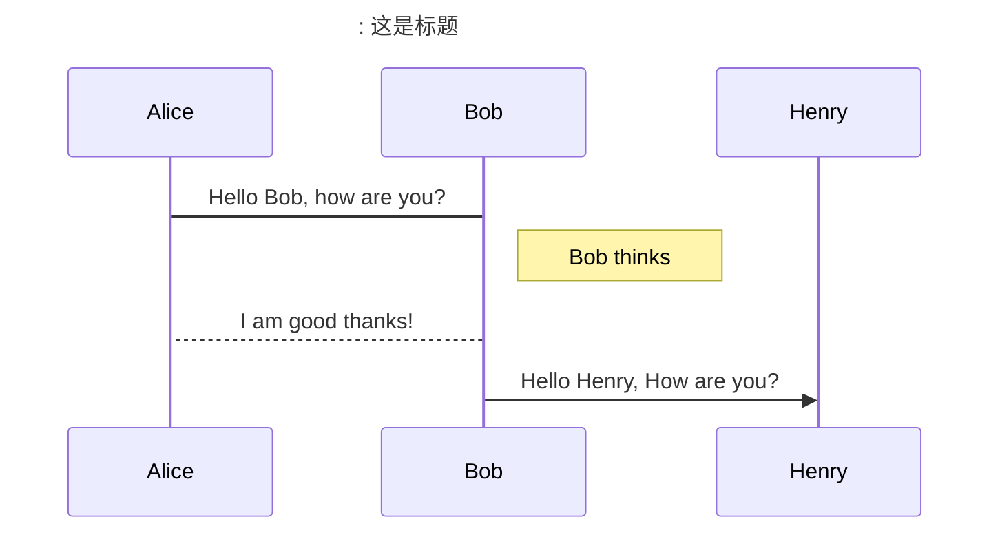
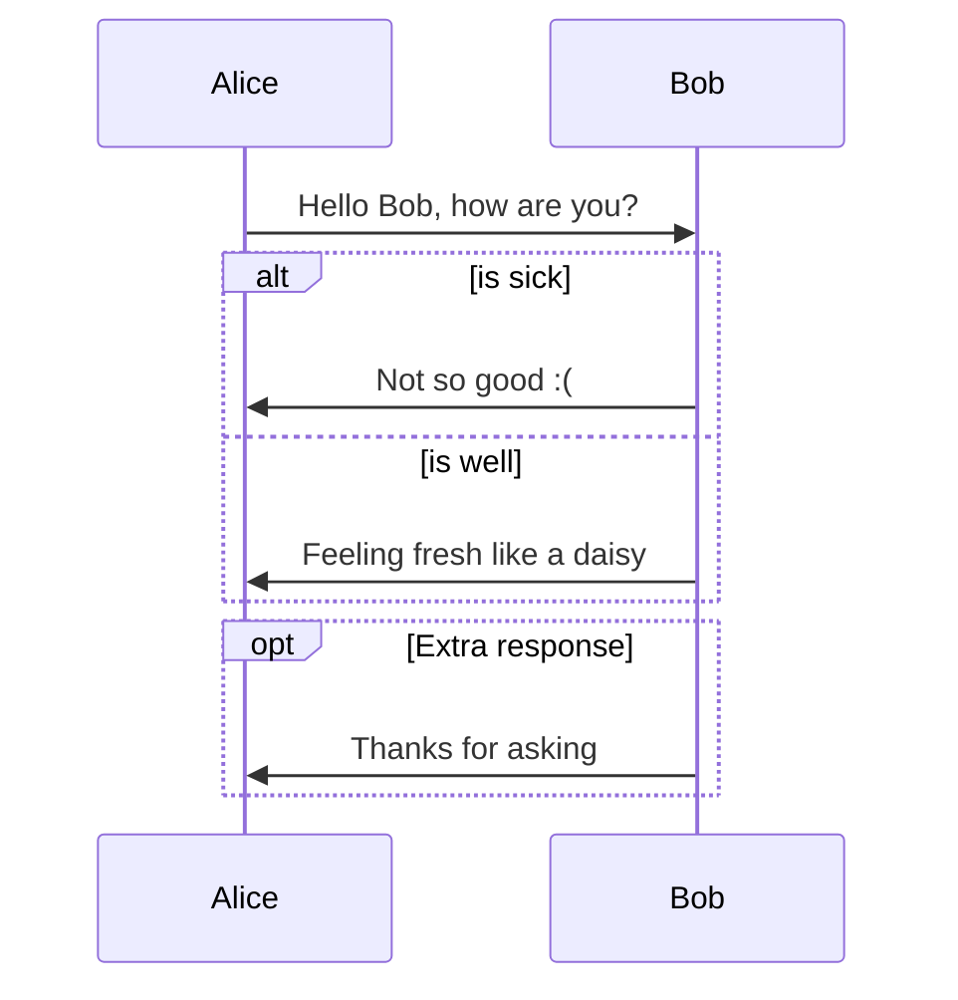
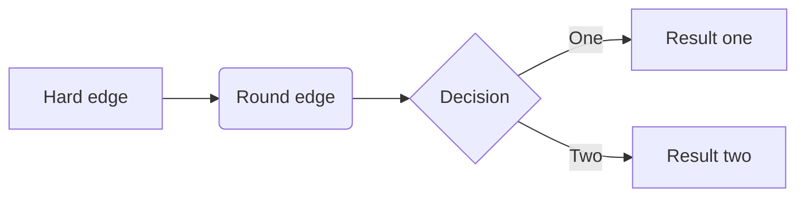
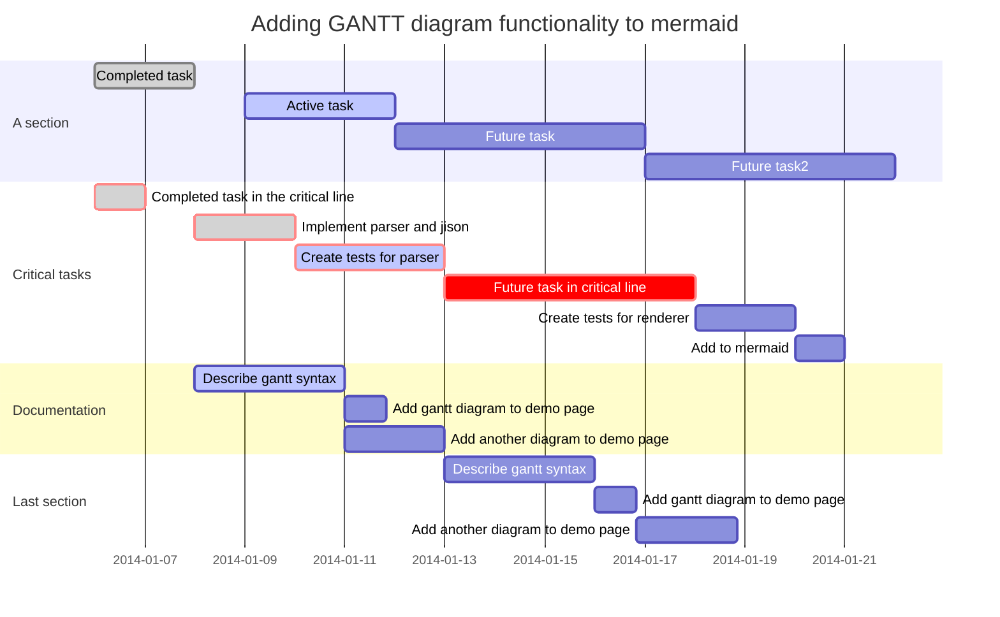
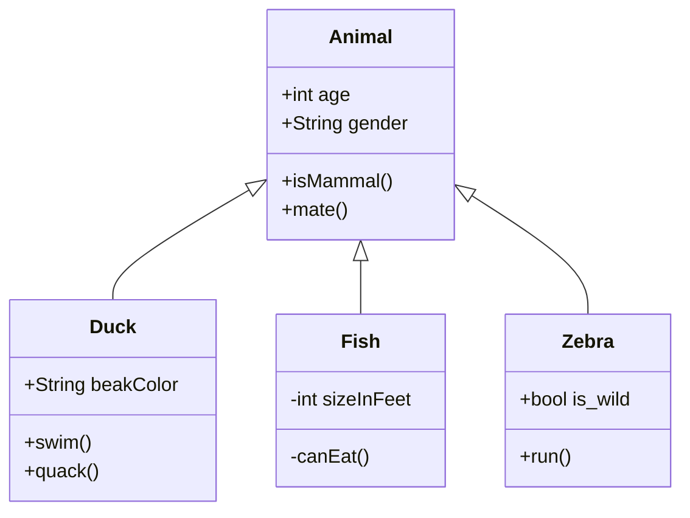
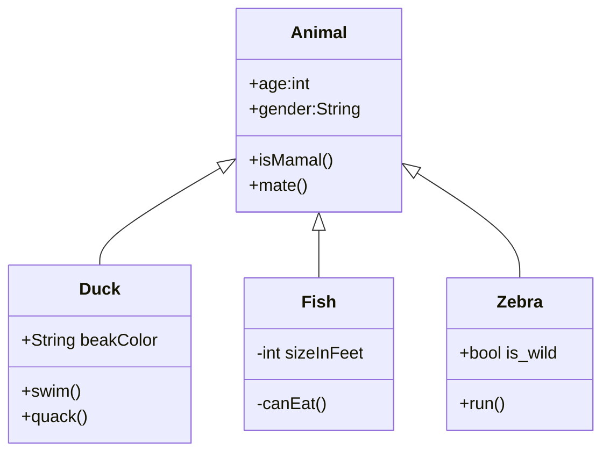
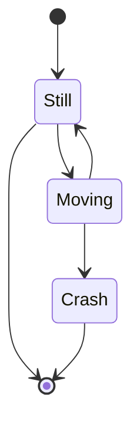
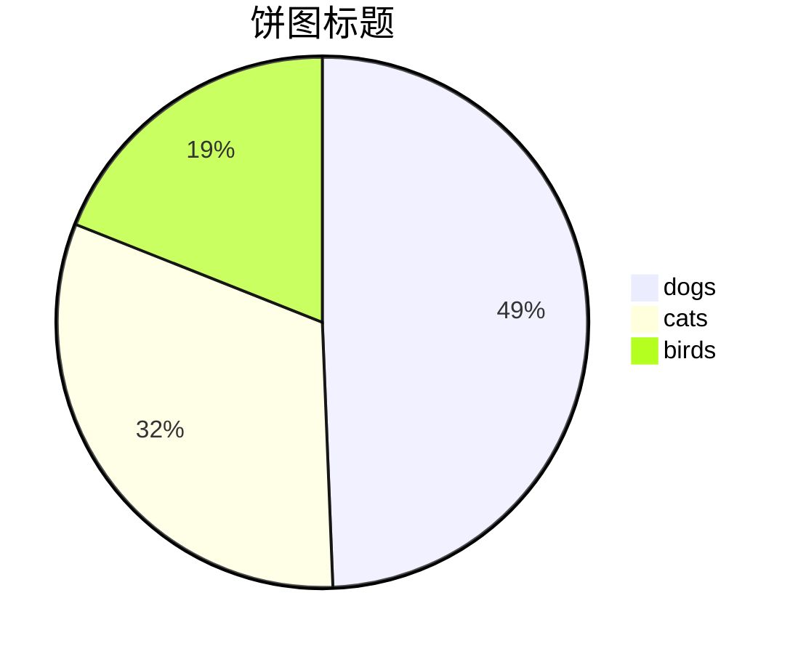

# Typora画图教程

本文主要介绍如何在Typora中画图。本文主要翻译自Typora官网中关于画图的[文章](http://support.typora.io/Draw-Diagrams-With-Markdown/)介绍。


## 一、概述

> Typora supports some Markdown extensions for diagrams, once they are enabled from preference panel.
>
> When exporting as HTML, PDF, epub, docx, those rendered diagrams will also be included, but diagrams features are not supported when exporting markdown into other file formats in current version. Besides, you should also notice that diagrams is not supported by standard Markdown, CommonMark or GFM. Therefore, we still recommend you to insert an image of these diagrams instead of write them in Markdown directly.

译文：

Typora支持一些Markdown图表插件，只需要在偏好设置中开启即可（设置如下）。


当把导出为HTML、PDF、epub、docx时，被渲染好的图表也会被导出，但是在当前版本（原文发表于2016.8.15，我也不知道那时候是什么版本）中，图表特性在导出文件中不被支持。另外，你应该注意图表在标准Markdown、CommonMark或GFM中不被支持。因此，我们仍然建议你将这些图表作为图像插入到文章中，而不是直接用Markdown绘制。


## 二、开始画图

### 2.1 序列图

> This feature uses [js-sequence](https://bramp.github.io/js-sequence-diagrams/), which turns the following code block into a rendered diagram:

这个特性使用了`js-sequence`，它能将以下代码块转换为渲染好的图表：

```txt
```sequence
title : 这是标题
Alice->Bob: Hello Bob, how are you?
Note right of Bob: Bob thinks
Bob-->Alice: I am good thanks!
Bob ->> Henry: Hello Henry, How are you?
​```
```



相信你能看出一些基本元素的语法，了解更多语法规则，请查看以下链接：

[1]https://bramp.github.io/js-sequence-diagrams/

[2]https://github.com/bramp/js-sequence-diagrams/blob/master/src/grammar.jison


### 2.2 流程图

> This feature uses [flowchart.js](http://flowchart.js.org/), which turns the following code block into a rendered diagram:

这个特性使用了`flowchart.js`，它能将下列代码块转换为图表：

````txt
```flow
%% 注释
%% 将起始点start命名为st(随便取),然后起始点内容为Start(冒号后的文本)
%% :>超链接地址,当点击该元素时，会跳转到相应网站
st=>start: Start:>http://www.lee-0o0.com
op1=>operation: Your Operation1
op2=>operation: Your Operation2:>http://www.lee-0o0.com
cond=>condition: Yes or No?
io=>inputoutput: catch something...
e=>end

st->op1->op2->io->cond
cond(yes)->e
cond(no)->op1
```
````


关于更多的案例，请查看以下链接：

[1]http://flowchart.js.org/


### 2.3 Mermaid

> Typora also has integration with [mermaid](https://mermaid-js.github.io/mermaid/#/), which supports sequence diagrams, flowcharts, Gantt charts, class and state diagrams, and pie charts.

Typora同样支持`Mermaid`，它将序列图、流程图、甘特图、类图、状态图和饼图整合在一起。

了解更多语法规则，查看以下链接：

[1]https://mermaid-js.github.io/mermaid/#/


#### 2.3.1 序列图

```txt
```mermaid
sequenceDiagram
    Alice->>Bob: Hello Bob, how are you?
    alt is sick
    Bob->>Alice: Not so good :(
    else is well
    Bob->>Alice: Feeling fresh like a daisy
    end
    opt Extra response
    Bob->>Alice: Thanks for asking
    end
​```
```




#### 2.3.2 流程图

````txt

````


#### 2.3.3 甘特图

````txt

````


#### 2.3.4 类图

````txt

````




#### 2.3.5 状态图

````txt

````


#### 2.3.6 饼图

````txt

````


## 三、参考资料

[1]http://support.typora.io/Draw-Diagrams-With-Markdown/

