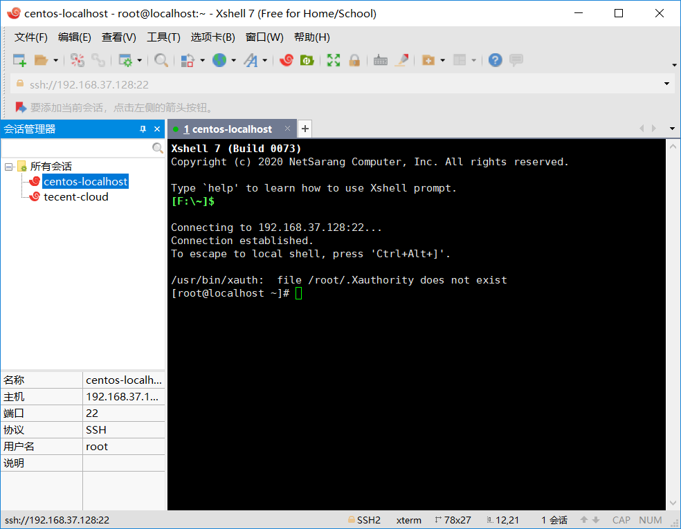

# Linux— —Linux简介
本文简单介绍Linux系统。

## 1. Linux简介
Linux是一个操作系统，Linux内核最初由林纳斯·托瓦兹（Linus Torvalds）编写。

图源：维基百科

## 2. Linux发行版
Linux 的发行版说简单点就是将 Linux 内核与应用软件做一个打包。

图源：菜鸟教程

目前市面上较知名的发行版有：Ubuntu、RedHat、CentOS、Debian、Fedora、SuSE、OpenSUSE、Arch Linux、SolusOS 等。

接下来将使用CentOS 7 来学习Linux系统。

## 3. 如何获取Linux操作系统
### 3.1 在虚拟机中安装Linux操作系统
首先，我们需要准备CentOS镜像文件，下载地址：https://mirrors.bfsu.edu.cn/centos/7.9.2009/isos/x86_64/，选择DVD版本的镜像文件进行下载：

然后，我们需要下载虚拟机VMware Workstation Player（该版本对于个人非商用使用免费，以下简称VMWare），下载地址：https://www.vmware.com/products/workstation-player.html，点击`DOWNLOAD FOR FREE`后按本机环境选择下载：

下载后首先安装VMWare，双击下载的安装程序，改变安装位置，一直点下一步完成安装，安装完成后重启电脑，打开VMWare：

接下来我们就准备创建新虚拟机，如下图，首先点击创建新虚拟机，然后选择下载的CentOS镜像文件：

然后输入用户名和密码：

点击完成创建CentOS虚拟机，等待一段时间后，虚拟机就启动了，输入刚刚的密码进入系统：

竟然还是桌面版的！

### 3.2 云服务器

现在各大厂商都有云服务器，所以我们可以选择购买云服务器进行学习。

阿里云：https://cn.aliyun.com/

腾讯云：https://cloud.tencent.com/

华为云：https://www.huaweicloud.com/

具体的购买教程略过。

## 4. 连接服务器

我们可以直接在虚拟机中操作，但是，我们还是希望通过一个终端软件连接到虚拟机然后操作虚拟机，我们能使用XShell来操作虚拟机，XShell下载地址：https://www.netsarang.com/en/free-for-home-school/，输入用户名和邮件后进行下载。

这里以本地虚拟机为例，首先在终端中输入`ifconfig`获取IP地址（如果是云服务器，就是公网IP地址）：

然后在XShell中新建连接：

输入账号和密码后，连接成功：

之后我们就可以在XShell中操作Linux操作系统了。

## 参考资料

[1] 菜鸟教程：https://www.runoob.com/linux/linux-intro.html