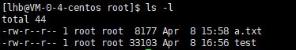

# 文件权限管理

在学习了文件基础知识和用户用户组知识后，可以学习文件权限管理相关知识。


## 1. 前情回顾

通过`ls -l`命令我们可以获取文件的详细情况：



本文重点关注前10个字符：`-rw-r--r--`，其中：

- 第1个字符标识文件类型；
- 第2-4个字符标识文件所有者对文件的权限，称为属主权限；
- 第5-7个字符标识文件所有者同组用户对文件的权限，称为属组权限；
- 第8-10个字符标识其他人对文件的权限，称为其他用户权限；


第 **1、4、7** 位表示读权限，如果用 **r** 字符表示，则有读权限，如果用 **-** 字符表示，则没有读权限；

第 **2、5、8** 位表示写权限，如果用 **w** 字符表示，则有写权限，如果用 **-** 字符表示没有写权限；

第 **3、6、9** 位表示可执行权限，如果用 **x** 字符表示，则有执行权限，如果用 **-** 字符表示，则没有执行权限；

在`ls -l`命令的结果中，第三和第四项分别标识文件的所有者和所属组。对于 root 用户来说，一般情况下，文件的权限对其不起作用。


## 2. 相关命令

### 2.1 chgrp

`chgrp`用于修改文件的所属组，语法如下：

```txt
chgrp [-R] 属组名 文件名
```

- `-R`：递归更改文件属组，就是在更改某个目录文件的属组时，如果加上`-R`的参数，那么该目录下的所有文件的属组都会更改。


### 2.2 chown

`chown`用于修改文件的所有者，也可以同时更改文件属组，语法如下：

```txt
chown [–R] 属主名 文件名
chown [-R] 属主名：属组名 文件名
```


### 2.3 chmod

`chmod`用于修改文件的权限，我们有两种方式来设置文件的权限。

**以数字的方式**

我们可以使用数字来代表各个权限，各权限的分数对照表如下：

- r—4
- w—2
- x—1

每种身份(owner/group/others)各自的三个权限(r/w/x)分数是需要累加的，例如当权限为： **-rwxrwx---** 分数则是：

- owner = rwx = 4+2+1 = 7
- group = rwx = 4+2+1 = 7
- others= --- = 0+0+0 = 0

所以我们设定权限的变更时，该文件的权限数字就是 **770**。变更权限的指令 chmod 的语法是这样的：

```
chmod [-R] xyz 文件或目录
```

选项与参数：

- **xyz** : 就是刚刚提到的数字类型的权限属性，为 **rwx** 属性数值的相加。
- **-R** : 进行递归(recursive)的持续变更，以及连同次目录下的所有文件都会变更。

**以符号的方式**

有一个改变权限的方法，从之前的介绍中我们可以发现，基本上就九个权限分别是：

- user：用户
- group：组
- others：其他

那么我们就可以使用 **u, g, o** 来代表三种身份的权限。

此外， **a** 则代表 **all**，即全部的身份。读写的权限可以写成 **r, w, x**，也就是可以使用下表的方式来看：

| chmod | u<br />g<br />o<br />a | +(加入)<br />-(除去)<br />=(设定) | r<br />w<br />x | 文件或目录 |
| ----- | ---------------------- | --------------------------------- | --------------- | ---------- |

我们可以使用如下语法来设置文件权限：

```txt
chmod 身份=[-\+]权限 文件名
```

例如，如果我们需要将文件权限设置为 **rwxr-xr--** 

```
chmod u=rwx,g=rx,o=r  test1    // 修改 test1 权限
```

而如果是要将权限去掉而不改变其他已存在的权限呢？例如要拿掉全部人的可执行权限，则：

```
chmod  a-x test1
```


## 参考资料

[1] 菜鸟教程：https://www.runoob.com/linux/linux-file-attr-permission.html