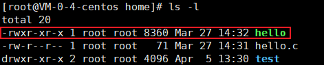

# Linux— —文件系统

本文主要介绍Linux中的文件系统。


## 1. 基础文件命令

首先我们先了解一些基础的文件命令。

### 1.1 pwd

命令`pwd`的作用是显示当前工作路径，是Print Working Directory的缩写。


### 1.2 cd

命令`cd`的作用是切换工作目录，是Change Directory的缩写。

首先先了解一下相对路径和绝对路径：

- 相对路径：相对于当前路径的路径
    - 一个点`.`表示当前目录；两个点`..`表示上一层目录；
- 绝对路径：从根目录开始的路径

我们可以在命令`cd`后跟上相对路径或绝对路径，也有一些特殊符号表示特殊用法：

|   符号    |            说明            |
| :-------: | :------------------------: |
|    `~`    |  代表当前登录用户的主目录  |
| `~用户名` | 表示切换至指定用户的主目录 |
|    `-`    |      代表上次所在目录      |
|   `..`    |       回到上一层目录       |


### 1.3 ls

命令`ls`的作用是显示目录下的所有文件，是list的缩写。`ls`命令的格式如下：

```txt
ls [选项] [目录路径]
```

如果目录路径省略，则表示显示当前目录下的所有文件。

`ls`命令的选项列表如下：

| 选项 |                             说明                             |
| :--: | :----------------------------------------------------------: |
| `-a` | 显示全部的文件，包括隐藏文件（开头为 . 的文件）也一起罗列出来 |
| `-A` | 显示全部的文件，连同隐藏文件，但不包括 `.` 与 `..` 这两个目录 |
| `-l` |                 使用长格式列出文件和目录信息                 |
| `-h` |  以人们易读的方式显示文件或目录大小，如 1KB、234MB、2GB 等   |
| `-F` | 在文件或目录名后加上文件类型的指示符号，例如，* 代表可运行文件，/ 代表目录，= 代表 socket文件 |
| `-R` |  连同子目录内容一起列出来，即将该目录下的所有文件都显示出来  |

接下来使用`ls -l`命令显示当前目录下的文件：



可以看到以长格式列出了文件和目录的详细信息，接下来就说说详细信息包含了哪些内容：


<center>图源：参考资料[2]</center>

我们也看到使用`ls`命令列出的文件或目录名具有不同的颜色，那么这些颜色代表的内容如下（一般情况，并不绝对）：

- 白色：普通文件，例如`hello.h`
- 蓝色：目录
- 绿色：可执行文件
- 红色：压缩文件
- 青色：链接文件，像Windows操作系统下的快捷方式
- 黄色：设备文件，分为块设备文件、字符设备文件、管道设备文件
- 灰色：其他文件


### 1.4 目录和文件操作

**创建目录：**

```
mkdir [-mp] 目录名
```

- `-m` 选项用于手动配置所创建目录的权限，而不再使用默认权限。
- `-p` 选项递归创建所有目录，以创建 /home/test/demo 为例，在默认情况下，你需要一层一层的创建各个目录，而使用 -p 选项，则系统会自动帮你创建 /home、/home/test 以及 /home/test/demo。

例如：

```txt
mkdir -m 711 test2
```

在创建 test2 目录时，使用了 -m 选项，通过设定 711 权限值来给予新的目录 `rwx--x--x` 的权限。

**删除空目录：**

```txt
rmdir [-p] 目录名
```

- `-p` 选项用于递归删除空目录

`rmdir` 命令的作用十分有限，因为只能刪除空目录，所以一旦目录中有内容，就会报错。

**创建文件：**

```txt
touch 文件名
```

**删除文件和目录：**

```txt
rm [选项] 文件或目录
```

rm 是强大的删除命令，它可以永久性地删除文件系统中指定的文件或目录。选项如下：

- `-f`：强制删除（force），和 `-i` 选项相反，使用 `-f`，系统将不再询问，而是直接删除目标文件或目录。
- `-i`：和 `-f` 正好相反，在删除文件或目录之前，系统会给出提示信息，使用 `-i` 可以有效防止不小心删除有用的文件或目录。
- `-r`：递归删除，主要用于删除目录，可删除指定目录及包含的所有内容，包括所有的子目录和文件。

**移动或重命名文件或目录**

```txt
mv [选项] 源文件 目标文件
```

选项：

- `-f`：强制覆盖，如果目标文件已经存在，则不询问，直接强制覆盖；
- `-i`：交互移动，如果目标文件已经存在，则询问用户是否覆盖（默认选项）；
- `-n`：如果目标文件已经存在，则不会覆盖移动，而且不询问用户；
- `-v`：显示文件或目录的移动过程；
- `-u`：若目标文件已经存在，但两者相比，源文件更新，则会对目标文件进行升级；

**复制文件或目录**

```txt
cp [选项] 源文件 目标文件
```

选项：

- `-a`：相当于 `-d`、`-p`、`-r` 选项的集合，这几个选项我们一一介绍；
- `-d`：如果源文件为软链接（对硬链接无效），则复制出的目标文件也为软链接；
- `-i`：询问，如果目标文件已经存在，则会询问是否覆盖；
- `-l`：把目标文件建立为源文件的硬链接文件，而不是复制源文件；
- `-s`：把目标文件建立为源文件的软链接文件，而不是复制源文件；
- `-p`：复制后目标文件保留源文件的属性（包括所有者、所属组、权限和时间）；
- `-r`：递归复制，用于复制目录；
- `-u`：若目标文件比源文件有差异，则使用该选项可以更新目标文件，此选项可用于对文件的升级和备用。

需要注意的是，源文件可以有多个，但这种情况下，目标文件必须是目录才可以。


## 2. Linux目录结构


## 3. Linux一切皆文件


## 参考资料

[1] http://c.biancheng.net/linux_tutorial/

[2] https://www.bilibili.com/video/BV1dt411f7TZ?p=6