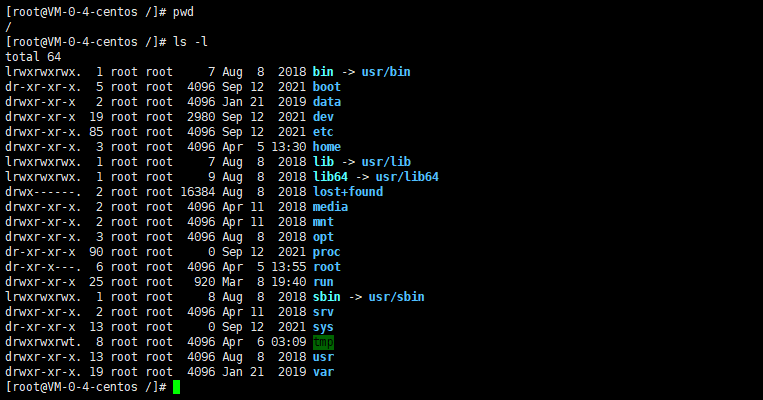

# Linux— —文件系统基础

本文主要介绍Linux中的文件系统。


## 1. 基础文件命令

首先我们先了解一些基础的文件命令。

### 1.1 pwd

命令`pwd`的作用是显示当前工作路径，是Print Working Directory的缩写。


### 1.2 cd

命令`cd`的作用是切换工作目录，是Change Directory的缩写。

首先先了解一下相对路径和绝对路径：

- 相对路径：相对于当前路径的路径
    - 一个点`.`表示当前目录；两个点`..`表示上一层目录；
- 绝对路径：从根目录开始的路径

我们可以在命令`cd`后跟上相对路径或绝对路径，也有一些特殊符号表示特殊用法：

|   符号    |            说明            |
| :-------: | :------------------------: |
|    `~`    |  代表当前登录用户的主目录  |
| `~用户名` | 表示切换至指定用户的主目录 |
|    `-`    |      代表上次所在目录      |
|   `..`    |       回到上一层目录       |


### 1.3 ls

命令`ls`的作用是显示目录下的所有文件，是list的缩写。`ls`命令的格式如下：

```txt
ls [选项] [目录路径]
```

如果目录路径省略，则表示显示当前目录下的所有文件。

`ls`命令的选项列表如下：

| 选项 |                             说明                             |
| :--: | :----------------------------------------------------------: |
| `-a` | 显示全部的文件，包括隐藏文件（开头为 . 的文件）也一起罗列出来 |
| `-A` | 显示全部的文件，连同隐藏文件，但不包括 `.` 与 `..` 这两个目录 |
| `-l` |                 使用长格式列出文件和目录信息                 |
| `-h` |  以人们易读的方式显示文件或目录大小，如 1KB、234MB、2GB 等   |
| `-F` | 在文件或目录名后加上文件类型的指示符号，例如，* 代表可运行文件，/ 代表目录，= 代表 socket文件 |
| `-R` |  连同子目录内容一起列出来，即将该目录下的所有文件都显示出来  |
| `-i` |                     显示 inode 节点信息                      |

接下来使用`ls -l`命令显示当前目录下的文件：


可以看到以长格式列出了文件和目录的详细信息，接下来就说说详细信息包含了哪些内容：


<center>图源：参考资料[2]</center>

我们也看到使用`ls`命令列出的文件或目录名具有不同的颜色，那么这些颜色代表的内容如下（一般情况，并不绝对）：

- 白色：普通文件，例如`hello.h`
- 蓝色：目录
- 绿色：可执行文件
- 红色：压缩文件
- 青色：链接文件，像Windows操作系统下的快捷方式
- 黄色：设备文件，分为块设备文件、字符设备文件、管道设备文件
- 灰色：其他文件


### 1.4 目录和文件操作

**创建目录：**

```
mkdir [-mp] 目录名
```

- `-m` 选项用于手动配置所创建目录的权限，而不再使用默认权限。
- `-p` 选项递归创建所有目录，以创建 /home/test/demo 为例，在默认情况下，你需要一层一层的创建各个目录，而使用 -p 选项，则系统会自动帮你创建 /home、/home/test 以及 /home/test/demo。

例如：

```txt
mkdir -m 711 test2
```

在创建 test2 目录时，使用了 -m 选项，通过设定 711 权限值来给予新的目录 `rwx--x--x` 的权限。

**删除空目录：**

```txt
rmdir [-p] 目录名
```

- `-p` 选项用于递归删除空目录

`rmdir` 命令的作用十分有限，因为只能刪除空目录，所以一旦目录中有内容，就会报错。

**创建文件：**

```txt
touch 文件名
```

**删除文件和目录：**

```txt
rm [选项] 文件或目录
```

rm 是强大的删除命令，它可以永久性地删除文件系统中指定的文件或目录。选项如下：

- `-f`：强制删除（force），和 `-i` 选项相反，使用 `-f`，系统将不再询问，而是直接删除目标文件或目录。
- `-i`：和 `-f` 正好相反，在删除文件或目录之前，系统会给出提示信息，使用 `-i` 可以有效防止不小心删除有用的文件或目录。
- `-r`：递归删除，主要用于删除目录，可删除指定目录及包含的所有内容，包括所有的子目录和文件。

**移动或重命名文件或目录**

```txt
mv [选项] 源文件 目标文件
```

选项：

- `-f`：强制覆盖，如果目标文件已经存在，则不询问，直接强制覆盖；
- `-i`：交互移动，如果目标文件已经存在，则询问用户是否覆盖（默认选项）；
- `-n`：如果目标文件已经存在，则不会覆盖移动，而且不询问用户；
- `-v`：显示文件或目录的移动过程；
- `-u`：若目标文件已经存在，但两者相比，源文件更新，则会对目标文件进行升级；

**复制文件或目录**

```txt
cp [选项] 源文件 目标文件
```

选项：

- `-a`：相当于 `-d`、`-p`、`-r` 选项的集合，这几个选项我们一一介绍；
- `-d`：如果源文件为软链接（对硬链接无效），则复制出的目标文件也为软链接；
- `-i`：询问，如果目标文件已经存在，则会询问是否覆盖；
- `-l`：把目标文件建立为源文件的硬链接文件，而不是复制源文件；
- `-s`：把目标文件建立为源文件的软链接文件，而不是复制源文件；
- `-p`：复制后目标文件保留源文件的属性（包括所有者、所属组、权限和时间）；
- `-r`：递归复制，用于复制目录；
- `-u`：若目标文件比源文件有差异，则使用该选项可以更新目标文件，此选项可用于对文件的升级和备用。

需要注意的是，源文件可以有多个，但这种情况下，目标文件必须是目录才可以。


## 2. Linux目录结构

查看根目录下有哪些文件：



以下是对这些目录的解释：

- **/bin**：
    bin 是 Binaries (二进制文件) 的缩写, 这个目录存放着最经常使用的命令。

- **/boot：**
    这里存放的是启动 Linux 时使用的一些核心文件，包括一些连接文件以及镜像文件。

- **/data：**

    存放数据的目录

- **/dev ：**
    dev 是 Device(设备) 的缩写, 该目录下存放的是 Linux 的外部设备，在 Linux 中访问设备的方式和访问文件的方式是相同的。

- **/etc：**
    etc 是 Etcetera(等等) 的缩写，这个目录用来存放所有的系统管理所需要的配置文件和子目录。

- **/home**：
    用户的主目录，在 Linux 中，每个用户都有一个自己的目录，一般该目录名是以用户的账号命名的。

- **/lib、/lib64**：
    lib 是 Library(库) 的缩写。这个目录里存放着系统最基本的动态连接共享库，其作用类似于 Windows 里的 DLL 文件。几乎所有的应用程序都需要用到这些共享库。

- **/lost+found**：
    这个目录一般情况下是空的，当系统非法关机后，这里就存放了一些文件。

- **/media**：
    linux 系统会自动识别一些设备，例如U盘、光驱等等，当识别后，Linux 会把识别的设备挂载到这个目录下。

- **/mnt**：
    系统提供该目录是为了让用户临时挂载别的文件系统的，我们可以将光驱挂载在 /mnt/ 上，然后进入该目录就可以查看光驱里的内容了。

- **/opt**：
    opt 是 optional(可选) 的缩写，这是给主机额外安装软件所摆放的目录。比如你安装一个ORACLE数据库就可以放到这个目录下。默认是空的。

- **/proc**：
    proc 是 Processes(进程) 的缩写，/proc 是一种伪文件系统（也即虚拟文件系统），存储的是当前内核运行状态的一系列特殊文件，这个目录是一个虚拟的目录，它是系统内存的映射，我们可以通过直接访问这个目录来获取系统信息。这个目录的内容不在硬盘上而是在内存里。

- **/root**：
    该目录为系统管理员，也称作超级权限者的用户主目录。

- **/run**：
    是一个临时文件系统，存储系统启动以来的信息。当系统重启时，这个目录下的文件应该被删掉或清除。如果你的系统上有 /var/run 目录，应该让它指向 run。

- **/sbin**：
    s 就是 Super User 的意思，是 Superuser Binaries (超级用户的二进制文件) 的缩写，这里存放的是系统管理员使用的系统管理程序。

- **/srv**：
     该目录存放一些服务启动之后需要提取的数据。

- **/sys**：

    这是 Linux2.6 内核的一个很大的变化。该目录下安装了 2.6 内核中新出现的一个文件系统 sysfs 。

    sysfs 文件系统集成了下面3种文件系统的信息：针对进程信息的 proc 文件系统、针对设备的 devfs 文件系统以及针对伪终端的 devpts 文件系统。

    该文件系统是内核设备树的一个直观反映。当一个内核对象被创建的时候，对应的文件和目录也在内核对象子系统中被创建。

- **/tmp**：
    tmp 是 temporary(临时) 的缩写。这个目录是用来存放一些临时文件的。

- **/usr**：
     usr 是 unix shared resources(共享资源) 的缩写，这是一个非常重要的目录，用户的很多应用程序和文件都放在这个目录下，类似于 windows 下的 program files 目录。

    - **/usr/bin：**
        系统用户使用的应用程序。
    - **/usr/sbin：**
        超级用户使用的比较高级的管理程序和系统守护程序。
    - **/usr/src：**
        内核源代码默认的放置目录。

- **/var**：
    var 是 variable(变量) 的缩写，这个目录中存放着在不断扩充着的东西，我们习惯将那些经常被修改的目录放在这个目录下。包括各种日志文件。

    

## 3. Linux一切皆文件

> Linux 中所有内容都是以文件的形式保存和管理的，即一切皆文件，普通文件是文件，目录（Windows 下称为文件夹）是文件，硬件设备（键盘、监视器、硬盘、打印机）是文件，就连套接字（socket）、网络通信等资源也都是文件。

>Linux系统中，文件具体可分为以下几种类型：
>
>#### 1) 普通文件
>
>类似 mp4、pdf、html 这样，可直接拿来使用的文件都属于普通文件，Linux 用户根据访问权限的不同可以对这些文件进行查看、删除以及更改操作。
>
>#### 2) 目录文件
>
>Linux 系统中，目录文件包含了此目录中各个文件的文件名以及指向这些文件的指针，打开目录等同于打开目录文件，只要你有权限，可以随意访问目录中的任何文件。
>
>注意，目录文件的访问权限，同普通文件的执行权限，是一个意思。
>
>#### 3) 字符设备文件和块设备文件
>
>这些文件通常隐藏在 /dev/ 目录下，当进行设备读取或外设交互时才会被使用。
>
>例如，磁盘光驱属于块设备文件，串口设备则属于字符设备文件。
>
>Linux 系统中的所有设备，要么是块设备文件，要么是字符设备文件。
>
>#### 4) 套接字文件（socket）
>
>套接字文件一般隐藏在 /var/run/ 目录下，用于进程间的网络通信。
>
>#### 5) 符号链接文件（symbolic link）
>
>类似于 Windows 中的快捷方式，是指向另一文件的简介指针（也就是软链接）。
>
>#### 6) 管道文件（pipe）
>
>主要用于进程间通信。例如，使用 mkfifo 命令创建一个 FIFO 文件，与此同时，启用进程 A 从 FIFO文件读数据，启用进程 B 从 FIFO文件中写数据，随写随读。


## 4. 软链接与硬链接

链接就像Windows系统中的快捷方式，就像给文件取一个别名。创建链接的命令如下：

```txt
ln [选项] 源文件 目标文件
```

选项：

- `-s`：建立软链接文件。如果不加 `-s` 选项，则建立硬链接文件；
- `-f`：强制。如果目标文件已经存在，则删除目标文件后再建立链接文件；

软链接与硬链接的区别：

首先我们需要了解Linux系统是如何组织文件的。每个文件都指向一个inode：inode 的默认大小为 128 Byte，用来记录文件的权限（r、w、x）、文件的所有者和属组、文件的大小、文件的状态改变时间（ctime）、文件的最近一次读取时间（atime）、文件的最近一次修改时间（mtime）、**文件的数据真正保存的 block 编号**。每个文件需要占用一个 inode。

创建硬链接，就是创建一个文件项，与源文件指向相同的inode：


硬链接图示：


<center>图源：参考资料[5]</center>

创建软链接，就是创建一个新的文件项，有新的inode与数据块，但是数据块中的内容是指向源文件的路径。


软链接图示：


<center>图源：参考资料[5]</center>

补充：使用`du -h`命令来查看某个目录实际占用磁盘空间大小。


## 参考资料

[1] C语言中文网：http://c.biancheng.net/linux_tutorial/

[2] Linux教程：https://www.bilibili.com/video/BV1dt411f7TZ?p=6

[3] 菜鸟教程： https://www.runoob.com/linux/linux-tutorial.html

[4] 软链接和硬链接区别：https://www.jianshu.com/p/dde6a01c4094

[5] 关于硬链接与软连接占用磁盘空间问题的分析研究：https://blog.51cto.com/jk6627/1949090