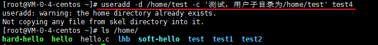
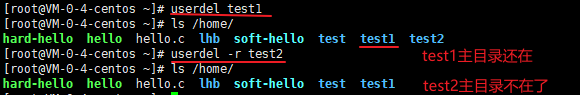
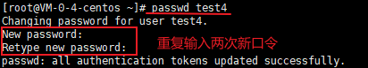
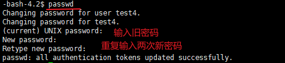
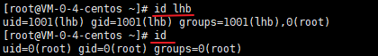
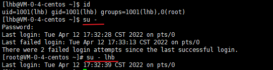

# 用户与用户组管理

Linux系统是一个多用户的系统，本文主要介绍如何进行用户和用户组管理。


## 1. 用户管理

用户管理主要涉及用户的添加、删除、修改以及用户口令（密码）的管理。

### 1.1 添加用户

我们可以使用如下命令添加用户：

```txt
useradd [选项] 用户名
```

选项列表如下：

- `-c comment`：添加注释，指定一段注释性描述。
- `-d 目录`：指定用户主目录，如果此目录不存在，则同时使用`-m`选项，可以创建主目录。默认会在`/home/`目录下创建与用户名同名的用户主目录。
- `-g 用户组名`：指定用户所属的用户组。如果未指定，则会创建一个与用户名同名的用户组。
- `-G 用户组名, 用户组名`：指定用户所属的附加组。
- `-s Shell文件`：指定用户的登录Shell。
- `-u 用户号`：指定用户的用户号，如果同时有`-o`选项，则可以重复使用其他用户的标识号。

例如：


创建一个名为test2的用户，自动在`/home/`目录下创建了`test2`用户子目录。



创建一个名为test4的用户，并将其主目录指定为`/home/test`。


### 1.2 删除用户

删除用户的命令如下：

```txt
userdel [-r] 用户名
```

- 选项`-r`的作用是把用户的主目录一起删除。




### 1.3 修改用户

修改用户的命令如下：

```txt
usermod [选项] 用户名
```

修改用户的选项与添加用户选项意义相同。此处不再赘述。

例如：

```txt
usermod -d /home/test1 test3
```

上述命令将用户`test3`的主目录修改为`/home/test1`。


### 1.4 用户口令管理

用户口令（密码）管理的命令如下：

```txt
passwd [选项] 用户名
```

选项列表如下：

- `-l`：锁定口令，即禁用账号。
- `-u`：口令解锁。
- `-d`：使账号无口令。
- `-f`：强迫用户下次登录时修改口令。

如果没有用户名，则修改当前用户的口令。

如果没有选项，则直接修改口令。普通用户修改自己的口令时，`passwd`命令会先询问原口令，验证后再要求用户输入两遍新口令，如果两次输入的口令一致，则将这个口令指定给用户；而超级用户为用户指定口令时，就不需要知道原口令。

例如：



root用户修改test4用户的口令。

然后我们使用test4用户登录系统，再次输入`passwd`命令修改口令：



### 1.5 其他命令

除了上述关于用户管理的命令，还存在其他有关用户的命令：

- `users`：打印当前主机所有登陆用户的名称。每个显示的用户名对应一个登录会话；如果一个用户有不止一个登录会话，那他的用户名将显示相同的次数。

- `id 用户名`：显示用户的`uid`、`gid`和所属组。如果没有用户名，则显示执行当前操作的用户的信息。

    

- `su`：用户切换命令，通过该命令可以实现任何身份的切换，包括从普通用户切换为 root 用户、从 root 用户切换为普通用户以及普通用户之间的切换。

    普通用户之间切换以及普通用户切换至 root 用户，都需要知晓对方的密码，只有正确输入密码，才能实现切换；从 root 用户切换至其他用户，无需知晓对方密码，直接可切换成功。

    命令格式如下：

    ```txt
    su [选项] [-] 用户名
    ```

    如果用户名未指定，则默认切换至`root`用户。

    `[-]`就像使用`-l`选项

    选项如下：

    - `-l`：改变身份时，也同时变更工作目录，以及HOME,SHELL,USER,logname。此外，也会变更PATH变量；
    - `-p`、`-m`：变更身份时，不要变更环境变量；
    - `-c <指令>` ：执行完指定的指令后，即恢复原来的身份；

    

    上述例子从lhb用户切换回root用户，再从root用户切换回lhb用户。


## 2. 用户组管理


## 参考资料

[1] 菜鸟教程： https://www.runoob.com/linux/linux-user-manage.html

[2] C语言中文网：http://c.biancheng.net/view/3089.html