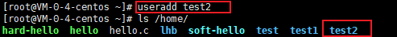

# 用户与用户组管理

Linux系统是一个多用户的系统，本文主要介绍如何进行用户和用户组管理。


## 1. 用户管理

用户管理主要涉及用户的添加、删除、修改以及用户口令（密码）的管理。

### 1.1 添加用户

我们可以使用如下命令添加用户：

```txt
useradd [选项] 用户名
```

选项列表如下：

- `-c comment`：添加注释，指定一段注释性描述。
- `-d 目录`：指定用户主目录，如果此目录不存在，则同时使用`-m`选项，可以创建主目录。默认会在`/home/`目录下创建与用户名同名的用户主目录。
- `-g 用户组名`：指定用户所属的用户组。如果未指定，则会创建一个与用户名同名的用户组。
- `-G 用户组名, 用户组名`：指定用户所属的附加组。
- `-s Shell文件`：指定用户的登录Shell。
- `-u 用户号`：指定用户的用户号，如果同时有`-o`选项，则可以重复使用其他用户的标识号。

例如：



创建一个名为test2的用户，自动在`/home/`目录下创建了`test2`用户子目录。


创建一个名为test4的用户，并将其主目录指定为`/home/test`。


### 1.2 删除用户

删除用户的命令如下：

```txt
userdel [-r] 用户名
```

- 选项`-r`的作用是把用户的主目录一起删除。


### 1.3 修改用户

修改用户的命令如下：

```txt
usermod [选项] 用户名
```

修改用户的选项与添加用户选项意义相同。此处不再赘述。

例如：

```txt
usermod -d /home/test1 test3
```

上述命令将用户`test3`的主目录修改为`/home/test1`。


### 1.4 用户口令管理

用户口令（密码）管理的命令如下：

```txt
passwd [选项] 用户名
```

选项列表如下：

- `-l`：锁定口令，即禁用账号。
- `-u`：口令解锁。
- `-d`：使账号无口令。
- `-f`：强迫用户下次登录时修改口令。

如果没有用户名，则修改当前用户的口令。

如果没有选项，则直接修改口令。普通用户修改自己的口令时，`passwd`命令会先询问原口令，验证后再要求用户输入两遍新口令，如果两次输入的口令一致，则将这个口令指定给用户；而超级用户为用户指定口令时，就不需要知道原口令。

例如：


root用户修改test4用户的口令。

然后我们使用test4用户登录系统，再次输入`passwd`命令修改口令：


### 1.5 其他命令

除了上述关于用户管理的命令，还存在其他有关用户的命令：

- `users`：打印当前主机所有登陆用户的名称。每个显示的用户名对应一个登录会话；如果一个用户有不止一个登录会话，那他的用户名将显示相同的次数。

- `id 用户名`：显示用户的`uid`、`gid`和所属组。如果没有用户名，则显示执行当前操作的用户的信息。

    

- `su`：用户切换命令，通过该命令可以实现任何身份的切换，包括从普通用户切换为 root 用户、从 root 用户切换为普通用户以及普通用户之间的切换。

    普通用户之间切换以及普通用户切换至 root 用户，都需要知晓对方的密码，只有正确输入密码，才能实现切换；从 root 用户切换至其他用户，无需知晓对方密码，直接可切换成功。

    命令格式如下：

    ```txt
    su [选项] [-] 用户名
    ```

    如果用户名未指定，则默认切换至`root`用户。

    `[-]`就像使用`-l`选项

    选项如下：

    - `-l`：改变身份时，也同时变更工作目录，以及HOME,SHELL,USER,logname。此外，也会变更PATH变量；
    - `-p`、`-m`：变更身份时，不要变更环境变量；
    - `-c <指令>` ：执行完指定的指令后，即恢复原来的身份；

    

    上述例子从lhb用户切换回root用户，再从root用户切换回lhb用户。


## 2. 用户组管理

用户组管理涉及用户组的添加、删除与修改。

### 2.1 添加用户组

在添加用户时，默认情况下会添加一个与用户名同名的用户组。当然，我们也可以使用如下命令添加用户组：

```txt
groupadd [选项] 用户组名
```

选项如下：

- `-g GID`：指定新用户组的组标识号（GID）。
- `-o`：一般与`-g`选项同时使用，表示新用户组的GID可以与系统已有用户组的GID相同。

例如：

```bash
groupadd -g 9999 -o group-test
```

上述命令添加一个用户组`group-test`并指定组ID为9999.


### 2.2 删除用户组

我们可以使用如下命令删除用户组：

```txt
groupdel 用户组名
```

例如：

```bash
groupdel group-test
```


### 2.3 修改用户组

可以使用如下命令修改用户组：

```txt
groupmod [选项] 用户组
```

选项如下：

- `-g GID`：为用户组指定新的组标识号。
- `-o`：与`-g`选项同时使用，用户组的新GID可以与系统已有用户组的GID相同。
- `-n 新用户组名`：将用户组的名字改为新名字

例如：

```bash
groupmod –g 10000 -n group3 group2
```


## 3. 用户和用户组管理其他命令

- **groups  用户名**：输出指定用户所在的用户组
- **newgrp 用户组名**：切换用户组


## 4. 系统文件

本节主要介绍有关用户和用户组的系统文件。

### 4.1 用户文件

Linux系统中的每个用户都在`/etc/passwd`文件中有一个对应的记录行，它记录了这个用户的一些基本属性。

`/etc/passwd`的内容示例如下：

```txt
root:x:0:0:root:/root:/bin/bash
bin:x:1:1:bin:/bin:/sbin/nologin
syslog:x:996:994::/home/syslog:/bin/false
lhb:x:1001:1001::/home/lhb:/bin/bash
```

 每行代表一个用户，格式如下：

```txt
用户名:口令:UID:GID:注释:主目录:登录Shell
```

- 用户名：代表用户的字符串；

- 口令：为了保密，用`x`代表；

- UID：用户唯一标识符；

- GID：用户所属组唯一标识符；

- 注释：一段注释，起解释、说明作用；

- 主目录：该用户的主目录；

- 登录Shell：用户登录后，要启动一个进程，负责将用户的操作传给内核，这个进程是用户登录到系统后运行的命令解释器或某个特定的程序，即Shell。Shell是用户与Linux系统之间的接口。Linux的Shell有许多种，每种都有不同的特点。常用的有sh(Bourne Shell), csh(C Shell), ksh(Korn Shell), tcsh(TENEX/TOPS-20 type C Shell), bash(Bourne Again Shell)等。

    系统管理员可以根据系统情况和用户习惯为用户指定某个Shell。如果不指定Shell，那么系统使用sh为默认的登录Shell，即这个字段的值为`/bin/sh`。

**伪用户**

系统中有一类用户称为伪用户（pseudo users），这些用户在`/etc/passwd`文件中也占有一条记录，但是不能登录，因为它们的登录Shell为空。它们的存在主要是方便系统管理，满足相应的系统进程对文件属主的要求。


### 4.2 用户口令文件

由于`/etc/passwd`文件是所有用户都可读的，如果用户的密码太简单或规律比较明显的话，一台普通的计算机就能够很容易地将它破解，因此对安全性要求较高的Linux系统都把加密后的口令字分离出来，单独存放在一个文件中，这个文件是`/etc/shadow`文件。 有超级用户才拥有该文件读权限，这就保证了用户密码的安全性。

`/etc/shadow`文件内容示例如下：

```txt
root:$1$zNJmqRKU$cZSTTm.zrPzcDysSBeEcv0:18881:0:99999:7:::
bin:*:17632:0:99999:7:::
daemon:*:17632:0:99999:7:::
dbus:!!:17751::::::
syslog:!!:17917::::::
lhb:$1$pUsepLCW$c03LgtSrIhE3XCxvzi9oe/:19094:0:99999:7:::
```

每一行代表一个用户，每一行的格式如下：

```txt
用户名:加密口令:最后一次修改时间:最小时间间隔:最大时间间隔:警告时间:不活动时间:失效时间:标志
```

- 用户名：代表用户的字符串

- 加密口令：加密后的用户口令字。如果为空，则对应用户没有口令，登录时不需要口令；如果包含`!`或`*`，则该用户不能使用口令登录。密码规则如下：

    ```txt
    $id$salt$hashed
    ```

    `$id$`代表着使用的加密算法：

    1. `$1$` is MD5
    2. `$2a$` is Blowfish
    3. `$2y$` is Blowfish
    4. `$5$` is SHA-256
    5. `$6$` is SHA-512

- 最后一次修改时间（Last Password Modified）：表示的是从某个时刻起，到用户最后一次修改口令时的天数。时间起点对不同的系统可能不一样。

- 修改密码最小时间间隔（Minimum Password Age）：指的是两次修改口令之间所需的最小天数。

- 修改密码最大时间间隔（Maximum Password Age）：指的是口令保持有效的最大天数。

- 警告时间（Warning Period）：表示的是从系统开始警告用户到用户正式失效之间的天数，应该大于不活动时间。

- 不活动时间（Inactivity period）：表示的是用户失效前的一段时间。

- 失效时间（Expiration Date）：用户被禁用的时间。

图示如下：


### 4.3 用户组文件

用户组的所有信息都存放在`/etc/group`文件中。文件内容示例如下：

```txt
root:x:0:lhb
bin:x:1:
daemon:x:2:
sys:x:3:
adm:x:4:
tty:x:5:
disk:x:6:
```

每一行格式如下：

```txt
组名:口令:组标识号:组内用户列表
```

- 组名：用户组名；
- 口令：放的是用户组加密后的口令；
- 组标识符：用户组唯一标识符；
- 组内用户列表：属于这个组的所有用户的列表，不同用户之间用逗号(,)分隔。这个用户组可能是用户的主组，也可能是附加组；


## 参考资料

[1] 菜鸟教程： https://www.runoob.com/linux/linux-user-manage.html

[2] C语言中文网：http://c.biancheng.net/view/3089.html

[3] https://linuxize.com/post/etc-shadow-file/