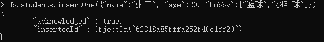
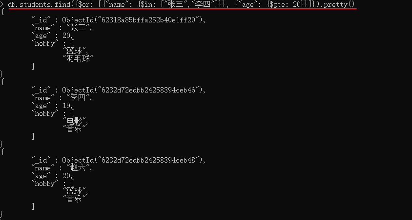

## 1. MongoDB介绍


## 2. MongoDB的安装与启动

首先进入[MongoDB的下载页面](https://www.mongodb.com/try/download)，选择MongoDB社区版，如下：


下载完成后，将下载的压缩包解压，在解压后与`bin`目录同级的地方创建文件夹`/data/db`，如下：


接下来说明如何启动MongoDB数据库服务，首先打开cmd，进入MongoDB安装位置的bin目录，输入如下命令：

```txt
mongod --dbpath ../data/db
```

完成后，会在控制台输出一些信息，并持续监听客户端的命令。从MongoDB服务的启动信息可知，MongoDB的默认端口是27017，如果我们想改变默认的启动端口，可以通过`--port`选项来指定：

```txt
mongod --dbpath ../data/db --port xxx
```

以上的方式是直接将启动参数写在启动命令中，我们也可以将启动参数放在配置文件，然后以配置文件的方式启动MongoDB服务：

```txt
mongod --config ../conf/mongod.conf
或
mongod -f ../conf/mongod.conf
```

配置文件的参考内容如下：

```txt
storage:
     dbPath: D:\software\mongodb-windows-x86_64-5.0.6\data\db
```

启动了MongoDB服务，我们可以启动MongoDB客户端，连接到服务（**注意：**启动MongoDB服务的控制台窗口不要关闭！）。仍然是打开cmd，进入MongoDB安装位置的bin目录，输入如下命令：

```txt
mongo
```

连接成功后，界面如下：


## 3. MongoDB术语介绍

### 3.1 MongoDB基本概念

在进行数据库操作之前，我们需要了解一下MongoDB中的术语：

| SQL术语/概念 | MongoDB术语/概念 | 解释/说明                           |
| :----------- | :--------------- | :---------------------------------- |
| database     | database         | 数据库                              |
| table        | collection       | 数据库表/集合                       |
| row          | document         | 数据记录行/文档                     |
| column       | field            | 数据字段/域                         |
| index        | index            | 索引                                |
| table joins  |                  | 表连接,MongoDB不支持                |
| primary key  | primary key      | 主键,MongoDB自动将_id字段设置为主键 |

<p align="center">来源：菜鸟教程</p>


### 3.2 MongoDB数据类型

|      |      |      |
| ---- | ---- | ---- |
|      |      |      |
|      |      |      |
|      |      |      |


## 4. MongoDB操作数据库

我们可以使用`show dbs`显示所有数据库，使用`db`显示当前的数据库：


MongoDB 中默认的数据库为 test，如果你没有创建新的数据库，集合将存放在 test 数据库中。

使用`use DATABASE_NAME`进行数据库的切换或创建，如果数据库不存在则创建：


可以看到，我们创建了一个数据库`mydb`，并且消息提示我们已切换到数据库`mydb`了。但是，显示所有数据库时，却没有创建的`mydb`数据库，这是因为只有在插入集合的时候，数据库才会被真正地创建。

我们可以使用`db.dropDatabase()`删除数据库：


## 5. MongoDB操作集合

我们可以使用如下命令[创建集合](https://docs.mongodb.com/manual/reference/method/db.createCollection/)：

```txt
db.createCollection(name, options)
```

- `name` 是要创建的集合名字
- `options` 是集合参数，可选的，完整的参数列表请参考：https://docs.mongodb.com/manual/reference/method/db.createCollection/

创建集合后，我们可以使用如下命令显示数据库中的集合：

```txt
show collections 
或
show tables
```

我们可以使用以下命令删除集合：

```txt
db.collection_name.drop()
```


## 6. 文档的增删查改

### 6.1 插入文档

我们可以使用`insertOne()`和`insertMang()`方法插入文档，语法如下：

```txt
db.collection_name.insertOne(
   <document>,
   {
      writeConcern: <document>
   }
)
```

```txt
db.collection_name.insertMany(
   [ <document 1> , <document 2>, ... ],
   {
      writeConcern: <document>,
      ordered: <boolean>
   }
)
```

两者的区别就是插入一个或多个文档的区别，所以此处以`insertOne()`为例介绍插入方法。

`insertOne()`需要两个参数：

- `document`：要插入的文档。如果要插入的文档不包含`_id`字段，那么MongoDB会在插入文档前自动创建类型为`ObjectID`的`_id`字段；如果要插入的文档包含`_id`字段，那么要保证该`_id`字段不与集合中文档的`_id`字段重复。

- `writeConcern`，可选的参数，初学略过；

**注意：**如果集合不存在，那么调用插入方法，会自动创建集合。




### 6.2 查询文档

我们可以使用如下方法来查询文档：

```txt
db.collection_name.find(query, projection)
```

- `query`：可选的，表示查询条件。如果不填，则表示查询集合中的所有文档。
- `projection`：可选的，表示符合查询条件的文档要返回的字段。

补充，如果需要使得查询结果更直观，可以使用`pretty()`方法：

```txt
db.collection_name.find(query, projection).pretty()
```

在进行下面的演示之前，我们先在`students`集合中插入一些数据：

```txt
db.students.insertMany([
	{
		"name": "李四",
		"age": 19,
        "hobby": ["电影", "音乐"]
	},
	{
		"name": "王五",
		"age": 18,
		"hobby": ["书法", "数码"]
	},
	{
		"name": "赵六",
		"age": 20,
		"hobby": ["篮球", "音乐"]
	}
])
```


下面就来说说一些`query`查询条件的设置，完整的查询条件请参照链接：https://docs.mongodb.com/manual/reference/operator/query/

正如上面的演示一样，如果没有查询条件，那么就会查询集合中的所有文档。

首先来看查询条件中的比较运算符，这是运用于一个查询条件中的，基本形式如下：

```txt
{ 字段名: { 比较运算符: 值 } }
```

| 比较运算符 |                  说明                  |
| :--------: | :------------------------------------: |
|    $eq     |     相等运算符，用于字段是否等于值     |
|    $gt     |     大于运算符，用于字段是否大于值     |
|    $gte    | 大于等于运算符，用于字段是否大于等于值 |
|    $in     |   值为数组，用于字段是否存在于数组中   |
|    $lt     |     小于运算符，用于字段是否小于值     |
|    $lte    | 小于等于运算符，用于字段是否小于等于值 |
|    $ne     | 不等于运算符，用于字段是否不等于某个值 |
|    $nin    |    值为数组，用于字段是否不在数组中    |

例如，查询`name`为`张三`的学生，我们可以使用如下命令：

```txt
db.students.find(
	{
		"name": {$eq: "张三"}
	}
).pretty()
```

对于相等运算符，我们可以省略运算符：

```txt
db.students.find(
	{
		"name": "张三"
	}
).pretty()
```


然后我们再来看看查询条件中的逻辑运算符，逻辑运算符用于连接多个查询条件，逻辑运算符列表如下：

| 逻辑运算符 |                     说明                     |
| :--------: | :------------------------------------------: |
|    $and    |  逻辑与，多个查询条件同时满足的文档才会返回  |
|    $or     | 逻辑或，只需要满足一个查询条件，文档就会返回 |
|    $not    |      逻辑非，不满足查询条件的文档会返回      |
|    $nor    |        不满足所有查询条件的文档会返回        |

逻辑运算符的语法格式如下：

```txt
{
	$and: [ { <expression1> }, { <expression2> } , ... , { <expressionN> } ]
}

{ 
	$or: [ { <expression1> }, { <expression2> }, ... , { <expressionN> } ] 
}

{
	field: { $not: { <operator-expression> } }
}

{ 
	$nor: [ { <expression1> }, { <expression2> }, ...  { <expressionN> } ] 
}
```

例如，查询姓名为"张三"、“李四”，或者年龄大于等于20岁的学生：

```txt
db.students.find({$or: [{"name": {$in: ["张三","李四"]}}, {"age": {$gte: 20}}]}).pretty()
```



接下来我们再看看有关数组的查询条件：

| 数组运算符 |                             说明                             |
| :--------: | :----------------------------------------------------------: |
|    $all    | 判断数组字段是否包含查询条件给出的字段，如果是，则返回该文档 |
| $elemMatch | 判断数组字段中是否有至少一个元素，满足所有给定的查询条件，是则返回文档 |
|   $size    |          如果数组字段的大小满足查询条件，则返回文档          |

各个数组运算符的语法如下：

```txt
{ <field>: { $all: [ <value1> , <value2> ... ] } }

{ <field>: { $elemMatch: { <query1>, <query2>, ... } } }

{ field: { $size: value } }
```

例如，查询爱好包含篮球的学生：

```txt
db.students.find(
	{
		"hobby": {
			$elemMatch: {$eq: "篮球"}
		}
	}
)
```


然后我们再来说说参数`projection`的使用。

参数`projection`用来指定符合条件的文档返回什么字段，格式如下：

```txt
{ <field1>: <value>, <field2>: <value> ... }
```

`projection`的简单使用如下表：

|          参数           |           说明            |
| :---------------------: | :-----------------------: |
| \<field\>: <1 or true>  | 返回指定的field，默认返回 |
| \<field\>: <0 or false> |     不返回指定的field     |

例如，在返回的文档中去除`name`字段：


关于`projection`还有多种类型，在以后的学习中会逐渐接触到。


### 6.3 删除文档

我们可以使用`deleteOne()`和`deleteMany()`来删除文档：

```txt
db.collection_name.deleteOne(
   <filter>,
   {
      writeConcern: <document>,
      collation: <document>,
      hint: <document|string>        // Available starting in MongoDB 4.4
   }
)

db.collection_name.deleteMany(
   <filter>,
   {
      writeConcern: <document>,
      collation: <document>
   }
)
```

两者的区别就是删除一个或多个的区别，接下来我们以`deleteOne()`为例讲解删除文档方法的使用，首先来看参数：

- `filter`：要删除的文档需要满足的条件，可以参考查询文档中的`query`参数；
- 第二个参数，略过

例如，如果我们要删除姓名为`张三`的学生，如下：

```txt
db.students.deleteOne({"name": "张三"})
```


### 6.4 更新文档

我们可以使用`updateOne()`或`updateMany()`来更新文档：

```txt
db.collection_name.updateOne(
   <filter>,
   <update>,
   {
     upsert: <boolean>,
     writeConcern: <document>,
     collation: <document>,
     arrayFilters: [ <filterdocument1>, ... ],
     hint:  <document|string>        // Available starting in MongoDB 4.2.1
   }
)

db.collection_name.updateMany(
   <filter>,
   <update>,
   {
     upsert: <boolean>,
     writeConcern: <document>,
     collation: <document>,
     arrayFilters: [ <filterdocument1>, ... ],
     hint:  <document|string>        // Available starting in MongoDB 4.2.1
   }
)
```

参数解释如下：

- `filter`：要更新的文档需要满足的条件，参照查询文档的`query`参数；
- `update`：要应用的更新
- 第三个参数，初学略过；

接下来简单说说参数`update`的使用方式，完整列表参看链接：https://docs.mongodb.com/manual/reference/operator/update/#std-label-update-operators

|                            操作符                            |         说明         |
| :----------------------------------------------------------: | :------------------: |
| [`$set`](https://docs.mongodb.com/manual/reference/operator/update/set/#mongodb-update-up.-set) |     给字段赋新值     |
| [`$unset`](https://www.mongodb.com/docs/manual/reference/operator/update/unset/#mongodb-update-up.-unset) | 从文档中移除指定字段 |

例如，使用`$set`将所有学生的年龄改为20岁：


使用`$unset`移除字段：

使用`$unset`的语法如下：

```txt
{ $unset: { <field1>: "", ... } }
```


## 7. 查询文档方法深入

### 7.1 查询排序

我们可以使用`sort()`方法对查询结果进行排序：

```txt
sort({<field>: 1或-1})
```

如果值为1，则表示按照字段升序排列；如果值为-1，则表示按照字段降序排列。

例如，首先按照年龄升序排列，然后按照成绩降序排列：


### 7.2 分页查询

我们可以使用`skip(num)`和`limit(num)`方法来进行分页查询。

- `skip(num)`用于跳过指定数量的文档；
- `limit(num)`用于返回指定数量的文档；

例如，使用`skip(num)`跳过第一条文档：


例如，使用`limit(num)`只返回一条文档：


结合`skip(num)`和`limit(num)`我们可以进行分页查询，例如，要查询第p页的数据，每页大小为s：

```txt
db.collection_name.find().skip(s*(p-1)).limit(s)
```


## 8. 索引

索引可以帮助我们加快查询的速度。如果没有索引，那么MongoDB就要对集合进行“全表扫描”来查询符合条件的文档，这是一项费时的工作。有了索引，MongoDB可以缩小必须查询的文档数量，以达到加快查询速度的目的。

MongoDB使用B树数据结构来创建索引。

MongoDB使用如下方法建立索引：

```txt
db.collection_name.createIndex(keys, options, commitQuorum)
```

- `keys`：索引键值对，键是字段名，值为1或-1，1表示按该字段升序建立索引，-1表示按该字段降序建立索引；
- `options`：可选的创建索引的设置；
- `commitQuornum`：略过；

下面列举一些创建索引时的一些设置`options`：

|  选项  |                             说明                             |
| :----: | :----------------------------------------------------------: |
|  name  | 指定索引名，如果未指定，MongoDB的通过连接索引的字段名和排序顺序生成一个索引名称。 |
| unique | 建立的索引是否唯一。指定为true创建唯一索引。默认值为**false**. |

例如，我们可以创建如下索引：

```txt
db.students.createIndex({"name":1},{"name":"index_students_name"})
```

注意，在集合创建的时候，MongoDB会自动在`_id`字段创建唯一索引，我们不能删除这个索引。


除了创建索引，我们还可以对索引进行如下操作：

- 查看集合所有索引：`db.collection_name.getIndexes()`
- 查看集合索引大小：`db.collection_name.totalIndexSize()`
- 删除集合所有索引：`db.collection_name.dropIndexes()`
- 删除集合指定索引：`db.collection_name.dropIndex("index_name")`


## 9. 聚合

MongoDB 中聚合(aggregate)主要用于处理数据(诸如统计平均值，求和等)，并返回计算后的数据结果。类似于SQL中的`count(*)`。

在MongoDB中，聚合分为两类：

- 单一目的聚合方法：简单，只可用于单一目的
- 聚合管道：推荐使用的方法

我们首先从简单的聚合方法学习聚合：单一目的聚合方法

|                     方法                      |                             说明                             |
| :-------------------------------------------: | :----------------------------------------------------------: |
| db.collection.estimatedDocumentCount(options) |        返回一个集合中的文档数量，该数量可能是不准确的        |
|      db.collection.count(query,options)       |                 统计符合query条件的文档数量                  |
| db.collection.distinct(field, query, options) | 返回一个数组，该数组包含符合条件的文档指定字段值，字段值在数组中唯一 |

例如：


接下来重点讲解聚合管道的用法。

聚合管道包含一个或多个用于处理文档的阶段：

- 每个阶段在输入文档中进行一个操作，例如，某个阶段可以过滤文档、对文档进行分组和计算值；
- 从一个阶段输出的文档座位下一个阶段的输入文档；
- 聚合管道返回每组文档的结果，例如，返回每组文档的总值、平均值、最大值和最小值；

MongoDB中聚合的方法使用`aggregate()`，语法如下：

```txt
db.collection_name.aggregate([ { <stage> }, ... ])
```

接下来先以一个简单的例子讲解聚合管道的用法，首先准备数据，数据来源于[MongoDB官网](https://www.mongodb.com/docs/manual/core/aggregation-pipeline/)：

```txt
db.orders.insertMany( [
   { _id: 0, name: "Pepperoni", size: "small", price: 19,
     quantity: 10, date: ISODate( "2021-03-13T08:14:30Z" ) },
   { _id: 1, name: "Pepperoni", size: "medium", price: 20,
     quantity: 20, date : ISODate( "2021-03-13T09:13:24Z" ) },
   { _id: 2, name: "Pepperoni", size: "large", price: 21,
     quantity: 30, date : ISODate( "2021-03-17T09:22:12Z" ) },
   { _id: 3, name: "Cheese", size: "small", price: 12,
     quantity: 15, date : ISODate( "2021-03-13T11:21:39.736Z" ) },
   { _id: 4, name: "Cheese", size: "medium", price: 13,
     quantity:50, date : ISODate( "2022-01-12T21:23:13.331Z" ) },
   { _id: 5, name: "Cheese", size: "large", price: 14,
     quantity: 10, date : ISODate( "2022-01-12T05:08:13Z" ) },
   { _id: 6, name: "Vegan", size: "small", price: 17,
     quantity: 10, date : ISODate( "2021-01-13T05:08:13Z" ) },
   { _id: 7, name: "Vegan", size: "medium", price: 18,
     quantity: 10, date : ISODate( "2021-01-13T05:10:13Z" ) }
] )
```

统计中等大小的每种披萨的销售数量：

```txt
db.orders.aggregate([
	{
		// 阶段一：筛选大小为中等的披萨销售记录
		$match: {"size": "medium"}
	},
	{
		// 阶段二：按披萨名分组，然后统计每个组的销售量
		$group: {_id: "$name", totalQuantity: {$sum: "$quantity"}}
	}
])
```

结果：

```txt
{ "_id" : "Pepperoni", "totalQuantity" : 20 }
{ "_id" : "Cheese", "totalQuantity" : 50 }
{ "_id" : "Vegan", "totalQuantity" : 10 }
```

完整的聚合管道阶段参考链接：https://www.mongodb.com/docs/manual/reference/operator/aggregation-pipeline/，下面简单说说上面两个阶段：

- `$match`：匹配阶段，将不符合条件的文档过滤出去使之不进入下一阶段，语法格式如下：

    ```txt
    { $match: { <query> } }
    ```

- `$group`：分组阶段，语法格式如下：

    ```txt
    {
      $group:
        {
          _id: <expression>, // Group By Expression
          <field1>: { <accumulator1> : <expression1> },
          ...
        }
     }
    ```

    - `_id`是必须的，指定分组的字段；
    - `field`是可选的，统计分组的其他数据；

注意，除了`$out`、`$merge`和`$geoNear`阶段，其他阶段可以在一个管道中多次出现。


## 10. 在Java中操作MongoDB

本节主要介绍如何在Java程序中操作MongoDB数据库。

### 10.1 环境搭建

首先，我们需要在程序中引入MongoDB-Java-Driver包，下载地址：https://mvnrepository.com/artifact/org.mongodb/mongo-java-driver：


我们选择最新的Jar包，由于此处没创建Maven工程，所以下载Jar包，然后引入项目中。项目结构如下：


### 10.2 连接数据库

在Java代码中连接数据库之前，需要在本地启动MongoDB数据库服务。

我们可以使用如下代码连接到本地的MongoDB数据库，并打印出集合`students`中的文档数量：

```java
public static void main(String[] args) {
    try{
        MongoClient mongoClient = new MongoClient("localhost",27017);

        MongoDatabase mydb = mongoClient.getDatabase("mydb");
        long studentsNum = mydb.getCollection("students").countDocuments();
        System.out.println(studentsNum);

    }catch (Exception e){
        System.out.println(e.getMessage());
    }
}
```


### 10.3 查询文档

当我们连接到MongoDB数据库后，可以查询文档并输出文档内容：

```java
public static void main(String[] args) {
    try{
        // 1. 连接到MongoDB服务
        MongoClient mongoClient = new MongoClient("localhost",27017);
        // 2. 获取数据库mydb
        MongoDatabase mydb = mongoClient.getDatabase("mydb");
        // 3. 获取数据库中集合students
        MongoCollection<Document> students = mydb.getCollection("students");
        // 4. 查询该集合所有文档并输出
        FindIterable<Document> documents = students.find();
        MongoCursor<Document> cursor = documents.iterator();
        while (cursor.hasNext()){
            System.out.println(cursor.next());
        }

    }catch (Exception e){
        System.out.println(e.getMessage());
    }
}
```

结果如下：


上面只是一个简单的查询案例，接下来让我们看看带有查询条件的查询方法：


### 10.4 新增文档


### 10.5 删除文档


### 10.6 修改文档


## 11. 事务


## 12. 


## 参考资料

[1] MongoDB菜鸟教程：https://www.runoob.com/mongodb/mongodb-tutorial.html

[2] MongoDB官方文档：https://docs.mongodb.com/manual/tutorial/getting-started/