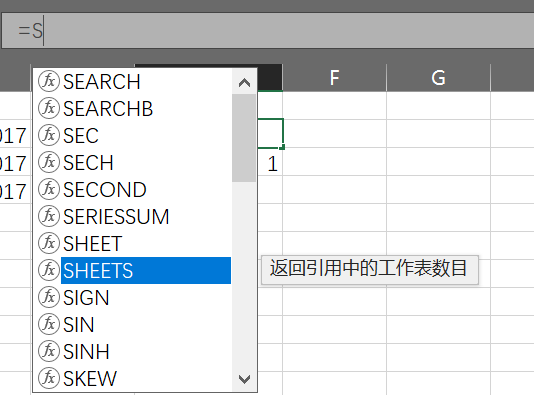

# 数据库— —数据库介绍

本篇文章主要介绍关系数据库的一些概念及术语。

## 一、什么是数据库？

数据库，顾名思义就是存储数据的仓库。现在问题来了：数据是如何存储在仓库里的呢，换句话说，数据是如何组织的。不同的数据库按照不同的方法来组织数据的，通常分为层次式数据库、网络式数据库和关系式数据库三种。本系列文章主要以MySQL为例介绍关系型数据库的内容。

其实关系型数据库和我们常见的EXCEL表非常类似，数据存储在表中，下面就以EXCEL为例来介绍关系型数据库的一些概念吧。

当我们把一个EXCEL文件保存下来时，会在我们的电脑中生成这样一个文件，这对应于**数据库(database)**：

打开我们的EXCEL文件，在EXCEL下方，我们可以选择和创建不同的表单，并且在不同的表单中处理不同的数据，这在数据库中也有类似的概念称为**表(table)**，并且每个表都有一个名字，比如sheet1,sheet2，**注意**：在一个数据库中不能使用相同的表名，但是在不同的数据库中却可以使用相同的表名。

我们在EXCEL中将sheet2修改为sheet1，会提示如下信息：

然后我们在sheet1中添加如下数据：

可以看到，在sheet1中保存了一些学生的基本信息，包括学号、姓名、年级和性别。这也就是关系数据库中的数据组织形式。下面介绍关系表是如何组织数据的：

- 列(column)：也称为字段，所有的表都是由一个或多个列组成的。比如学号为一列，并且学号为列名。

- 数据类型(datatype)：它规定了该列所容许的数据的类型，比如”学号“必须是长度为11的字符串，“姓名"为长度为20的变长字符串。在EXCEL中也有类似的概念，就是单元格格式：

  

- 行(row)：也称为记录，比如（22020170001，张三，2017，男）为一行（一个记录）。

- 主键(primary key)：也称为主码，一列（或多列），其值能唯一区分表中的每个行。比如在我们的例子中，”学号“就能唯一区分学生，因为学生的学号不可能重复，所以”学号“为主键。作为主键，需要满足以下条件：

  - 任意两行都不具有相同的主键值；
  - 每个行都必须具有一个主键值（主键列不允许为NULL值）；

关系数据库的初步认识如上，我们将在后面的学习中更深地理解这些概念，也会学习更多的概念。

## 二、什么是SQL？

SQL是结构化查询语言(Structured Query Language)的缩写，SQL是一种专门用来与数据库通信的语言。

其实在EXCEL中也有类似的功能，比如：

当然，这不是语言，只是EXCEL内置的函数，但与SQL的功能类似，都是处理数据的。

SQL的优点：

- SQL并不是某个特定数据库供应商专有的语言；
- SQL简单易学。它的语句全都是由描述性很强的英语单词组成，而且这些单词的数目不多；
- SQL虽然简单，但是可以进行非常复杂和高级的数据库操作；

## 三、什么是MySQL？

数据的存储、检索、管理和处理都是由数据库软件 — — 数据库管理系统（DBMS，Database Management System)完成的。MySQL是一种DBMS，即它是一种数据库软件。

换句话说，我们并不能直接操作数据库，需要借助DBMS来操作数据库，而MySQL就是其中一种，除此还有Oracle、SQL Server等。

DBMS可以分为两类：一类是基于共享文件系统的DBMS，另一类是基于客户机—服务器的DBMS。MySQL属于后者。

客户机—服务器应用分为两个不同的部分。服务器部分是负责所有数据访问和处理的一个软件，这个软件运行在称为数据库服务的计算机上；客户机是与用户打交道的软件，它负责向服务器发送操作数据的请求。客户机和服务器可能安装在两台计算机上，也可能安装在一台计算机上。

在本系列教程中，我们会使用MySQL自带的命令行程序以及navicat作为客户机操作数据。

## 四、参考资料

[1]Ben Forta.MySQL必知必会[M].北京：人民邮电出版社，2009.1-14.
