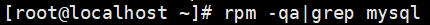
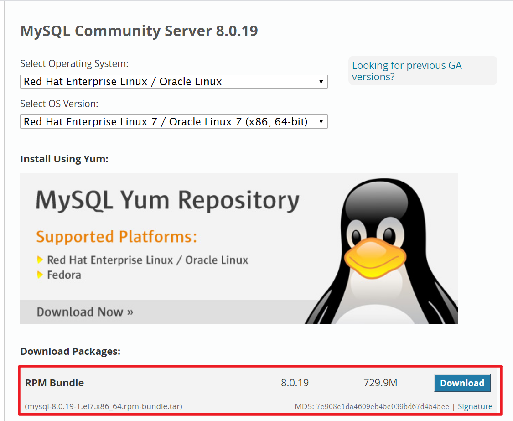

# 数据库— —Centos 7 安装mysql 8.0

本篇为文章主要介绍了如何在Centos 7上安装mysql 8.0。

[toc]

## 一、删除已安装的mysql

- 检查mariadb

  ` rpm -qa|grep mariadb `

  

- 删除mariadb

  如果有残存的mariadb的话，删除相关文件：

  ` rpm -e --nodeps mariadb-libs `

  

- 检查mysql

  同理，检查是否有残存的mysql文件：

  `rpm -qa|grep mysql`

  

- 删除mysql

  同理，如果有残存的mysql文件，删除之。

## 二、下载mysql 8.0 安装包

下载地址：https://dev.mysql.com/downloads/file/?id=492659

在此推荐先将安装包下载到自己的电脑上，然后使用winscp上传到服务器。

## 三、解压压缩包

首先进入压缩包所在的目录，然后执行解压命令：

`tar -xvf mysql-8.0.19-1.el7.x86_64.rpm-bundle.tar`

## 四、安装

 各rpm包是有依赖关系的，所以需要按照一定顺序进行安装，安装期间如果提示缺少哪些依赖也要先安装相应的包。

`rpm -ivh mysql-community-common-8.0.19-1.el7.x86_64.rpm`

`rpm -ivh mysql-community-libs-8.0.19-1.el7.x86_64.rpm`

`rpm -ivh mysql-community-client-8.0.19-1.el7.x86_64.rpm`

`rpm -ivh mysql-community-server-8.0.19-1.el7.x86_64.rpm`

注意，在安装mysql-community-server时，可能会出现以下错误；

> warning: mysql-community-server-5.7.26-1.el7.x86_64.rpm: Header V3 DSA/SHA1 Signature, key ID 5072e1f5: NOKEY
> error: Failed dependencies:
> 	libaio.so.1()(64bit) is needed by mysql-community-server-5.7.26-1.el7.x86_64
> 	libaio.so.1(LIBAIO_0.1)(64bit) is needed by mysql-community-server-5.7.26-1.el7.x86_64
> 	libaio.so.1(LIBAIO_0.4)(64bit) is needed by mysql-community-server-5.7.26-1.el7.x86_64

提示信息表示需要依赖libaio，所以需要使用以下命令先安装libaio：

`yum install libaio`

然后再重新执行上面的第四条命令，即安装mysql-community-server。

至此，mysql 8.0已成功安装在服务器上了。

## 五、启动mysql

启动mysql命令如下：

`systemctl start mysqld.service`

查看mysql服务状态：

`systemctl status mysqld.service`

## 六、登陆mysql

现在我们就可以登陆mysql了，但是，密码是什么呢?

我们可以使用以下命令查看密码：

`grep 'temporary password' /var/log/mysqld.log`

结果（红圈中的密码就是初始密码）：

然后使用密码和如下命令就可以登陆到Mysql了：

`mysql -u root -p`

## 七、修改密码

修改密码命令：

`  ALTER USER 'root'@'localhost' IDENTIFIED BY '你要修改成的密码'; `

注意，如果修改的密码过于简单，会导致修改密码失败。

## 八、允许远程访问服务器

登陆数据库后，依次执行以下命令：

`use mysql;`

`UPDATE user SET host = '%' WHERE user='root';`

`flush privileges;`

之后就可以远程访问数据库了，当然，有时候还会出现其他问题导致不能访问数据库，可以尝试考虑放行3306端口、关闭防火墙等措施。

## 九、设置开机启动

` systemctl enable mysqld `

` systemctl daemon-reload `

## 十、参考资料

[1]  https://juejin.im/post/5d07cf13f265da1bd522cfb6 

[2]  https://www.cnblogs.com/niuben/p/11481239.html 

[3]  https://www.linuxidc.com/Linux/2016-12/138979.htm 

[下一篇文章我们介绍如何在Windows 10下安装MySQL 8.0](./03.数据库— —Windows 10上安装MySQL 8.0)