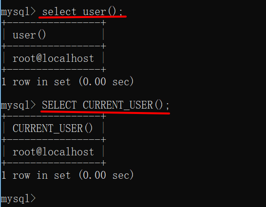
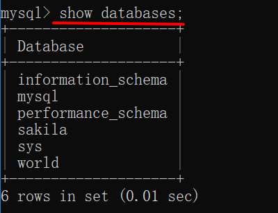
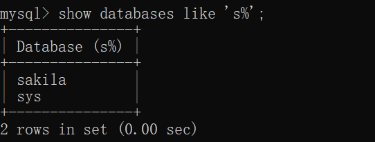
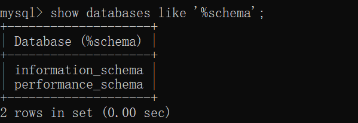
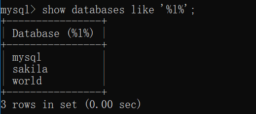
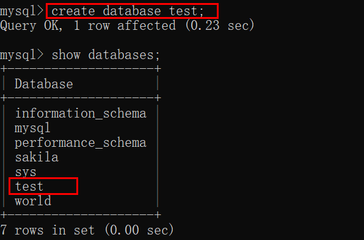
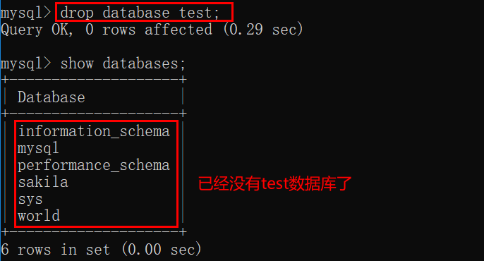
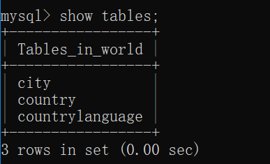
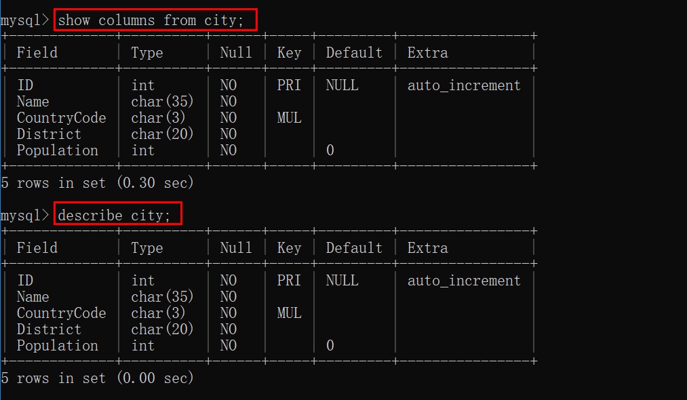

# 数据库— —操作数据库

本篇主要介绍如何查看数据库、创建数据库等操作。

[toc]

## 一、查看当前登陆的用户

登陆MySQL后，可以使用如下命令查看当前的用户是谁：

```mysql
select user();
或
select current_user();
```

结果：




## 二、查看数据库

可以使用以下命令查看当前用户权限范围下的所有数据库：

```mysql
show databases;
```



我们可以缩小查看的数据库范围，使用关键词**like**和**%**进行匹配：

```mysql
show databases like '字符';
```

例子：

- 查找数据库名与world完全匹配的数据库

```mysql
show databases like 'world';
```

- 查找数据库名以s开头的数据库

```mysql
show databases like 's%';
```

- 查找数据库名以schema结尾的数据库

```mysql
show databases like '%schema';
```

- 查找数据库名中包含l的数据库

```mysql
show databases like '%l%';
```

结果分别如下：









## 三、选择数据库

我们可以使用以下命令选择具体的数据库：

```mysql
use 数据库名;
```

例如：

```mysql
use world;
```

结果：


## 四、创建数据库

可以使用下面的命令创建自己的数据库：

```mysql
create database 数据库名;
```

例如：

```mysql
create database test;
```

然后查看所有的数据库，结果：




## 五、删除数据库

我们可以使用以下命令删除数据库：

```mysql
drop database 数据库名;
```

例如：




## 六、查看数据表

当选择了具体的数据库world后，可以使用以下命令查看该数据库里的数据表：

```mysql
show tables;
```

结果：



可以看到在数据库world里面有三张表：city、country和countrylanguage。


## 七、查看表的列名

我们可以使用以下的命令查看某一个数据表有哪些列：

```mysql
show columns from 数据表名;
或
describe 数据表名;
```

例如：



可以看到city表中有五列，其列名分别为ID、Name、CountryCode、District、Population，并且还有一些其他信息，我们将在以后介绍。


## 八、参考资料

[1]Ben Forta.MySQL必知必会[M].北京：人民邮电出版社，2009.15-19.

[2]https://blog.csdn.net/qq_35722899/article/details/92794536


[下一篇文章主要介绍如何创建和操纵数据表](./05.数据库— —创建和操纵数据表.md)