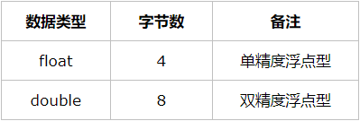

# 数据库— —创建和操纵数据表

本篇文章主要介绍数据类型以及操纵数据表。

[toc]

## 一、数据类型

什么是数据类型？比如说1，2，3，4...这些都是整数，那整数就是他们的数据类型，再比如说“hello"、"你好"都是字符串，那么字符串就是他们的数据类型。

在创建表时，需要指明每一列的数据类型，表示该列的数据必须是属于该数据类型的。在MySQL中，数据类型大致可以分为三类：数值、日期/时间和字符串/字符类型。

### 1.1 数值


MySQL中整型默认是带符号的，如果要使用无符号整数，可以在该数据类型后加上关键词“**unsigned**”。



float(M,D)、double(M,D)的用法规则：

- D表示浮点型数据小数点之后的精度(位数)，假如超过D位则四舍五入，假设float(5,2)，则1.233四舍五入为1.23，1.237四舍五入为1.24；

- M表示浮点型数据总共的位数，小数点前只支持M-D位数字。假设float(5,2)，则D=2则表示支持小数点后两位，即小数点前支持三位数；


当我们不指定M、D的时候，会按照实际的精度来处理。

使用float和double 存在的问题是精度丢失，即写入数据库的数据未必是插入数据库的数据，而decimal无论写入数据中的数据是多少，都不会存在精度丢失问题，所以接下来介绍decimal数据类型。

- float/double在数据库中存储的是近似值，而decimal则是以字符串形式进行保存的，所以不会丢失精度；
- decimal(M,D)的规则和float/double相同，但区别在float/double在不指定M、D时默认按照实际精度来处理，而decimal在不指定M，D时默认为decimal(10, 0)；


### 1.2 日期/时间

MySQL支持五种形式的日期/时间类型：date、time、year、datetime、timestamp。


datatime 和 timestamp的区别：

- datetime占8个字节，timestamp占4个字节；
- datetime支持的范围是 ‘1000-01-01 00:00:00.000000’到 ‘9999-12-31 23:59:59.999999’，timestamp支持的范围是’1970-01-01 00:00:01.000000’ UTC 到 ’2038-01-19 03:14:07.999999’ UTC；
- datetime默认值为空，当插入的值为null时，该列的值就是null；timestamp默认值不为空，当插入的值为null的时候，MySQL会取当前时间；
- datetime存储的时间与时区无关，timestamp存储的时间及显示的时间都依赖于当前时区；


### 1.3 字符串/字符


## 二、创建表

### 2.1 创建表

可以使用`create table`命令来创建数据表，创建表时需要给出以下信息：

- 表名，在关键词`create table`后面给出；
- 表列的名字和定义，每一列的定义用逗号分隔；

例子：

```mysql
create table student(
    id int not null auto_increment comment 'id',
    student_number char(14) not null comment '学号',
    name varchar(20) not null comment '学生姓名',
    birthday date not null comment '出生日期',
    gender char(1) not null default '男' comment '性别',
	primary key(id)
)engine=InnoDB charset=utf8;
```

结果：


在创建数据表时，每一列首先给出列名，然后后面紧跟数据类型，再附加一些限制条件。


### 2.2 主键设置

我们可以在创建表时使用以下的命令设置主键：

```mysql
primary key(列名[,列名,列名])
```

创建由多个列组成的主键，应该以逗号分隔给出每个列名。并且该主键的声明位于表列信息之后。


### 2.3 NOT NULL

可以在每个字段后面都加上这 NULL 或 NOT NULL 修饰符来指定该字段是否可以为空(NULL)，还是说必须填上数据 (NOT NULL)。MySQL 默认情况下指定字段为 NULL ，如果一个字段指定为NOT NULL，MySQL 不允许向该字段插入空值。


### 2.4 AUTO_INCREMENT

AUTO_INCREMENT 修饰符只适用于数据类型 INT 列，表明 MySQL 应该自动为该字段生成一个数(每次在上一次生成的数值上面加 1)。ID列常用于主键，并且是自增的。


### 2.5 默认值

可以使用 DEFAULT 修饰符为字段设定一个默认值。

当插入记录时，如果忘记传该列的值时，MySQL 会自动为您设置上该字段的默认值。


### 2.6 注释

在MySQL数据库中， 列的注释是用属性comment来添加。


## 三、更新表

我们可以使用`alter table`命令来更改表的结构，比如增加列、删除列

### 3.1 增加列

我们可以使用以下命令增加一列：

```mysql
alter table 表名
add 列名 数据类型 [其他限制信息];
```

例如：


### 3.2 删除列

我们可以使用以下命令删除列：

```mysql
alter table 表名
drop 列名;
```

例如：


### 3.3 修改列

如果需要修改字段类型及名称，你可以在ALTER命令中使用change：

```mysql
alter table 表名
change 旧列名 新列名 数据类型 [限制信息];
```

例如：


如果要修改列名，不能直接使用`alter table student change id new_id;`，这样会报错：


需要在后面加上数据类型等信息。


## 四、重命名表

我们可以使用以下命令重命名表名：

```mysql
rename table 旧表名 to 新表名;
```

例子：


## 五、删除表

我们可以使用以下命令删除数据表：

```mysql
drop table 表名;
```

例子：


## 六、参考资料

[1]https://www.cnblogs.com/xrq730/p/8446246.html

[2]菜鸟教程：https://www.runoob.com/mysql/mysql-data-types.html

[3]菜鸟教程：https://www.runoob.com/mysql/mysql-alter.html

[4]Ben Forta.MySQL必知必会[M].北京：人民邮电出版社，2009.144-154.


