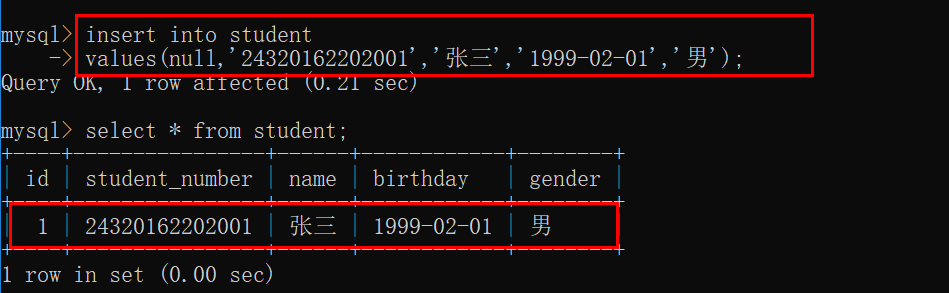
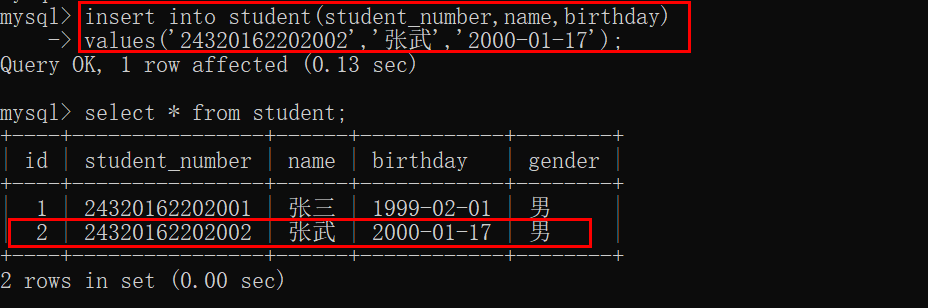
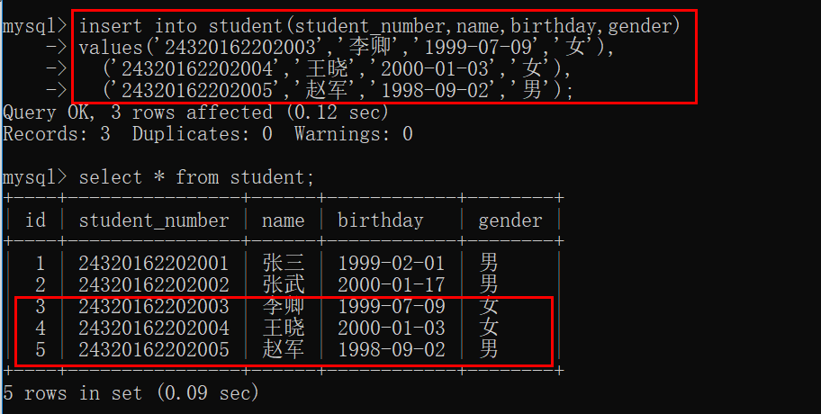

# 数据库— —插入数据

本篇文章主要介绍如何向数据表中插入数据。


在本例中，以student表为例，建表语句如下：

```mysql
create table student(
    id int not null auto_increment comment 'id',
    student_number char(14) not null comment '学号',
    name varchar(20) not null comment '学生姓名',
    birthday date not null comment '出生日期',
    gender char(1) not null default '男' comment '性别',
	primary key(id)
)engine=InnoDB charset=utf8;
```


## 一、插入一整行完整数据

可以使用以下命令向数据表中插入一行完整的数据：

```mysql
insert into 表名
values(第一列数据,第二列数据,第三列数据......);
```

例如：

```mysql
insert into student
values(null,'24320162202001','张三','1999-02-01','男');
```

结果：



如果该列数据是自增的，那么该列数值使用null值代替，不可以什么都不写，否则MySQL无法匹配。


## 二、插入部分数据

在插入完整一行数据时，必须明确知道各列的顺序，我们也可以明确插入部分数据，其余数据使用自增数据或者默认值，插入部分数据命令如下：

```mysql
insert into 表名(列名,列名,列名......)
values(第一列的数据,第二列的数据,第三列的数据......);
```

此处的第一列、第二列并不是对应数据表中的第一列、第二列，而是对应着插入语句中表名后的第一个列名、第二个列名。

例子：

```mysql
insert into student(student_number,name,birthday)
values('24320162202002','张武','2000-01-17');
```

结果：



可以看到我们并没有给出id和gender的数据，但是MySQL会根据其是否为自增数据或者默认值自动填充数据。

使用这种方法可以不用知道各列的顺序，使插入数据更加灵活。


## 三、插入多行数据

在上面的基础上，可以在`values`后面以逗号分隔多个数据行，表示插入多行数据：

```mysql
insert into 表名[(列名,列名,列名......)]
values(第一行第一列数据,第一行第二列数据,第一行第三列数据......)，
	  (第二行第一列数据,第二行第二列数据,第二行第三列数据......)，
	  ......
```

例子：

```mysql
insert into student(student_number,name,birthday,gender)
values('24320162202003','李卿','1999-07-09','女'),
	  ('24320162202004','王晓','2000-01-03','女'),
	  ('24320162202005','赵军','1998-09-02','男');
```




## 四、参考资料

[1]Ben Forta.MySQL必知必会[M].北京：人民邮电出版社，2009.131-136.
