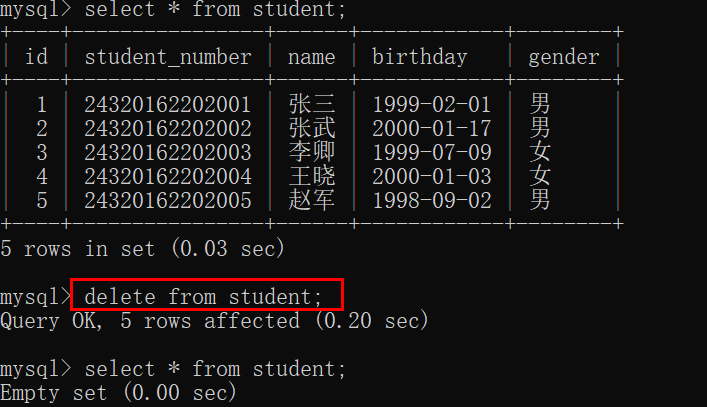
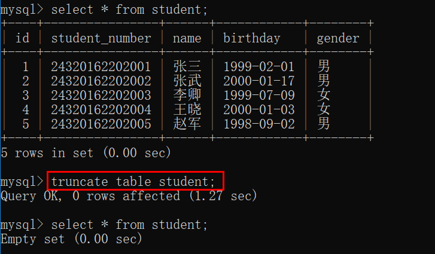
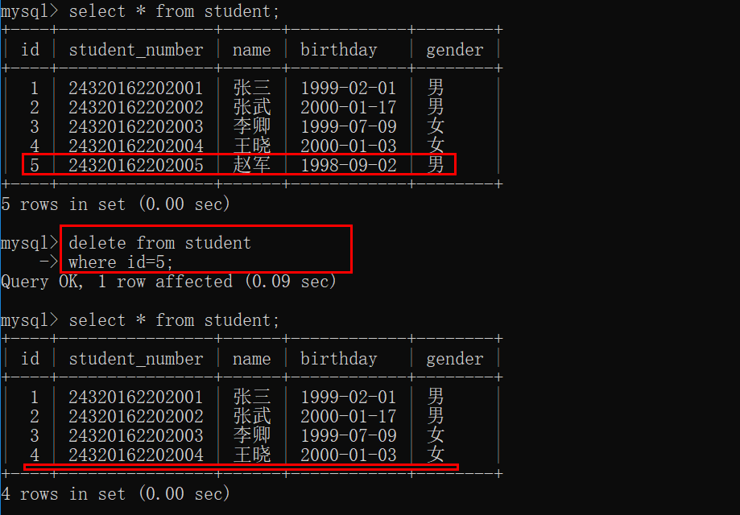
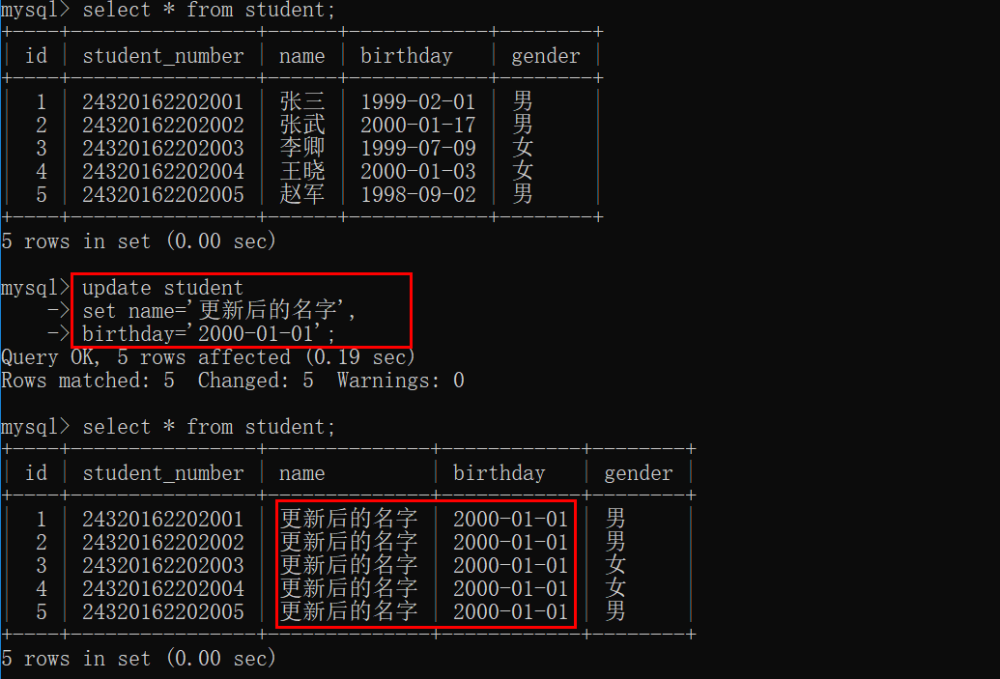
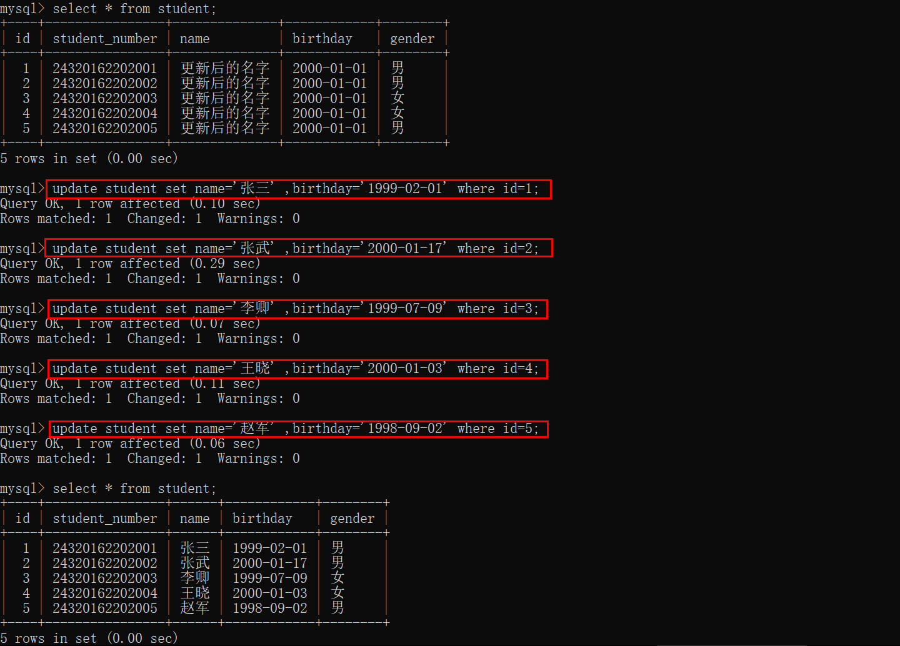

# 数据库— —删除和更新数据行

本篇文章主要介绍删除数据行以及更新数据行、更新特定的数据行。

[toc]

建表语句及数据：

```mysql
create table student(
    id int not null auto_increment comment 'id',
    student_number char(14) not null comment '学号',
    name varchar(20) not null comment '学生姓名',
    birthday date not null comment '出生日期',
    gender char(1) not null default '男' comment '性别',
	primary key(id)
)engine=InnoDB charset=utf8;

insert into `student` values (1, '24320162202001', '张三', '1999-02-01', '男');
insert into `student` values (2, '24320162202002', '张武', '2000-01-17', '男');
insert into `student` values (3, '24320162202003', '李卿', '1999-07-09', '女');
insert into `student` values (4, '24320162202004', '王晓', '2000-01-03', '女');
insert into `student` values (5, '24320162202005', '赵军', '1998-09-02', '男');
```


## 一、删除所有数据行

我们可以使用以下命令删除所有数据行：

```mysql
delete from 表名;
```

例子：



这种方式不提倡使用，因为大多数时候我们只想删除特定行，所以我们需要用带有`where`子句的`delete`删除语句来删除特定行。

PS：如果确实想要删除表中的所有数据，我们可以使用以下命令代替：

```mysql
truncate table 表名;
```

该语句实际是删除原来的表并重新创建一个表，而不是逐行删除数据，所以速度更快。

例子：




## 二、删除特定数据行

我们可以使用`where`子句删除特定的数据行，语法如下：

```mysql
delete from 表名
where 条件[,条件2，条件3];
```

其中`where`子句后的条件可以有多个，每个条件由逗号分隔。

条件是一个“列=值”对，表示选择“列=值”的行。

例如：

```mysql
delete from student 
where id=5;
```

表示删除`id=5`的行。




## 三、更新所有数据行

我们可以使用以下命令更新所有的数据行：

```mysql
update 表名
set 列名=新值，
	列名=新值，
	......;
```

上述语句会将数据表中的所有数据行都修改了，注意`update`和`表名`之间没有`table`。

例如：

```mysql
update student
set name='更新后的名字',
	birthday='2000-01-01';
```



如果在用`update`语句更新多行时，在更新这些行中的一行或者多行时出现一个错误，则整个`update`操作被取消，错误发生前更新的所有行被恢复到它们原来的值。即使发生错误也要继续进行更新，可以使用`ignore`关键字：

```mysql
update ignore 表名......
```

与删除一样，我们一般只想修改特定行的数据，所以仍然需要使用`where`子句来选择特定行。


## 四、更新特定数据行

语法：

```mysql
update 表名
set 列名=新值,
	列名=新值，
	......
where 条件[,条件2，条件3...];
```

例子：

```mysql
update student set name='张三' ,birthday='1999-02-01' where id=1;
update student set name='张武' ,birthday='2000-01-17' where id=2;
update student set name='李卿' ,birthday='1999-07-09' where id=3;
update student set name='王晓' ,birthday='2000-01-03' where id=4;
update student set name='赵军' ,birthday='1998-09-02' where id=5;
```



PS：如果要删除某列的值，可设置其为NULL值（如果表定义允许的话）。


## 五、参考资料

[1]Ben Forta.MySQL必知必会[M].北京：人民邮电出版社，2009.139-143.
