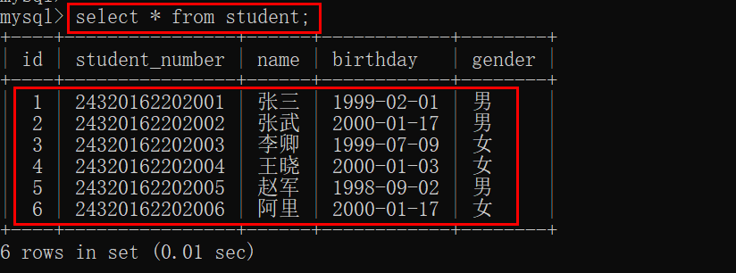
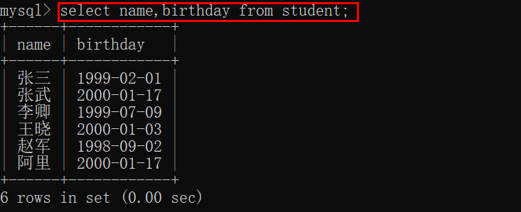
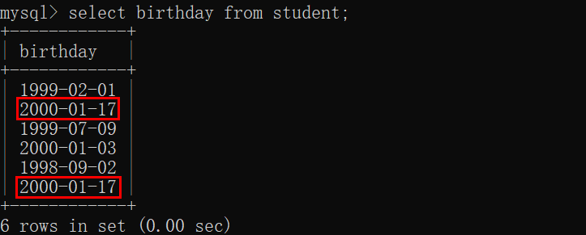
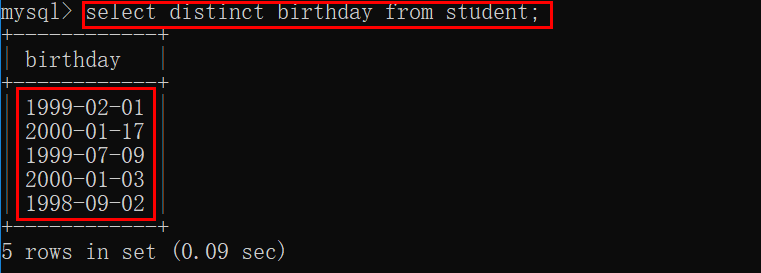
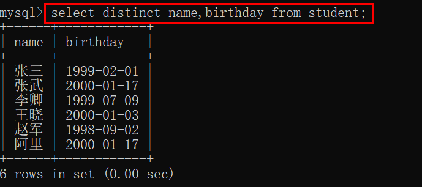
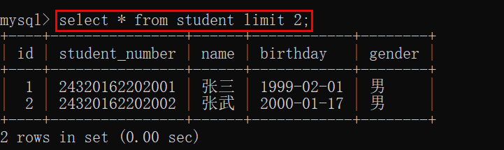
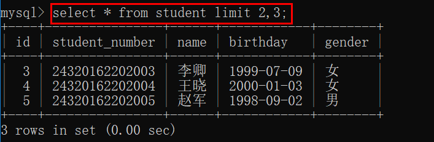

# 数据库— —查询数据

本篇文章主要介绍如何查询数据。

[toc]

建表语句及数据准备：

```mysql
create table student(
    id int not null auto_increment comment 'id',
    student_number char(14) not null comment '学号',
    name varchar(20) not null comment '学生姓名',
    birthday date not null comment '出生日期',
    gender char(1) not null default '男' comment '性别',
	primary key(id)
)engine=InnoDB charset=utf8;

insert into `student` values (1, '24320162202001', '张三', '1999-02-01', '男');
insert into `student` values (2, '24320162202002', '张武', '2000-01-17', '男');
insert into `student` values (3, '24320162202003', '李卿', '1999-07-09', '女');
insert into `student` values (4, '24320162202004', '王晓', '2000-01-03', '女');
insert into `student` values (5, '24320162202005', '赵军', '1998-09-02', '男');
insert into `student` values (6, '24320162202006', '阿里', '2000-01-17', '女');
```


## 一、查询全部数据

我们可以使用以下语句查询数据表中的群不数据：

```mysql
select * from 表名;
```

例如：




## 二、查询部分列数据

有时候，我们只想查询部分列的数据，可以在`select`后面加上要查询的列名，语法如下：

```mysql
select 列名[,列名,列名] from 表名;
```

例如，从学生表中只查询名字和生日：




## 三、检索不同的行

首先看一个例子，来确定有多少个不同的出生日期：

```mysql
select birthday from student;
```

可以结果把所有的出生日期都查询出来了，即使有重复的日期也会查询出来，假如我们有几千名几万名学生，那么就会查询几千几万个日期出来，可实际上，肯定有学生的出生日期相同，所以不会有和学生数量等量的日期数量。



我们可以使用关键字`distinct`来查询不同的行，就是查询出来的结果，没有重复的行，语法如下：

```mysql
select distinct 列名[,列名，列名] from 表名;
```

例如：



如果是查询多个列，那么加了`distinct`的查询结果是仍然是列的组合没有重复的，单个列的值有可能重复。




## 四、限制结果

如果我们查询的结果有很多行，我们可以使用关键字`limit`限制查询结果:

```mysql
select 列名[,列名,列名...] from 表名 limit 数字;
或
select 列名[,列名,列名...] from 表名 limit 数字,数字;
```

如果`limit`后面只有一个数字`n`，表示显示查询结果的前`n`条结果：



如果`limit`后面有两个数字`m,n`，表示从查询结果的第`m`条结果开始，显示接下来的`n`条结果（包括第`m`行）：



注意：查询出来的第一行为行0，不是行1。


## 五、参考资料

[1]Ben Forta.MySQL必知必会[M].北京：人民邮电出版社，2009.20-27
