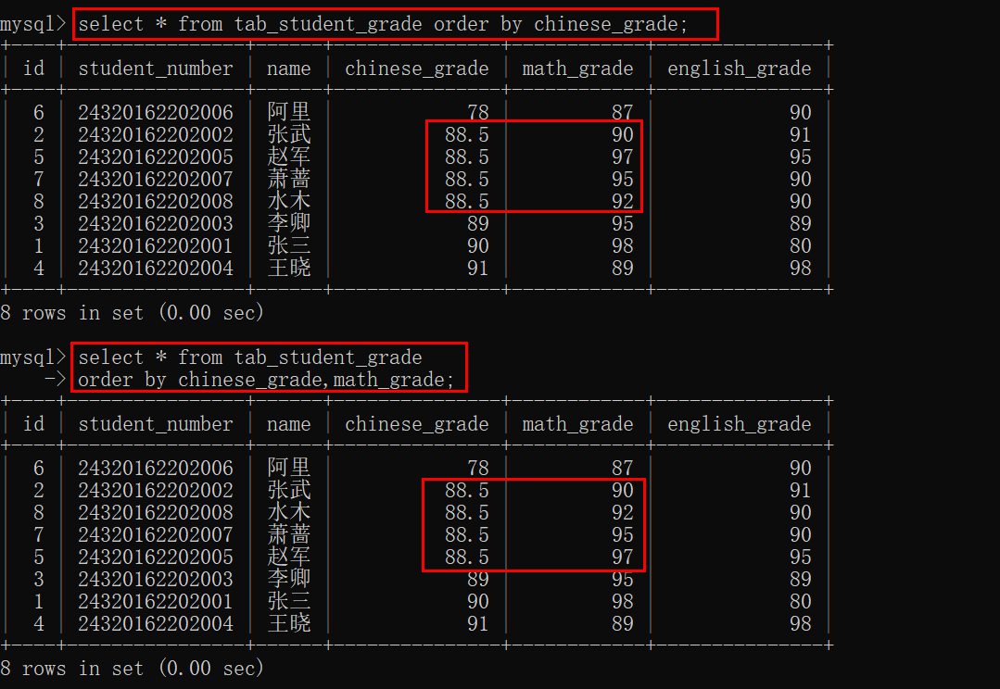
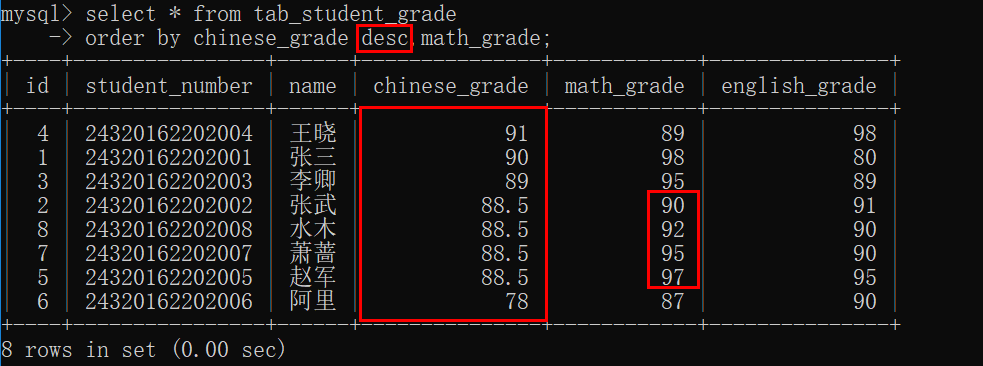

# 数据库— —排序查询结果

在本章中，我们将介绍如何排序查询结果。

[toc]

数据准备：

```mysql
create table tab_student_grade(
    id int not null auto_increment comment 'id',
    student_number char(14) not null comment '学号',
    name varchar(20) not null comment '学生姓名',
    chinese_grade float not null comment '语文成绩',
    math_grade float not null comment '数学成绩',
    english_grade float not null comment '英语成绩',
	primary key(id)
)engine=InnoDB charset=utf8;

insert into `tab_student_grade` values (null, '24320162202001', '张三',90.0,98.0,80.0);
insert into `tab_student_grade` values (null, '24320162202002', '张武', 88.5,90.0,91.0);
insert into `tab_student_grade` values (null, '24320162202003', '李卿', 89.0,95.0,89.0);
insert into `tab_student_grade` values (null, '24320162202004', '王晓', 91.0,89.0,98.0);
insert into `tab_student_grade` values (null, '24320162202005', '赵军', 88.5,97.0,95.0);
insert into `tab_student_grade` values (null, '24320162202006', '阿里', 78.0,87.0,90.0);
insert into `tab_student_grade` values (null, '24320162202007', '萧蔷', 88.5,95.0,90.0);
insert into `tab_student_grade` values (null, '24320162202008', '水木', 88.5,92.0,90.0);
```


## 一、按单列排序

当我们检索数据时，数据行的顺序是没有意义的，所以我们需要使用`order by`子句对检索出来的数据排序。

```mysql
select 列名[,列名...] from 表名 
order by 列名;
```

在子句`order by`后面跟上一列的名字，表示检索出来的数据根据该列进行排序，默认是升序（由小到大）。

例如：

```mysql
select * from tab_student_grade
order by chinese_grade;
```

表示将查询出来的顺序按照语文成绩，从小到大进行排列。


## 二、按多列排序

在子句`order by`后面可以有多个列名，表示按照多列进行排序，排序规则是首先将查询结果按照`order by`后的第一列进行排序，然后在该基础上按照第二列进行排序，依次类推。

在上述例子中，查询结果以语文成绩排序，但是数学成绩并没有顺序，如有四个同学的语文成绩都是88.5，但是他们的数学成绩分别为90，97，95，92，是没有顺序的，所以我们可以在语文成绩排序的基础上，再对数学成绩进行排序。

```mysql
select * from tab_student_grade
order by chinese_grade,math_grade;
```




## 三、升序、降序排序

使用`order by`子句排序，默认是升序，即关键词`asc`，我们也可以使用关键词`desc`降序排序。

```mysql
select * from tab_student_grade
order by chinese_grade desc,math_grade;
```



每个列名后面跟`desc`表示降序，如果该列后面没有`desc`，则该列按照升序排列。


## 四、order by子句的位置

我们看一个例子，结合`limit`和`order by `：

```mysql
select * from tab_student_grade
order by chinese_grade
limit 1;
```

结果：


表示显示语文成绩最低的同学信息。

如果我们交换`limit`和`order by`子句的顺序，则会发生错误：


所以在给出`order`by子句时，应该保证它位于`from`子句后面，如果使用`limit`，他必须位于`order by`之后。使用子句的次序不对将产生错误信息。


## 五、参考资料

[1]Ben Forta.MySQL必知必会[M].北京：人民邮电出版社，2009.28-33.


[下一篇我们主要介绍如何过滤检索出来的数据](./10.数据库— —过滤数据.md)

