# 数据库— —过滤数据

在之前的例子中，我们都是将一个表中所有行的数据查询出来，但实际上，我们可能只需要特定的行数据，并不需要所有行数据，所以本篇主要介绍如何过滤行数据。

[toc]

## 一、使用where子句过滤数据

### 1.1 例子

我们可以使用`where`子句来过滤查询出来的数据，`where`子句后面跟过滤条件：

```mysql
select 列名[,列名...] from 表名
where 条件;
```

例如：

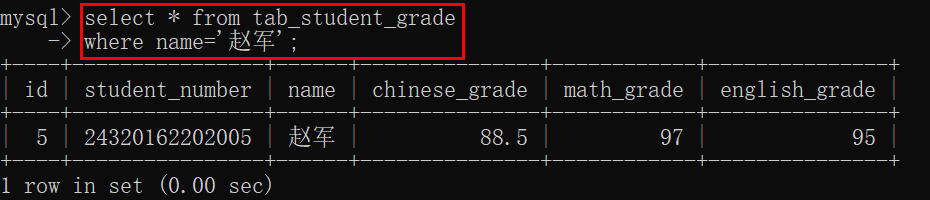

查询名字等于“赵军”的同学的成绩。


### 1.2 条件操作符

除了上述的等于操作符，还有其他的条件操作符：

|   操作符    |        说明        |
| :---------: | :----------------: |
|      =      |        等于        |
|     !=      |       不等于       |
|     <>      |       不等于       |
|      <      |        小于        |
|     <=      |      小于等于      |
|      >      |        大于        |
|     \>=     |      大于等于      |
| between and | 在指定的两个值之间 |

下面是一些关于上述条件操作符的例子：

- 不等于

  查询id不等于1的同学成绩：

  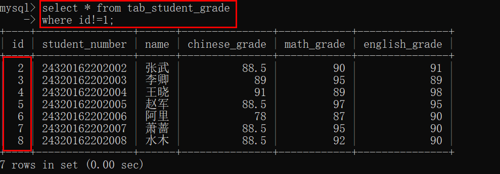

  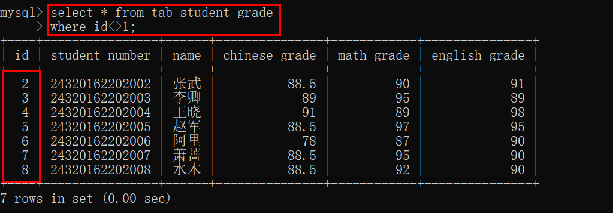

- 小于

  查询语文成绩小于90分的同学：

  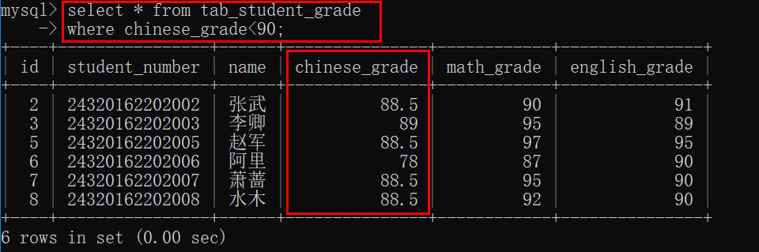

- 小于等于

  查询语文成绩小于等于90分的同学：

  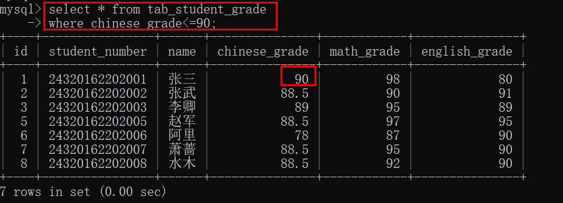

- 大于

  查询语文成绩大于90分的同学：

  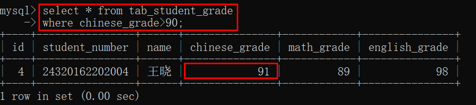

- 大于等于

  查询语文成绩大于等于90分的同学：

  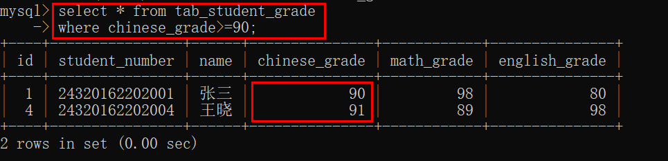

- 两者之间

  查询id在2和5之间的同学，包括2和5：

  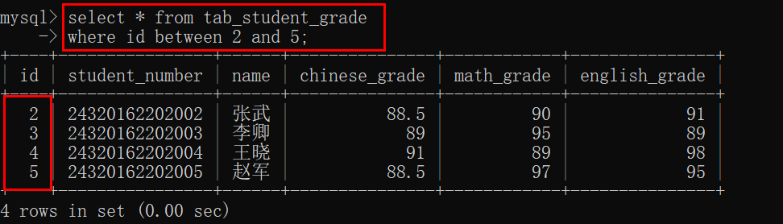


### 1.3 空值检查

如果要查询出某个列值为空值的数据，我们可以使用空值检查：

```mysql
select 列名[,列名...] from 表名
where 列名 is null;
```

注意使用的是`is`，而不是`=`。


## 二、多条件过滤数据

在上述例子中，`where`子句后面只跟了一个条件，其实我们也可以跟多个条件进行过滤数据。我们可以使用`and`和`or`操作符连接多个条件。

### 2.1 and操作符

使用`and`操作符连接多个条件，表示查询出的数据行必须同时满足多个条件。

```mysql
select 列名[,列名...] from 表名
where 条件1 and 条件2 and 条件3 ...;
```

例如，查询出三科成绩都大于等于80分的同学信息：

```mysql
select id,student_number,name from tab_student_grade
where chinese_grade>=80 and math_grade>=80 and english_grade>=80;
```


从这个例子中，我们也可以看出条件中的列名不一定是我们要显示的列，可以是不显示的列。、


### 2.2 or操作符

使用`or`操作符连接多个条件，表示查询出的结果只要满足其中一个条件即可。

```mysql
select 列名[,列名...] from 表名
where 条件1 or 条件2 or 条件3 ...;
```

例如，查询任意一科成绩上了95分的同学：

```mysql
select * from tab_student_grade
where chinese_grade>=95 or math_grade>=95 or english_grade>=95;
```

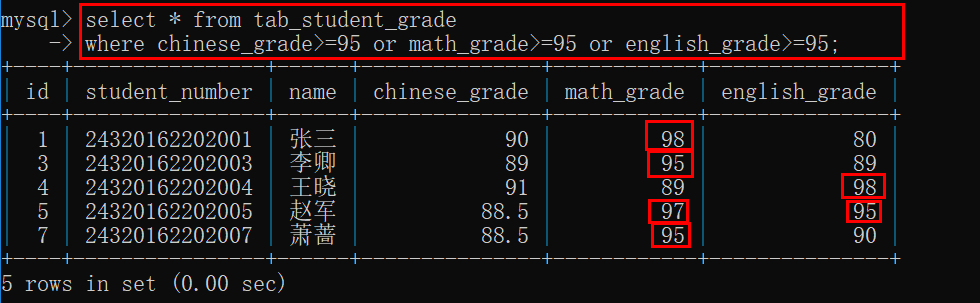


### 2.3 and和or的计算顺序

如果`and`和`or`操作符在一个`where`子句中，那么优先处理`and`操作符，然后处理`or`操作符。

**在实际应用中，应该明确使用圆括号`()`来确定处理顺序，里层的括号先处理。**

例如，查询语文成绩大于等于90分的同学或者数学和英语成绩同时大于等于90分的同学：

```mysql
select * from tab_student_grade
where chinese_grade >= 90 or math_grade >= 90 and english_grade >= 90;
```

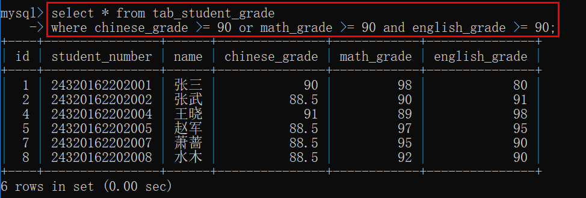

上述语句实际上等同于：

```mysql
select * from tab_student_grade
where (chinese_grade >= 90 or (math_grade >= 90 and english_grade >= 90));
```

如果我们改变括号：

```mysql
select * from tab_student_grade
where ((chinese_grade >= 90 or math_grade >= 90) and english_grade >= 90);
```

表示语文和英语成绩大于等于90分或者数学和英语成绩大于等于90分的同学，就是英语成绩一定要大于等于90分，其余两科有一科大于等于90分即可：

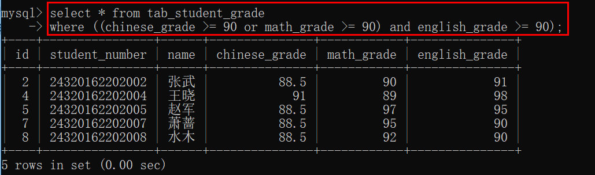


## 三、in和not操作符

### 3.1 in操作符

使用`in`操作符，可以指定条件范围，范围中的每个条件都可以进行匹配。条件范围由圆括号分隔，括号里面的条件由逗号分隔。

```mysql
select 列名[,列名...] from 表名
where 列名 in (值1,值2,值3...);
```

实际上，这是一种简化的`or`操作符写法，上述语句等于：

```mysql
select 列名[,列名...] from 表名
where 列名=值1 or 列名=值2 or 列名=值3 ...;
```

例如：

```mysql
select * from tab_student_grade
where id in (1,2,5);
```

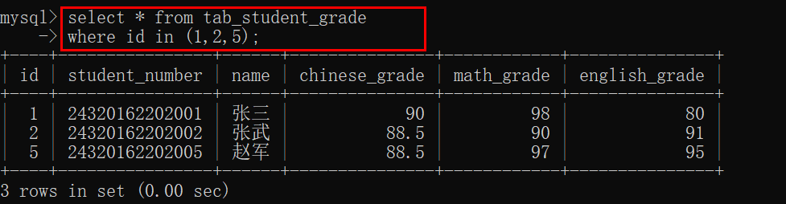

上述语句实际等于下列语句：

```mysql
select * from tab_student_grade
where id=1 or id=2 or id=5;
```

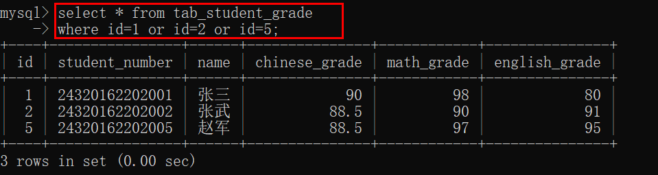


### 3.3 not操作符

`where`子句中的`not`操作符，用来否定其之后的任何条件。

MySQL支持`not`对`in` 、`between and`和`exists`取反。

例如：

```mysql
select * from tab_student_grade
where id not in (1,2,5);
```

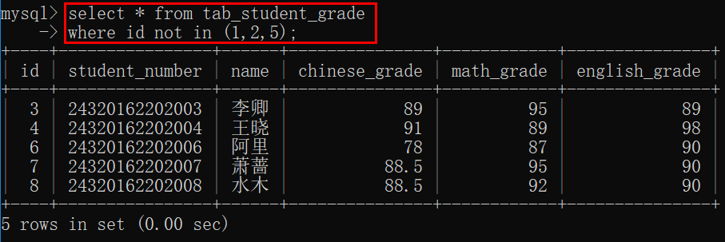


## 四、使用通配符进行过滤

### 4.1 like操作符

前面介绍的操作符都是针对已知值进行匹配过滤，但是如果只知道一部分的值，需要使用通配符进行匹配。如果在搜索子句中使用通配符，则必须使用`like`操作符。`like`指示MySQL，后跟的搜索模式使用通配符匹配，而不是直接相等匹配。


### 4.2 % 通配符

`%`表示任何字符出现任意次数。

例如：

搜索姓张的同学的成绩：

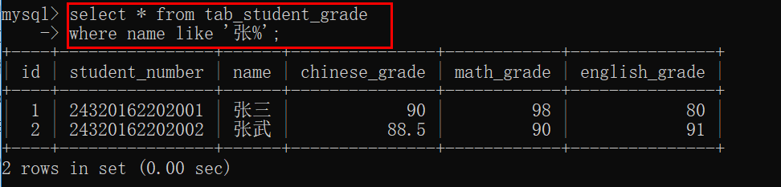

`%`不仅能用在匹配字符串上，也能用在匹配数字上：

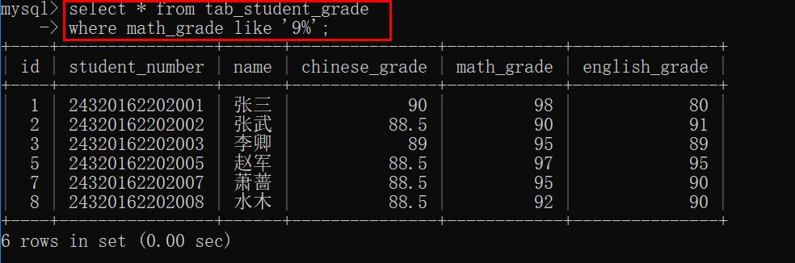

`%`可以是在待匹配字符中任意的位置上。


### 4.3 _ 通配符

`_`表示匹配单个字符。

例子表示匹配语文成绩为8开头的整数成绩：

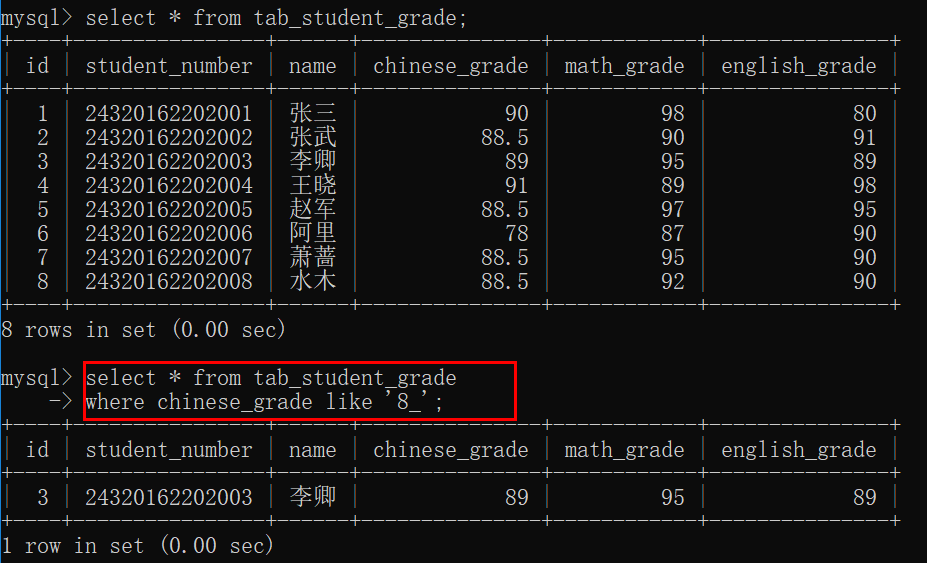


## 五、参考资料

[1]Ben Forta.MySQL必知必会[M].北京：人民邮电出版社，2009.34-50.
