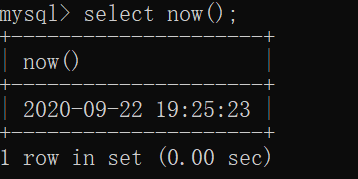

# 数据库— —运算符与函数

本文主要介绍MySQL中的运算符与函数。

## 一、运算符

### 1.1 + - * /

加减乘除

### 1.2 % mod()

求余运算符和函数

### 1.3 比较运算符

大于`>`，大于等于`>=`，小于`<`，小于等于`<=`，等于`=`

### 1.4 左移<<和右移>>

左移的格式`左移几为n<<要左移的数字m`，左移相当于$m*2^n$。

右移的格式`要右移的数字m>>右移几位n`，右移相当于$m/2^n$。

### 1.5 逻辑运算符 与或非

我们可以使用`&&、||、!`来表示与或非

也可以使用`AND,OR,NOT`来表示与或非

## 二、数学函数

### 2.1 abs(n)

返回n的绝对值

### 2.2 ceil(n)和ceiling(n)

返回大于等于n的最小整数

### 2.3 floor(n)

返回小于等于n的最大整数

### 2.4 ln(n)，log(m,n)，log2(n)，log10(n)

`ln(n)`返回以e为底的n的对数值。

`log(m,n)`返回以m为底的n的对数值。

`log2(n)`返回以2为底的n的对数值。

`log10(n)`返回以10为底的n的对数值。

### 2.5 pow(m,n)和power(m,n)

返回$m^n$

### 2.6 sqrt(n)

返回n的平方根

### 2.7 rand()

返回一个【0，1）之间的随机数。

### 2.8 exp(n)和pi()

`exp(n)`返回$e^n$；我们可以使用`exp(1)`返回自然数e;

`pi()`返回$\pi$值;

## 三、文本函数

### 3.1 length(str)和char_length(str)

`length(str)`返回字符串的字节长度；

`char_length(str)`返回字符串的字符长度；

### 3.2 upper(str)和lower(str)

将字符串转换为大写字母和小写字母。

### 3.3 trim()、ltrim()和rtrim()

`trim()`去除字符串两边的空白字符；

`ltrim()`去除字符串的左边空白字符；

`rtrim()`去除字符串的右边空白字符；

### 3.4 substring()

substring()有四种形式：

- substring(str,pos)返回str从pos开始到结尾的子字符串，包括pos
- substring(str FROM pos)，同substring(str,pos)
- substring(str,pos,len)，返回str从pos开始长度为len的子字符串
- substring(str FROM pos FOR len)，同substring(str,start,end)

所有的字符串第一个字符索引为1。

### 3.5 reverse()

翻转字符串

### 3.6 replace(str,from_str,to_str)

用`to_str`替换`str`中的`from_str`；

### 3.7 repeat(str,count)

重复`str`字符串`count`次

### 3.8 concat(str1,str2,...)和concat_ws(separator,str1,str2,...)

`concat(str1,str2,...)`返回多个字符串的连接字符串。

`concat_ws(separator,str1,str2,...)`返回多个字符串的用sepator分隔的连接字符串。

### 3.9 space(n)

返回长度为n的空白字符串

### 3.10 instr(str,substr)

返回substr在str中第一次出现的位置。

## 四、日期时间函数

### 4.1 now()

返回当前的日期时间。

### 4.2 current_date()，current_time()，current_timestamp()

`current_date()`：返回当前的日期；

`current_time()`：返回当前的时间；

`current_timestamp()`：返回当前的时间戳，即日期时间；

### 4.3 adddate(date,INTERVAL expr unit )和adddate(date,days)

返回date加上指定天数后的日期；

也可以加上月/年：

### 4.4 addtime(expr1,expr2)

将expr2加到expr1并返回结果，expr1可以是日期时间表达式或时间表达式，expr2是时间表达式；

### 4.5 date_format(date,format)

根据格式字符串format格式化日期时间。

常见的格式符号为：

| 符号 |                             说明                             |
| :--: | :----------------------------------------------------------: |
|  %Y  |                     年份，用四个数字表示                     |
|  %m  | 月份(00-12)，如果月份为0，则返回00，如果月份大于12，则返回Null |
|  %d  | 一个月中的第几天（00-31），如果天数为0，则返回00，如果大于31，则返回Null |
|  %H  |                        小时（00-23）                         |
|  %i  |                        分钟（00-59）                         |
|  %s  |                         秒（00-59）                          |
|  %T  |                   24小时表示时间，%H:%i:%s                   |

## 五、系统函数

### 5.1 version()

查看数据库版本

### 5.2 database()

查看当前数据库

### 5.3 user()

查看当前用户

## 六、统计函数/聚集函数

聚集函数通常用于一组数据，他们通常和`group by`子句使用，用于将值分为子集。

### 6.1 avg()

语法为`avg([distinct] column_name)`

返回一组值的平均值，可选关键字为`DISTINCT`，表示重复的值只计算一次。

### 6.2 min()和max()

返回一组值的最小值和最大值

### 6.3 count()

语法：`count([distinct] column_name)`

返回该组值有多少个值。`distinct`为可选关键字，表示该组中有多少个不同的值。

### 6.4 sum()

语法为`sum([distinct] column_name)`

表示该组值的和，可选关键字`distinct`表示该组不同值的和。

