# 数据库— —分组查询

本文主要介绍分组查询。


## 0.环境搭建

在接下来的案例学习中，需要导入数据库，文件如下：

链接：https://pan.baidu.com/s/1Fy2ptUWWruWYHL_udjtH2w 
提取码：yzvp

利用语句`source c:\xxx\xxx\myemployees.sql`导入SQL文件。

其中包含四张表：

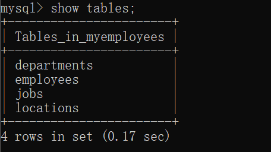


## 一、语法规则

分组查询就是在查询的基础上加上`GROUP BY`子句：

```sql
SELECT 分组/聚集函数(参数列名)，列1，列2....
FROM 表名
[WHERE 分组前筛选条件]
GROUP BY 列名1，列名2.../表达式或函数(较少)
[HAVING 分组后筛选条件]
ORDER BY 列名；
```

对于分组查询的理解：

- 首先只看查询语句以及分组前筛选条件，并且去掉聚集函数，但是不去掉参数列名，即首先执行如下语句：

  ```sql
  SELECT 参数列名，列1，列2....
  FROM 表名
  [WHERE 分组前筛选条件]
  ```

- 然后加上分组条件：

  ```sql
  SELECT 参数列名，列1，列2....
  FROM 表名
  [WHERE 分组前筛选条件]
  GROUP BY 列名1，列名2.../表达式或函数(较少)
  ```

  即在第一步的基础上，将结果集按照分组的列分成几个小组

- 然后加上函数：

  ```sql
  SELECT 分组(聚集)函数(参数列名)，列1，列2....
  FROM 表名
  [WHERE 分组前筛选条件]
  GROUP BY 列名1，列名2.../表达式或函数(较少)
  ```

  即在每一组内进行函数操作；

- 最后加上分组后筛选条件和排序子句：

  ```sql
  SELECT 分组(聚集)函数(参数列名)，列1，列2....
  FROM 表名
  [WHERE 分组前筛选条件]
  GROUP BY 列名1，列名2.../表达式或函数(较少)
  [HAVING 分组后筛选条件]
  ORDER BY 列名；
  ```

  

## 二、分组查询使用

案例一：查询每个部门的平均工资。

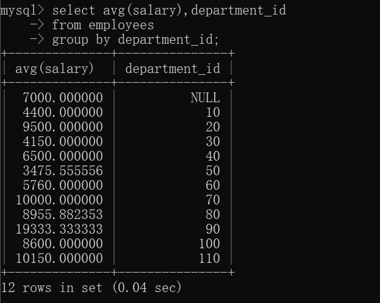


案例二：查询每个工种的最高工资

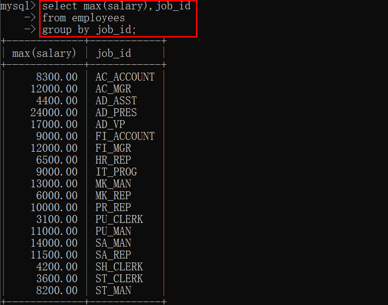


案例三：查询每个位置上的部门数

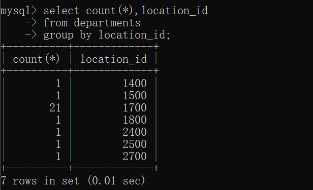


## 三、带有筛选条件的分组

### 3.1 分组前的筛选条件

案例：查询邮箱中包含a字符的部门的平均工资

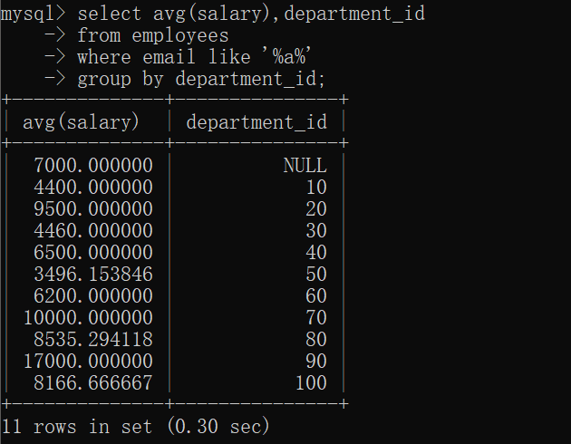


### 3.2 分组后的筛选条件

案例：查询邮箱中包含a字符的平均工资大于6000的部门

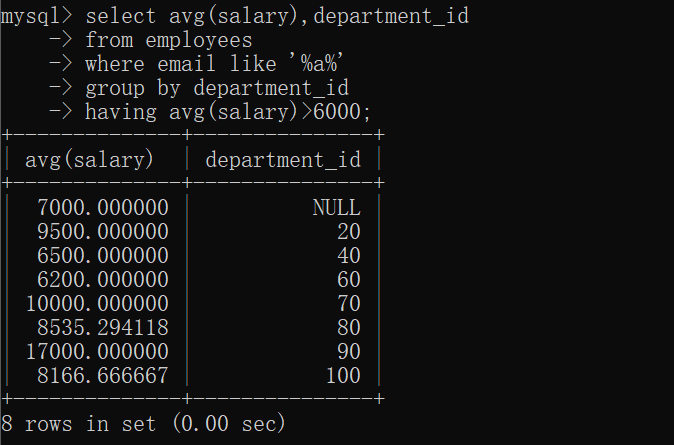


### 3.3 两者对比


## 四、排序

我们可以在`ORDER BY`子句中对结果进行排序：

案例：查询邮箱中包含a字符的平均工资大于6000的部门，并按照平均工资排序

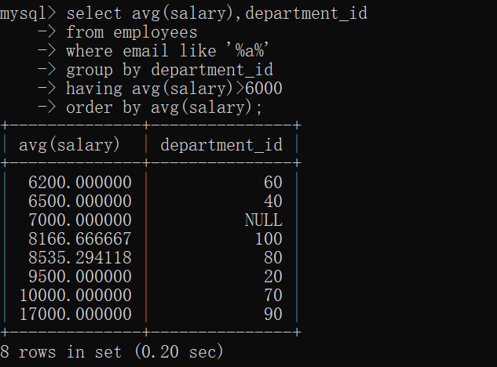


## 五、别名使用

我们可以在`SELECT `中命名别名，在`HAVING`和`ORDER BY`子句中使用别名：

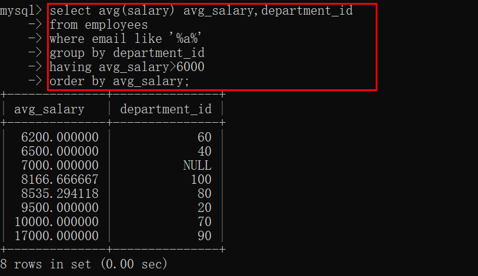


## 六、案例练习

案例一：查询各job_id的员工工资的最大值，最小值，平均值，总和，并按job_id升序；

```sql
select job_id,max(salary),min(salary),avg(salary),sum(salary)
from employees
group by job_id
order by job_id;
```

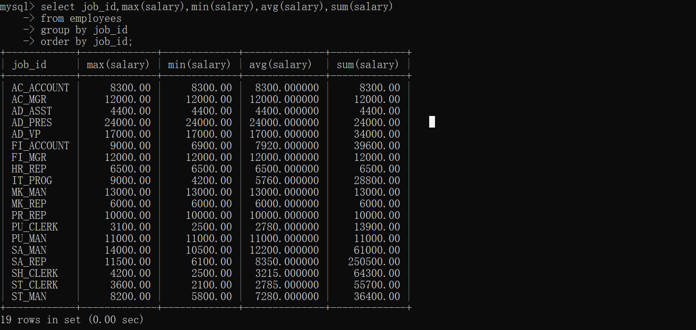


案例二：查询各个管理者手下员工的最低工资，其中最低工资不能低于6000，没有管理者的员工不计算在内

```sql
select min(salary),manager_id
from employees
where manager_id is not null 
group by manager_id
having min(salary)>=6000;
```

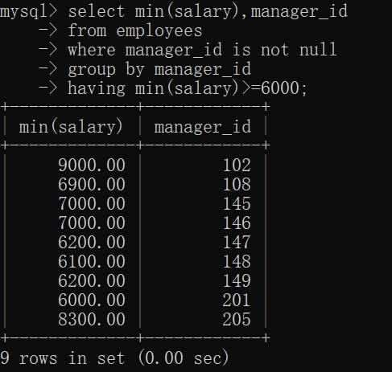


案例三：查询所有部门的编号，员工数量和工资平均值，并按平均工资降序；

```sql
select department_id,count(*) number_of_employees,avg(salary) avg_salary
from employees
group by department_id
order by avg(salary) desc;
```

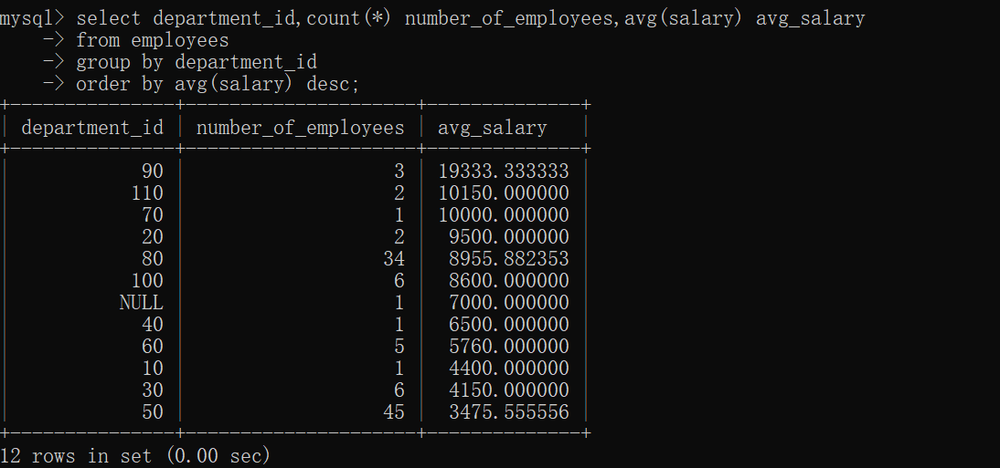


案例四：选择各个job_id的员工人数

```plsql
select job_id,count(*)
from employees
group by job_id;
```

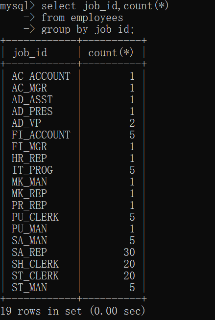