# 数据库— —连接查询

本文主要介绍连接查询。若一个查询涉及到多张表，则称之为连接查询。


## 零、环境准备

本文需要用到的数据库及表如下：

```sql
create database if not exists couple;
use couple;

create table girl(
    `id` int primary key auto_increment,
    `name` varchar(30) not null,
    `boyfriend_id` int
);

create table boy(
	`id` int primary key auto_increment,
    `name` varchar(30) not null,
    `girlfriend_id` int
);

insert into girl values(null,'杨颖',1);
insert into girl values(null,'迪丽热巴',null);
insert into girl values(null,'古力娜扎',null);
insert into girl values(null,'孙俪',2);
insert into girl values(null,'关晓彤',3);

insert into boy values(null,'黄晓明',1);
insert into boy values(null,'邓超',4);
insert into boy values(null,'鹿晗',5);
insert into boy values(null,'张艺兴',null);
insert into boy values(null,'吴亦凡',null);
```

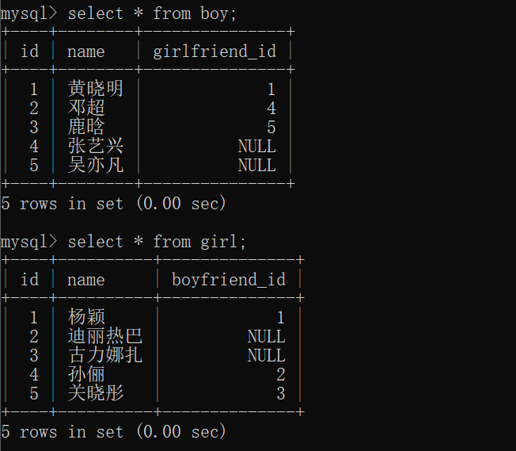


## 一、笛卡尔积

假设现有m列的表A，有k1个行；n列的表B，有k2个行。

则表A和表B的笛卡尔积是一个新的表，其有m+n列，有k1*k2行。

即新表就是用表A的每一行去匹配表B的每一行。

举例，现有表A和表B如下：

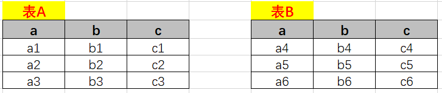

则AXB，即表A和表B的笛卡儿积如下：

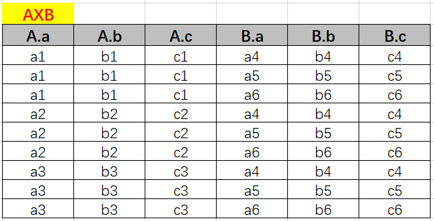


## 二、分类

连接查询按照功能分类，可分为：

- 内连接：连接结果行，既能在A表中找到，也能在B表中找到，即两表的相交结果；

  

  - 等值连接：用相等条件筛选相交部分；
  - 非等值连接：用不等的条件（>=,>,<,<=,!=)筛选相交部分；
  - 自连接：该表与自己连接；

- 外连接

  - 左外连接：获取左表的所有记录；

    

  - 右外连接：获取右表的所有记录；

    

  - 全外连接

- 交叉连接：就是笛卡尔积

连接查询按照年代分类，可分为：

- SQL92标准：在MySQL中，仅仅支持内连接
- SQL99标准：在MySQL中，支持内连接、外连接（除全外连接）和交叉连接


## 二、SQL92标准

### 2.1 笛卡尔积

在MySQL 92标准中，表示笛卡尔积的语法如下：

```sql
select 别名1.列名，别名1.列名，别名2.列名...
from 表名1 别名1 ， 表名2 别名2；
```

举例：

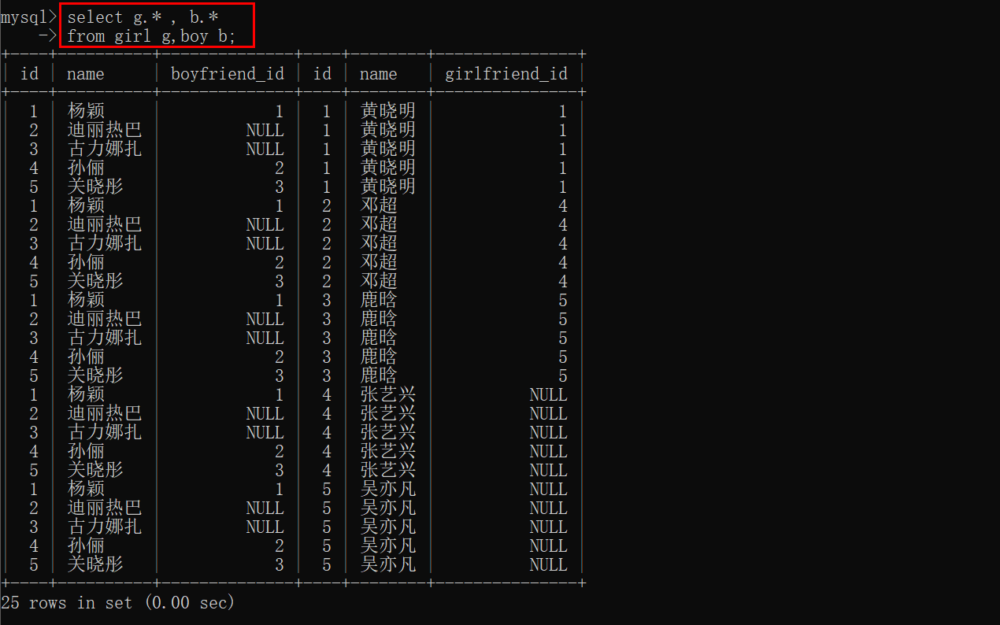


### 2.2 等值连接

等值连接就是在笛卡尔积的基础上加上相等的条件，用于筛选指定的行：

```sql
select 别名1.列名，别名1.列名，别名2.列名...
from 表名1 别名1 ， 表名2 别名2
where 筛选条件（相等）；
```

举例：查询每个女生的男朋友。

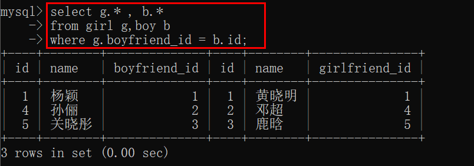


### 2.3 非等值连接

非等值连接就是将等值连接的筛选条件改为非等：

```sql
select 别名1.列名，别名1.列名，别名2.列名...
from 表名1 别名1 ， 表名2 别名2
where 筛选条件(不相等）；
```

举例：使用上一节的数据库myemployees，查询员工名及其工资等级。

首先增加工资等级的表：

```sql
use myemployees;
create table salary_grade(
	`grade` char(4) not null,
    `lowest_salary` int not null,
    `highest_salary` int not null
);

insert into salary_grade values('F',1000,2999);
insert into salary_grade values('E',3000,4999);
insert into salary_grade values('D',5000,7999);
insert into salary_grade values('C',8000,9999);
insert into salary_grade values('B',10000,18999);
insert into salary_grade values('A',19000,25999);
```

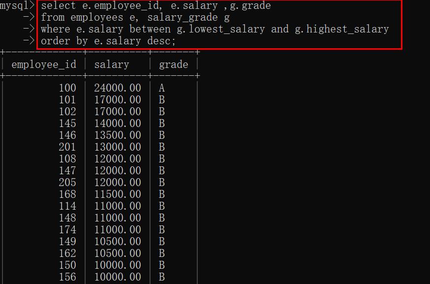


### 2.4 自连接

即自己与自己进行连接：

```sql
select 别名1.列名，别名1.列名，别名2.列名...
from 表名1 别名1 ， 表名1 别名2
where 筛选条件；
```

例子：查询员工的上司

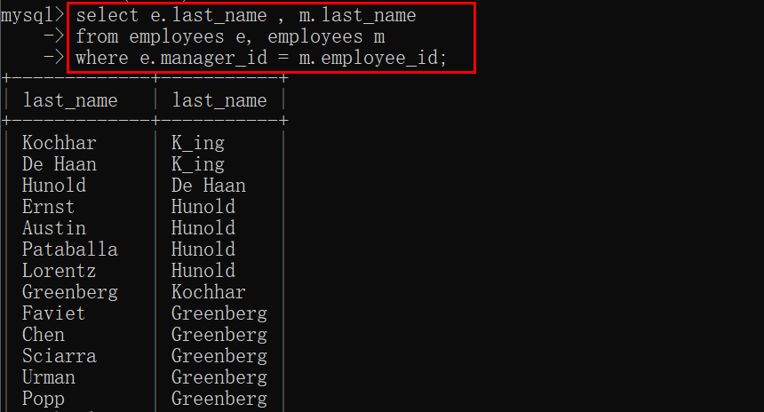


## 三、SQL99标准

### 3.1 内连接

```sql
select 列
from 表1 别名1
inner join 表2 别名2 on 连接条件
[inner join 表3 别名3 on 连接条件]
[where 筛选条件]
...;
```

SQL 99的标准是将连接条件和筛选条件进行分隔，使逻辑更清楚。

例如，查询每个女生的男朋友：

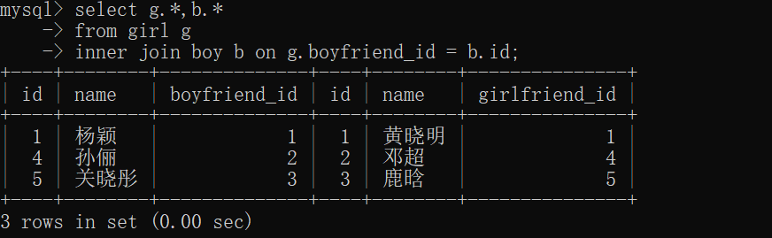

如果想再筛选出姓“孙”的女生的男朋友，则添加`where`子句：

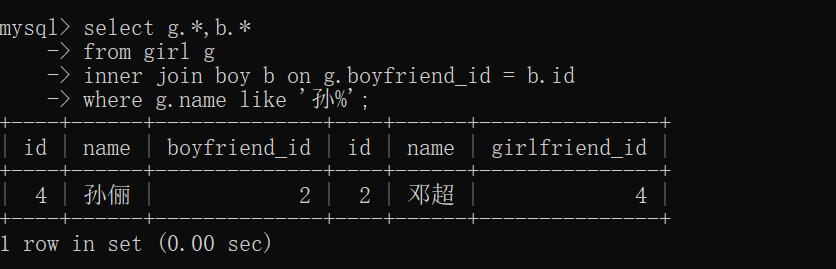


### 3.2 外连接

#### 3.2.1 左外连接

语法如下：

```sql
select 列
from 表1 别名1
left outer join 表2 别名2 on 连接条件
[left outer join 表3 别名3 on 连接条件]
[where 筛选条件]
...;
```

举例，利用左外连接查询女生的男朋友：

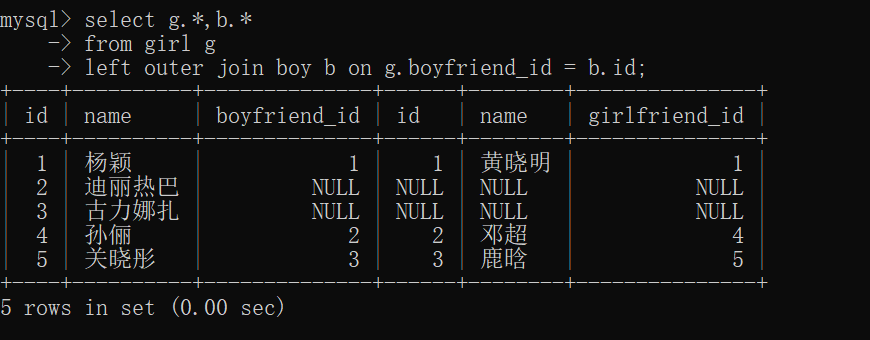

我们发现所有的女生记录都在结果集中，而没有男朋友的女生，在男朋友信息列中，用null填充，我们可以用where筛选：

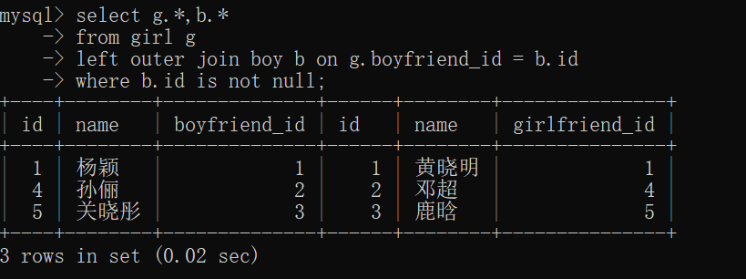


#### 3.2.2 右外连接

语法：

```sql
select 列
from 表1 别名1
right outer join 表2 别名2 on 连接条件
[right outer join 表3 别名3 on 连接条件]
[where 筛选条件]
...;
```

右外连接与左外连接类似，不过此时右表作为主表，即右表所有行都在结果集中。

左外连接和右外连接可以相互转换。


#### 3.2.3 全外连接

语法：

```sql
select 列
from 表1 别名1
full outer join 表2 别名2 on 连接条件
[full outer join 表3 别名3 on 连接条件]
[where 筛选条件]
...;
```

全外连接就是左外连接+右外连接。在MySQL中不支持。


### 3.3 交叉连接

交叉连接就是笛卡儿积，语法如下：

```sql
select 列
from 表1 别名1
cross join 表2 别名2 on 连接条件
[cross join 表3 别名3 on 连接条件]
[where 筛选条件]
...;
```

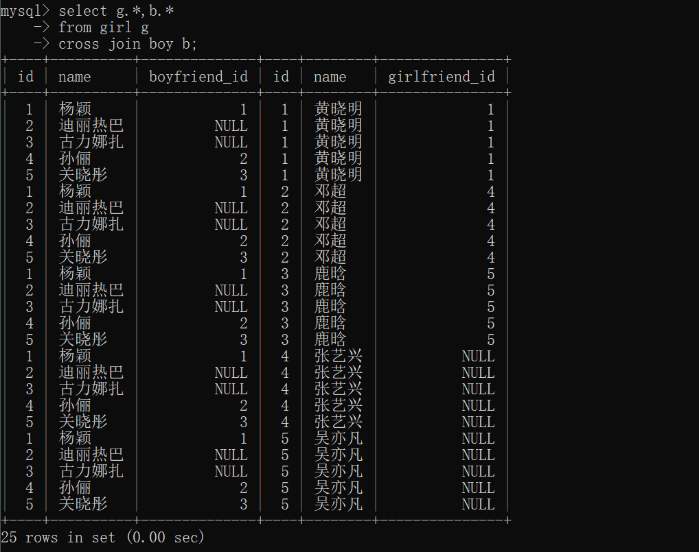