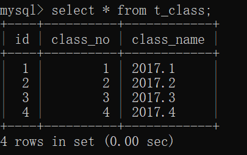
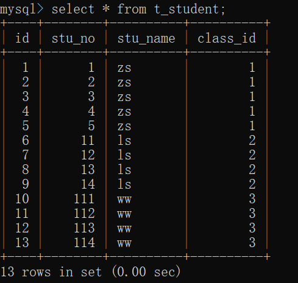
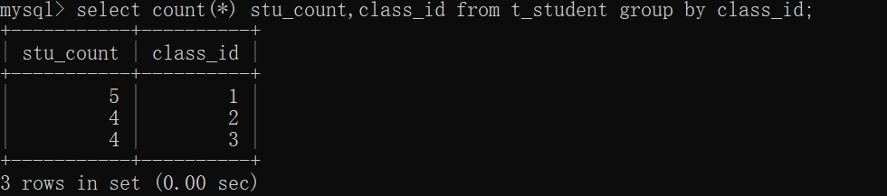
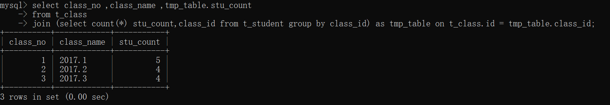

# 数据库— —子查询

本文介绍子查询的知识。出现在其他语句中的查询，我们称为子查询或内查询，外部的查询语句称为主查询或外查询。

[toc]

## 一、分类

我们将查询语句按照结果集进行分类：

- 标量子查询：结果为一行一列
- 行子查询：结果为一行多列
- 列子查询：结果为一列多行
- 表子查询：结果为多行多列

我们以外部语句为查询语句为例，则子查询可出现的位置如下：

- select 语句后：支持出现标量子查询
- from 语句后：支持出现表子查询
- where 或 having 语句后：支持出现标量子查询、列子查询和行子查询
- exists 语句后：支持出现表子查询


本文主要介绍where和having后面的子查询。

## 二、where和having子查询

特点：

1. 子查询放在小括号内。

2. 子查询一般放在条件的右侧。

3. 标量子查询，一般搭配着单行单列操作符使用 **>、<、>=、<=、=、<>、!=**

4. 列子查询，一般搭配着多行操作符使用

   > in(not in)：列表中的“任意一个”
   >
   > any或者some：和子查询返回的“某一个值”比较，比如a>some(10,20,30)，a大于子查询中任意一个即可，a大于子查询中最小值即可，等同于a>min(10,20,30)。
   >
   > all：和子查询返回的“所有值”比较，比如a>all(10,20,30)，a大于子查询中所有值，换句话说，a大于子查询中最大值即可满足查询条件，等同于a>max(10,20,30);

5. 子查询的执行优先于主查询执行，因为主查询的条件用到了子查询的结果。


### 2.1 标量子查询

标量子查询的结果为只有一行一列，就相当于一个常量。

案例一：查询谁的工资比Abel高；

```sql
SELECT *
FROM employees a
WHERE a.salary > (SELECT salary
                  FROM employees
                  WHERE last_name = 'Abel');
```

案例二：返回job_id与141号员工相同，salary比143号员工多的员工、姓名、job_id和工资（多个标量子查询）

```sql
SELECT
  a.last_name 姓名,
  a.job_id,
  a.salary    工资
FROM employees a
WHERE a.job_id = (SELECT job_id
                  FROM employees
                  WHERE employee_id = 141)
      AND
      a.salary > (SELECT salary
                  FROM employees
                  WHERE employee_id = 143);
```

案例三：查询最低工资大于50号部门最低工资的部门id和其最低工资【having】（分组函数）

```sql
SELECT
  min(a.salary) minsalary,
  department_id
FROM employees a
GROUP BY a.department_id
HAVING min(a.salary) > (SELECT min(salary)
                        FROM employees
                        WHERE department_id = 50);
```


### 2.2 列子查询

列子查询需要搭配多行操作符使用：in(not in)、any/some、all。

为了提升效率，最好使用**distinct**关键字去重一下。

案例一：返回location_id是1400或1700的部门中的所有员工姓名 (IN)

```sql
SELECT a.last_name
FROM employees a
WHERE a.department_id IN (SELECT DISTINCT department_id
                          FROM departments
                          WHERE location_id IN (1400, 1700));
```

案例二：返回其他工种中比job_id为'IT_PROG'工种任意工资低的员工的员工号、姓名、job_id、salary返回其他工种中比job_id为'IT_PROG'工种任意工资低的员工的员工号、姓名、job_id、salary (ANY)

```sql
SELECT
  last_name,
  employee_id,
  job_id,
  salary
FROM employees
WHERE salary < ANY (SELECT DISTINCT salary
                    FROM employees
                    WHERE job_id = 'IT_PROG') 
      AND job_id != 'IT_PROG';
```

案例三：返回其他工种中比job_id为'IT_PROG'部门所有工资低的员工的员工号、姓名、job_id、salary（ ALL）

```sql
SELECT
  last_name,
  employee_id,
  job_id,
  salary
FROM employees
WHERE salary < ALL (SELECT DISTINCT salary
                    FROM employees
                    WHERE job_id = 'IT_PROG') 
      AND job_id != 'IT_PROG';
```


### 2.3 行子查询

行子查询位于where或having后面，不常见：

案例：查询员工编号最小并且工资最高的员工信息

```sql
SELECT *
FROM employees a
WHERE (a.employee_id, a.salary) = (SELECT
                                     min(employee_id),
                                     max(salary)
                                   FROM employees);
```


## 三、表子查询

表子查询的结果是多行多列，相当于一张表。

**表子查询可以放在from或exists后。需要给表子查询的结果取一个别名，否则找不到这个表。**

例如，现有一个班级表t_class和一个学生表t_student，结构以及数据如下：

```mysql
create table t_class(
	id int auto_increment not null,
    class_no int not null,
    class_name varchar(20) not null,
    primary key(id)
);

create table t_student(
	id int auto_increment not null,
    stu_no int not null,
    stu_name varchar(20) not null,
    class_id int not null,
    primary key(id)
);

insert into t_class 
values(null,1,'2017.1'),(null,2,'2017.2'),(null,3,'2017.3'),(null,4,'2017.4');

insert into t_student values
(null,1,'zs',1),(null,2,'zs',1),(null,3,'zs',1),(null,4,'zs',1),(null,5,'zs',1),
(null,11,'ls',2),(null,12,'ls',2),(null,13,'ls',2),(null,14,'ls',2),
(null,111,'ww',3),(null,112,'ww',3),(null,113,'ww',3),(null,114,'ww',3);
```

表内数据结果：





请求出每个班级有多少人，结果表结构为：class_no，class_name，stu_count。

首先在学生表中求出每个班级有多少人：

```mysql
select count(*) stu_count,class_id 
from t_student 
group by class_id;
```



然后将这个中间表与班级表联合查询，得到班级号和班级名：

```mysql
select class_no ,class_name ,tmp_table.stu_count 
from t_class
join (select count(*) stu_count,class_id from t_student group by class_id) as tmp_table on t_class.id = tmp_table.class_id;
```

