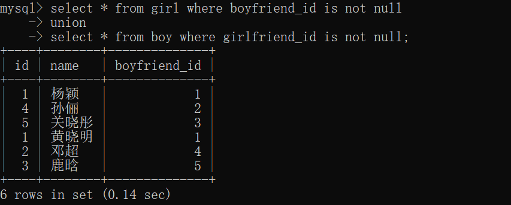

# 数据库— —联合查询

本文介绍联合查询。

[toc]

## 一、联合查询

语法

```sql
select ...
union [all]
select ...
...;
```

联合查询用于将多个查询的结果集合并为一个结果集。

如果使用关键词`union`，则默认去除重复的行；如果使用关键词`union all`，则不去除重复的行。

多个查询的结果集列数需要一样，如果不一样，则报错；并且默认使用第一个查询的列名。


## 二、使用

查询有男朋友的女生和有女朋友的男生。

