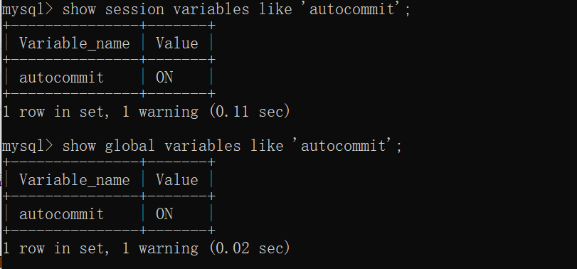

# 数据库— —事务

本文介绍数据库中事务知识。


## 一、事务介绍及特性

事务：一组操作要么都完成，要么都不完成。这些操作可以是select、update、insert、delete。

在 MySQL 中只有使用了 **Innodb 数据库引擎**的数据库或表才支持事务。

事务的特性（ACID)：

- 原子性（Atomicity）：一个事务（transaction）中的所有操作，要么全部完成，要么全部不完成，不会结束在中间某个环节。事务在执行过程中发生错误，会被回滚（Rollback）到事务开始前的状态，就像这个事务从来没有执行过一样。
- 一致性（Consistency）：在事务开始之前和事务结束以后，数据库的完整性没有被破坏。这表示写入的数据必须完全符合所有的预设规则。即在事务结束后，数据库从一个一致性状态转换到另一个一致性状态。
- 隔离性（Isolation）：数据库允许多个并发事务同时对数据进行读写和修改，隔离性可以防止多个事务并发执行时由于交叉执行而导致数据的不一致。事务隔离分为不同级别，包括读未提交（Read uncommitted）、读提交（read committed）、可重复读（repeatable read）和串行化（Serializable）。
- 持久性（Durability）：事务处理结束后，对数据的修改就是永久的，即便系统故障也不会丢失。


## 二、事务演示

### 2.1 自动提交

在MySQL中，每个操作默认是一个事务，并且事务的提交是自动的，我们可以使用以下命令查看是否自动提交：

```sql
# 显示会话自动提交变量
show session variables like 'autocommit';    
# 显示全局自动提交变量
show global variables like 'autocommit';
```

如果值为`ON`，表示自动提交开启；

如果值为`OFF`，表示自动提交关闭；




我们可以使用如下命令修改自动提交的值：

```sql
# 设置会话自动提交变量
set session autocommit=0;
# 设置全局自动提交变量
set global autocommit=0;
```

上述SQL修改会话系统变量或全局系统变量，只对当前实例有效，如果MySQL服务重启的话，这些设置就会丢失，如果要永久生效，就必须在配置文件中修改系统变量。


### 2.2 事务控制

事务控制的步骤如下：

```markdown
1. 关闭自动提交
set session autocommit=0;
2. 开启事务
start transaction; 
3. 指定操作
select ...
delete ...
update ...
insert ...
4. 回滚或提交事务
rollback;
commit;
```

案例一演示：在事务中，删除表中两条数据，但是最后回滚事务。


案例一演示：在事务中，删除表中两条数据，最后提交事务。


## 三、保存点

当事务回滚时，会将已经执行的操作全部回滚；如果我们只想回滚一部分操作，则可以使用保存点回滚一部分操作。

```sql
savepoint 保存点名;
rollback to 保存点名;
```

例如，现在删除两条数据，在删除第一条数据后设置保存点，然后回滚到该保存点；


## 四、事务隔离级别

在多个事务同时执行时，会有以下问题出现：

- 丢失修改：是指两个事务T1和T2读入同一数据并修改，T1先提交，T2后提交。T2的提交结果破坏了T1提交的结果，导致T1的修改被丢失。

- 脏读： 也指读未提交。当一个事务正在访问数据并且对数据进行了修改，而这种修改还没有提交到数据库中，这时另外一个事务也访问了这个数据，然后使用了这个数据。因为这个数据是还没有提交的数据，那么另外一个事务读到的这个数据是“脏数据”，依据“脏数据”所做的操作可能是不正确的。

- 不可重复读：是指事务T1读取数据后，事务T2 执行更新操作，使T1无法再现前一次读取结果。包括以下三种情况：

  - 事务T1读取某一数据后，**事务T2对其做了修改(update)**，当事务T1再次读该数据时，得到与前一次不同的值；
  - 事务T1按一定条件从数据库中读取了某些数据记录后，**事务T2删除(delete)了其中部分记录**，当T1再次按相同条件读取数据时，发现某些记录神秘地消失了。 
  - 事务T1按一定条件从数据库中读取某些数据记录后，**事务T2插入(insert)了一些记录**，当T1再次按相同条件读取数据时，发现多了一些记录。

  后两种情况也称为幻读。


事务隔离其实就是为了解决上面提到的脏读、不可重复读、幻读这几个问题，下面展示了 4 种隔离级别对这三个问题的解决程度。

| 隔离级别                            | 脏读 | 不可重复读 | 幻读 |
| ----------------------------------- | ---- | ---------- | ---- |
| 读未提交<br />read uncommitted      | ×    | ×          | ×    |
| 读提交<br />read committed          | √    | ×          | ×    |
| 可重复读(默认)<br />repeatable read | √    | √          | ×    |
| 串行化<br />Serializable            | √    | √          | √    |

`√`的意思是在该隔离级别下，可以解决该问题；`×`的意思是在该隔离级别下，不可以解决该问题。

- **READ-UNCOMMITTED(读取未提交)：** 最低的隔离级别，允许读取尚未提交的数据变更，**可能会导致脏读、幻读或不可重复读**。
- **READ-COMMITTED(读取已提交)：** 允许读取并发事务已经提交的数据，**可以阻止脏读，但是幻读或不可重复读仍有可能发生**。
- **REPEATABLE-READ(可重复读)：** 对同一字段的多次读取结果都是一致的，除非数据是被本身事务自己所修改，**可以阻止脏读和不可重复读，但幻读仍有可能发生**。
- **SERIALIZABLE(可串行化)：** 最高的隔离级别，完全服从ACID的隔离级别。所有的事务依次逐个执行，这样事务之间就完全不可能产生干扰，也就是说，**该级别可以防止脏读、不可重复读以及幻读**。


我们可以使用以下命令查看隔离级别：

```sql
select @@transaction_isolation;
show session variables like 'transaction_isolation';
show global variables like 'transaction_isolation';
```


我们可以使用以下命令修改隔离级别：

```sql
set session|global transaction isolation level 隔离级别;
```

隔离级别有四种：read uncommitted、read committed、repeatable read、Serializable。


## 五、实际演示

使用 2 个命令行mysql ，模拟多线程（多事务）对同一份数据的各种问题。

### 5.1 读未提交

如果将读未提交设置为事务隔离级别，则会出现脏读的情况：


### 5.2 读已提交

在事务隔离级别为读已提交时，会出现不可重复读问题：


### 5.3 可重复读

如果将事务隔离级别设置为可重复读，则不会出现不可重复读的问题（上图）：


### 5.4 串行化

如果一个事务开启后，另一个事务想要修改数据，就要等待第一个事务结束后才能修改：


## 六、参考资料

[1] https://github.com/Snailclimb/JavaGuide/blob/master/docs/database/%E4%BA%8B%E5%8A%A1%E9%9A%94%E7%A6%BB%E7%BA%A7%E5%88%AB(%E5%9B%BE%E6%96%87%E8%AF%A6%E8%A7%A3).md