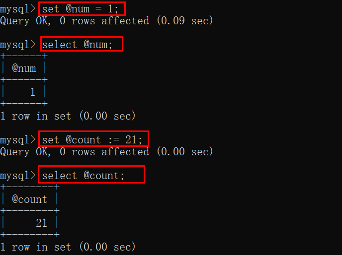
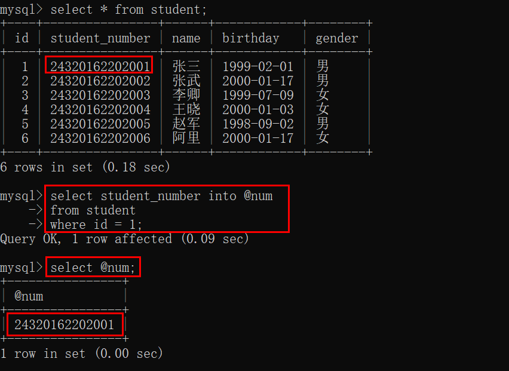
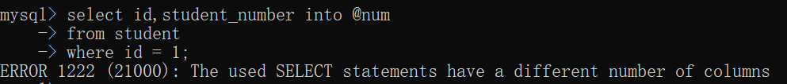
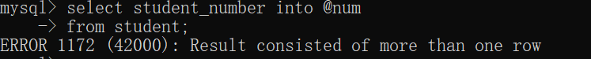

# 数据库— —变量

本文介绍数据库系统变量与用户变量。


## 一、变量概述

变量分为系统变量和用户变量：

- 系统变量是系统已定义好的变量，用户定义系统的一些属性；
- 用户变量是用户自己定义的变量，和编程语言中的变量含义相同；

根据系统变量的作用范围，可分为全局变量和会话变量：

- 全局变量：对所有客户端的任一次连接都有效；
- 会话变量：仅对当前客户端当次连接有效；


## 二、全局变量

### 2.1 查看系统变量

我们可以使用以下命令查看所有的系统变量：

```sql
show session variables;
show global variables;

--- 默认查看session的系统变量
show variables;
```

如果想查看某个具体的系统变量，可以使用如下命令：

```sql
show session variables like '变量名';
show global variables like '变量名';

--- 在变量名中可以使用%_通配符
```


### 2.2 修改系统变量

我们可以使用以下的命令修改系统变量：

```sql
set session 变量名 = 值;
set global 变量名 = 值;
```


## 三、用户变量

用户变量都是会话级别，只要是当前用户当次连接，都会受到影响，不区分数据库。

### 3.1 全局变量

全局变量定义后，在该次会话中都可以使用。

我们可以使用以下命令创建用户变量：

```sql
set @变量名 = 值;
set @变量名 := 值;
```

在 MySQL 中，很多地方会默认将`=`处理为比较符号，因此 MySQL 还提供了另外一种赋值符号`:=`，即冒号与等号拼接而成的符号。

使用以下命令查看用户变量：

```sql
select @用户变量名,@用户变量名...;
```



我们也可以将查询语句的结果赋值给用户变量：

语法：

```sql
select 字段 into @用户变量名
from ...
where ...;
```



注意，如果查询多个列，则会出现错误：



如果查询结果有多行，也会报错：




### 3.2 局部变量

局部变量定义在`begin ...end`中，其只能在`begin...end`中使用，并且其定义语法不同，在后续存储过程和函数中讲解。