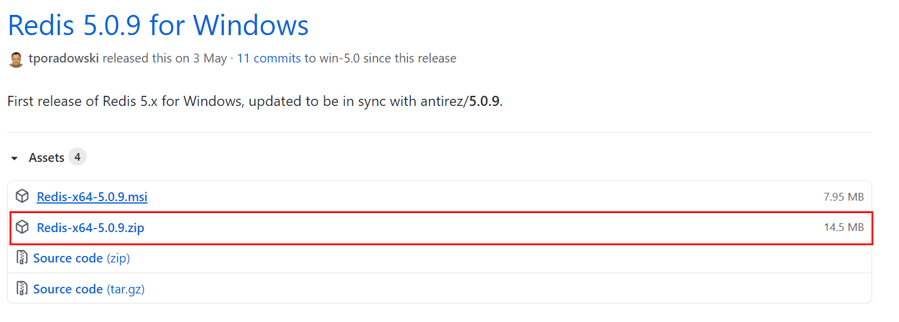
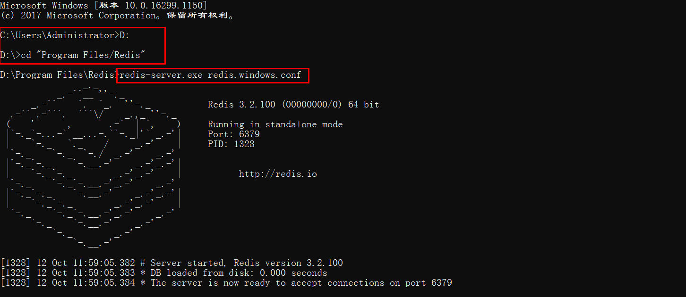
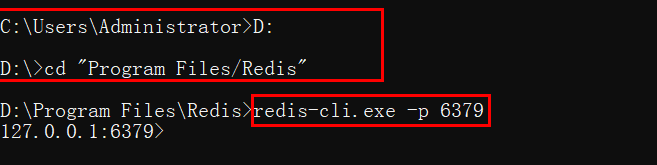
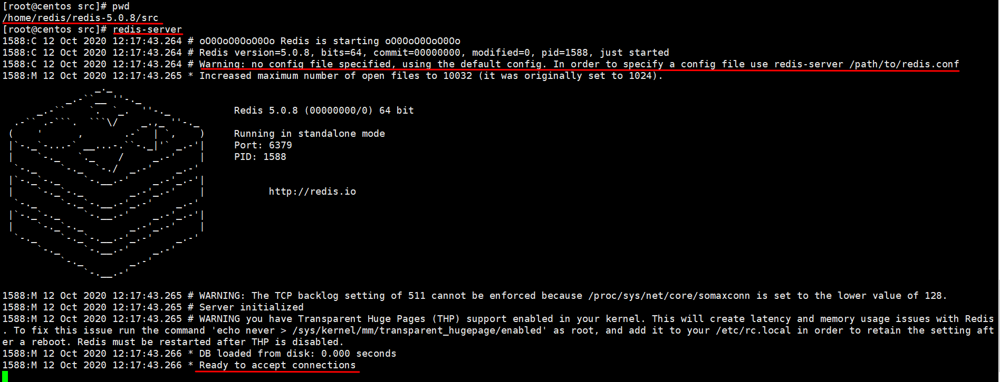

# Redis-Redis概述

本文主要介绍什么是Redis、Redis的特点、安装Redis、Redis的启动及其相关问题。


## 一、什么是Redis

Redis官网：https://redis.io/

Redis中文官网：http://www.redis.cn/

在其官网中介绍如下：

> Redis 是一个开源（BSD许可）的，内存中的数据结构存储系统，它可以用作数据库、缓存和消息中间件。

我们可以理解Redis就是一个内存中的key-value数据库。


## 二、Redis的特点

- 内存数据库，速度快，性能高，读的速度是110000次/s,写的速度是81000次/s 。

- 支持数据的持久化，可以将内存中的数据保存在磁盘中，重启的时候可以再次加载进行使用。
- 丰富的数据类型，Redis支持String, List, Hash, Set 及 Ordered Set 数据类型。
- 原子性，Redis的所有操作都是原子性的，同时Redis还支持对几个操作合并后的原子性执行（事务）。
- 丰富的特性，Redis还支持 publish/subscribe，通知，key 过期，主从复制等等特性。


## 三、Redis的安装

### 3.1 Windows安装Redis

下载地址：https://github.com/tporadowski/redis/releases



Windows下的安装教程如下：https://www.runoob.com/redis/redis-install.html


### 3.2 Linux安装Redis

依次运行如下命令：

```txt
wget http://download.redis.io/releases/redis-6.0.6.tar.gz
tar -xzf redis-6.0.6.tar.gz
cd redis-6.0.6
make
```


## 四、Redis的启动

### 4.1 Windows下启动Redis

首先打开控制台，切换到Redis目录下，然后运行如下命令启动Redis服务端：

```txt
redis-server.exe redis.windows.conf
```

`redis.windows.conf`表示配置文件。



不要关闭上面的窗口，另外打开一个控制台，切换到Redis目录下，运行Redis客户端：

```txt
redis-cli.exe -p 6379
```

`-p 6379`表示连接服务器端口6379，如果不指定主机`-h`，默认表示连接本机。




### 4.2 Linux下启动Redis

首先进入到解压后的 `redis`目录下的`src` 目录，通过如下命令启动Redis: 

```
redis-server 配置文件路径
```



然后新开一个窗口，进入`redis/src`目录下，运行如下命令启动客户端：

```txt
redis-cli
```


## 五、Redis基础知识

### 5.1 Redis的默认端口

Redis的默认端口是6379


### 5.2 Redis默认数据库

Redis默认使用16个数据库，数据库的下标从0开始，默认使用0号数据库，在默认配置文件中描述如下：

```conf
# Set the number of databases. The default database is DB 0, you can select
# a different one on a per-connection basis using SELECT <dbid> where
# dbid is a number between 0 and 'databases'-1
databases 16
```

我们可以在Redis中使用如下命令切换数据库：

```txt
select 数据库下标
```


### 5.3 清空数据库

我们可以使用如下命令清空当前数据库：

```txt
flushdb
```

也可以使用如下命令清空所有数据库：

```txt
flushall
```

这两条命令慎用。


### 5.4 键相关

查看当前数据库的键数量：

```txt
dbsize
```

查看所有的键值：

```txt
keys *
```

可以使用正则表达式查看符和模式的键值：

```txt
keys pattern
```

例如：

- `？`匹配一个字符：`h?llo` 匹配 `hello`, `hallo` 和 `hxllo`；
- `*`匹配0个或多个字符：h*llo` 匹配 `hllo` 和 `heeeello`；
- `[]`匹配在括号中的字符：`h[ae]llo` 匹配 `hello` 和 `hallo,` 但是不匹配 `hillo`
- `[^]`匹配不在括号中的字符：`h[^e]llo` 匹配 `hallo`, `hbllo`, … 但是不匹配 `hello`
- `h[a-b]llo` 匹配 `hallo` 和 `hbllo`

如果你想取消字符的特殊匹配，可以在正则表达式的前面加`\`。