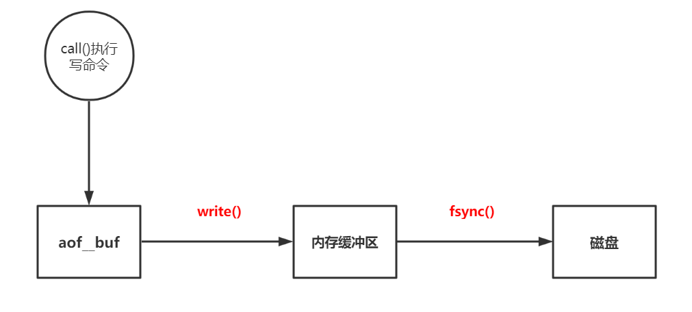

# Redis— —持久化

本文介绍Redis持久化的两个技术：RDB和AOF。


## 一、RDB

RDB（Redis Database），是在一个特定的时间间隔保存一个数据快照（Snapshot），存储为dump.rdb文件。

**工作原理：**

- Redis主进程调用fork()，复制一个与主进程相同的子进程，用于持久化工作；
- 子进程把数据写到一个文件dump.rdb中；
- 新的文件替换掉旧的文件；
- 当Redis启动时，会加载文件dump.rdb中的数据到内存中；

**优点：**

- 性能好，当进行持久化操作时，主进程会复制（fork())一个子进程出来，然后把持久化的工作交给子进程，主进程不会有I/O操作；
- 在数据量比较大的情况下，RDB的启动速度比AOF快；

**缺点：**

- 容易丢失数据，最后一次备份的时间点到出现问题（断电...）的时间点这段时间内，数据就会丢失；
- RDB使用fork()复制主进程来进行数据的持久化，如果内存中的数据比较大，那么复制的时间比较长，可能会导致短时间Redis无法提供服务；

**配置：**

在Redis配置文件中，找到`SNAPSHOTTING`模块，该模块就是有关RDB的配置：

```txt
################################ SNAPSHOTTING  ################################

#   save <seconds> <changes>
#   在seconds秒内有changes次写操作，就进行持久化操作，默认配置如下：
#   如果想禁用RDB,可以配置为  save ""

save 900 1
save 300 10
save 60 10000


#   如果RDB持久化失败，那么Redis不允许进行写操作
stop-writes-on-bgsave-error yes

#	进行RDB持久化时，压缩文件dump.rdb
rdbcompression yes

#	校验文件dump.rdb
rdbchecksum yes

# The filename where to dump the DB
#   默认的持久化文件名
dbfilename dump.rdb

# 	默认的持久化文件路径
dir ./
```


**手动生成快照：**

除了根据配置文件中的设置进行自动持久化，我们也可以手动生成快照文件，命令如下：

- `save`：`save`命令会使用同步的方式生成RDB快照文件，这意味着在这个过程中会阻塞所有其他客户端的请求；
- `bgsave`：`bgsave`命令使用后台的方式保存RDB文件，调用此命令后，会立刻返回OK，Redis会产生一个子进程进行持久化处理，并且会立刻恢复对客户端的服务。在客户端我们可以使用`lastsave`命令查看最近一次执行快照的时间。
- 执行`flushall`命令，也会生成dump.rdb文件，但里面是空的，毫无意义；

配置文件里禁用了快照生成功能不影响`save`和`bgsave`命令。


## 二、AOF

AOF(Append Only File)，是指Redis接收到写操作时，会将写操作命令追加保存到文件`appendonly.aof`中。当Redis启动时，会依次执行该文件中的命令，重建数据。

**优点：**

- 不容易丢失数据，我们可以设置AOF文件同步策略，使得数据不会丢失或者最多丢失一秒的数据；

**缺点：**

- AOF文件比RDB文件大，占用磁盘空间大，并且恢复速度慢于RDB；
- AOF的速度比RDB低，在文件同步策略设置为no时，速度与RDB相同，但一般设置为每秒同步；

**配置文件：**

AOF的相关配置在`APPEND ONLY MODE`模块中：

```txt
############################## APPEND ONLY MODE ###############################

#   是否开启AOF，默认关闭

appendonly no

#	aof文件名，默认为appendonly.aof
appendfilename "appendonly.aof"

# 	文件同步策略，有三个选项：always,everysec和no，默认为everysec
# appendfsync always
appendfsync everysec
# appendfsync no

#	重写时将文件同步策略设置为no
#	https://blog.csdn.net/jingkyks/article/details/46956905
no-appendfsync-on-rewrite no

#	自动重写设置
#	只有当前AOF大小(即aof_current_size)和上一次重写时AOF大小(aof_base_size)的比值
#	超过设定的值时，才会触发重写。
auto-aof-rewrite-percentage 100
#	只有当前的AOF大小超过设定的值时，才能触发重写
auto-aof-rewrite-min-size 64mb
#	我们也可以使用bgrewriteaop手动执行重写


aof-load-truncated yes
```


**AOF文件损坏修复**

如果aop文件损坏了，我们可以使用以下命令进行修复：

```txt
redis-check-aof --fix
```


**AOF与RDB文件同时存在**

如果aop与rdb文件同时存在，则Redis在启动时，优先加载aop文件。


**AOF文件格式**

AOF文件中，一条命令以`*`开始，后面的数字表示该命令有几个参数。

然后，每个参数前以`$`开始，后面的数字表示该参数的符号个数，再跟具体的参数值。

每行以`\r\n`结束。

例如:

```txt
*2
$6
SELECT
$1
0
*6
$5
RPUSH
$4
list
$1
1
$1
2
$1
3
$1
4
```


**AOF文件的写入与同步**

Redis 的服务器进程就是一个事件循环（loop）， 这个循环中的文件事件负责接收客户端的命令请求， 以及向客户端发送命令回复， 而时间事件则负责执行像 `serverCron` 函数这样需要定时运行的函数。

因为服务器在处理文件事件时可能会执行写命令， 使得一些内容被追加到 `aof_buf` 缓冲区里面， 所以在服务器每次结束一个事件循环之前， 它都会调用 `flushAppendOnlyFile` 函数， 考虑是否需要将 `aof_buf` 缓冲区中的内容写入和保存到 AOF 文件里面， 这个过程可以用以下伪代码表示：

```txt
def eventLoop():

    while True:

        # 处理文件事件，接收命令请求以及发送命令回复
        # 处理命令请求时可能会有新内容被追加到 aof_buf 缓冲区中
        processFileEvents()

        # 处理时间事件
        processTimeEvents()

        # 考虑是否要将 aof_buf 中的内容写入和保存到 AOF 文件里面
        flushAppendOnlyFile()
```

在`flushAppendOnlyFile()`函数中，会调用`write()`函数将缓冲区中的内容写入到文件中，但是，为了提高文件的写入效率，在调用`write()`函数后，操作系统会将数据保存在一个内存缓冲区中，当内存缓冲区被填满之后，才会将文件真正地写入到磁盘中，此做法仍然有丢失数据地风险，因此，我们可以调用`fsync()`函数让操作系统立即将内存缓冲区中地数据写入到磁盘中。



所以配置文件中的选项appendfsync实际上就是指`fsync()`函数执行的频率。

- `always`：服务器在每个事件循环都要将 `aof_buf` 缓冲区中的所有内容写入到 AOF 文件， 并且同步（调用fsync()函数） AOF 文件， 所以 `always` 的效率是 `appendfsync` 选项三个值当中最慢的一个， 但从安全性来说， `always` 也是最安全的， 因为即使出现故障停机， AOF 持久化也只会丢失一个事件循环中所产生的命令数据。
- `everysec`：服务器在每个事件循环都要将 `aof_buf` 缓冲区中的所有内容写入到 AOF 文件， 并且每隔超过一秒就要在子线程中对 AOF 文件进行一次同步： 从效率上来讲， `everysec` 模式足够快， 并且就算出现故障停机， 数据库也只丢失一秒钟的命令数据。
- `no`：服务器在每个事件循环都要将 `aof_buf` 缓冲区中的所有内容写入到 AOF 文件， 至于何时对 AOF 文件进行同步， 则由操作系统控制。


**AOF文件的重写解析**

由于AOF文件保存的是写命令，随着运行时间的增长，AOF文件也会变得越来越大，使用AOF文件来还原数据所需的时间也越来越长，所以我们需要对AOF文件进行重写，并将重写后的新文件替换旧文件。

除了通过配置进行自动重写外，我们可以通过命令`bgrewriteaof`手动进行重写。

重写是子进程是通过读取当前数据库状态来实现的，并且子进程在执行重写期间，主进程需要执行以下三项工作：

- 执行客户端的命令；
- 将执行后的写命令追加到AOF缓冲区中；
- 将执行后的写命令追加到AOF重写缓冲区中；

当子进程完成重写工作后，会给主进程发送一个信号，主进程接到该信号后，会进行以下工作：

- 将AOF重写缓冲区中的所有内容写入到新的AOF文件中；
- 对新的AOF文件进行改名，替换旧文件；


## 三、参考资料

[1]https://www.cnblogs.com/kismetv/p/9137897.html#t4

[2]尚硅谷Redis教程：https://www.bilibili.com/video/BV1J4411x7U1?p=19

[3]https://segmentfault.com/a/1190000002906345

[4]https://blog.csdn.net/jingkyks/article/details/46956905

[4]黄建宏.Redis设计与实现