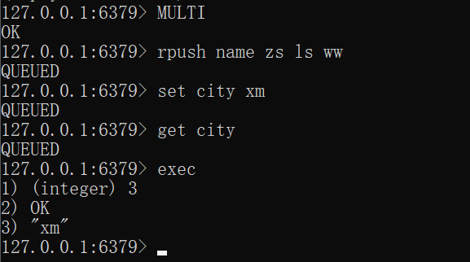
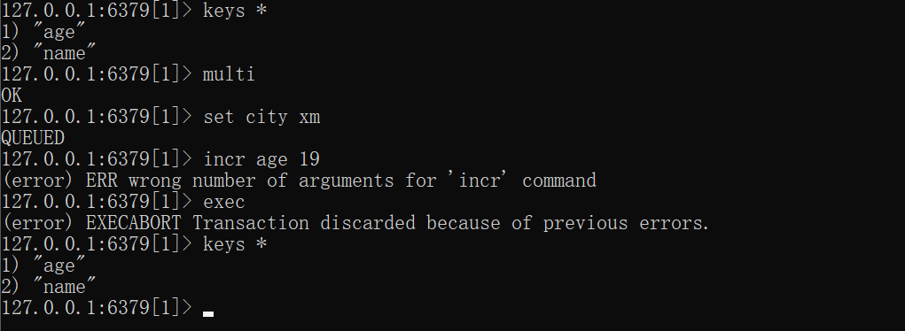
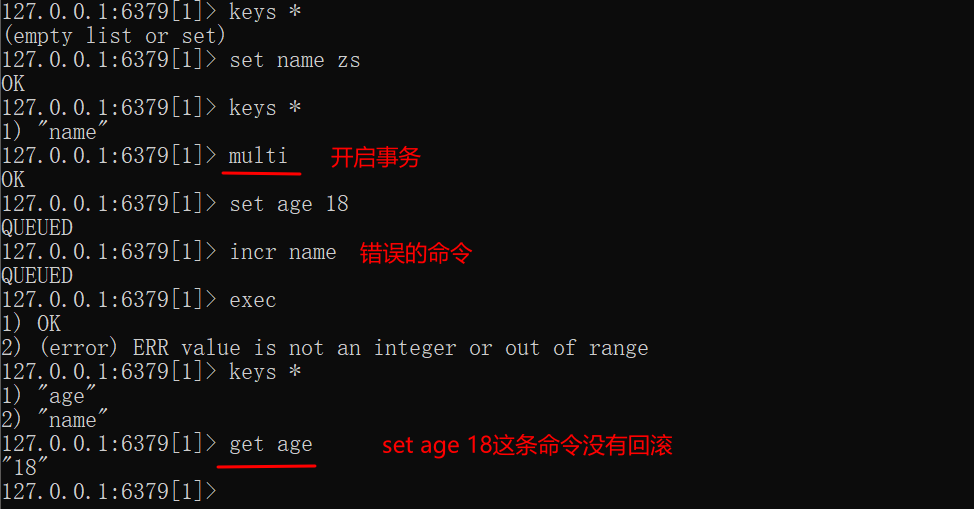
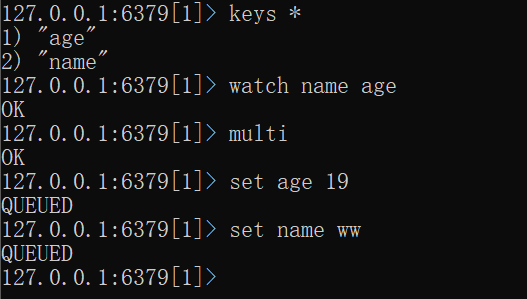
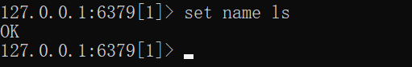
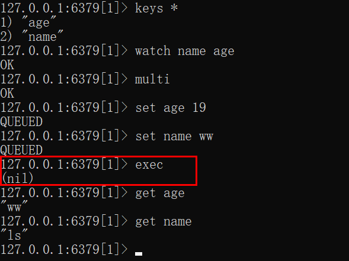

# Redis-事务

本文介绍Redis有关事务的知识。

## 一、概述

Redis事务可以一次执行多个操作，其步骤如下：

- 开启事务
- 命令入队
- 执行事务/放弃事务

涉及到的命令如下：

- `multi`：开启事务，总返回OK
- `exec`：执行事务
- `discard`：清空事务队列， 并放弃执行事务

演示如下：

## 二、事务中的错误

如果命令在入队时报错，则事务中的命令不会执行：

如果事务中有命令执行出错，并不会回滚，其他的命令依旧会成功执行：

## 三、监测键

WATCH 命令可以为 Redis 事务提供 check-and-set （CAS）行为。

被 WATCH 的键会被监视，并会检查这些键是否被改动过了。 如果有至少一个被监视的键在 EXEC 执行之前被修改了， 那么整个事务都会被取消， EXEC 返回nil-reply来表示事务已经失败。

事务只能在所有被监视键都没有被修改的前提下执行， 如果这个前提不能满足的话，事务就不会被执行。WATCH 命令可以被调用多次。 对键的监视从 WATCH 执行之后开始生效， 直到调用 EXEC 为止。

- 当 EXEC 被调用时， 不管事务是否成功执行， 对所有键的监视都会被取消。

-  当客户端断开连接时， 该客户端对键的监视也会被取消。

- 使用无参数的 UNWATCH 命令可以手动取消对所有键的监视。 对于一些需要改动多个键的事务， 有时候程序需要同时对多个键进行加锁， 然后检查这些键的当前值是否符合程序的要求。 当值达不到要求时， 就可以使用 UNWATCH 命令来取消目前对键的监视， 中途放弃这个事务， 并等待事务的下次尝试。

WATCH需要在事务开启前使用，即MULTI前，案例：

客户端A监视键name和age，并开启事务，命令入队，但没有执行：

客户端B修改了name的值：

客户端A执行事务，但并没有执行成功：

