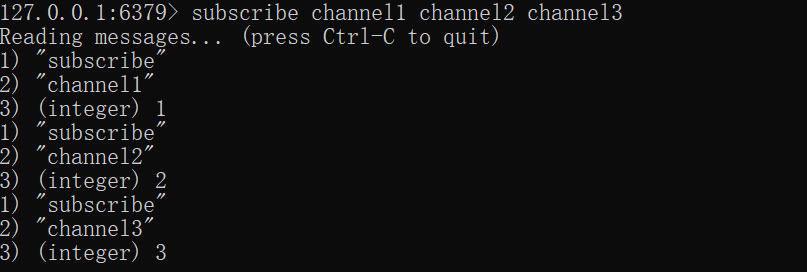
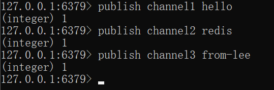
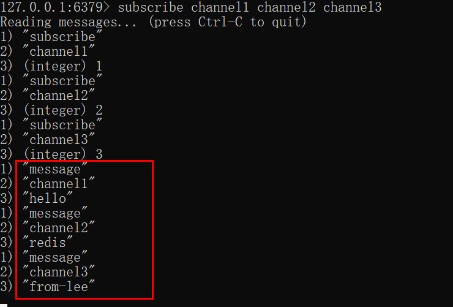

# Redis— —发布订阅

本文介绍Redis发布订阅相关知识。

[toc]

## 一、基本概念

Redis 发布订阅 (pub/sub) 是一种消息通信模式：发送者 (pub) 发送消息，订阅者 (sub) 接收消息。

Redis 客户端可以订阅任意数量的频道。

下图展示了频道 channel1 ， 以及订阅这个频道的三个客户端 —— client2 、 client5 和 client1 之间的关系：

当有新消息通过 PUBLISH 命令发送给频道 channel1 时， 这个消息就会被发送给订阅它的三个客户端：

## 二、命令

| 序号 | 命令及描述                                                   |
| :--- | :----------------------------------------------------------- |
| 1    | PUBLISH channel message 将信息发送到指定的频道。             |
| 2    | PSUBSCRIBE pattern [pattern ...] 订阅一个或多个符合给定模式的频道。 |
| 3    | PUNSUBSCRIBE  pattern [pattern ...\] 退订所有符和给定模式的频道。 |
| 4    | SUBSCRIBE channel [channel ...] 订阅一个或多个频道的信息。   |
| 5    | UNSUBSCRIBE  channel [channel ...] 退订给定的频道。          |

## 三、演示

需要开启两个客户端。

客户端A，订阅频道channel1，channel2，channel3:

客户端B，分别给频道channel1，channel2，channel3发消息：

在客户端A可以接受到客户端发送的消息：

