# Redis— —复制

本文介绍主从复制以及哨兵模式相关知识。

[toc]

## 一、什么是主从复制

主从复制，是指将一台Redis服务器的数据，复制到其他的Redis服务器。前者称为主节点(master)，后者称为从节点(slave)；数据的复制是单向的，只能由主节点到从节点。

默认情况下，每台Redis服务器都是主节点；且一个主节点可以有多个从节点(或没有从节点)，但一个从节点只能有一个主节点。

主从复制的作用：

- 数据冗余：主从复制实现了数据的热备份，是持久化之外的一种数据冗余方式。
- 故障恢复：当主节点出现问题时，可以由从节点提供服务，实现快速的故障恢复；实际上是一种服务的冗余。
- 负载均衡：在主从复制的基础上，配合读写分离，可以由主节点提供写服务，由从节点提供读服务（即写Redis数据时应用连接主节点，读Redis数据时应用连接从节点），分担服务器负载；尤其是在写少读多的场景下，通过多个从节点分担读负载，可以大大提高Redis服务器的并发量。


## 二、如何开启主从复制

**主从复制的开启，完全是在从节点发起的；不需要我们在主节点做任何事情。**

从节点开启主从复制，有2种方式：

（1）配置文件

在从服务器的配置文件中加入：`slaveof <masterip> <masterport>`

（2）客户端命令

Redis服务器启动后，直接通过客户端执行命令：`slaveof <masterip> <masterport>`，则该Redis实例成为从节点。


## 三、案例演示

我们启动三个Redis服务器进程，分别监听6379、6380和6381端口，并分别开启客户端：

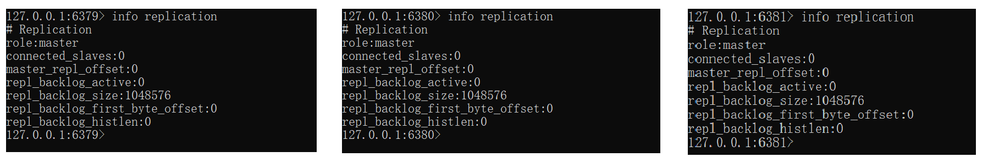

此时三台服务器均为主结点。

在6379结点中添加数据：

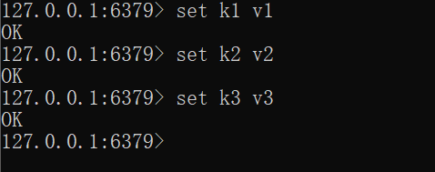

我们使用命令`slaveof`，将6380和6381端口的结点设置为从节点：


此时6379结点有了两个从节点：

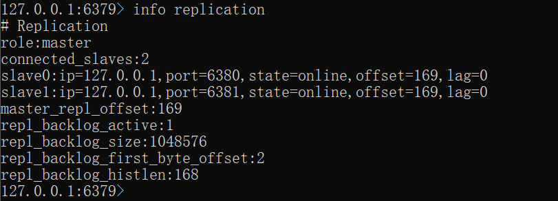

并且从节点有主节点的数据，此后也会同步主节点的数据：

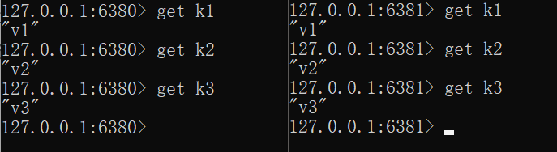

**注意：**从节点只能读取数据，不能写入数据。


## 四、宕机处理

两种宕机情况：

- 如果主节点宕机后，从节点会等待主节点，属性`master_link_status`置为`down`。

  当主节点再次上线后，从节点再次恢复连接。

- 如果从节点宕机后，则主节点更新从节点信息，减少宕机的从节点。

  当从节点再次上线后，其独立为新的主节点，除非其使用命令`slaveof`再次成为从结点。


如果主节点宕机后，我们可以在一个从节点中使用命令`slaveof no one`，将其设置为主节点，其他从结点再使用命令`slaveof host port`从属于这个新的主节点。

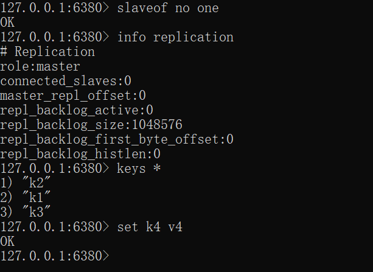

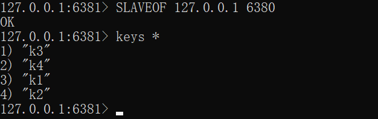


## 五、哨兵模式

在主节点宕机后，我们需要手动将从节点转换为主节点，并转换其他从节点的主节点，这既繁琐又耗费时间精力，所以有了哨兵模式。

哨兵是 Redis 高可用的解决方案，该方案是由一个或多个 Sentinel 实例组成 Sentinel 系统，这个系统可以监视多个主服务以及这些主服务下的所有从服务，在被监视的主服务进入下线状态时，自动将下线主服务下属的某个从服务提升为新的主服务，然后由新的主服务继续处理命令请求。

我们可以在Windows下使用以下命令启动哨兵：

```txt
redis-server.exe sentinel.conf --sentinel
```

其中，`sentinel.conf`内容如下：

```txt
# 当前Sentinel服务运行的端口  
port 26379

# Sentinel去监视一个名为mymaster的主redis实例，这个主实例的IP地址为本机地址127.0.0.1，
# 端口号为6379，而将这个主实例判断为失效至少需要1个 Sentinel进程的同意，
#只要同意Sentinel的数量不达标，自动failover就不会执行  
sentinel monitor mymaster 127.0.0.1 6379 1
```

配置了一主二从的Redis服务

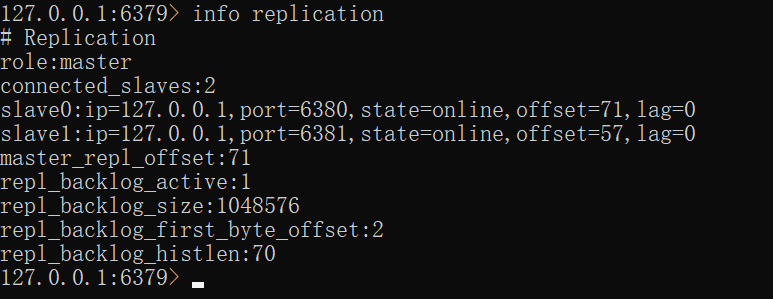

开启哨兵监视：

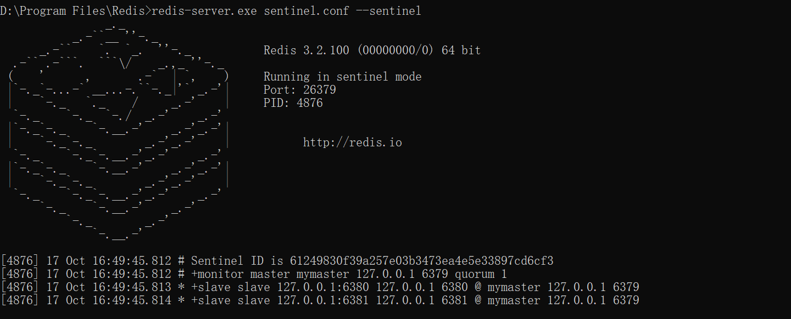

主节点下线：

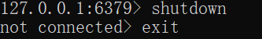

哨兵模式下自动选举出新的主节点：

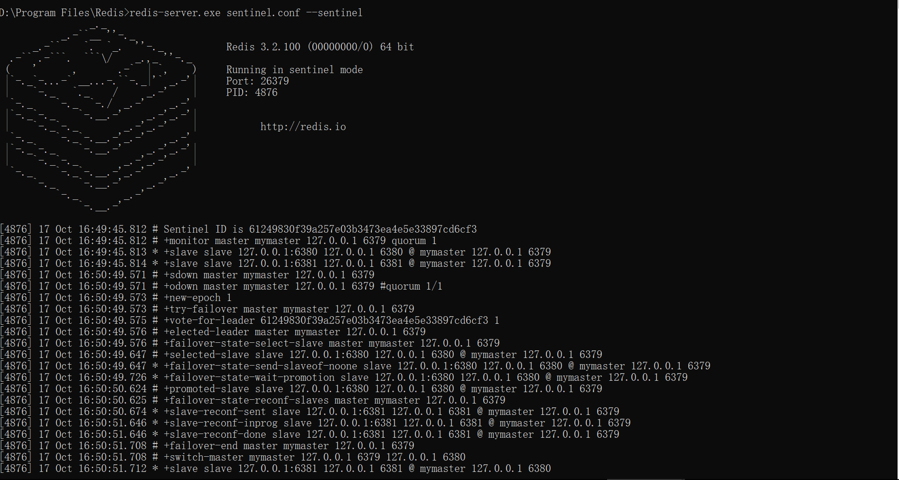

此时主节点自动变为了6380，并且6381的主节点也自动变为了6380：

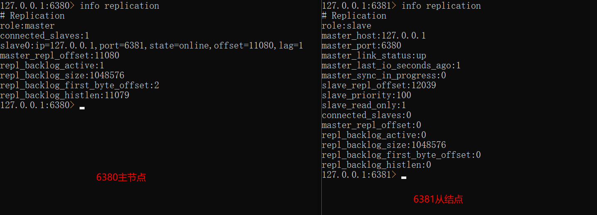


假如哨兵宕机了，此模式也无法工作，所以改进方法是配置多个哨兵，形成哨兵集群。